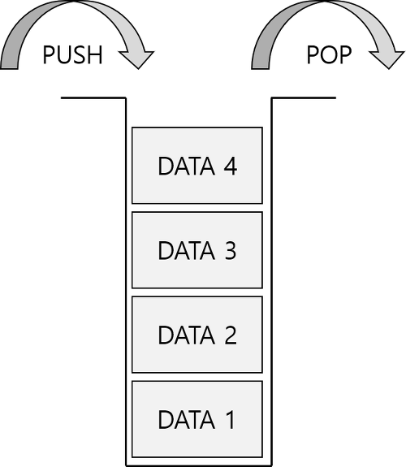
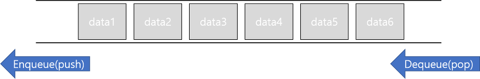
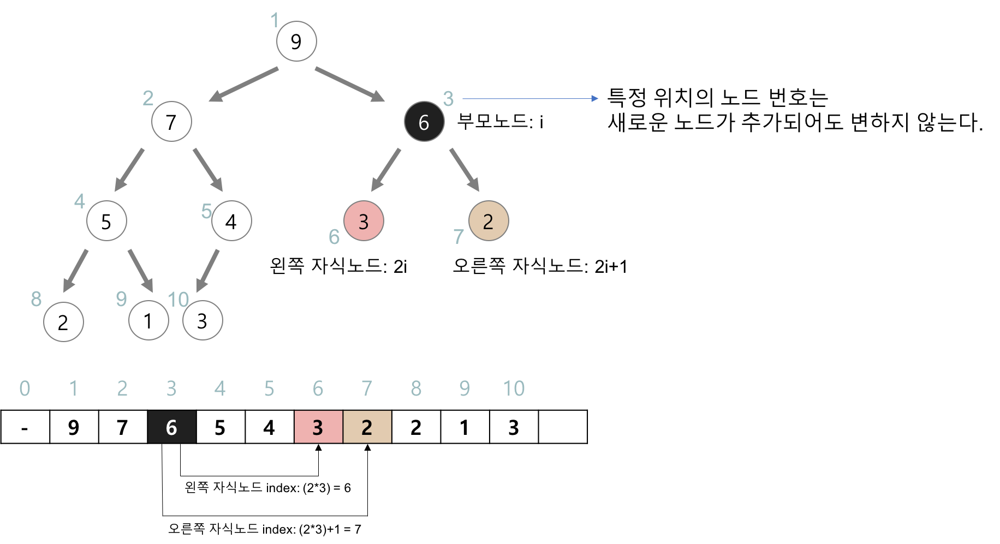
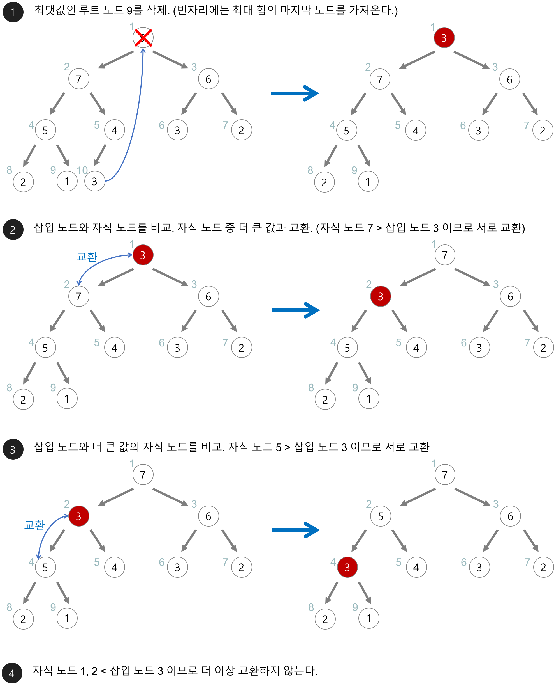
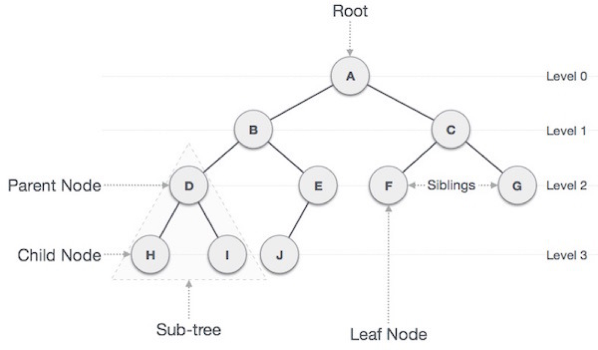
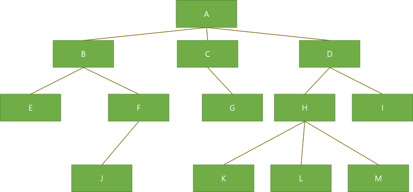
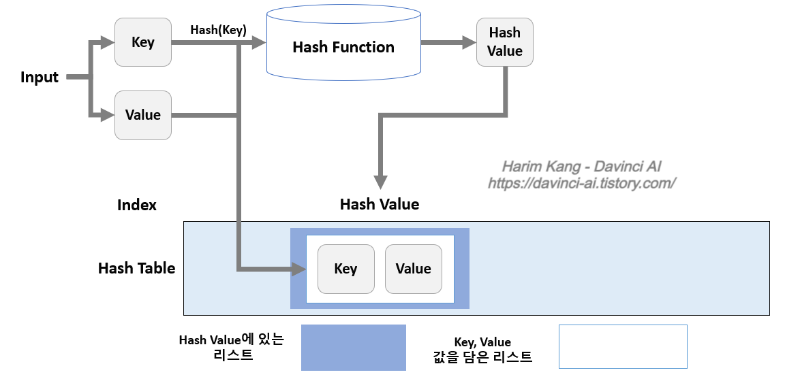
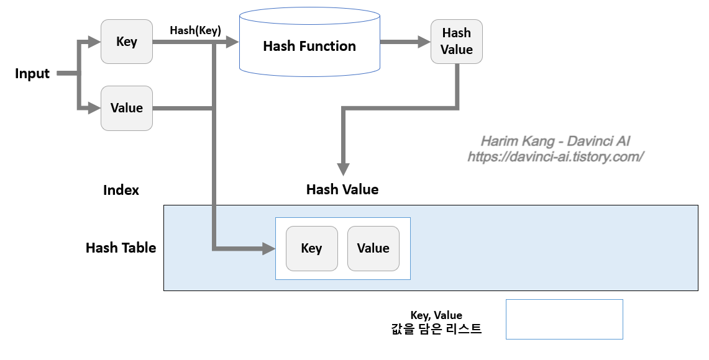
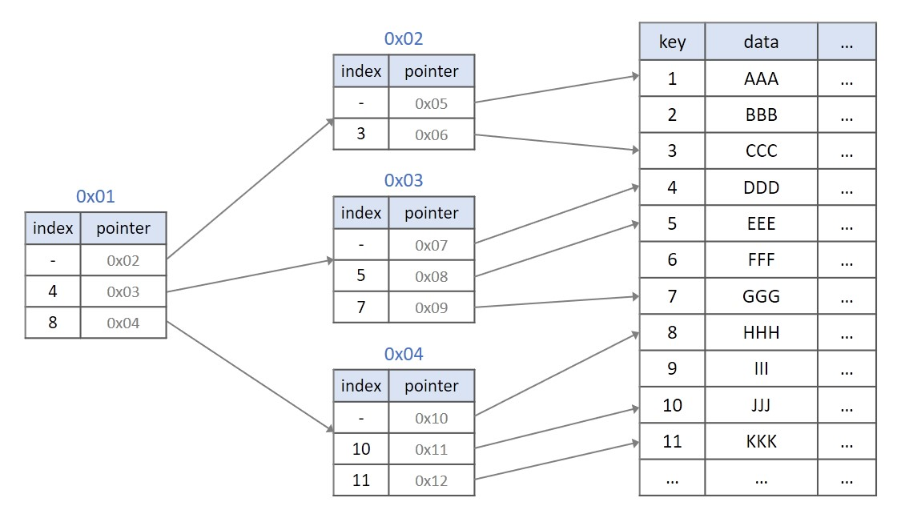
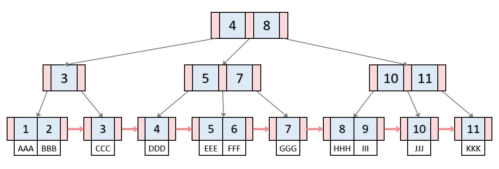

# 8주차 - 자료구조

## 스택(Stack) & 큐(Queue)

### Stack

- **후입선출(Last In First Out, LIFO)** 의 형태를 가진 자료구조

- 데이터의 개수가 스택의 크기를 초과하면 overflow가 일어나고, 아무것도 없을 때 pop을 하거나 데이터에 접근시 underflow가 일어나기 때문에 구현시 예외처리가 필수적



ex)

```c
#include <stdio.h>
#include <stdlib.h>

#define size 100

int stack[size];
int top=-1;

void push(int item){
    if(top>=size-1){
        printf("\n\nStack is FULL\n");
        exit(1);
    }
    else stack[++top]=item;
}

int pop(){
    if(top==-1){
        printf("\n\nStack is Empty\n");
        exit(1);
    }
    else return stack[top--];
}

void del(){
    if(top==-1){
        printf("\n\nStack is Empty\n");
        exit(1);
    }
    else top--;
}

int peek(){
    if(top==-1){
        printf("\n\nStack is Empty\n");
        exit(1);
    }
    else return stack[top];
}

```

```python
'''
파이썬에서는 list를 이용하여 쉽게 스택을 구현 할 수 있으며
실제 사용시에는 collections에 구현되어 있는 deque를 이용하면 더 빠름

from collections import deque
dq = deque()

# 스택으로 사용시
dq.append() # 가장 오른쪽에 추가
dq.pop() # 가장 오른쪽 원소 삭제 및 반환

# 큐로 사용시
dq.append() # 가장 오른쪽에 추가
dq.popleft() # 가장 왼쪽 원소 삭제 및 반환
'''

stack = []
stack.append(1) # push
stack.append(2)
stack.pop() # pop, 2
stack[-1] # top, 1
len(stack) # size, 1

'''
그냥 list의 append와 pop만을 사용하면, stack과 동일하게 동작
'''
```

ex) C++ STL 사용하기

- empty() - 스택이 비어있으면 true, 비어있지 않으면 false을 반환합니다.
- size() - 스택에 있는 데이터의 개수를 반환합니다.
- top() - 스택의 맨 위에 있는 값(가장 나중에 넣은 값)을 반환합니다.
- push(data) - 스택에 data를 삽입합니다.
- pop() - 스택에서 데이터를 제거합니다.

```cpp
#include <iostream>
#include <stack>
#include <string>
using namespace std;

int n;
stack<int> s;

int main(){
	cin >> n;
	while(n--){
		string op;
		cin >> op;
		if(op == "push"){
			int x; cin >> x;
			s.push(x);
		}
		else if(op == "pop"){
			if(s.empty()) cout << -1 << "\n";
			else{
				cout << s.top() << "\n";
				s.pop();
		    }
		}
		else if(op == "size"){
			cout << s.size() << "\n";
        }
		else if(op == "empty"){
			cout << s.empty() << "\n";
		}
		else if(op == "top"){
			if(s.empty()) cout << -1 << "\n";
			else cout << s.top() << "\n";
		}
	}
}
```

### Queue

- 선입선출(First In First Out, FIFO)의 형태를 가지고 있는 자료구조

- 먼저 온 것이 먼저 나가는 특성을 가지는 것이, 줄을 서서 기다릴 때 먼저 온 사람이 먼저 들어가는 것과 같은 이치



ex)

```cpp
#include <stdio.h>
#include <string.h>

#define SIZE 10010

int q[SIZE];
int front = 0;
int rear = 0;

void push(int data){
    q[rear++] = data;
}

int pop(){
    if(front >= rear) return -1;
    return q[front++];
}

int size(){
    return rear-front;
}

int empty(){
    if(front >= rear) return 1;
    return false;
}

int getFront(){
    if(front >= rear) return -1;
    return q[front];
}

int getBack(){
    if(front >= rear) return -1;
    return q[rear-1];
}

int main(){
    int n; scanf("%d", &n);
    while(n--){
        char op[10]; scanf("%s", op);
        if(!strcmp(op, "push")){
            int data; scanf("%d", &data);
            push(data);
        }else if(!strcmp(op, "pop")){
            printf("%d\n", pop());
        }else if(!strcmp(op, "size")){
            printf("%d\n", size());
        }else if(!strcmp(op, "empty")){
            printf("%d\n", empty());
        }else if(!strcmp(op, "front")){
            printf("%d\n", getFront());
        }else if(!strcmp(op, "back")){
            printf("%d\n", getBack());
        }
    }
}
```

```python
'''
stack과 마찬가지로 파이썬에서는 list를 이용하여 쉽게 구현 할 수 있다.
하지만 이 또한 deque를 사용하는 것이 빠르고 쉽다.
from collections import deque
dq = deque()

# 스택으로 사용시
dq.append() # 가장 오른쪽에 추가
dq.pop() # 가장 오른쪽 원소 삭제 및 반환

# 큐로 사용시
dq.append() # 가장 오른쪽에 추가
dq.popleft() # 가장 왼쪽 원소 삭제 및 반환
'''

queue = []
queue.append(1) # 가장 오른쪽에 원소 추가 push
queue.append(2) # 가장 오른쪽에 원소 추가 push
queue.pop(0)    # 가장 왼쪽 원소 삭제 및 반환, pop, 1
len(queue)      # size 및 empty 판단
queue[0]        # 제일 앞의 원소를 읽기, getFront
queue[-1]       # 제일 마지막의 원소를 읽기, getBack
```

ex) C++ STL

- empty() - 큐가 비어있으면 true, 그렇지 않으면 false를 반환합니다.
- size() - 큐에 있는 데이터의 개수를 반환압니다.
- front() - 큐에 가장 처음으로 들어간 값을 반환합니다.
- back() - 큐에 가장 마지막으로 들어간 값을 반환합니다.
- push(data) - 큐에 data를 삽입합니다.
- pop() - 큐에서 데이터를 제거합니다.

```cpp
#include <iostream>
#include <queue>
#include <string>
using namespace std;

int n;
queue<int> q;

int main(){
	cin >> n;
	while(n--){
		string op;
		cin >> op;
		if(op == "push"){
			int x; cin >> x;
			q.push(x);
		}
		else if(op == "pop"){
			if(q.empty()) cout << -1 << "\n";
			else{
				cout << q.front() << "\n";
				q.pop();
		  }
		}
		else if(op == "size"){
			cout << q.size() << "\n";
        }
		else if(op == "empty"){
			cout << q.empty() << "\n";
		}
		else if(op == "front"){
			if(q.empty()) cout << -1 << "\n";
			else cout << q.front() << "\n";
		}
		else if(op == "back"){
			if(q.empty()) cout << -1 << "\n";
			else cout << q.back() << "\n";
		}
	}
}
```

## 힙(Heap)

우선 순위 큐를 위해 만들어진 자료구조, heap.

**우선순위 큐**

- 데이터들이 우선순위를 가지고 있고, 우선순위가 높은 데이터가 먼저 나감

**Heap**

- 완전 이진트리의 일종, 우선순위 큐를 위해 만들어진 자료구조
- 여러 개의 값들 중, 최댓값이나 최솟값을 빠르게 찾아내도록 만들어진 자료구조
- 힙은 일종의 **반정렬 상태**를 유지
- 힙 트리에서는 중복 된 값을 허용
- 종류
  - 최대 힙
    - 부모 노드의 키 값이 자식 노드의 키 값보다 크거나 같은 이진 트리
    - key ( 부모 ) ≥ key ( 자식 )
  - 최소 힙
    - 부모 노드의 키 값이 자식 노드의 키 값보다 작거나 같은 이진 트리
    - key ( 부모 ) ≤ key ( 자식 )
- 보통 배열로 구현
- 구현을 쉽게하기 위해 첫 번째 인덱스인 0은 사용되지 않음
- 특정 위치의 노드 번호는 새로운 노드가 추가 되어도 변하지 않음
- 힙에서의 부모 노드와 자식 노드의 관계
  - 왼쪽 자식의 인덱스 = (부모)\*2
  - 오른쪽 자식의 인덱스 = (부모)\*2+1
  - 부모의 인덱스 = (부모)//2



**Heap의 삽입**

- 새로운 요소가 들어오면, 일단 새로운 노드를 힙의 마지막 노드에 이어서 삽입
- 새로운 노드를 부모 노드들과 차례로 교환해서 힙의 성질을 만족 시킴


**Heap의 삭제**

- 최대 힙에서 최대 값은 루트 노드이므로, 루트 노드가 삭제 된다
- 삭제 된 루트 노드에는 힙의 마지막 노드를 가져온다
- 힙을 재구성한다.



## 트리(Tree)

- 나무를 닮은 구조를 가진 자료구조
- 노드로 이루어진 자료구조
- 트리는 하나의 root노드를 가진다
- 루트 노드는 0개 이상의 자식 노드를 가지고 있다
- 그 자식 노드 또한 0개 이상의 자식 노드를 가지고 있으며, 이는 반복적으로 정의 된다
- 노드들과 노드들을 연결하는 간선들로 구성되어 있음
  - 사이클이 존재 할 수 없음
  - 특정 순서로 나열 될 수도 있고, 그럴 수 없을 수도 있다
  - 각 노드는 부모 노드로의 연결이 있을 수도 있고 없을 수도 있다
- 비선형 자료구조로 계층적 관계를 표현 한다.
- 그래프의 한 종류이며
  - Cycle이 없는 연결 그래프 ( Connected Graph )
  - 또는 DAG(Directed Acyclic Graph, 무향비순환 그래프)의 한 종류



- 루트 노드(root node): 부모가 없는 노드, 트리는 하나의 루트 노드만을 가진다.
- 단말 노드(leaf node): 자식이 없는 노드, ‘말단 노드’ 또는 ‘잎 노드’라고도 부른다.
- 내부(internal) 노드: 단말 노드가 아닌 노드
- 간선(edge): 노드를 연결하는 선 (link, branch 라고도 부름)
- 형제(sibling): 같은 부모를 가지는 노드
- 노드의 크기(size): 자신을 포함한 모든 자손 노드의 개수
- 노드의 깊이(depth): 루트에서 어떤 노드에 도달하기 위해 거쳐야 하는 간선의 수
- 노드의 레벨(level): 트리의 특정 깊이를 가지는 노드의 집합
- 노드의 차수(degree): 하위 트리 개수 / 간선 수 (degree) = 각 노드가 지닌 가지의 수
- 트리의 차수(degree of tree): 트리의 최대 차수
- 트리의 높이(height): 루트 노드에서 가장 깊숙히 있는 노드의 깊이

**특징**

- 그래프의 한 종류이다. ‘최소 연결 트리’ 라고도 불린다.
- 트리는 계층 모델 이다.
- 트리는 DAG(Directed Acyclic Graphs, 방향성이 있는 비순환 그래프)의 한 종류이다.
  - loop나 circuit이 없다. 당연히 self-loop도 없다.
  - 즉, 사이클이 없다.
- 노드가 N개인 트리는 항상 N-1개의 간선(edge)을 가진다.
  - 즉, 간선은 항상 (정점의 개수 - 1) 만큼을 가진다.
- 루트에서 어떤 노드로 가는 경로는 유일하다.
  - 임의의 두 노드 간의 경로도 유일하다. 즉, 두 개의 정점 사이에 반드시 1개의 경로만을 가진다.
- 한 개의 루트 노드만이 존재하며 모든 자식 노드는 한 개의 부모 노드만을 가진다.
- 부모-자식 관계이므로 흐름은 top-bottom 아니면 bottom-top으로 이루어진다.
- 순회는 Pre-order, In-order 아니면 Post-order로 이루어진다.
  - 이 3가지 모두 DFS/BFS 안에 있다.
- 트리는 이진 트리, 이진 탐색 트리, 균형 트리(AVL 트리, red-black 트리), 이진 힙(최대힙, 최소힙) 등이 있다.

**표현법**

단순한 표현법



- **첫 번째**
  - 이 그림 자체로도 트리를 표현할 수 있습니다.
- **두 번째**
  - 중첩된 괄호(Nested Parenthesis)로 표현할 수 있습니다.
  - 읽기 어렵지만, 트리를 하나의 수식처럼 표현할 수 있습니다.
  - (A((B(E)(F(J)))(C(G))(D(H(K)(L)(M))(I))))
- **세 번째**
  - 코드로 구현할 때 가장 많이 쓰이는 구조체 를 활용하는 방법입니다

**Left Chird-Right Sibling**

왼쪽 자식-오른쪽 형제(Left Chird-Right Sibling) 표현법

이름 그대로 한 개의 포인터는 가장 왼쪽의 자식을, 다른 포인터는 자신 바로 오른쪽에 있는 형제를 가리켜 차수가 다양한 트리를 각 노드 당 2개의 포인터로만 표현할 수 있음.

## 이진탐색트리(Binary Search Tree)

이진 트리의 일종으로, 트리와 binary search를 결합한 자료구조.

- 각 노드의 왼쪽 서브 트리는 해당 노드의 값보다 작은 값을 지닌 노드들로만 이루어져 있음.
- 각 노드의 오른쪽 서브 트리는 해당 노드의 값보다 큰 값을 지닌 노드들로만 이루어져 있음.
- 중복 된 노드가 없어야 함.
- 왼쪽, 오른쪽 서브 트리도 이진 탐색 트리임.

BST를 순회 할 때는 inorder 방식으로 순회하며, 순회를 끝내면 모든 값을 정렬 된 순서로 읽을 수 있음.

( left - root - right 순으로 순회하기 때문 )

**구현**

```python
class Node:
    def __init__(self,val):
        self.val = val
        self.left = None
        self.right = None

class BinarySearchTree:
    def __init__(self):
        self.root = None

    def setRoot(self, val):
        self.root = Node(val)

    def find(self, val):
        if self.findNode(self.root, val):
            return True
        return True

    def findNode(self, curNode, val):
        if curNode is None:
            return False
        elif val == curNode.val:
            return curNode
        elif val < curNode.val:
            return self.findNode(curNode.left, val)
        else:
            return self.findNode(curNode.right, val)

    def insert(self, val):
        if self.root is None:
            self.setRoot(val)
        else:
            self.insertNode(self.root, val)

    def insertNode(self, curNode, val):
        if val <= curNode.val:
            if curNode.left:
                self.insertNode(curNode.left, val)
            else:
                curNode.left = Node(val)
        else:
            if curNode.right:
                self.insertNode(curNode.right, val)
            else:
                curNode.right = Node(val)

    def traverse(self):
        return self.traverseNode(self.root)

    def traverseNode(self, curNode):
        res = []
        if curNode.left:
            res.extend(self.traverseNode(curNode.left))
        if curNode:
            res.extend([curNode.val])
        if curNode.right:
            res.extend(self.traverseNode(curNode.right))
        return res
```

## 해시(Hash)

### 해쉬 테이블 (Hash Table)

- 해쉬 구조란?
- 키(Key)와 값(Value)쌍으로 이루어진 데이터 구조를 의미합니다. Key를 이용하여 데이터를 찾으므로, 속도를 빠르게 만드는 구조입니다.
- 파이썬에서는 딕셔너리(Dictionary) 타입이 해쉬 테이블과 같은 구조입니다.
- 기본적으로는, 배열로 미리 Hash Table 크기만큼 생성해서 사용합니다. 공간은 많이 사용하지만, 시간은 빠르다는 장점이 있습니다.
- 검색이 많이 필요한 경우, 저장, 삭제, 읽기가 많은 경우, 캐쉬를 구현할 때 주로 사용됩니다.

### 장점

- 데이터 저장/검색 속도가 빠릅니다.
- 해쉬는 키에 대한 데이터가 있는지(중복) 확인이 쉽습니다.

### 단점

- 일반적으로 저장공간이 좀더 많이 필요합니다.
- 여러 키에 해당하는 주소가 동일할 경우 충돌을 해결하기 위한 별도 자료구조가 필요합니다. (충돌 해결 알고리즘)

### 시간 복잡도

- 일반적인 경우(충돌이 없는 경우): O(1)
- 최악의 경우(모든 경우에 충돌이 발생하는 경우): O(n)

### 용어

- 해쉬(Hash): 임의 값을 고정 길이로 변환하는 것을 의미합니다.
- 해쉬 함수(Hash Function): 특정 연산을 이용하여 키 값을 받아서 value를 가진 공간의 주소로 바꾸어주는 - 함수를 의미합니다.
- 해쉬 테이블(Hash Table): 해쉬 구조를 사용하는 데이터 구조입니다.
- 해쉬 값(해쉬 주소, Hash Value or Address): Key값을 해쉬 함수에 넣어서 얻은 주소값을 의미합니다. 이 값을 통해 슬롯을 찾아간다.
- 슬롯(Slot): 한 개의 데이터를 저장할 수 있는 공간을 의미합니다. (아래 그림에서는 bucket)

### 해쉬 함수와 키 생성 함수

키 생성 함수를 파이썬 기본라이브러리의 hash() 함수를 사용하여 설명 할 것 입니다. 해당 함수는 실행마다 값이 달라질 수 있습니다. 사실, 해쉬 함수는 보안 분야에서 많이 사용됩니다. 예를 들어 SHA(Secure Hash Algorithm)은 어떤 데이터도 고정된 크기의 유일한 값으로 리턴해주기 때문에 많이 사용됩니다.

#### SHA-1

SHA-1은 해쉬값의 크기를 160으로 고정하는 알고리즘.

```python
import hashlib

data = 'test'.encode()
hash_object = hashlib.sha1()
hash_object.update(data)
hex_dig = hash_object.hexdigest()
print(hex_dig)

data2 = 'hello world'.encode()
hash_object2 = hashlib.sha1()
hash_object2.update(data2)
hex_dig2 = hash_object2.hexdigest()
print(hex_dig2)
```

#### SHA-256

위의 SHA-1에서 해쉬값의 크기를 256으로 늘려서 더 안전한 알고리즘입니다. 위의 메소드에서 sha1()대신 sha256()을 사용하면 됩니다.

### 파이썬의 딕셔너리

Key, Value 구조의 데이터를 가지는 형태로 이루어져 있습니다.

```python
dic = {'name':'Kang', 'phone':'01029244422', 'birth':'951129'}
```

### 해시 테이블 충돌 문제

해시 값을 만들었을 때, 같은 해시 값이 존재하게 되면 충돌이 발생 그 문제를 해결하기 위한 방법은 여러가지 가 있음.

#### Chaining 기법

Open Hashing 기법 중 하나: 해쉬테이블 저장공간 외에 공간을 더 추가해서 사용하는 방법입니다.

충돌이 발생시, 링크드 리스트로 데이터를 추가로 뒤에 연결시키는 방법입니다.



해당 방식은 끝없이 key, value쌍들을 넣을 수 있지만, 공간 효율성이 떨어진다는 단점이 있습니다. 하나의 hash value index에만 들어간다면 불균형한 구조가 될 가능성이 있습니다.

#### Linear Probing 기법



Close Hashing 기법 중 하나: 해쉬테이블 저장공간 안에서 충돌 문제를 해결하는 방법입니다.

충돌이 일어나면, 해당 hash value(hash address)의 다음 index부터 맨 처음 나오는 빈공간에 저장하는 기법입니다. (저장 공간 활용도의 증가)

## 트라이(Trie)


- 트라이(Trie)는 문자열을 저장하고 효율적으로 탐색하기 위한 트리 형태의 자료구조이다.

- 우리가 검색할 때 볼 수 있는 자동완성 기능, 사전 검색 등 문자열을 탐색하는데 특화되어있는 자료구조라고 한다.

- 래딕스 트리(radix tree) or 접두사 트리(prefix tree) or 탐색 트리(retrieval tree)라고도 한다. 트라이는 retrieval tree에서 나온 단어이다.

- 예를 들어 'Datastructure'라는 단어를 검색하기 위해서는 제일 먼저 'D'를 찾고, 다음에 'a', 't', ... 의 순서로 찾으면 된다. 이러한 개념을 적용한 것이 트라이(Trie)이다.

### 트라이(Trie) 장단점

트라이(Trie)는 문자열 검색을 빠르게 한다.

문자열을 탐색할 때, 하나하나씩 전부 비교하면서 탐색을 하는 것보다 시간 복잡도 측면에서 훨씬 더 효율적이다.

각 노드에서 자식들에 대한 포인터들을 배열로 모두 저장하고 있다는 점에서 저장 공간의 크기가 크다는 단점도 있다. (메모리 측면에서 비효율적일 수 있음!)

### 트라이 구현

```python
class Node(object):
    def __init__(self, key, data=None):
        self.key = key
        self.data = data
        self.children = {}


class Trie(object):
    def __init__(self):
        self.head = Node(None)

    # 문자열 삽입
    def insert(self, string):
        curr_node = self.head

        # 삽입할 String 각각의 문자에 대해 자식 Node를 만들며 내려간다.
        for char in string:
            # 자식Node들 중 같은 문자가 없으면 Node 새로 생성
            if char not in curr_node.children:
                curr_node.children[char] = Node(char)

            # 같음 문자가 있으면 노드를 따로 생성하지 않고, 해당 노드로 이동
            curr_node = curr_node.children[char]

        # 문자열이 끝난 지점의 노드의 data값에 해당 문자열을 표시
        curr_node.data = string


    # 문자열이 존재하는지 탐색
    def search(self, string):
        # 가장 아래에 있는 노드에서부터 탐색 시작.
        curr_node = self.head

        for char in string:
            if char in curr_node.children:
                curr_node = curr_node.children[char]
            else:
                return False

        # 탐색이 끝난 후에 해당 노드의 data값이 존재한다면, 문자가 포함되어있다는 뜻
        if curr_node.data is not None:
            return True
```

## B-Tree & B+Tree

주로 데이터베이스의 인덱스에 사용되는 자료구조로, 특이한 자료구조 중 하나.




1. **모든 key, data가 리프노드**에 모여있습니다. B트리는 리프노드가 아닌 각자 key마다 data를 가진다면, B+트리는 리프 노드에 모든 data를 가집니다.
2. **모든 리프노드가 연결리스트**의 형태를 띄고 있습니다. B트리는 옆에있는 리프노드를 검사할 때, 다시 루트노드부터 검사해야 한다면, B+트리는 리프노드에서 선형검사를 수행할 수 있어 시간복잡도가 굉장히 줄어듭니다.
3. **리프노드의 부모 key는 리프노드의 첫번째 key보다 작거나 같습니다.** 그림의 B+트리는 리프노드의 key들을 트리가 가지고 있는 경우여서, data 삽입 또는 삭제가 일어날 때 트리의 key에 변경이 일어납니다. 해당 경우뿐만 아니라 data의 삽입과 삭제가 일어날 때 트리의 key에 변경이 일어나지 않게 하여 더욱 편하게 B+트리를 구현하는 방법도 존재하기 때문에 **작거나 같다**라는 표현을 사용하였습니다.
