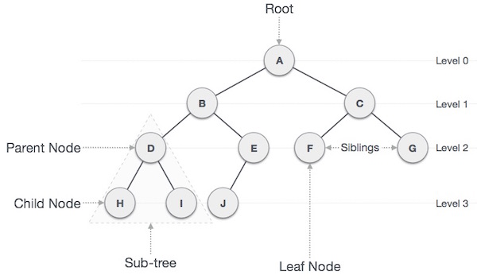
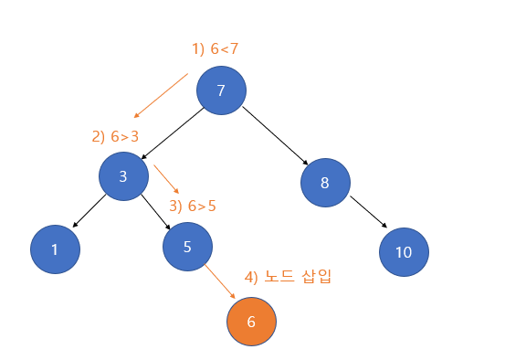
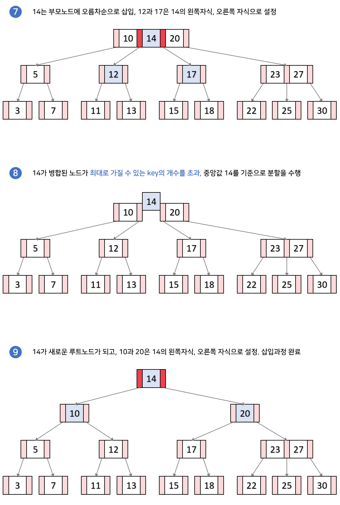
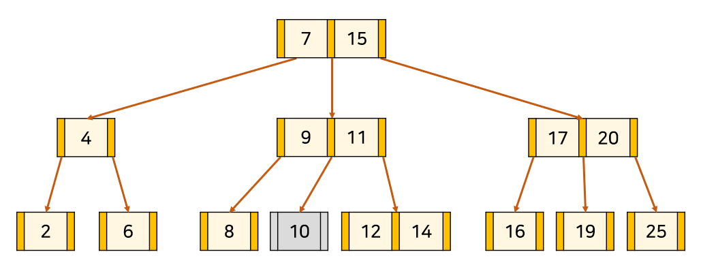
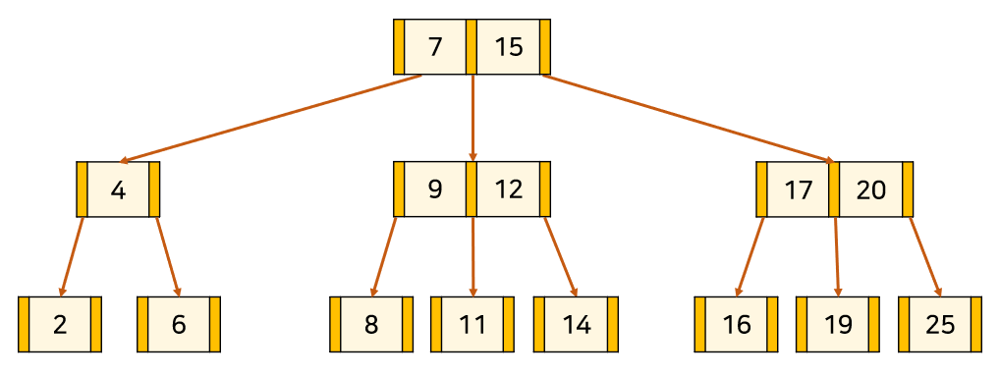
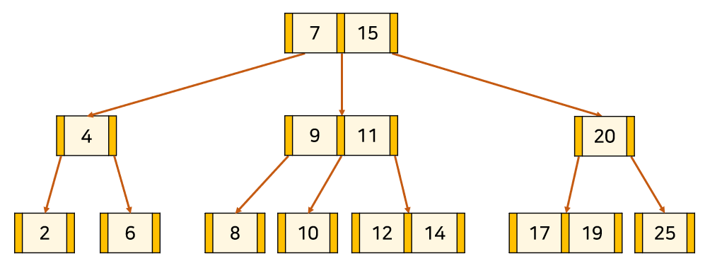

# 스택(Stack) & 큐(Queue)

## 스택

* LIFO 구조 
* 가장 상위에 위치하는 자료는 최근에 들어온 자료
* 자료를 삭제하는 연산은 pop 연산으로 가장 최근에 들어온 자료가 삭제 된다.

## 큐

* FIFO 자료구조
* 자료를 추가 할 때는 PUSH 연산으로 QUEUE의 맨뒤의 자료를 추가한다
* 자료를 제거 할 때는 POP 연산으로 QUEUE의 맨앞의 자료를 제거한다.

# 힙(Heap)

[참고](https://m.blog.naver.com/ndb796/221228342808)

힙은 최소값이나 최대 값을 찾아내기 위해서 완전 이진트리를 기반으로 하는 트리이다. 최대 힙을 기준으로 부모 노드는 항상 자식 노드 보다 커야한다. 최소 힙은 그 반대이다.

## 이진트리

이진 트리란 모든 노드의 자식의 개수가 2개 이하인 트리 구조를 얘기한다.

여기서 완전 이진 트리라는 것은 ROOT 노드 부터 시작해서 자식 노드가 왼쪽부터 오른쪽 순으로 채워져있는 트리를 얘기한다.(단 마지막 레벨 전까지 모든 노드는 채워져 있어야 한다.)

## 삽입

새로운 자료가 삽입 됬을 때 힙구조를 만족시키기 위해서 삽입을 할 때 다음과 같은 과정을 거친다.(설명을 위해서 최소 힙을 기준으로 하겠다)

1. 새로운 데이터를 완전 이진 트리를 기준으로 할 때 마지막 노드에 넣는다.

2. 부모 노드와 새로 삽입한 원소와 값을 비교하고 자신의 값이 부모 노드보다 작다면 부모 노드와 자리를 바꾼다.

3. 만약에 루트 노드에 도착하거나 부모 노드가 자신보다 작다면 해당 자리에서 멈춘다.

# 삭제 

힙에서 자료를 삭제하면서 힙 구조가 성립하게 하기 위해서 삭제를 수행 할 때 다음과 같은 과정을 거친다.(최소힙을 기준으로 설명하겠다.)

1. 힙의 루트 노드를 삭제한다.

2. 힙의 맨 마지막 원소를 루트 노드로 가져온다.

3. 자식 노드와 비교해서 자신보다 작다면 자식 노드와 자리를 바꾼다. 만약에 둘다 자신보다 작다면 자식 노드 중에서 작은 노드와 자리를 바꾼다. 

4. 마지막 레벨 전까지 3번의 과정을 수행하거나, 자식 노드중에 자신보다 작은게 없다면 해당 자리에서 연산을 종료한다.

## 힙 정렬(HEAP SORT)

루트 노드는 최소나 최대를 유지한다는 특성을 이용해서 정렬을 수행 할 수 있다. 

1. 모든 원소를 HEAP안에 삽입한다.

2. 루트 노드에 있는 자료를 출력하고 힙에서 제거한다.

3. 힙이 빌 때 까지 2의 과정을 반복한다.

# 트리(Tree)
[참고](https://velog.io/@adam2/TREE)

## 트리의 성질

1. 트리에는 root라고 불리는 특별한 노드가 있다. 
2. 다른 노드들은 중복되지 않는 n개의 부속 트리를 가지고 있다. (트리는 사이클이 없는 그래프이며 계층 구조를 가진다.)

## 트리의 용어

1. 잎사귀 노드(leaf node)

    차수가 0인 노드, 맨 마지막 차수에 존재하는 노드

2. 내부 노드 

    차수가 1 이상인 노드

3. 부모 노드

    부속 트리를 가진 노드

4. 자식

    부모에 속하는 부속 노드

5. 레벨

    루트 노드로 부터의 깊이(루트 노드는 0이다)

6. 차수

    각 노드가 지니는 가지의 개수

# 이진탐색트리(Binary Search Tree)

## 이진 트리

    이진 트리는 트리 중에서 노드들의 최대 차수가 2인 노드 들로 구성되는 트리이다.

## 이진 트리의 종류

1. 완전 이진 트리

    트리를 구성하고 있는 임의의 두 단말 노드의 레벨 차이가 1이하이고, 마지막 레벨을 제외한 모든 레벨에 존재할 수 있는 모든 노드를 갖고 있으며, 왼쪽에서 오른쪽으로 채워지는 이진트리

2. 전 이진 트리

    
    모든 노드가 0개 또는 2개의 자식 노드를 갖는 트리.

3. 포화 이진 트리

    전 이진 트리이면서 완전 이진 트리인 경우

## 이진 탐색 트리
[참조](https://mattlee.tistory.com/30)
모든 노드가 자신의 왼쪽 서브트리에는 자신 보다 작은 키 값을, 오른쪽 서브 트리에는 자신보다 큰 키 값을 놓는 규칙을 만족하는 이진 트리이다.

## 연산

1. 탐색

     

    자신이 찾고자 하는 값과 현재 노드를 비교하면서 탐색에 들어간다. 만약 현재 노드가 자신이 찾는 값보다 작으면 현재 노드를 기준으로 오른쪽 자식으로 이동하고, 크다면 왼쪽 자식으로 이동한다. 일치하면 탐색을 종료한다. 이 계산의 시간 복잡도는 log n 이다.

2. 삽입

    

    자신이 삽입하는 값과 현재 노드의 값을 비교한다. 현재 노드가 추가하려는 노드보다 작으면 오른쪽 자식으로 이동하고, 작으면 왼쪽 자식으로 이동한다. 가장 높은 레벨로 이동 할 때 까지 위의 과정을 반복한 다음, 가장 높은 레벨에 해당 노드를 삽입한다.

3. 삭제

    삭제 연산의 경우에는 3가지 경우로 나뉜다. 자식이 없는 노드를 삭제하는 경우, 자식이 1개 존재하는 노드를 삭제하는 경우, 자식이 2개 존재하는 노드를 삭제하는 경우

    * 자식이 없는 노드
    
    

    자식이 없는 노드의 경우는 해당 자식만 삭제를 수행하면 된다.

    * 자식이 1개인 노드

    

    자식이 1개인 노드는 해당 노드를 삭제하고 해당 노드의 자리에 자식노드를 넣어준다.

    * 자식이 2개인 노드

    

    결론적으로 말하면 왼쪽 트리에서 가장 오른쪽에 있는 노드로 교체를 하거나, 오른쪽 트리에서 제일 왼쪽에 있는 원소로 교체를 하면 된다.

# 해시(Hash)
[참조](https://mangkyu.tistory.com/102)

    해시 테이블이란 (key, value)로 자료를 저장하는 자료구조중 하나로 빠르게 데이터를 검색 할 수 있는 자료구조이다. 내부적으로 버킷을 사용해서 자료를 저장한다. 자료가 들어오면 해시 함수를 이용해서 어느 버킷에 넣어 줄지 결정하는 방식이다.

    위와 같이 해시 함수를 이용해서 각각의 이름을 해당하는 인덱스로 이동을 시켜서 나중에 이름이 들어오더라도 해시 함수만 실행하면 되므로 탐색하는데 걸리는 시간복잡도는 1이 되게 된다.

## 해시 함수

    해시 함수는 다음과 같은 예시가 존재한다. 아래의 함수를 사용해서 인덱스를 정한다.

1. Division methond

    나눗셈을 이용하는 방법으로 입력값을 테이블의 크기로 나누어 계산한다.( 주소 = 입력값 % 테이블의 크기) 테이블의 크기를 소수로 정하고 2의 제곱수와 먼 값을 사용해야 효과가 좋다고 알려져 있다.

2. Digit Folding

    각 Key의 문자열을 ASCII 코드로 바꾸고 값을 합한 데이터를 테이블 내의 주소로 사용하는 방법이다.

3. Multiplicatino Method

    숫자로 된 Key값 K와 0과 1사이의 실수 A, 보통 2의 제곱수인 m을 사용하여 다음과 같은 계산을 해준다. h(k)=(kAmod1) × m

4. Univeral Hashing

    다수의 해시함수를 만들어 집합 H에 넣어두고, 무작위로 해시함수를 선택해 해시값을 만드는 기법이다.

## 해시 충돌

    하지만 키가 될 수 있는 값보다 자료의 개수가 많거나, 해시함수를 돌렸으나 해시값이 동일한 경우가 생긴다면 이를 해시 충돌이라고 부른다. 해시 충돌이 적게 일어날 수록 좋은 해시 함수이다. 그렇지 않다면 최악의 경우 해시 탐색을 할 때 시간 복잡도가 log n 까지 갈 수 있다.

### 해결 방법

1. 체이닝(chaining)

    해시충돌이 발생하게 되면 충돌한 해시를 해당 버킷에 연결 리스트 형식으로 이어 붙이는 방식이다. 테이블이 가득 차지는 않는다는 장점이 있으나, 충돌이 많이 일어나면 메모리가 효율적으로 사용되지 않는다는 문제점이 발생한다.

2. 개방 주소법(open addressing)

    만약에 충돌이 일어나게 된다면, 충돌한 인덱스를 기준으로 규칙을 통해 비어있는 인덱스를 찾아 나가는 방식이다. 방식으로는 선형, 제곱, 이중 탐색 방식이 존재한다. 모든 인덱스를 사용한다는 장점이 존재하나, 
만약에 충돌이 일어나게 된다면, 충돌한 인덱스를 기준으로 규칙을 통해 비어있는 인덱스를 찾아 나가는 방식이다. 방식으로는 선형, 제곱, 이중 탐색 방식이 존재한다. 모든 인덱스를 사용하여 공간 효율적인 장점이 존재하나, 비어있는 인덱스를 찾는데 시간이 오래 걸리는 단점이 존재한다.

# 트라이(Trie)

최대 길이가 m인 문자열이 n개 있다고 하자. 여기에서 자신이 찾고자 하는 문자열이 있는지 없는지 여부를 확인 하려고 한다. 3가지 방법을 통해서 각각의 시간 복잡도를 알아보도록한다.

## naive 한 방법

맨 처음으로 naive 한 방법을 사용하게 된다면 문자열을 비교하는데 m, 해당 과정을 n번 반복하게 되므로 시간 복잡도는 mn 이 되게 된다. 또한 새로운 문자열을 비교 하게 되면 m * n 을 다시 수행해야한다. 

## 이진 탐색

문자열 탐색을 수행할 때마다 처음부터 탐색을 하는 것 보다는 사전식으로 정렬을 하게 된다면 다시 문자열 탐색을 하는 경우에 훨씬 찾기가 쉬워진다. 처음에 정렬을 수행하면서 문자열의 대소를 비교하는데 m, 이것을 바탕으로 정렬하는데 n * logn 이 소요된다. 정렬하는데는 m * n * log(n)으로 이전의 naive한 방법보다 시간 복잡도에서 손해를 보게 되지만, 문자열을 비교하는 연산에서는 문자열을 비교하는데 m, 이진탐색 트리를 타고 내려가는데 log(n)이 소요되므로 m * log(n)이 소요 되므로 다음에 문자열을 비교 할 때는 이득이게 된다.

## Trie 구조

이제는 trie 구조를 활용해서 문자열을 찾는 방식이다. 자식의 개수는 문자열의 개수만큼 존재한다. 트리와 비슷한 구조로 한단계 내려 갈 때 마다 해당 문자열의 노드가 존재하는지 확인을 하는데 1(해시나 배열을 사용하면 된다.) 문자열 m개가 있으므로 찾는데는 시간복잡도 m이 소요되고, 트리를 만드는데는 mn이 걸린다. 배열을 사용하는 방식은 문자가 많아지면 메모리 공간이 부족해진다.

# B-Tree & B+Tree

이진 트리도 좋은 탐색 수단이긴하나 이진 트리를 사용하게 된다면 위의 그림과 같이 skwed tree같은 깊이가 균일하지 않은 트리가 생기게 되어서 비효율이 발생하게 된다. 이러한 비효율을 막기위해서 b트리, 즉 balanced tree를 사용하게 된다.

## B- 트리
[참고1](https://rebro.kr/169) [참고2](https://velog.io/@emplam27/%EC%9E%90%EB%A3%8C%EA%B5%AC%EC%A1%B0-%EA%B7%B8%EB%A6%BC%EC%9C%BC%EB%A1%9C-%EC%95%8C%EC%95%84%EB%B3%B4%EB%8A%94-B-Tree#key-%EA%B2%80%EC%83%89%EA%B3%BC%EC%A0%95)
[시각화](https://www.cs.usfca.edu/~galles/visualization/BTree.html)

### B-트리의 성질

1. node의 key의 수가 k개라면, 자식 node의 수는 k+1개이다. 

2. node의 key는 반드시 정렬된 상태여야 한다. 

3. 자식 node들의 key는 현재 node의 key를 기준으로 크기 순으로 나뉘게 된다. 

4. root node는 항상 2개 이상의 자식 node를 갖는다. (root node가 leaf node인 경우 제외) 

5. M차 트리일 때, root node와 leaf node를 제외한 모든 node는 최소 [M/2], 최대 M 개의 서브 트리를 갖는다. 

6. 모든 leaf node들은 같은 level에 있어야 한다. 

이 성질은 삽입, 삭제 연산이 끝나도 유지가 되어야 한다.

### 탐색

1) root node부터 탐색을 시작한다. 

2) node의 key를 순회하여 K가 존재하면 탐색을 종료한다. 

3) k가 존재하지 않는다면, 어떤 이웃한 두 key 사이에 K가 들어가는 경우 사이의 포인터를 통해 자식 node로 내려간다. 

4) leaf node까지 2~3을 반복한다. 

### 삽입

삽입을 하는 경우는 1가지만 생각하면 된다. 어떤 노드가 담을 수 있는 최대값을 초과해서 담게 된다면, 그 노드에서 중앙값(홀수면 중간, 짝수면 중간에서 왼쪽 값을 부모 노드로 보내면 된다.)

1. 삽입 후에 노드에 담은 값이 초과가 없는 경우
    
    

2. 삽입 후에 노드에 담은 값이 초과가 있는 경우

    

    
    
    
    
### 삭제

삭제를 하는 경우는 크게 2가지로 나뉜다. 리프노드에 삭제할 원소가 있는 케이스, 부모노드에 삭제할 원소가 있는 케이스

1. 리프노드에 있는 케이스

    * 삭제할 노드의 원소 개수가 최소 보다 큰 경우

        그냥 삭제하면 된다

    * 삭제할 노드의 원소 개수가 최소이고, 형제 노드의 원소 개수가 최소 보다 많은 경우

        10을 삭제하는 경우

        

        

        
    
        

    삭제할 노드의 부모중에  오른쪽 노드를 삭제할 노드와(만약 자식 노드가 맨 오른쪽이면 부모 중 왼쪽 노드를 삭제한다.)교체한다. 교체한 부모 노드를 기준으로 오른쪽의 자식의 원소의 개수가 많다면 오른쪽 자식중의 최소, 왼쪽이라면 왼쪽 자식중의 최대와 아까전에 바꿔준 부모 노드로 위치를 바꿔준다.

    * 형제 노드의 원소 개수가 최소이고, 부모의 노드 개수가 최소보다 많은 경우

        

        

        
    
    자신을 가르키는 포인터를 기준으로 오른쪽 부모(맨 왼쪽에 자식 노드가 있다면 왼쪽으로 한다.)를 아래로 내린후에 포인터에 남아있는 형제 노드와 병합한다.

    * 부모 노드 형제 노드 둘다 최소 노드 개수를 가지는 경우

        아래의 경우와 동일 하므로 생략.

2. 리프노드가 아닌 부모 노드에 있는 경우

    * 자식 노드와 부모 노드의 원소 개수가 최소 보다 많은 경우

        

        

        자신과 가장 근접한(즉 자신을 기준으로 오른쪽 자식에서는 최소 값을 왼쪽 노드에서는 최대 값과 자리를 바꾼다.)

    * 자식 노드와 부모 노드의 원소 개수가 최소인 경우(위의 경우와 동일 케이스)

        

        

        

        

        

             

        * 원하는 값을 삭제하고 그 값의 양쪽 자식을 하나로 합친다. 합쳐진 node를 n1이라고 하자. 

        * 삭제한 노드의 포인터에 오른쪽에 위치한 값을 삭제한 노드의 형제 node에 합쳐준다. 합쳐진 node를 n2라고 하자. 

        * n1을 n2의 자식이 되도록 연결한다. 

        * 만약 n2의 key 수가 최대보다 크다면 key 삽입 과정과 동일하게 분할을 한다. 

        * 만약 n2의 key 수가 최소보다 작다면 2번 과정으로 돌아가서 동일한 과정을 반복한다. (n2의 가르키는 포인터에서 오른쪽에 위치한 부모를 n2의 형제 node에 합쳐준다) 

## B+ 트리

b- 트리와 많은 면에서 비슷하나, b+ 트리는 **무조건** 데이터는 리프노드에 저장된다. 리프노드 이외의 부모 노드는 인덱스를 나타내는 인덱싱 노드이다. 또한 리프 노드 끼리는 b- 트리와 다르게 연결이 되어있다. 

## 삽입

삽입이 되는 경우는 2가지로 나뉜다. 첫번째는 그냥 삽입이 되는경우고, 두번째는 삽입을 하는 도중에 노드에 원소 개수가 최대 값 보다 많게 되어 일어나는 경우다.

1. 삽입이 되는경우

해당 자리에 해당하는 key값을 넣어준다.

2. 삽입이 될 때 분할이 일어나는 경우

분할이 일어나는 노드에서 중앙값(홀수면 중앙, 짝수면 중간에서 왼쪽에 있는 수)를 기준으로 노드를 나누고, 두 노드를 연결한 이후에, 부모 노드에 중앙 값을 복사해서 삽입한다.(그래서 부모 노드는 자신의 오른쪽 자식의 첫번째 원소의 값을 가진다.) 부모 노드에서도 분할이 일어나면 부모 노드도 자식 노드와 b- 트리와 동일한 과정을 거치면 된다.

## 삭제

1. 삭제하는 노드의 개수가 최소값인 경우

    삭제하는 노드가 최소 값이면 옆쪽 노드에 원소를 빌려온다. 이 때 부모 노드의 오른쪽 포인터에 위치해 있던 원소가 삭제 된다면, 해당 부모의 수를 빌려온 수로 보충해준다.

2. 삭제하는 노드의 개수가 최소값이 아닌 경우

    그냥 삭제를 해주면 된다. 이 때 해당 노드의 가장 앞의 값이라면 부모 노드의 값도 새로 맨 앞의 값이 되는 수로 바꿔 준다.