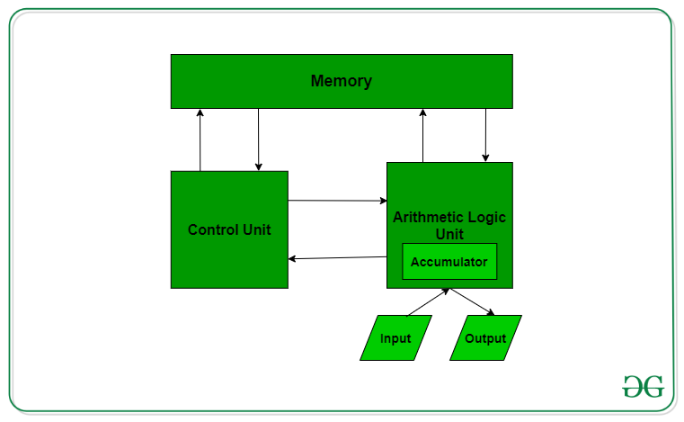
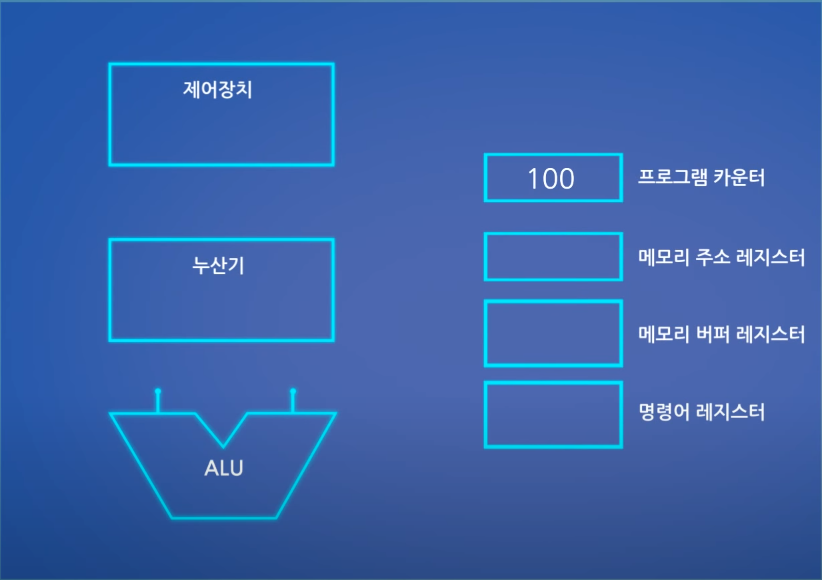
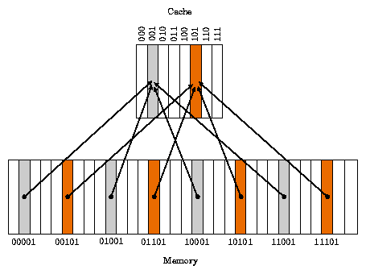

# 컴퓨터 구조 기초

현대의 컴퓨터 구조는 기본적으로 폰노이만 구조에 기초해서 제작된다.

## 폰노이만 구조

폰노이만 구조는 크게 메모리와 해당 메모리를 읽어서 명령을 처리하는 cpu, IO장치 로 이루어져 있다.

* 장점
    
    * 데이터와 프로그램의 메모리가 한 곳에 모여있으므로 cpu에서 차지하는 공간이 적은 편이다. 

* 단점
    
    * 데이터와 프로그램이 메모리에 다 몰려 있으므로 동시에 프로그램을 실행하면서 데이터를 저장하는게 되지 않고 프로그램을 실행하고 데이터를 메모리에 써줘야 한다.

    * 버스가 1개 이므로 버스에 병목현상이 일어날 가능성이 크다.

# 컴퓨터의 구성

5대 구성 요소

1. 제어 장치(Control Unit)

    cpu에 있는 장치로써 장치들의 동작과 주고 받는 데이터의 흐름을 제어하는 역활을 한다. 어셈블리 연산에서 명령어를 받아서 alu에게 해당 연산을 수행하라는 명령을 하는 역활을 한다. 이외에도 RAM, I/O장치등의 작동을 조절하는 역활을 한다.

2. 산술연산장치(Arithmetic Logical Unit)

    cpu에서 산술 연산과 논리 연산을 수행하는 디지털 회로다. CU에서 받은 연산을 수행하는 역활을 한다.

3. 기억장치

    프로그램 실행에 필요한 데이터를 저장하는 장치이다. 주기억 장치와 보조기억 장치로 나뉜다.

    * 주기억 장치

        * 프로그램을 수행하기에는 레지스터의 용량이 너무 작으므로 정보를 저장해 두었다가 필요할 때 읽어 들이는 저장소이다.

        * 종류에는 RAM 과 ROM 이 존재한다.

    * 보조기억 장치

        * 프로그램이나 자료를 영구적으로 기억할 수 있는 기억장치  

        * 주기억 장치에 비해서는 속도가 느리나 정보 저장이 대용량으로 된다.

        * 예시로는 HDD, SSD 등이 존재한다.

4. 입력장치

    컴퓨터 내부로 자료를 입력하는 장치로써 키보드, 마우스, 조이스틱 등이 존재한다.

5. 출력장치

    프린터, 스피커, 모니터와 같이 사용자가 알아볼 수 있게 컴퓨터의 자료를 외부로 변환하는 장치를 의미한다.

# 중앙처리장치 작동 원리

[참조](https://www.youtube.com/watch?v=Fg00LN30Ezg)

## 작동을 위해 필요한 기본적인 구조

1. 메모리

* 레지스터

    cpu에 있는 고속 저장장치로써 프로세스를 처리할 때 프로세스가 바로 사용할 수 있는 정보를 담는 역활을 한다. 종류에 따라서 주소 레지스터, 상태 레지스터, 범용 레지스터, Program Counter가 존재한다.

    * 주소 레지스터 
        
        주소를 저장하는 레지스터로써 메모리에 접근을 쉽게해주는 레지스터이다. Program Counter 에서 수행할 주소를 넘겨 받은 다음에 해당 주소를 찾아가 데이터를 가져온다.

    * 상태 레지스터

        기계의 순간 순간의 상태를 기록해주는 레지스터이다. 대표적인 종류로 Carry, Zero, Overflow 레지스터가 존재한다. 

    * 범용 레지스터

        주소와 데이터를 저장하기 위해서, 일반적인 연산을 위해서 사용되는 레지스터이다.

    * Program Counter

        다음에 인출할 명령어를 임시 저장하는 레지스터

    * 명령어 레지스터

        가장 최근에 인출된 명령어를 임시저장을 하는 레지스터이다. 제어 장치가 이 레지스터를 해독하고, 그에 알맞는 제어를 수행하게 된다.
    
2. 캐시 메모리

    cpu에 있는 메모리로써 cpu와 램간의 속도차이를 메꾸는 버퍼 역활을 한다. 캐시에는 종류로는 L1, L2, L3 캐시가 있다. L1 이 속도가 가장빠르고 용량이 적고, L3가 속도가 가장 느리고 용량이 크다.

3. RAM

    현대 폰노이만 구조에서는 램에 데이터와 프로그램을 모두 저장한다. 용량이 크나 속도가 느리다는 단점이 존재한다.

4. 제어 유닛(Control Unit)

    cpu에 있는 장치로써 장치들의 동작과 주고 받는 데이터의 흐름을 제어하는 역활을 한다. 어셈블리 연산에서 명령어를 받아서 alu에게 해당 연산을 수행하라는 명령을 하는 역활을 한다. 이외에도 RAM, I/O장치등의 작동을 조절하는 역활을 한다.

5. 산술연산장치(Arithmetic Logical Unit)

    cpu에서 산술 연산과 논리 연산을 수행하는 디지털 회로다. CU에서 받은 연산을 수행하는 역활을 한다.

## 작동 과정

작동과정은 간단하게(현대 컴퓨터는 아니다) 4가지를 가진다.

* Fetch(인출) : 메모리상(RAM)의 프로그램 카운터가 가리키는 명령어를 CPU로 인출하여 메모리 버퍼 레지스터에 적재를 한다. 이후에 Program Counter를 한자리 늘려서 다음 연산을 대비한다.

* Decode(해석) : 명령어의 해석. 이 단계에서 명령어의 레지스터에 있는 레지스터를 제어장치로 보낸다. 제어장치로 보내서 연산을 수행하는 과정에서, 주소 레지스터에 수행을 할 주소를 저장하고, 해당 주소의 값을 버퍼 레지스터에 저장한다.

* Execute(실행) : 해석된 명령어에 따라 Control Unit에서 메모리와 누산기, ALU에 명령을 내려 명령을 수행한다.

* Writeback(쓰기) : 명령어대로 처리 완료된 데이터를 해당 메모리 주소로 쓰기를 완료한고 program counter에 따라서 다음 명령어를 대비한다.

# 캐시 메모리

    만약에 cpu가 연산을 하는데 앞에서 설명했던 것 처럼 모든 연산을 램에서 불러오게 되면 100사이클 정도의 손해가 발생한다. 이러한 cpu의 처리 속도와 램에서 데이터를 불러오는 속도의 차이를 메꾸기 위해 만든 공간이 바로 캐시라는 공간이다.

## 캐시의 계층

    캐시는 계층에 따라 L1, L2, L3 로 나뉜다. 숫자가 커질수록 용량은 커지나 속도가 느려진다. 숫자가 작은 곳에 많이 쓰는 데이터를 놓는 방식이다.

## 캐시의 원리

* 시간 지역성

    어떤 데이터가 요청 되면 한번 요청된 데이터는 잠시후에 요청될 가능성이 높다.

* 공간 지역성

    어떤 데이터가 요구되면 근처에 있는 데이터도 요구할 가능성이 높다.(array 접근 같은 케이스)

## 캐시 미스 vs 캐시 적중(hit)

    cpu가 데이터를 요청 하였을 때 해당 데이터가 캐시에 존재한다면 이를 캐시적중이라고 한다. 만약에 해당 데이터가 존재하지 않는다면 캐시미스라고 한다.

## 캐시미스의 경우 3가지

캐시 미스의 경우는 다음과 같이 3가지 경우로 나뉠 수 있다.

1. Compulsory miss
    
    해당 메모리 주소를 처음 불러서 생기는 미스다. 프로그램을 새로 키게 되면 발생할 가능성이 높다. 컴퓨터 가동 시간에서는 적게 발생하는 miss 라서 성능에 영향은 적다.

2. Conflict miss

    원래 저장해두는 캐시 공간에 해당 데이터가 존재하지 않아 생기는 문제점. direct mapped cache에서 많이 발생하고, n-associative cache에서 n이 커질수록 적게 발생한다.

3. Capacity miss

    말 그래도 공간이 부족해서 발생하는 캐시 오류이다. 위의 미스는 공간 할당 문제로 발생하는 오류이다. 예방하기 위해서 캐시 공간을 키우면 되지만 캐시 공간이 커지면 속도가 느려지는 문제점이 존재한다.

## 캐시 배치 구조

1. Direct Mapped Cache

    

    사전에서 인덱스와 비슷한 방식으로 특정한 규칙을 가지 주소를 캐시에 메핑한다. 그림의 예시를 들면 뒷 자리가 101 인 주소는 모두 캐시 101에 들어가는 방식이다. 하지만 문제가 발생하는데 예를 들어 101인 데이터가 2개 존재하는데 다른데 데이터가 비어 있게 되면 캐시 미스가 나게 된다. 이러면 굉장히 비효율적인 상황이 벌어진다. 메모리가 부족하지 않지만 해당 메모리를 제대로 활용하지 못한다.

2. Fully Associative Cache

    위와는 반대로 특정한 규칙이 아닌 그냥 비어있는 메모리에 주소를 지정하는 방식이다. 하지만 방식이 방식이라 캐시를 둘러보려면 모든 캐시를 둘러봐야 한다.

3. Set Associative Cache

    위의 2가지 경우를 섞어서 생각한 방식으로, 행과 열이 있으면 같은 행에는 같은 자료는 Fully Associative Cache 처럼 배치되고 다른 행은 Direct Mapped Cache 방식으로 배치가 된다.