# 10주차 - 컴퓨터 아키텍쳐

## 고정 소수점 & 부동 소수점

고정 소수점과 부동 소수점은 수점 아래 숫자가 있는 실수를 표기하는 방식의 명칭.

```
고정 소수점 : 123.456
부동 소수점 : 1.23456×10^2=0.00123456×10^5=12.3456×10
```

### 고정 소수점을 부동 소수점으로 변경하는 과정

```
R=±m×2^n
```

- 10진수 21.25를 2진수로 바꾼다.
  - 21.25→10101.01
- R,m,n 값 정리하기
  - R=10101.01이다. IEEE 754에 따라 m을 구하면
  - m=1.010101
  - n=4
- 결과: 1.010101×2^4
  - 이렇게 표현하는 것을 정규화한다고 말한다.

### 고정소수점과 부동소수점의 컴퓨터 내부에서의 표현 방식

#### 고정소수점


고정소수점은 첫 번째 칸을 부호비트, 그 다음 15칸은 정수부, 16칸은 소수부라고 부른다. 명칭 그대로 부호비트는 실수의 부호를 나타내는 비트 자리로 실수가 음수라면 1을, 양수라면 0을 넣는다. 그리고 정수부에는 실수의 정수 부분을, 소수부에는 실수의 소수부분을 넣는다. 정수부와 소수부의 경계 부분을 소수점의 위치로 생각하고 수를 그대로 넣으면 된다. 숫자들을 넣고 남은 칸들은 모두 0으로 채워진다.

21.25를 예를 들어 표현하면 다음과 같다. 21.25는 위 설명에서 10101.01로 구한 바 있다.

```
부호비트: 0 (10101.01이라는 실수는 양수이기 때문이다.)
정수부: 10101 (정수 부분의 수)
소수부: 01 (소수 부분의 수)
```

이들을 구한 뒤 아래 그림과 같이 넣어주면 된다.

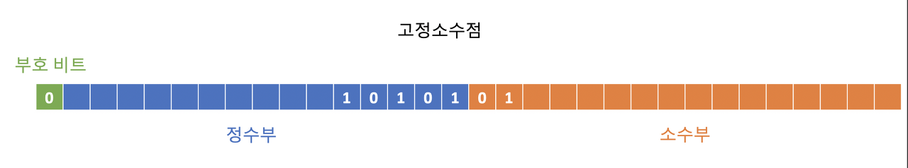

남은 부분을 0으로 채우면 끝


#### 부동소수점

부동소수점 역시 첫 번째 칸은 부호비트이다. 다만 그 다음 8칸은 지수부, 나머지 23칸은 가수부이다. 부호 부분엔 실수가 음수일 경우 1, 양수일 경우 0을 자리시킨다. 지수부는 위 설명에서의 n에 bias를 더한 값을 2진수로 변환한 수를 넣는 부분이다. bias는 32비트에서는 127, 64비트에서는 1023이다.

가수부에는 가수를 넣는 부분인데, 위 설명에서의 m의 소수점 아래 부분을 일컫는다.

21.25를 2진수로 변환한 10101.01을 예로 들어 그림과 함께 설명하면 다음과 같다.

```
부호비트: 0 (10101.01은 양수이기 때문이다.)
지수부분: 10000011 (n+bias의 2진수 값이다. 위에서 구한 대로 n은 4, 32비트이기에 bias는 127. 4+127=131을 2진수로 변환하면 10000011이다.)
가수부분: 010101 (m의 소수점 아래부분이 들어가는 곳으로, 위에서 구한대로 m은 1.010101이다. 그러므로 010101이 가수에 해당한다.)
```


그리고 남은 부분은 모두 0으로 채워주면 끝이다.


## 패리티 비트 & 해밍 코드

### 패리티 비트

문자열 내 1비트의 모든 숫자가 짝수 또는 홀수인지를 보증하기 위해 전송하고자 하는 데이터의 각 문자에 1 비트를 더하여 전송하는 방법.

2가지 종류의 (짝,홀) 패리티 비트가 있다.

- 짝수 패리티는 전체 비트에서 1의 개수가 짝수가 되도록 패리티 비트를 정하는 방법.
- 홀수 패리티는 전체 비트에서 1의 개수가 홀수가 되도록 패리티 비트를 정하는 방법.

### 해밍 코드

이진 선형 블록 오류 정정 부호의 일종.

#### 특징

데이터 전송 또는 메모리 액세스 등의 경우 최대 2비트의 오류를 감지하거나, 1비트 오류를 수정할 수 있다.

#### 해밍코드를 생성하는 방법

1. 몇 개의 패리티 비트를 추가할 지 계산
   

위의 부등식을 만족하는 최소의 p를 계산

2. 패리티비트를 추가해서 새로운 데이터를 생성


#### 예시

1. 원본 데이터 1001에 대해 해밍코드를 만들어보자. 순서에 따라 먼저 몇개의 패리티비트를 추가해야할지 계산한다.

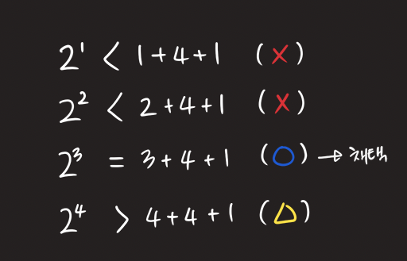

위 부등식 검사를 통해 가장 적절한 P의 값은 3이라는 것을 알 수 있다. 4도 부등식을 만족하지만 P는 부등식을 만족하는 최소값이면 되기 때문에 3을 채택한다.

2. P를 구했으니 패리티비트 자리를 추가해서 새로운 데이터를 만든다.

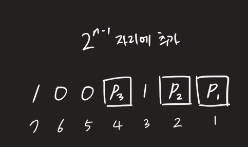

3. 공식을 통해 패리티 범위를 구한다.

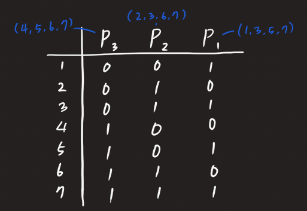

이 예제에서는 짝수패리티로 해밍코드를 만든다.
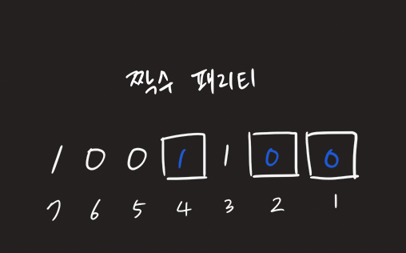

4. 따라서 원본 데이터 1001에 대한 해밍코드는 1001100이 된다.

#### 검사 및 수정

해밍코드의 가장 큰 특징은 데이터의 재수신 없이 수신측에서 바로 오류를 검출하고 수정할 수 있다는 점이다. 위에서 만든 해밍코드를 수신측의 입장에서 해석하고 원본 데이터를 얻어내는 방법에 대해 알아보자.

정상적으로 수신했다면 1001100을 수신해야 하지만 검출과 수정을 해보기 위해 단일 비트 오류가 발생해서 1011100을 수신했다고 가정한다. 수신측은 이 통신이 짝수 해밍코드를 사용한 통신임을 미리 알고 있기 때문에 어떤 비트가 패리티비트인지 알고있다.


그리고 그 패리티비트가 어떤 범위에 대한 짝수패리티인지도 알고 있기 때문에 순서대로 패리티비트의 유효성을 검사하는 것으로 오류를 수정할 수 있다.

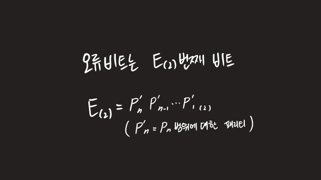

첫번째 비트부터 검사한다.

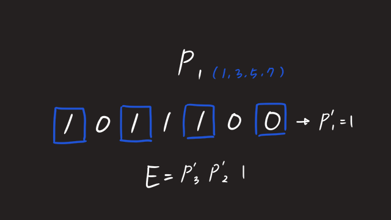

첫번째 패리티를 검사해봤더니 벌써 오류가 발생했음을 알 수 있다. 범위에 대한 짝수패리티는 1이기 때문에 1을 기록하고 넘어간다.

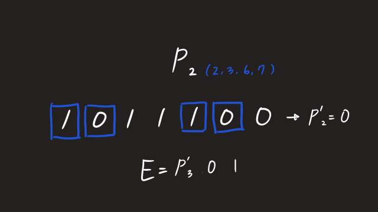

두번째 패리티를 검사해봤더니 정상이다. 범위에 대한 짝수패리티는 0이기 때문에 0을 기록하고 넘어간다.

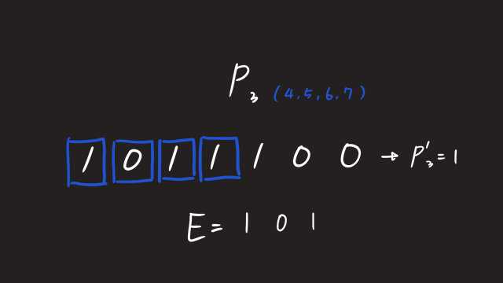

세번째 패리티를 검사해봤더니 또 패리티가 맞지 않는다. 범위에 대한 짝수 패리티는 1이기 때문에 1을 기록한다. 결국 E는 5임을 구할 수 있다.

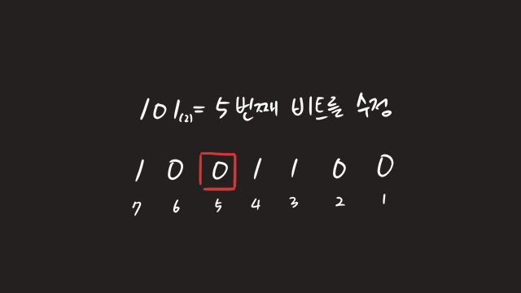

5번 비트를 0으로 바꿔서 1001100 즉, 원래 보내고자 했던 데이터를 얻을 수 있고, 해밍코드를 만들기 위해 추가한 (1, 2, 4) 번째 비트를 제거하고 1001이라는 원래 메시지를 얻을 수 있다.

출처: https://eastroot1590.tistory.com/entry/오류-검출-코드-해밍코드Hamming-Code [글그리 블로그]

## ARM 프로세서

### ARM?

- Acorn RISC Machine의 약자로 임베디드 시스템에 자주 사용되는 RISC 프로세서의 이름.
- ARM은 고성능 MPU와 더불어 다양한 병렬 제어 유닛과 통신 인터페이스를 갖추고 있음.

### 구조

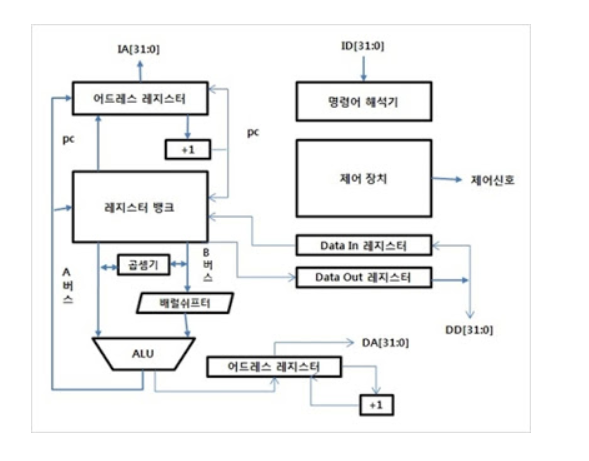

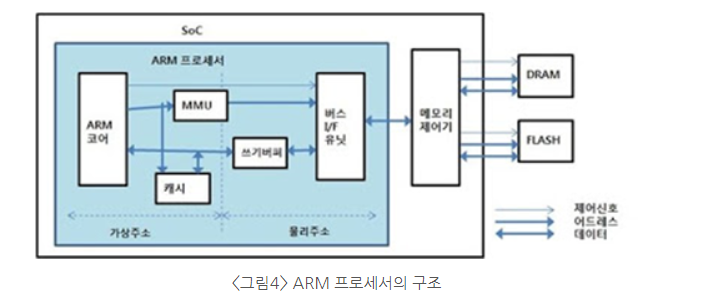

- ARM 코어 : ARM 아키텍처의 기본원리를 이용하여 구현한 프로세서의 핵심부분. 일반적인 프로세서와 동일한 구조로 레지스터, ALU, 제어장치, 명령어 해석기와 내부에서 서로 정보를 교환하기 위한 데이터 경로로 구성되어있음.
- 명령어 해석기 : 입력되는 명령을 해석하기 위한 장치
- 제어 장치 : 제어에 필요한 신호를 내부와 외부로 구동하는 역할
- ALU(Arithmetic Logic Unit) : 32비트 산술 및 논리 연산을 수행하는 중추로 레지스터 뱅크로부터 2개의 내부 버스가 연결되어있고, 연산결과를 레지스터 뱅크 및 어드레스 레지스터로 저장하기위한 ALU 출력 버스가 존재한다.
- 캐시 : ARM 코어에서 읽기 요청이 있을 때 명령과 데이터 전달을 최대한 빠르게하기 위한 고속 메모리 장치. 대부분 캐시를 가지고 있는 프로세서는 MMU또는 MPU 같은 제어장치가 존재.
  ( MMU : 가상 주소를 물리 주소로 변환하기 위한 어드레스 변환 기능이 있어 다양한 어플리케이션을 지원할 수 있음. )
