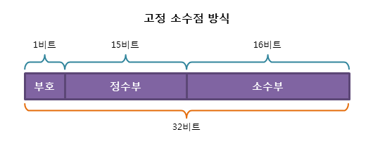
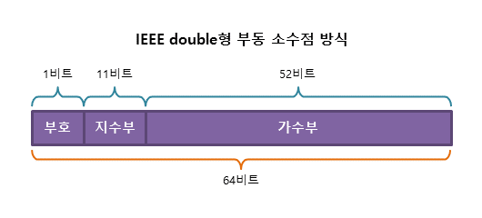
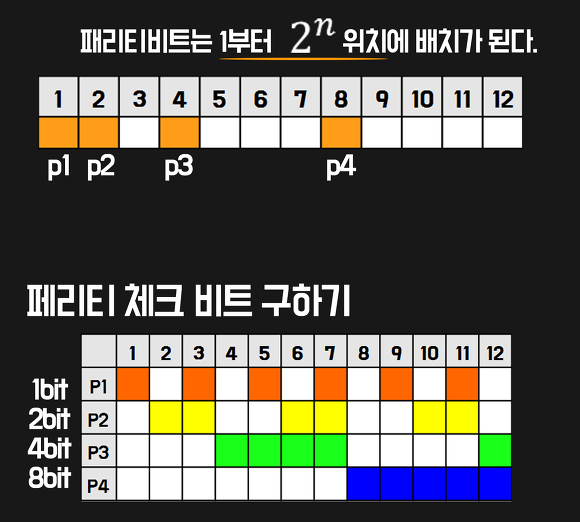
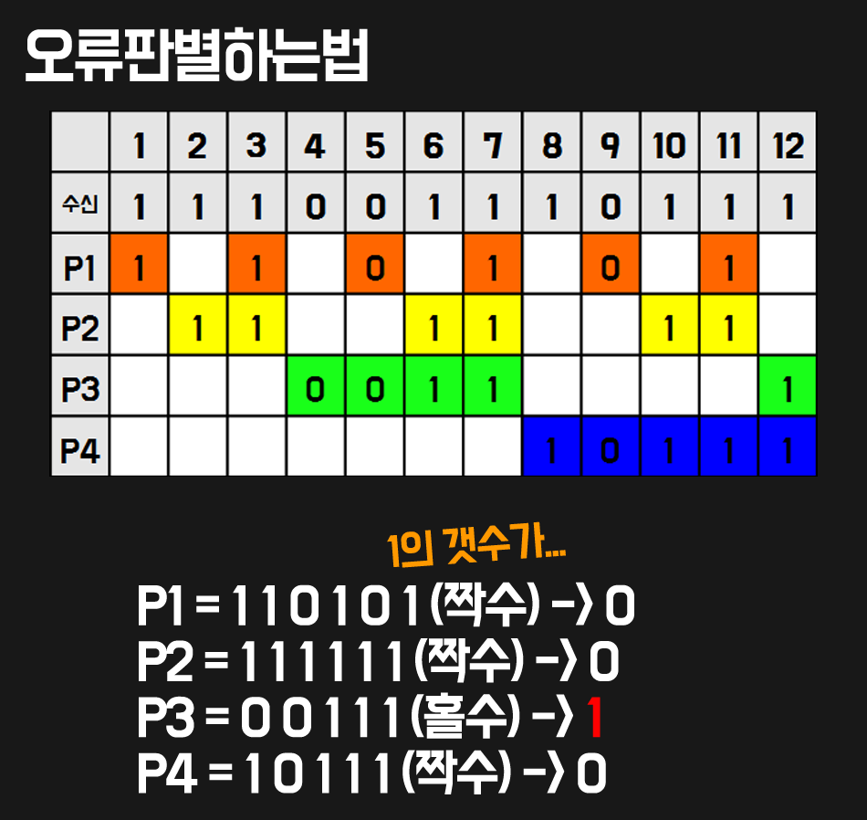
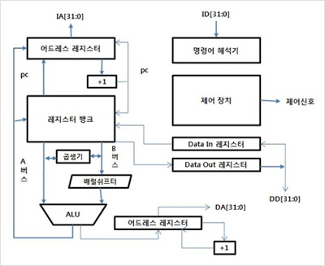

# 고정 소수점 & 부동 소수점

[참고](https://m.blog.naver.com/PostView.naver?isHttpsRedirect=true&blogId=7rlaguswns7&logNo=221349728794)

## 고정 소수점

고정 소수점이란 말 그대로 소수점이 고정이 되어있는 상태이다. 소수부분과 정수 부분을 나눠서 표현을 한다. 

예를 들어서 10.375라는 수가 있다면, 정수부분은 10이라는 수를 나타내고 소수 부분은 0.375를 나타낸다. 이진법 표기에 따라서 각 자리의 수는 0.5 0.25 0.125 순으로 줄어들게 되는데 0.375 = 0.25 + 0.125으로 나타낸다. 
고로 10.375 = 1010.011 로 나타낸다. 하지만 소수점이 커지게 되면 그만큼 사용하는 자리수도 늘어나게 되므로 표현 방법에 제약이 많다. 그래서 부동 소수점을 사용해서 소수를 표시한다.

## 부동 소수점

부동 소수점의 방식은 xxx.xxx방식이 아닌 2의 a*2^b 를 사용해서 숫자를 나타낸다. 10.375가 있으면 일단 고정 소수점으로 나타낸 다음에 1010.011을 1만 정수부분에 남을 때 까지 줄여준다. 1.010011 * 2 ^ 3 와 같이 줄여주면 1.010011 과 2 ^ 3 을 나타내준다. 지수부에 나타 내 줄 때는 127을 영점으로 잡고 지수의 수 만큼 더해준다. 2 ^ 3은 130으로 나타내므로 10000010 으로 나타내어 주고, 1.010011은 맨 앞의 1은 생략하고 가수부에 넣어준다.

# 패리티 비트 & 해밍코드

https://m.blog.naver.com/PostView.naver?blogId=7rlaguswns7&logNo=221351867797&targetKeyword=&targetRecommendationCode=1

[참고](https://milkye.tistory.com/130)

## 패리티 비트

1의 개수를 홀수인지 아닌지를 통해서 오류를 검출한다. 비트 1개의 오류는 검출이 가능하나 비트가 2개가 오류가 나면 오류 검출이 불가능하다.

## 해밍코드

데이터 비트에 여러개의 패리티 비트를 추가하여 오류를 검출하고 정정할 수 있는 코드

* 최소 패리티 비트 결정

2 ^ parity <= parity + data + 1이 성립해야 한다. Data의 크기가 4라고 하면 parity 비트의 최소값은 3이어야 한다.

* 위치 결정

n번째 패리티 비트는 2 ^ (n-1) 번째 자리에 배치된다. 또한 
다음과 같은 규칙으로 판별하는 자리를 정한다

* 검증 방식

자신과 검출하는 자리들의 1의 숫자가 짝수여야 한다. 그러므로 오류가 난 것이 확인이 되고, 패리티 비트를 역순으로 정렬하면 0100이 되는데 이것을 토대로 4번째 자리에 오류가 난 것이 확인 가능하다.

# ARM 프로세서

## Arm 이란?

Arm이란 임베디드 시스템에 많이 사용되는 RISC 프로세서의 이름이다. Acorn RISC Machine의 약자이다.

## 구조

    ARM 코어 : ARM 아키텍처의 설계를 따라 구현한 코어 

    명령어 해석기 : 입력되는 명령을 해석하기 위한 장치

    제어장치 : 명령어 해석기가 판독해준 명령을 따라서 기계에 명령을 수행하는 역할을 한다.

    ALU(Arithmetic Logic Unit) : 산술 연산 장치이다. 계산을 담당하는 역할을 한다.

## 특징

* RISC의 구조 특성상 명령어의 종류가 적다.

* 32비트 단위의 명령어 구조를 사용한다.

* 전력을 적게 사용한다.

* 칩을 직접생산하지 않고 설계만 해준다.
