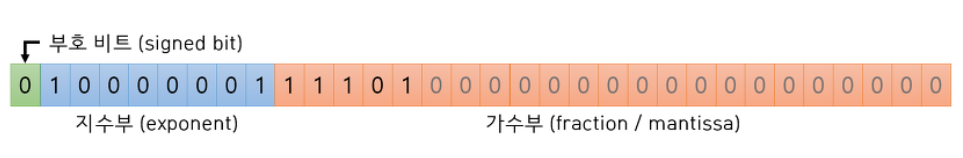
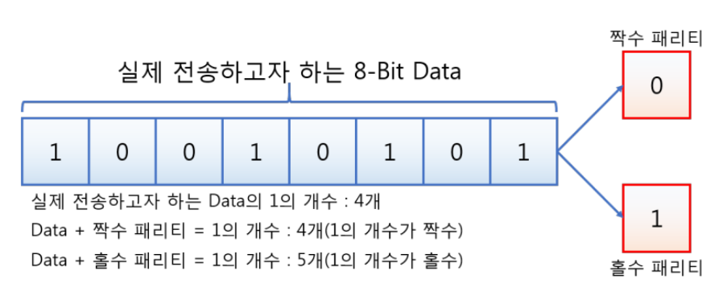
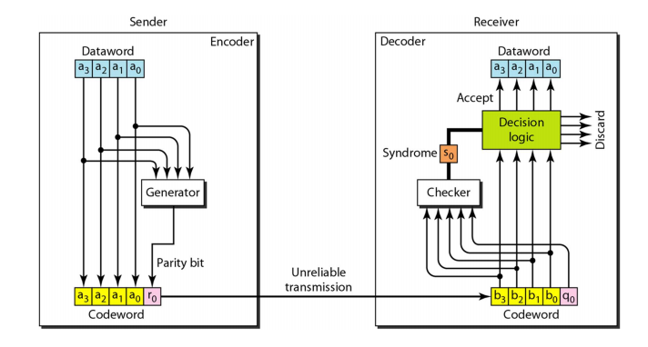
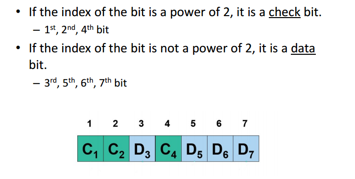
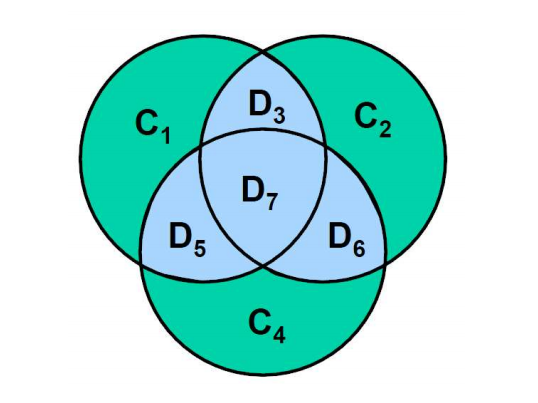
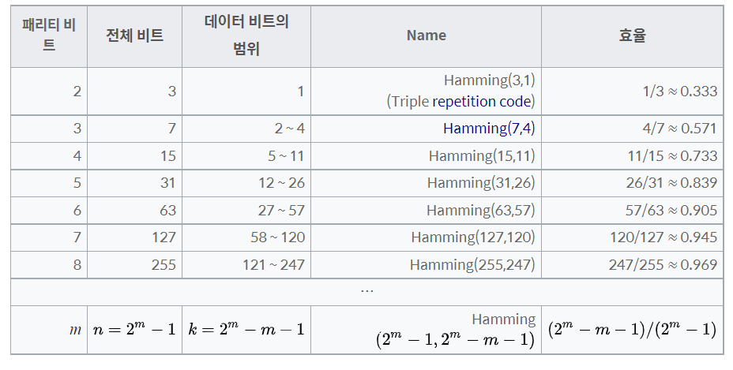
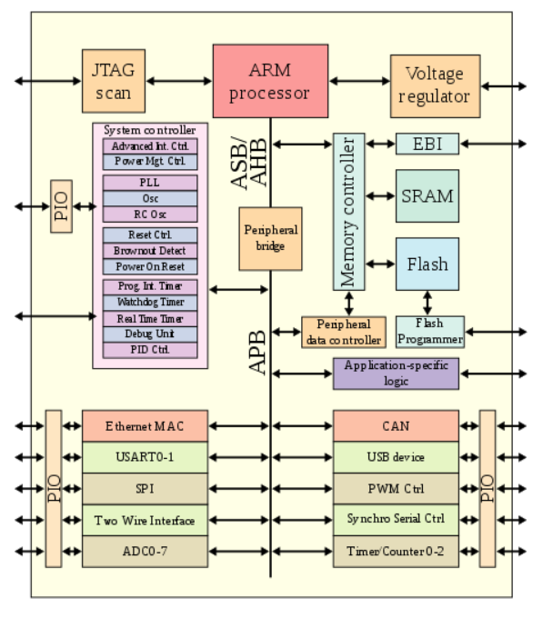
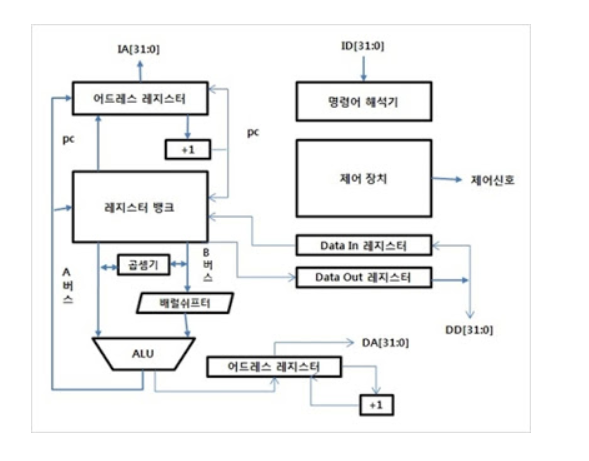
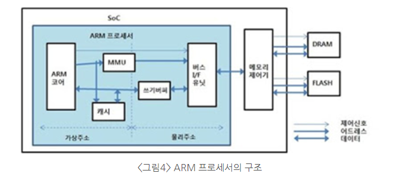

## 목차

1. 고정 소수점 & 부동 소수점
2. 패리티 비트 & 해밍 코드
3. ARM 프로세서


---------


# 01. 고정 소수점 & 부동 소수점

부동 소수점 (floating point)는 소수점이 움직인다는 의미를 가진다.


컴퓨터는 0과 1로 이루어진 기계어 즉, 2진법을 사용한다.  10진수의 경우 10^n에 해당하는 수가 될때마다 자릿수가 올라가지만 2진수의 경우 2^n에 해당하는 수가 될때 마다 자릿수가 올라간다.

예를 들어 4는 2진수로 2^2 == 100, 8은 이진수로 2^3 == 1000이다.


10진수 정수를 2진수로 바꾸는 방법은 10진수가 1일 될 때까지 2로 나누면서 나머지를 구하고 밑에서 거꾸로 읽으면된다.


부동소수점은 실수(real number)을 표현할 때 쓰는 방법이다. 정수부는 앞에 설명한 정수 변환가 똑같이 하면되지만 소수부는 10진수에 2를 곱해 1이나 0을 뽑아내고 위에서 밑으로 읽어준다. 

예를 들어, 0.625를 2진수로 변환하는 과정은 

1. `0.625` * `2` = `1.25` -> `1`과 나머지 `0.25`

2. `0.25` * `2` = `0.5` -> `0`과 나머지 `0.5`

3. `0.5` * `2` = `1.0` -> `1`과 나머지 `0`

   그러므로 0.625는 2진수로 `0.101` 이다.

 만약 0.789 같이 10진수 기준으로는 자릿수가 길지 않아도 n/(2의 배수) 꼴의 분수로 예쁘게 표현되지 않은 수일 경우 `2진수로 바꾸면 엄청나게 긴 길이`가 될 것이다.


### 고정 소수점

고정 소수점 표현방식은 앞서 설명한 10진수가 2진수로 바꾼 값을 그대로 넣는 방식이다. 

예를 들어, 7.625라는 실수를 2진수로 바꾸면 111.101이 된다. 이것을 그대로 저장하는 것이다.


16비트 체계의 경우 맨 앞자리는 부호비트 : 0이면 양수 1이면 음수

나머지 비트는 정수부와 소수부로 그대로 넣고 남은 자리는 0으로 채운다.

고정 소수점 방식은 구현하기 편리하지만 `비트수 대비 표현 가능한 수의 범위와 정밀도가 낮다`.


### 부동 소수점

부동 소수점 표현방식은 2진수로 변환한 결과를 정규화 과정을 걸쳐 표현하는 방식이다.

* 정규화 과정은 1.xxx * 2^n 으로 변환하는 것을 말한다. 

* 즉, 정수부를 1만 남을때까지 소수점을 이동하고 이동한 칸수만큼 n자리에 넣는다. 


예를들어, `111.101` 의 정규화는 `1.11101` * 2^2 이다.

여기서 정수부는 무조건 1이기 때문에 표현하지 않는다. (hidden bit)

* 32비트 체계에서 23자리 `가수부`에는 `정규화 결과`를 왼쪽부터 넣는다. 
* 지부수에는 2 ^ n 에서 n의 해당하는 수를 넣는다. 하지만 `bias라는 지정된 수를 더한` 다음에 넣어야한다.
* bias는 지수가 음수가 될 경우가 있기 때문이다.
* 32비트 체계에서 bias는 127이라고 규정한다.
  * 그러므로 n이 2인경우 2 + 127 인 129를 2진수로 바꾼 10000001을 넣고
  * n이 -100인 경우 (-100) + 127 = 27를 2진수로 바꾼 00011011으로 넣는다.


7.625를 부동소수점으로 바꾸면 `1.11101` * `2^2`를 

* 가수부에는 1을 제외한 `.11101`을 넣고
* 지수부에는 2 + 127 = 129 = `10000001`을 넣으면 된다.




C에서 나오는 float와 double은 32비트와 64비트 체계를 의미한다. 

* 32비트의 경우 부호비트 1 + 지수부 8 + 가수부 23이고
* 64비트의 경우 부호비트 1 + 지수부 11 + 가수부 52비트 이다.


#### 결론

부동소수점 표현방식은 고정 소수점 표현방식에 비해서 비트 수 대비 표현 가능한 수가의 범위와 정밀도가 좋기 때문에 현재의 대부분의 컴퓨터 시스템에서 부동소수점을 이용해 실수로 표현하고 있다.


> 참고자료
>
> [고정소수점,부동소수점](https://gsmesie692.tistory.com/94)


# 02. 패리티 비트 & 해밍 코드

 데이터를 전송하다면 잡음과 오류에 의해 데이터 손실과 변경이 일어난다. 이것을 에러라고 하며 에러가 발생했는 혹은 어디서 발생했는지에 관한 오류 검사 중 가장 대표적이면서 간단한 검사를 패리티 비트라고 한다.


### 패리티 비트

오류가 발생했는지를 검사하기 위해 추가된 비트이다. 전송하고자 하는 데이터의 각 문자에 1비트를 더해 전송하는 방법으로 1개의 비트 오류만 검출 할 수 있다.


#### 짝수 / 홀수 패리티 비트



짝수 패리티 비트라고 0이 고정으로 되어있거나 홀수 패리티 비트라고 1로 고정되어있는게 아니다. 짝수 패리티 비트는 1의 개수를 짝수로 패리티 비트를 설정하는 것이고, 홀수 패리티 비트는 1의 개수를 홀수로 맞추는 것을 말한다.


패리티 비트를 정해서 데이터를 보내면 받는 쪽에서 수신된 데이터의 전체 비트를 계산해서 패리티 비트를 다시 계산함으로써 오류 발생 여부를 알 수 있다. 하지만 오류 발생 여부만 알 수 있지 오류 수정은 할 수 없다.

또한 2비트의 데이터가 손실되면 알 수 없다.



예를 들어, 1011의 데이터를 보내고 짝수 패리티 비트인 경우

* `10111`을 받으면 짝수개임으로 정상으로 취급
* `10011` (1 bit가 잘못된 경우), 홀수개이므로 discard
* `00110` (2 bit가 잘못된 경우), 오류이지만 짝수이므로 패스
* `01011` (3 bit가 잘못된 경우), 홀수이므로 discard


### Hamming code

해밍코드는 리차드 해밍에 의해 고안된 에러탐지로 2비트의 에러 탐지와 1비트의 correct가 가능해진다. Hamming (n, k) 코드는 k비트의 dataword를 7비트 codeword로 바꾸는 것을 말한다.

예를들어 Hamming(4,7)인 경우 보내는 데이터 코드는 4비트이고 3비트의 check bit가 있음을 말한다.





* check bit는 2의 지수의 수에 들어간다. 즉, 1,2,4 번째에 들어감

예를 들어,

`1011` 데이터를 보내는 경우 3번째 `1`, 5번째 `0`, 6번째 `1`, 7번째 `1` 임

1번째 들어가는 비트는` 3번째, 5번째, 7번째`의 영향을 미치고 3번, 5번, 7번 비트를 XOR 통해 비트를 결정한다.  --> `0`

```java
1&3  1&5  1&6  1&7
001  001  001  001
011  101  110  111
ㅡㅡ  ㅡㅡ  ㅡㅡ ㅡㅡ
001  001  000  001 
  o   o    x   o    --> 3 5 7 101 이므로 0  
```

2번째 들어가는 비트는 `3번째, 6번째, 7번째`의 영향을 미치고 3,6,7번 비트를 XOR한 결과 2번째 비트는 `1`이 들어간다.

```java
2&3    2&5    2&6    2&7
010    010    010    010
011    101    110    111
---    ---    ---    ---
010    000    010    010 --> 3 6 7  111 이므로 1
```

4번째 들어가는 비트는 `5번째, 6번째, 7번째`의 영향을 미치고 5,6,7번 비트의 XOR한 결과 4번째 비트는 `0`이 들어간다.

```java
4&3    4&5    4&6    4&7
100    100    100    100
011    101    110    111
---    ---    ---    ---
000    100    100    100 --> 5 6 7 011 이므로 0
```

그러므로 해밍코드는 `0110011`이다.


1비트의 error를 correct하기 위해서 hamming code보다 더 잘 할 수 없다. 그래서 해밍코드를 perfect code라고 한다.

k가 많아질 수록 효율성은 높아지지만 여러 bit가 에러 날 가능성 역시 높아지기 때문에 detection 능력은 작아진다. 


### 해밍코드 생성규칙




> 참고자료
>
> [해밍코드](https://dreamlog.tistory.com/578)


# 03. ARM 프로세서



### ARM Processor(Advanced RISC Machine 또는 Acorn RISC Machine)

* ARM은 임베디드 기기에 주로 사용되는 32bit 프로세서이다.
* 모바일 기기 또는 IoT 디바이스에 많이 사용되는 아키텍처이다.
* ARM은 고성능 MPU와 더불어 다양한 병렬 제어 유닛과 통신 인터페이스를 갖추고 있어 다양한 응용을 지원하는 아키텍처로 구성하지만 자동체 제어기에서 사용하는 CAN 통신 인터페이스가 없어 제어기로써는 사용되지 않으며 인포테인먼트 요소인 오디오 및 네비게이션에 주로 이용되는 아키텍처이다.
* RISC 아키텍처가 있는 프로세서는 일반적으로 복잡한 명령 세트 컴퓨팅 (CISC) 아키텍처보다 `적은 트랜지스터를 필요`로 하여 `비용, 전력소비 및 열 방출을 향상`시킨다.
* 스마트폰, 랩탑, 태블릿, 기타 임베디드 시스템과 같은 `가볍고 휴대가능한 베터리 전원 장치에 바람직`지만 서버와 데스크탑에도 어느정도 유용하다.
* 스마트폰에서 CPU역할을 하는 AP (Application Processor)가 널리 보급되며 인지도가 올라갔다.

 

#### ARM 프로세서 설계시 고려사항

1. 저전력, 작은 die 사이즈로 설계
2. 제한된 메모리를 고려한 코드 직접도
3. 저가격의 메모리 소자 사용
4. 설계 및 제조비용, 주변장치 공간을 위해 임베디드 프로세서가 차지하는 다이사이즈 줄이기

 

#### RISC와 CISC이란

RISC(Reduced Instruction Set Computing- 줄여진 명령집합컴퓨터)는 CISC에 비해 명령어구조가 간단하고 명령어 수가 적어 보다 빠르고 효율적으로 처리가 가능하다.

* HOST PC (노트북, 데스크탑)에서 사용하는 대부분의 프로세서는 CISC이다.

CISC는 열이 많이 발생하기 때문에 반드시 열을 내려주는 냉각팬이 필요하지만 RISC는 필요없어 부피가 작다. 따라서 대부분의 임베디드 시스템에서 RISC 아키텍처 선호한다.

 

### ARM Architecrue

ARM 아키텍처는 ARM프로세서를 설계하는 디자인을 의미하며 프로그래머 모델을 의미한다.





* ARM 코어 : ARM 아키텍처의 기본원리를 이용하여 구현한 프로세서의 핵심부분으로 일반적인 프로세서와 동일한 구조를 가지고 있다. 레지스터, ALU, 제어장치, 명령어 해석기와 내부에서 서로 정보를 교환하기 위한 데이터 경로로 구성되어있다.
* 명령어 해석기 : 입력되는 명령을 해석하기 위한 장치
* 제어 장치 : 제어에 필요한 신호를 내부와 외부로 구동하는 역할
* ALU(Arithmetic Logic Unit) : 32비트 산술 및 논리 연산을 수행한다. 2개의 내부 버스가 연결되어있고, 연산결과를 레지스터 뱅크 및 어드레스 레지스터로 저장하기위한 ALU 출력 버스가 있다. 
* 캐시 : ARM 코어에서 읽기 요청이 있을 때 명령과 데이터를 빠르게 전달하기 위한 고속 메모리 장치이다.
* MMU : 가상 주소를 물리 주소로 변환하기 위한 어드레스 변환 기능이 있다.


> 참고자료
>
> [ARM아키텍처의이해](https://m.blog.naver.com/PostView.naver?isHttpsRedirect=true&blogId=suresofttech&logNo=221249244004)
