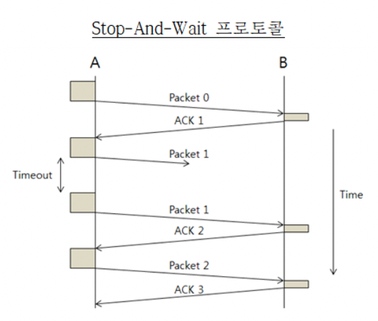
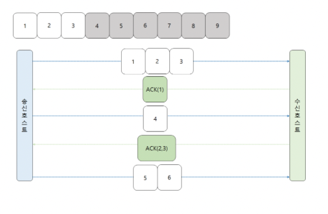
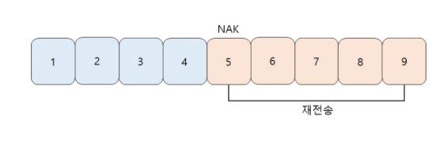
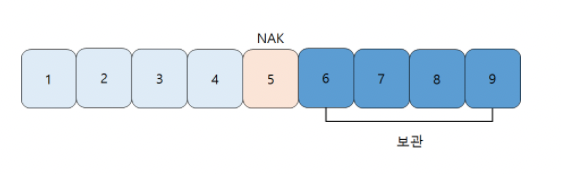
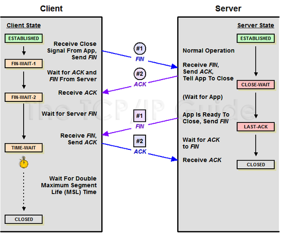

# 1주차 CS 스터디

## 네트워크 - OSI 7계층

OSI 7계층 모델은 국제 표준 기구인 ISO에서 만들었음. 네트워크의 표준을 제정하기위해 만들었지만 **"실제로" 사용되지는 않음.**
실제로 대부분은 TCP/IP 모델을 사용.

> 각 계층은 통신 과정에서 계층끼리 실제(물리적)로 연결되어있는 것이 아님. 논리적으로 연결되어 있음. ( Logically Connected )

> 각 계층 사이에서 데이터를 주고 받을 때는 데이터의 헤더를 변경하는 과정이 필요함. 그 과정을 **encapsulation**, **decapsulation**이라고 부름.

> 면접이나 이런 곳에서 실제로 각 계층의 세세한 동작을 물어보는 것은 거의 없는 것 같지만, 각 계층의 순서와 데이터의 단위 정도는 알아두면 좋음.

### 물리 계층 ( Physical Layer )

- 기계적, 전기적인 특징을 이용해 데이터를 전송
- 0, 1의 비트를 통해 데이터 전달
- 이 계층과 관련된 장비는 허브가 존재

### 데이터 링크 계층 ( Data Link Layer )

- 물리 계층에서 송수신되는 정보의 오류와 흐름을 관리하여 안전한 정보의 전달을 수행할 수 있도록 도와주는 역할
- MAC Address를 통해 통신을 진행
- 이 계층에서 사용하는 데이터의 단위는 프레임
- 이 계층과 관련된 장비는 스위치가 존재

### 네트워크 계층 ( Network Layer )

- 라우팅 기능을 하는 계층. 목적지까지 데이터를 보내는 기능을 제공.
- 이 계층에서 사용하는 데이터 단위는 패킷
- 이 계층과 관련된 장비는 라우터가 존재

### 전송 계층 ( Transport Layer )

- 전송 계층은 양 끝단의 사용자들이 신뢰성있는 데이터를 주고 받게 해주는 역할
- 송신자와 수신자 간의 신뢰성있고 효율적인 데이터를 전송하기 위하여 오류검출 및 복구, 흐름제어와 중복검사 등을 수행
- Port 번호를 사용하여 데이터 전송을하고, TCP와 UDP가 대표적인 프로토콜.
- 이 계층에서 사용하는 데이터 단위는 세그먼트.

### 세션 계층 ( Session Layer )

- 세션 계층은 응용 프로세스가 통신을 관리하기 위한 방법을 정의
- 이 계층은 세션을 만들고 없애는 역할을 함

### 표현 계층 ( Presentation Layer )

- 데이터를 어떻게 표현할지 정하는 역할을 가지는 계층
- 아래와 같은 세가지의 기능을 가짐
  1. 송신자에서 온 데이터를 해석하기 위한 응용계층 데이터 부호화, 변화
  2. 수신자에서 데이터의 압축을 풀수 있는 방식으로 된 데이터 압축
  3. 데이터의 암호화와 복호화

### 응용 계층 ( Application Layer )

- 사용자와 가장 가까운 계층.
- 우리가 실제로 사용하는 응용 서비스나 프로세스가 이 계층에서 작동.

> 결국 중요한건 네트워크는 여러개의 레이어가 겹겹이 쌓여서 만들어진 계층이라는 것. 현재 대부분 사용되는 TCP/IP 모델도 4계층으로 이루어져있음. 이러한 계층끼리 서로 정보를 주고 받으며 맡은 역할을 수행함으로써 통신이 이루어짐.

## 네트워크 TCP

- `TCP(Transmission Control Protocol)`는 Transport Layer의 프로토콜 중 하나이다.
- 특징으로는 데이터의 송수신을 위해 IP를 이용하는 프로토콜이라는 것 + 통신간의 신뢰성 보장
- 신뢰성을 보장하기 위한 방법 2가지

  - 흐름제어 ( flow control )

    - 송신측과 수신측의 데이터 처리 속도 차이를 해결하기위한 방법
    - 수신측의 속도 < 송신측의 속도 => 문제 발생
    - 이를 해결하기 위한 방법
      - Stop and Wait
        
        - 송신측이 수신측에게 1개의 패킷을 송신하면, 수신측이 해당 패킷의 에러 유무를 판단하고 ACK를 보내거나 NAK를 보냄.
        - 송신측이 NAK를 받거나 ACK를 받지 못하면, 송신측은 전달한 패킷이 제대로 송신되지 않았다고 판단하여 다시 보냄.
        - 장점
          - 구현 방식의 단순함
          - 버퍼의 최대 크기가 1
        - 단점
          - 한 번에 하나씩만 전송하기 때문에 전송효율이 매우 안좋음
      - Sliding Window
        
        - Stop and Wait의 단점을 해결하기 위해 사용하는 방법으로 윈도우라는 것을 사용하여 여러 개의 패킷을 보내는 방식.
        - 윈도우에 포함되는 영역의 모든 패킷을 전송하고, 그 패킷들이 확인되면 윈도우를 slide하여 패킷을 전송.
        - Go-Back-N
          
          - 위의 예시를 살펴보면, 윈도우의 크기가 9라면 1~9까지의 프레임을 수신측으로 보낼 수 있음.
          - 그런데 여기서 수신측이 5번 프레임에서 NAK를 보내면, 5번부터 현재 윈도우의 끝까지 모두 재전송하는 방식.
          - 송신자는 ACK를 기다리지않고 여러개의 패킷을 전송할 수 있음. 하지만, 중간에 하나가 오류가 발생했을 때 그 이후의 패킷을 모두 버려야한다는 단점이 있음.
        - Selective Repeat
          
          - Go-Back-N 의 단점을 해결하기 위해 사용하는 방법.
          - 오류가 발생한 프레임만 재전송하는 방식. Go-Back-N과 달리 오류가 난 프레임만 재전송을 함.
            > Sliding Window 방식에서는 window size와 패킷의 id와 비슷한 sequence number간의 상관관계를 통해 window size의 최댓값을 지정하게 되는데, 이러한 방식은 직접 검색해서 한 번 더 알아보는 것을 추천드립니다. 너무나 deep해져서 이 부분은 일단 보류하겠습니다.

  - 혼잡제어 ( congestion control )
    - 송신측의 데이터 전달과 네트워크의 데이터처리 속도 차이를 해결하기위한 방법
    - 네트워크의 혼잡에 의해 오버플로우 혹은 데이터 손실이 발생
    - 혼잡이라는 말은 네트워크내의 패킷수가 과도하게 증가하는 현상
    - 해결 방법
      - Slow Start
        - 혼잡이 감지되면 Window의 Size를 1로 줄임. 그 후 `Threshold` 전까지 지수적으로 증가하다, 그 후에는 선형적으로 증가시키는 방식.
      - AIMD ( Additive Increase Multicative Decrease )
        - Window Size를 증가할 때는 선형적으로, 감소할 때는 절반씩 줄이는 방법. 말 그대로 Adittive하게 증가하고, Multicative하게 감소시킴.
      - 위의 두가지 방법을 적절히 활용하는 TCP Tahoe, TCP Reno 방법이 있음.
        - 3 ACK Duplicated, Timeout 등의 조건에 따라 적절히 Slow Start, AIMD 사용
      - Threshold? ( 임계점 )
        - 특정 임계점으로 이 임계점을 넘어가면 Window Size를 증가시키는 방식을 다르게하기위해 사용.
        - 보통 Tahoe에서는 혼잡이 발생했을 때 3 ACK Duplicated 에서는 Threshold를 현재 윈도우의 절반으로 줄이고 Timeout일 때는 1로 줄인다. 그에 반해, Reno에서는 무조건 절반으로 변경.

### TCP 3 way handshake

> TCP의 가상회선을 수립하는 단계. 클라이언트는 서버에 요청을 전송할 수 있는지, 서버는 클라이언트에게 응답을 전송할 수 있는지 확인하는 과정.

- SYN(Synchronize), ACK(Acknowledgement) 패킷을 주고 받음.
- 임의의 난수를 SYN의 플래그에 전송하고, 그것을 받은 측은 ACK의 플래그에 1을 더한 값을 전송.
  - 여기서 난수를 사용하는 이유? 기존 요청과 구분하기 위한 플래그로 사용.
- 순서 : **SYN(n) -> ACK(n+1), SYN(m) -> ACK(m+1)**
  1. 클라이언트가 SYN을 서버에게 전송
  2. 서버가 SYN, ACK를 클라이언트에게 전송
  3. 클라이언트가 ACK를 서버에게 전송
  4. 가상 회선 ESTABLISHED

=> 이렇게 1~3 까지의 단계를 거치기 때문에 3 way handshake라고 부름.

### TCP 4 way handshake

> TCP연결을 해제하는 단계로, 클라이언트는 서버에게 연결해제를 통지하고 서버가 이를 확인하고 클라이언트에게 이를 받았음을 전송해주고 최종적으로 연결이 해제. 단, 서버에서 소켓이 닫혔다고 통지해도 클라이언트 측에서는 일정시간 대기하는데, 혹시나 패킷이 나중에 도착할 수 있기 때문.

- 순서
  1. 데이터를 전부 송신한 클라이언트가 FIN 비트를 송신
  2. 서버가 ACK 비트를 클라이언트로 송신
  3. 클라이언트는 서버의 남은 패킷을 송신할때까지 대기
  4. 클라이언트가 FIN 비트를 서버로 송신
  5. 클라이언트가 ACK 비트를 서버로 송신
  6. 여기서 클라이언트가 서버에서 보낸 패킷이 늦게 도착할 수있다고 생각해서 잠시 대기
  7. CLOSED (연결 해제됨)

=> 이렇게 1~2, 4~5 의 단계를 거치기 때문에 4 way handshake라고 부름.

6번에서 잠시 대기하는 것을 TIME-WAIT이라고 부름.

## 네트워크 UDP

UDP(User Datagram Protocol)도 TCP와 마찬가지로 Transport Layer의 프로토콜으로 IP(데이터 그램)를 패킷으로 사용함.

### TCP의 문제점

- 신뢰를 보장한다는 큰 장점이 있지만, 패킷을 조금만 손실해도 그 패킷을 재전송하고 매번 connection 수립 및 connection 해제 단계를 거치기 때문에 "느림"
- 그렇기 때문에 실시간 통신이 필요할 때는 사용하기 힘듦.

### UDP의 특징

- 신뢰성을 거의 보장하지 않음.
  - 혼잡제어, 흐름제어 등을 하지않기 때문에 신뢰성이 거의 없음. 보통 checksum을 통해서 데이터 훼손 정도만 판단 가능. 또한 데이터가 유실되어도 ACK 등의 패킷을 주고받지 않기 때문에 다시 요청하는 방법이 없음.
- UDP는 신뢰성을 보장하지않아서, TCP 보다 훨씬 빠르다는 장점이 있음.
- Connection-Less 서비스 => 데이터 전송 순서가 보장되지 않음.
  - 이와 반대로 Connection Oriented인 TCP는 전송 순서를 보장.
  - _connection oriented_, *connection less*라는 단어는 계층마다 조금씩 다르게 사용되므로, 한 번 숙지하면 좋음.

이러한 빠른 속도의 장점 때문에, Real-time Transport Protocol RTP에서 주로 사용함.

즉, 신뢰성보다 성능이 우선시 되는 서비스에 사용되는 프로토콜.
( ex) 실시간 스트리밍 )
