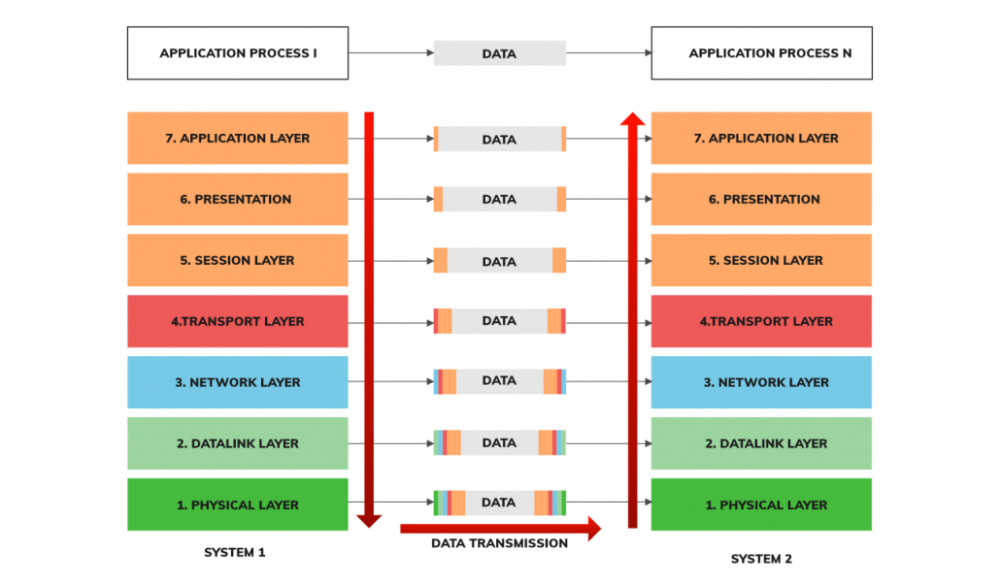

# OSI 7 계층

## OSI 7계층의 필요성

* 네트워크를 제어할 때 자신들 만의 기기 그리고 규격을 만들어서 통일이 되지 않음 -> 통일된 규격과 프로토콜의 필요성 대두!

* 데이터 통신을 단계로 나누어 각 단계의 순서를 명확히하고, 이 모델에 따라 프로토콜을 정의해서 데이터 통신을 구축!  

## Encapsulation & Decapsulation

* encapsulation
  
  데이터 전송시에 각각의 레이어에 관련한 헤더를 붙이는 과정

* decapsulation

  수신된 데이터를 각각의 레이어를 올라가면서 헤더를 없에는 과정

## OSI 7 계층의 각 계층

* 1계층 (Physical layer)
    
  osi 최하층에 위치한 계층으로 데이터가 물리적으로 전송되는 채널이다. 데이터의 형태는 0 과 1로 이루어진 bit 형태로 되어있다. 허브가 이 계층을 담당하는 대표적인 장비다.

* 2계층 (Datalink layer)
  
  라우터에서 라우터 간의 연결을 관장하는 계층이다. 오류를 찾아내기 위해서 crc 기반의 오류 제어와 흐름 제어를 사용한다. 데이터의 형태는 Frame으로 이루어져 있으며, 이 계층의 주소는 MAC(Media Access Control)주소이다. 이 계층을 담당하는 장비로는 스위치가 있다.

* 3계층 (Network layer)
  
  네트워크와 네트워크 간의 연결을 담당하는 계층이다. 라우팅을 통해 데이터를 보낼 최적의 경로를 선택한다. 데이터의 형태는 Packet이며 이 계층의 주소는 IP주소이다. 이 계층을 담당하는 장비로는 라우터가 존재한다.

* 4계층 (Transport layer)

  컴퓨터와 컴퓨터의 프로세스간의 통신을 담당하는 계층이다. 데이터의 형태로는 쓰이는 방법에 따라 Datagram, Segment로 이루어져 있다. 이 계층의 주소의 이름은 Port이다.

* 5계층 (Session layer)

  통신 장치간의 상호작용과 동기화를 제공한다. 세션과 세션간의 통신을 관리한다.

* 6계층 (Presentation layer)

  세션 계층으로 부터 전달받은 데이터를 읽을 수 있는 형식으로 변환한다. 

* 7계층 (Application layer)

  응용 프로그램이 이 계층에 해당된다. 유저와 기기간의 인터페이스를 제공한다.

# TCP/IP 흐름제어 & 혼잡제어

  ## Tcp 란?
  Transmission Control Protocol의 약자로써 osi 모델 기준 4 계층에서 통신을 제어하는 프로토콜이다.
  
  ## 흐름제어란?
  * 송신측과 수신측의 데이터 속도 차이를 해결하기 위한 기법
  * 수신측이 송신측에게 자신의 상태를 알리는 것 
  * 이를 위한 도구로는 sliding window 와 sequence number가 있다.

  
    ### sliding window
    

    흐름제어에서 GBN, Selective Repeat에서 사용하는 일종의 버퍼로 송신측에서는 보내고 acknowledgement를 기다리는 packet과 보낼 예정인 packet을 저장하는 역활을 한다.

    ### sequence number
    위의 그림같이 각 패킷마다 번호를 부여해서 패킷이 모두 도착했는지 여부를 확인 할 수 있게 해준다. 전송계층에서 sequence number 를 활용하면 connection-oriented라 하고 아니라면 conectionless인 프로토콜이라고 한다. tcp/ip는 대표적인 connection-oriented 프로토콜이다.

  ### 전송 계층에는 flow control을 하는 3가지 프로토콜이 존재한다.

  * stop-and-wait

  

  버퍼가 크기가 1인 sliding window가 양쪽에 존재하며 수신자는 송신자에게 신호를 받으면 다음에 받고자하는 신호(ack)를 보내준다. 구현이 쉬우나 매번 신호를 1개씩 보내야 하므로 시간 낭비가 심하다.

  * GBN (Go-Back-N)

  
  
  크기가 1이상인 sliding window가 양쪽에 존재하며 송신측에서 한번에 여러개의 신호를 보낸다. 그리고 수신측에서 ack를 보내는데 송신측에서는 신호 중에서 가장 숫자가 큰 ack 이전까지 신호까지 받았다고 판단하고 sliding window를 이동한다. 한번에 여러개의 데이터를 송신과 수신이 가능해서 효율이 높다. 하지만 ack신호가 도착하지 않거나 앞의 신호에서 오류가 나면 이미 보낸 신호도 다시 보내야 하므로 자원낭비가 심할 수도 있다.

  * Selective-Repeat

  위의 GBN의 단점을 해결하기 위해서 사용한다. GBN과 달리 ack는 송신측에서 다음에 보내줄 신호가 아닌 도착한 신호를 확인해주는 역활을 해서 도착하지 않은 신호만 전송한다.

## 혼잡제어란?

* 네트워크로 들어가는 정보 소통량을 조절하여 네트워크가 혼잡해지지 않게 조절하는 것을 말한다. 흐름제어는 점대 점이라면 혼잡 제어는 네트워크 전체에 해당한다.  

  ### 예시

  *  slow start

      * 처음에 window의 크기를 1로 지정하고 한 주기마다 창의 크기를 2배씩 늘린다. 
      
      * 만약에 혼잡 현상이 발생하면 window의 크기를 1로 설정하고 threshold의 크기를 혼잡이 발생했을 당시 window의 크기의 1/2로 설정한다.

      * 이후에 지수증가를 하다가 threshold이상으로 올라가면 window의 크기가 1씩 증가한다.

  * AIMD(additive increase multiple decrease)
      * window의 크기를 1씩 증가 시킨다.
      * 혼잡이 발생하면 window의 크기를 절반으로 줄인다.
  
  * 실제 사용
    
    위의 2가지를 적절하게 사용해서 tcp reno, tcp tahoe 같은 방법을 사용한다.

# TCP 3 way handshake & 4 way handshake

## TCP / IP 통신에서 각각 연결을 수립할 때와 끊기위해 사용하는 과정이다.

### 3 way hanshake

* client 쪽에서 연결을 요청하는 syn 신호를 보냄
* syn을 확인했다는 ack 신호와 연결을 요청하는 syn 신호를 server 쪽에서 보냄
* client 쪽에서 연결이 되었다는 ack를 server로 보냄

### 4 way hanshake

* client는 연결이 종료되었다는 fin 신호를 보냄
* server는 확인했다는 ack 신호를 client에 보냄
* server는 연결이 종료되었다는 fin 신호를 보냄
* clinet는 확인했다는 ack 신호를 client에 보냄
  

# UDP

## UDP는 TCP와 같이 전송계층에서 작동하는 프로토콜이다. Error Control 과 Flow Control이 존재 하지 않는다.

* 장점

  * Error Control과 Flow Control이 존재하지 않아서 처리 속도가 빠르며 이를 통해서 실시간 서비스 (ex) 동영상, 실시간 스트림)에 사용된다.

* 단점

  * 위에서 얘기한 2가지 Control의 부재로 인해 데이터의 손상에 취약해서 신뢰성이 요구되는 프로세스에 사용하면 안됨