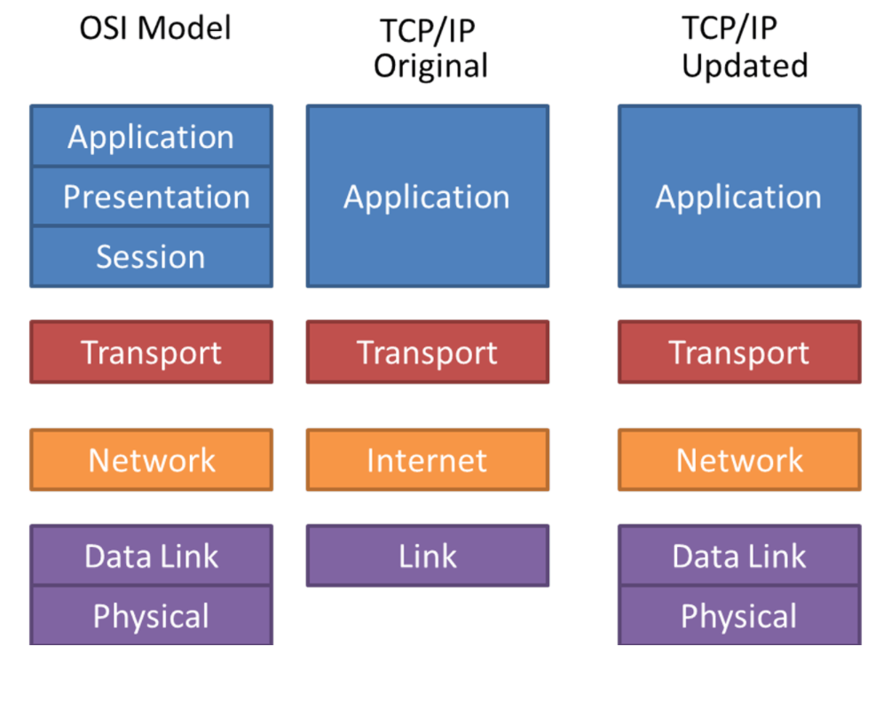
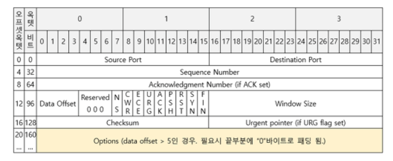
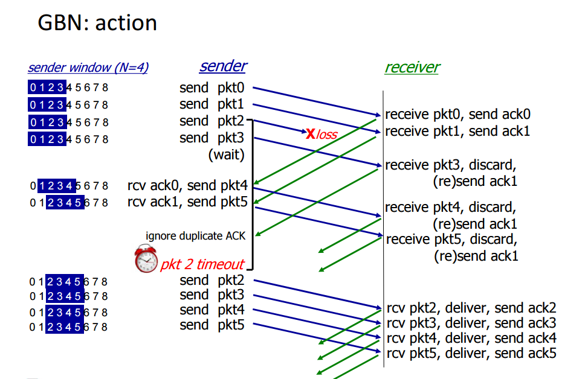
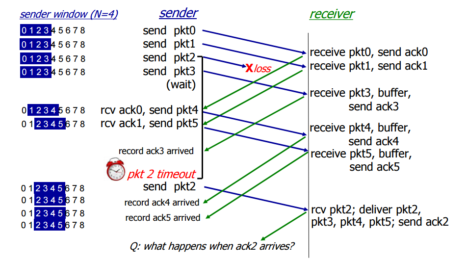

# Network - 1

## 1. OSI 7 계층

* 국제 표준 기구인 ISO에서 네트워크 표준을 제정하기 위해 만들었다.

  

### 물리 계층

* 전기적, 기계적 특성을 이용해 통신케이블로 데이터를 전송 (0,1 비트)
* 데이터만 전달할 분 **데이터가 무엇인지, 어떤 오류가 있는지 신경쓰지 않음.**
* 통신케이블, 리피터, 허브 등이 포함

### 데이터 링크 계층

* 물리계층을 통해 송수신되는 정보의 **오류와 흐름을 관리하고 도와주는 역할**을 수행

* 데이터 링크 계층은 Point to Point 신뢰성 있는 전송을 보장하기 위해 오류 제어와 Medium Access Control을 수행

  1. 에러탐지, 재전송 : 예 : Cyclic Redundancy Check(CRC)

  2. Medium Access Control
     * 공유된 매체 혹은 회선을 언제 누가 데이터를 전송할지 결정하는 것 
     * 종류 : Random access protocols, Controlled access protocols, Channelization protocols(FDMA, TDMA, CDMA)

* 브릿지, 스위치(mac 주소 테이블을 이용해 해당 프레임 전송)를 통해 물리 계층에서 받은 정보를 전달

### 네트워크 계층

* 데이터를 목적지까지 안전하고 빠르게 전달하는 **라우팅 기능**을 수행
* 전송 계층이 요구하는 서비스 품질을 제공하기 위해 기능적, 절차적 수단을 제공한다. 

### 전송계층

* end system 있는 데이터를 주고 받는 역할
* TCP, UDP 프로토콜을 통해 통신을 활성화

### 세션 계층

* 세션을 열고 닫고를 제공하는 매커니즘의 계층

* 세션 복구도 지원

  * 체크포인트를 통해서 동기화
  * 예 5MB마다 체크포인트를 설정할 경우, 100MB를 전송 중 48MB에서 연결이 끊겼을 때 다시 45MB부터 전송할 수 있음

  

### 표현 계층

* 데이터의 변환, 데이터의 압축, 그리고 데이터의 암호화가 이루어짐
* 서로 다른 통신 기기간의 다른 인코딩을 사용할 수 있기 때문에 데이터 변환이 일어남

### 응용계층

* 응용 프로세스를 사용하여 직접적인 응용 서비스를 수행합니다.
* 최종 목적지로서 HTTP, FTP, SMTP, POP3, IMAP, Telnet 등과 같은 프로토콜

## 1-1. TCP/IP 계층

* 현재 사용하고 있는 네트워크 모델이다.

### **Application layer** 

* 특정 서비스를 제공하기 위해 어플리케이션 끼리 정보를 주고 받음
* FTP, HTTP, SSH, Telnet, DNS, SMTP

### **Transport layer **

* 송신된 데이터를 수신측 어플리케이션에 전달

* TCP, UDP, RTP, RTCP

### **Internet layer**

* 수신 측 까지 데이터를 전달하기 위해 사용
* IP, ARP, ICMP, RARP 

### **network access layer**

* 네트워크 직접 연결된 기기간 전송가능
* 이더넷

### * **TCP/IP 예시 **

검색 창에 www.google.com으로 검색한다는 것은 ?

* 구글 웹서버인 80포트를 http request 메세지를 보내는 것이다.

<application = HTTP, transport = TCP, Internet layer = IP, Network access layer = 이더넷 사용 가정>

1. (**application layer**) 패킷의 application layer에는 http request가 들어간다.

2. (**transport layer**) tcp 프로토콜에서 중요한 것은 시작포트와 목적포트이다. 여기서는 웹 서버이기 때문에 80번이다.

3. (**Internet layer**) ip 프로토콜에서 중요한 것은 시작 ip 주소와 목적지 ip이다.

   * 시작 ip는 알지만, 목적지 ip는 알지 못한다.

   * DNS 프로토콜로 도메인 주소로 ip 주소를 알 수 있다.

     * 브라우저는 os에게 구글의 ip주소를 물어보고 DNS 서버로 요청을 보낸다. (port 53)

     * os가 DNS의 서버주소를 알고 있는 이유는 이미 컴퓨터에 등록되어 있기 때문

4. (**network access layer**) 이더넷 프로토콜의 헤더를 만들어야 한다. 

   * MAC 주소를 알아와야 하지만, 여기서 MAC 주소는 구글 MAC 주소 대신, **물리적으로 연결된 우리집 공유기 MAC 주소가 필요**하다. (우리집 공유기를 게이트웨이라고 하기도 한다)

   * ARP : IP주소로 MAC 주소로 바꿔주는 주소 해석 프로토콜 

5. 완성시켰으면 보낼 수 있다. 그런데 그 전에 TCP는 3way handshaking을 통해 연결한다.

6. 우리집 공유기로부터 구글서버까지 여러 라우터에 걸쳐 도착한다. 

7. 구글 서버가 연결된 라우터까지 도착하면 패킷의 IP헤더에 기록된 구글 서버 IP주소를 통해 MAC주소를 알아오고 데이터를 전송한다.

   * 이 때 ARP 프로토콜을 통해 MAC 주소를 알아온다.

   * 라우터에 연결된 네트워크에 브로드캐스팅하게 되고, 목적지인 구글 서버가 자신의 IP온 ARP를 받고 MAC 주소를 반환

   * MAC주소를 알았기 때문에 데이터를 물리적으로 전송할 수 있다.

8. (Internet layer, Network access layer 활용으로) 목적지로 데이터 도착

9. transport layer의 포트번호를 확인하고, 80번 포트를 사용하는 어플리케이션에게 데이터를 전달해줌

10. 어플리케이션까지 도달하면 웹 서버가 사용될 http request 데이터를 얻게 된다.

11. 서버에서 정상적으로 http request를 받고, 응답으로 돌려준다.

12. 4 way handshake으로 연결을 닫는다.

### * **네이글 알고리즘**

* TCP에서는 기본적으로 네이글 알고리즘(Nagle Algorithm)이라는 것을 사용한다.
* TCP/IP로 데이터를 보내기 전에 버퍼에 데이터를 모아서 전송하는 것을 말함

 * 설명  ---- MSS : Maximum Segment Size

   if 전송하기 위한 새로운 데이터가 있으면,

   ​      if **MSS** 보다 송신 윈도우 사이즈가 같거나 크고 & 이용할 수 있는 데이터가 **MSS** 보다 같거나 큰 경우,

   ​             **MSS** 만큼 세그먼트를 보낸다.

   ​      else

   ​            if  파이프에 여전히 확인 되지 않은 데이터가 있으면 (보내고 응답받지 않은 데이터)

   ​                   확인 응답을 받을 때 까지 데이터를 버퍼에 더한다.

   ​            else

   ​                   즉시 보낸다.

* 만약에 송신측 프로세스에서 송신 버퍼로 작은 데이터 단위로만 계속 밀어(PUSH)낸다고 한다면, 패킷당 IP 헤더와 TCP 헤더에 의해 (IPv4기준 40 bytes, 옵션) 오버헤드 비율이 더 커지게 된다.

  * 예시로 송신측이 수신측으로 90 bytes를 보내되 송신 버퍼가 크게 상관없이 데이터가 채워지자 마자 전송한다고 가정한다.

    그리고 프로세스는 세 번에 걸쳐서 데이터를 송신 버퍼로 밀어낸다고 가정한다.

     

    헤더(40bytes) + 데이터(10 bytes),

    헤더(40bytes) + 데이터 (20 bytes),

    헤더(40bytes) + 데이터 (60 bytes)

     

    데이터 90 bytes를 보내기 위해 헤더 120 bytes의 헤더를 보내야 하는 상황이 발생한다. -> 윈도우 신드롬이라고 합니다.

    즉 네트워크망을 비효율적으로 사용하는 것이다.

    실제로 총 전송된 패킷 210 bytes 중 헤더 비율이 약 57%이다.

* 실제 사용 예시 : 

  * 네트워크 게임에서 네이글을 적용시켰을 때, 반응성과 효율성의 설명
  * 클라이언트 -> 네이글 알고리즘은 실시간성에 맞지 않는다. 
    * 클라이언트의 유저 입력 전송은 데이터 양이 작고 반복적인 경우가 많다.
    * 이 경우에 네이글 알고리즘을 사용하게 되면, 크기가 작다는 이유로 지연 전송될 가능성이 있어서 사용자 반응성에 영향일 미치게 된다. 그렇기 때문에 클라이언트 네트워크는 **네이글 알고리즘**을 사용하지 않는 것이 유리하다.
  * 서버
    * 서버는 클라이언트에게 현재 유저가 처한 게임 상황의 결과를 지속적으로 보내준다.
    * 이 경우, 정보의 양은 클 수 있다. 
    * 보통 데이터가 큰 경우 네이글 알고리즘이 지연되는 경우는 수신자의 가용 윈도우 사이즈가 충분하지 않은 경우이다.  네이글 알고리즘을 사용하지 않는 경우, 계속 데이터를 클라이언트에게 보내기 때문에 좋지 않고, 동시에 여러 클라이언트가 사용하는 서버에서 트래픽이슈는 민감한 부분이기 때문에... 네이글 알고리즘을 사용하는 것이 좋지 않나
  * 출처: https://ozt88.tistory.com/18 [공부 모음]

  

## 2. TCP

* End Pointer간 신뢰성있는 데이터 전송을 담당하는 계층
  * 신뢰성 : 데이터를 순차적, 안정적인 전달
  * 전송 : 포트 번호에 해당하는 프로세스에 데이터를 전달

* 특징

  * **신뢰성 있는** 데이터 통신이 가능하게 해주는 프로토콜
  * Connection 연결 - 양방향 통신
  * 순차 전송을 보장
  * 흐름제어, 혼잡제어, 오류탐지

* TCP 헤더

  

  * TCP 헤더 + 데이터 = segment

* TCP의 문제점

  * 전송의 신뢰성은 보장하지만 매번 connection 연결에 대한 시간 손실이 발생한다
  * 패킷이 조금만 손실해도 재전송한다.

  

### 2-1. 3 Way handshake & 4 Way handshake

- 3-way handshaking를 통해 연결지향적이고, 신뢰성 있는 데이터 전송이 가능합니다.
  - **서버** : socket() 생성 → bind() 소켓 특정포트 연결 → listen() 연결요청 대기상태 → accept() 연결허용 → read/write() 데이터 송수신 → close() 연결종료
  - **클라이언트** : socket() 생성 → connect() 연결요청 → read/write() 데이터 송수신 → close() 연결종료
- 3-way handshaking
  1. client -> server : SYN
  2. server -> client : ACK+SYN
  3. client -> server : ACK
- 4-way handshaking 
  1. client → server : Fin
  2. server → client : ack 보내고 모든 데이터 전송 완료 후 fin 전송
  3. client → server : ack을 보내고 time wait를 통해 기다린다.
  4. server는 ack을 받고 서버를 닫는다.

### 2-2. 흐름제어/ 혼잡제어

> 흐름제어

* 송수신자 간의 데이터 처리 속도 차이를 조절

* Stop and Wait와 Sliding Window 기법이 있다.

* Stop and Wait는 매번 전송 패킷에 대한 확인 응답을 받아야 다음 패킷을 전송할 수 있기 때문에 비효율적이다.

* Sliding Window는 데이터의 흐름을 **동적으로 조절**할 수 있다.

  * Window는 receiver과 sending window 그리고 congestion window가 있다.

    * congestion window 는 네트워크 상태, 코어에 있는 라우터 상태에 기반한다.
    * receiver window 는 sending window와 congestion window 중 작은 것으로 결정
    * 송신 윈도우의 크기가 클수록 많은 데이터를 보낼 수 있다.

  * Go Back N

    * 

      

  * Selective Repeat

    * 
    * go back n과 다르게 missing한 packet만 재전송한다. 

> 혼잡제어

* 네트워크 데이터 처리 속도(ex : 라우터) 조절
* 한 라우터에 데이터가 몰릴 경우, 자신에게 온 데이터를 모두 처리할 수 없게 된다. 이 경우 호스트들은 또 다시 재전송을 하게되고 결국 혼잡을 가중시켜 오버플로우나 데이터 손실을 발생시킨다. 그래서 네트워크내 패킷수를 방지하는 것이 혼잡제어라고 한다.

AIMD(Additive Increase / Multiplicative Decrease)

- 처음에 패킷을 하나씩 보내고 이것이 문제없이 도착하면 window 크기(단위 시간 내에 보내는 패킷의 수)를 1씩 증가시켜가며 전송하는 방법
- 패킷 전송에 실패하거나 일정 시간을 넘으면 패킷의 보내는 속도를 절반으로 줄인다.
- 공평한 방식으로, 여러 호스트가 한 네트워크를 공유하고 있으면 나중에 진입하는 쪽이 처음에는 불리하지만, 시간이 흐르면 평형상태로 수렴하게 되는 특징이 있다.
- 문제점은 초기에 네트워크의 높은 대역폭을 사용하지 못하여 오랜 시간이 걸리게 되고, 네트워크가 혼잡해지는 상황을 미리 감지하지 못한다. 즉, 네트워크가 혼잡해지고 나서야 대역폭을 줄이는 방식이다.

Slow Start (느린 시작)

* AIMD가 전송 속도를 올리는데 시간이 오래 걸리는 단점이 존재
* slow start : 한 세그먼트가 ack받으면 1MSS 증가한다. 즉, 지수적으로 증가한다. 혼잡이 발생하면 1부터 다시 시작하며 혼잡 발생 시점의 절반은 SSThresh 으로 지정한다. 그리고 다시 slow start를 시작하고 SSThresh 도달하면 congestion avoidance phase 로 RTT마다 1 MSS씩 증가합니다.

- fast retransmission :  타임아웃으로 loss를 기다리는 것이 아니라, 3번의 duplicate ack으로 loss를 판단하여 재전송한다.

- fast recovery : 3번의 duplicate ack이 오면 loss로 판단하여 반으로 줄이고, congestion avoidance phase부터 시작한다.

  > slow start + congestion avoidance + fast retransmisson = TCP Tahoe
  >
  > TCP Tahoe + Fast Recovery = TCP reno

## 3. UDP

* TCP보다 **신뢰성이 떨어지지만 전송 속도가 일반적으로 빠른** 프로토콜 ( 순차 전송, 흐름제어, 혼잡제어를 하지 않는다.)
* Connectionless
* 비교적 데이터의 신뢰성이 중요하지 않을 때 사용(ex: 영상 스트리밍)

> 대표적인 예 1 : DNS

* request의 양이 적기 때문에 UDP segment에 들어갈 수 있다.
* 3 way handshking으로 연결을 유지할 필요가 없다 → connection을 유지할 필요 x
* 연결 상태가 없기 때문에 더 많은 클라이언트를 수용할 수 있다.
* DNS에서 UDP 대신 TCP를 사용하는 경우
  * Zone transfer : DNS 서버간의 요청을 주고 받을 때의 transfer
  * 데이터가 512 바이트를 넘어가거나 응답을 못받은 경우

> 대표적인 예 2 : QUIC (HTTP3에서 상세히 설명)

* UDP는 데이터 전송에 집중한 설계로 별도의 기능이 있지 않다.

* 구글, 유투브가 현재 사용 중

  * 즉, TCP의 단점을 극복하고 TCP만큼의 신뢰성을 확보하면서 원하는 구현을 할 수 있다.

  1. 전송속도 향상 : 첫 연결 설정에서 필요한 정보와 함께 데이터를 전송하고 연결 성공시 설정을 캐싱하여 다음 연결때 바로 성립 가능
     * Connection UUID라는 고유한 식별자로 서버와 연결 ( 커넥션 재수립 필요 x)
  2. 보안적인 면에서도 향상
     * TLS 기본 적용
     * IP Spoofing (source address를 바꿈)/ Replay Attack 방지 -> 보안성 향상
  3. 독립된 스트림 사용으로 향상된 멀티플렉싱 가능
