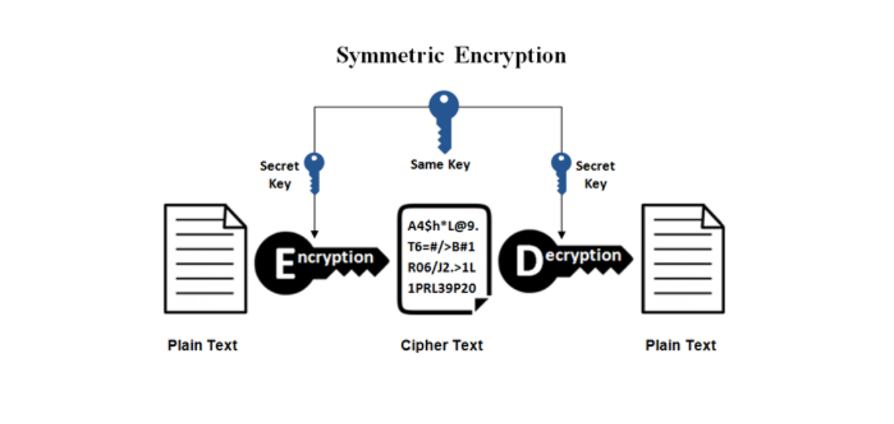
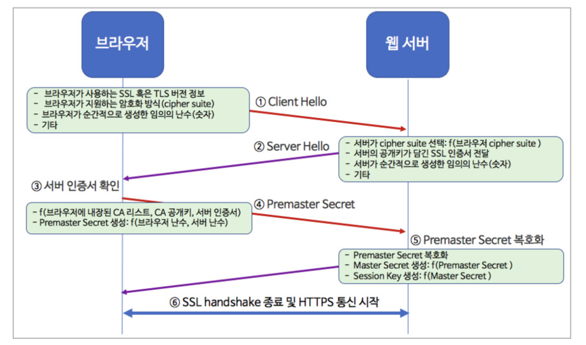
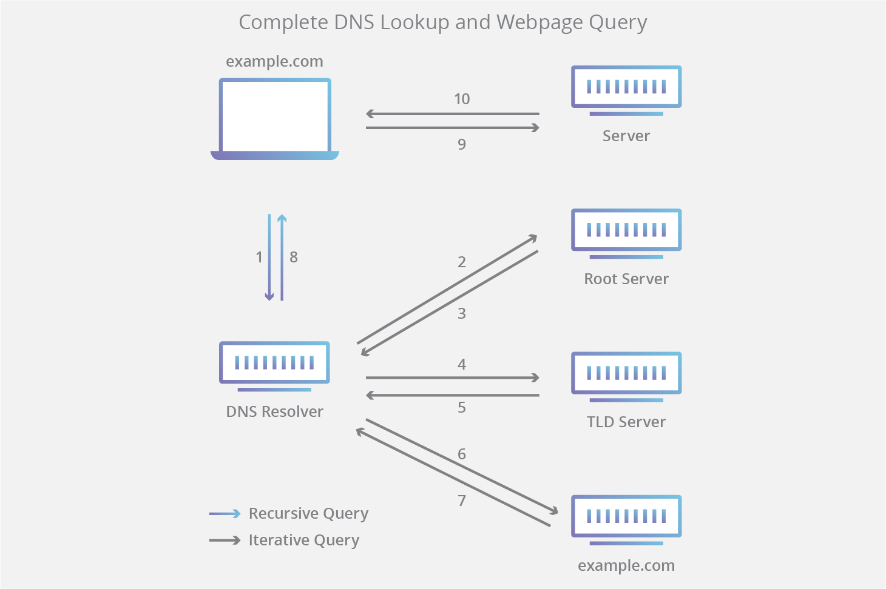
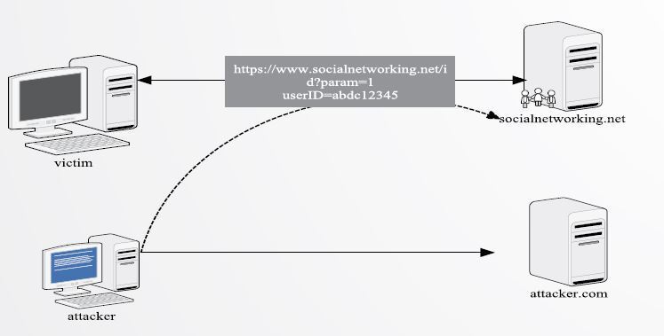

# 대칭키 & 공개키

    메세지를 주고 받다 보면 상대방이 알아차리지 못하도록 암호화를 해야될 필요가 있음! 👉 암호화를 푸는 방식의 차이가 대칭키와 공개키

## 대칭키

* 우리가 흔히 생각하는 암호의 방식이다. 자물쇠와 열쇠의 비유를 생각하면 된다. 어떠한 자물쇠를 열기 위해서는 자물쇠의 맞는 열쇠가 일대일로 필요 하듯이, 암호키와 복호키가 일대일 대칭이 되는 방식이다.
* 복호화를 할 때 속도가 빠르다는 점이 장점이다.
* 복호화를 하려면 동일한 암호화키를 건네줘야 하는데 네트워크 환경이면 탈취당할 확률이 높다.
* 기밀성을 제공하나, 무결성/인증/부인방지 를 보장하지 않음
* 암호화 단위에 따라 스트림암호와 블록암호로 나뉨
* 방식으로는 DES, 3-DES, AES, SEED, ARIA, MASK가 있다. 

## 비대칭키

* 외부에 공개하지 않는 개인키(private key)와 전체에 공개하는 공개키(public key)로 나뉜다. 개인키로 암호화 한 것은 공개키로 복호화가 가능하며, 공개키로 암호화 한 것은 개인키로 복호화가 가능하다.
* 복호화를 할 때 속도가 느리다는 단점이 존재한다.
* 공개키를 인터넷에 내놓아도 개인키만 노출 되지 않으면 정보가 탈취될 염려가 없다.
* 기밀성/무결성/인증/부인방지 를 보장함
* 속도가 느리기 때문에 긴문서의 암호화하는 경우보다 대칭키 알고리즘의 키값에 대한 암호에 사용.
* 암호화 말고도 해당 문서를 특정 단체나 개인이 암호화를 했다는 증거가 되기도 한다.
* 방식으로는 RSA, Elgamal 등이 있음.

# HTTP & HTTPS

## HTTP 란?
    Hyper Text Transfer Protocol의 약자로 인터넷의 hypertext를 80번 포트를 이용해 텍스트로 주고받는 프로토콜이다. 그러나 단순 텍스트를 이용해 전달이 되기 때문에 정보 탈취의 위험성이 크다.

## HTTPS 란?
    위의 http의 보안의 취약성일 극복하기 위해 ssl인증서를 사용해서 HTTP(헤더는 제외)를 암호화 시키는 방식이다. 속도가 느리다는 장점이 있지만, 현재는 하드웨어의 발달로 속도 차이도 거의 없으며, 검색 엔진에 노출도도 높아지게 된다.

# TLS/SSL handshake

1. 클라이언트는 자신이 사용 가능한 암호화 방식 ssl/tls 버전 정보 등을 보냄

2. 서버는 클라이언트가 사용가능한 암호화 목록중에서 하나를 선택하고 선택한 암호화 방식을 정보에 담아서 보냄

3. 클라이언트는 해당 서버의 ssl 인증서가 믿을만 한지 판단하고 공개키를 통해 대칭키를 암호화를 해서 서버로 전송한다.

4. 서버쪽에서는 암호화된 대칭키를 복호화 하여서 통신 때 사용한다.

5. 통신이 시작된다.

# CORS

* 교차 출처 리소스 공유(Cross-Origin Resource Sharing, CORS)는 추가 HTTP 헤더를 사용하여, 한 출처에서 실행 중인 웹 애플리케이션이 다른 출처의 선택한 자원에 접근할 수 있는 권한을 부여하도록 브라우저에 알려주는 체제이다

* SOP(동일 출처 규칙)이 보안을 위해 중요하긴하나 다른 사이트에 있는 자원을 접근하는 일이 발생하므로 CORS를 사용한다.

* 동작 방식에는 preflight requestsimple request 2가지가 존재한다.
    
    
    -  Preflight request는 서버에 예비 요청을 보내서 안전한지 판단한 후 본 요청을 보내는 방법
    - simple request는 서버에게 바로 요청을 보내는 방법

# REST

## REST(Representational State Transfer)는 효율적, 안정적이며 확장가능한 분산시스템을 가져올 수 있는소프트웨어 아키텍처 디자인 제약의 모음을 나타냅니다. - MDN 정의

다음과 같이 6가지 제한 조건이 있다.

* Uniform (유니폼 인터페이스)

    Uniform Interface는 URI로 지정한 리소스에 대한 조작을 통일되고 한정적인 인터페이스로 수행하는 아키텍처 스타일을 말합니다.

* Stateless (무상태성)

    REST는 무상태성 성격을 갖습니다. 다시 말해 작업을 위한 상태정보를 따로 저장하고 관리하지 않습니다. 세션 정보나 쿠키정보를 별도로 저장하고 관리하지 않기 때문에 API 서버는 들어오는 요청만을 단순히 처리하면 됩니다. 때문에 서비스의 자유도가 높아지고 서버에서 불필요한 정보를 관리하지 않음으로써 구현이 단순해집니다.

* Cacheable (캐시 가능)

    REST의 가장 큰 특징 중 하나는 HTTP라는 기존 웹표준을 그대로 사용하기 때문에, 웹에서 사용하는 기존 인프라를 그대로 활용이 가능합니다. 따라서 HTTP가 가진 캐싱 기능이 적용 가능합니다. HTTP 프로토콜 표준에서 사용하는 Last-Modified태그나 E-Tag를 이용하면 캐싱 구현이 가능합니다.

* Self-descriptiveness (자체 표현 구조)

    REST의 또 다른 큰 특징 중 하나는 REST API 메시지만 보고도 이를 쉽게 이해 할 수 있는 자체 표현 구조로 되어 있다는 것입니다.

* Client - Server 구조

    REST 서버는 API 제공, 클라이언트는 사용자 인증이나 컨텍스트(세션, 로그인 정보)등을 직접 관리하는 구조로 각각의 역할이 확실히 구분되기 때문에 클라이언트와 서버에서 개발해야 할 내용이 명확해지고 서로간 의존성이 줄어들게 됩니다.

* 계층형 구조

    REST 서버는 다중 계층으로 구성될 수 있으며 보안, 로드 밸런싱, 암호화 계층을 추가해 구조상의 유연성을 둘 수 있고 PROXY, 게이트웨이 같은 네트워크 기반의 중간매체를 사용할 수 있게 합니다.

이러한 조건들을 준수하면서 사이트를 설계하려는 것이 rest api 라고 할 수 있다.

# DNS 

## DNS는 Domain Name System의 약자로 아이피를 우리가 알기쉬운 알파벳 이름으로 변화시켜주는 시스템을 의미한다.

* 쿼리를 요청하는 방식에 따라 iterative 와 recursive 로 나뉜다.

* www.naver.com의 IP를 찾을 때 다음과 같은 과정으로 ip를 찾게 된다.

1. 웹 브라우저에 www.naver.com을 입력하게 되면 먼저 local DNS에게 www.naver.com(.)이라는 hostname에 대한 ip주소를 묻는다. 

2. 만약 local에 없다면 root 서버(.)에게 물어본다.

3. root dns 서버에 없다면 root dns서버는 .com의 정보를 가지고 있는 서버의 주소로 응답한다.

4. www.naver.com 의 주소를 가지고 있는 서버를 찾으면 해당 ip를 local dns 가 가져와서 유저의 컴퓨터에 보내준다.

# CSRF

* 웹 애플리케이션 취약점 중 하나로 사용자가 자신의 의지와 무관하게 공격자가 의도한 행동을 해서 특정 웹페이지를 보안에 취약하게 한다거나 수정, 삭제 등의 작업을 하게 만드는 공격 방법이다.

* 대표적인 예시로 그림이나 페이지 안에 코드를 숨기는 방식이 존재한다.

방어 기법으로는 다음의 2가지 방식이 존재한다.

1. Referrer 검증

    back-end에서 해당 코드를 불러온 페이지를 확인을 하여서 불러온 페이지와 실행하는 페이지의 도메인이 다르다면 실행하지 않는 방식

2. Security Token 사용 (A.K.A CSRF Token)

    Referrer 검증이 불가한 환경이라면, Security Token를 활용할 수 있습니다. 우선 사용자의 세션에 임의의 난수 값을 저장하고 사용자의 요청 마다 해당 난수 값을 포함 시켜 전송시킵니다. 이후 Back-end 단에서 요청을 받을 때마다 세션에 저장된 토큰 값과 요청 파라미터에 전달되는 토큰 값이 일치하는 지 검증하는 방법입니다.
