# 네트워크

## #1. 대칭키 & 공개키

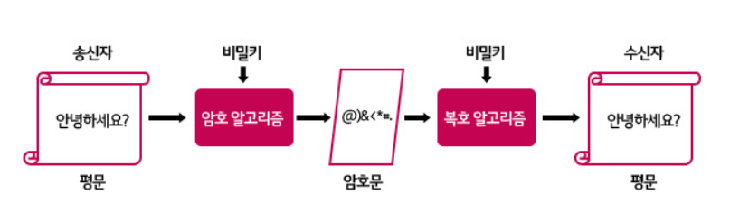

#### 대칭키

동일한 방식으로 암호화 수행하는 방식

암호화된 키를 가지고 있다면 쉽게 복호화할 수 있다.

#### 공개키

서로 다른 키로 암호화 복호화하는 방식으로 비대칭키라고 함

데이터 암호화 시에는 공개키를 사용하고 복호화시에는 개인키를 사용

공개키로 암호화한 데이터는 오직 개인키로만 복호화할 수 있기 때문에 공개키를 가지고 있어도 상관없음

하지만 대칭키에 비해 암호화 연산시간이 추가되기 때문에 더 비용이 큼

## #2. TLS/SSL handshake

문제점 : 

1. HTTP 중간의 내용을 가로챌 수 있다.
2. HTTP 내용을 훔쳐볼 수 있다.
3. HTTP 내용을 조작하여 보낼 수 있다.

#### TLS (Transport Layer Security)

* 응용 계층 데이터의 암호화, 암호화된 전송 계층 데이터의 복호화

* SSL의 업그레이드 버전 (SSL 3.0) => TLS임
  * 엄밀한 의미에서는 TLS, SSL은 다르지만 TLS/SSL을 합쳐서 TLS를 지칭함
* HTTPS는 TCP handshake 를 걸쳐 SSL handshake 완료 후 통신을 시작

#### TLS의 특징

* 암호화 : 정해진 피어만 메세지의 내용을 확인할 수 있음
* 인증 : 메세지 발신자의 신원 확인
* 무결성 : 메세지가 위/변조되지 않았음을 보장

#### SSL (Secure Sockets Layer)

* NetScape Communications Corporation 에서 웹 서버와 웹 브라이저간의 보안을 위해 만든 프로토콜
* 공개키와 개인키(대칭키) 기반으로 사용함
* SSL은 공개키와 대칭키의 단점을 보안하여 한 방식으로 채택하지 않고 **두 방식을 적절히 섞어 사용함**
* SSL의 필요성?
  * 서버와 브라우저간 전송되는 데이터를 외부의 공격자로부터 **보안**하기 위해 필요

#### SSL 인증서가 서비스를 보증하는 방법

* SSL은 공개키 방식으로 대칭키를 전달하고 이 대칭키를 활용해서 암호화와 복호화를 하고 서버와 브라우저간 통신을 진행

  >  예 : 등장인물 - 사용자 A , 사이트 B, 인증기관 C

1. 사이트 B는 인증기관 C의 인증된 문서를 얻기 위해서 인증 기관 C에게 사이트의 정보와 공개키를 전달
2. 인증기관 C은 전달받은 데이터를 검증하고 검증이 완료되면 인증기관은 사이트 인증서를 생성하기 위해 데이터를 **자신의 개인키로 서명**하고 인증서 전달
3. 인증기관 C는 사용자 A에게 자신의 공개키를 전달 (공개키는 사용자 브라우저의 저장)

  (기본적으로, 브라우저에는 CA 즉, 인증기관의 정보와 리스트가 내장되어 있음)

----------------------------------- 사용자 A가 사이트 B에 접속 ------------------------------------

4. 사용자가 사이트에 접속 요청
5. 사이트는 자신이 신뢰할 수 있는 사이트임을 증명하기 위해 사용자에게 자신의 인증서를 전달
6. 사용자는 브라우저에 내장되어있는 **인증기관 공개키로 사이트 인증서를 복호화**하여 검증
   * 공개키는 두 개의 키를 가지고 있음. A로 암호화면 B로 복호화하고 B로 암호화하면 A로 복호화할 수 있는 방식이기 때문에
   * 인증서가 인증기관의 개인키로 서명되었기 때문에 인증기관의 공개키를 복호화한 것이다.
   * 그렇다면 왜 누구나 볼 수 있는 공개키로 복호화하도록 비밀키로 암호화했는가?? 비밀키로 만들 수 있는 것은 비밀키를 알고 있는 인증기관만 가능하기 때문에 **공개키로 복호화를 성공**한다면, 그것은 인증기관에서 만든 것임을 보증하게 됨.
7. 인증서를 해독하면 정보와 사이트 공개키 획득
8. **사이트 공개키로 사용자는 자신의 대칭키를 암호화**하고 암호화한 대칭키를 사이트에게 전달
9. 사이트는 자신의 개인키로 사용자로부터 전달받은 암호문을 해독하여 사용자의 대칭키를 얻음 (사이트의 공개키로 암호화했기 때문에 사이트 개인키로만 해독가능)
10. 이렇게 얻은 대칭키를 활용해 사용자와 사이트는 암호문을 주고 받을 수 있게 된다.

#### TLS/SSL Handshake (실제과정)

**첫번째 단계 : Client Hello**

* 클라이언트 측에서 생성한 랜덤 데이터
* 클라이언트가 지원하는 암호화 방식들
* 세션 아이디 : 이미 SSL handshake를 했다면 비용과 시간을 절약하기 위해 기존 세션을 재활용

**두번째 단계 : Server Hello**

* 서버 측에서 생성한 랜덤 데이터
* 서버가 선택한 클라이언트의 암호화 방식 : 자신이 처리할 수 있는 안전한 데이터
* 인증서

**세번째 단계**

* 브라우저에 내장된 인증기관의 리스트에 있는지 확인하고 CA 공개키를 이용해 인증서 복호화 (즉, 인증기관에서 인증된 사이트임을 신뢰)
* 클라이언트는 서버의 랜덤 데이터와 클라이언트가 생성한 랜덤 데이터를 조합해 **pre master secret** 키를 생성한다. (대칭키 기법으로 암호화/복호화할 예정이기 때문에 pre master secret 값은 제 3자에게 노출되면 안된다)
* 그러므로 전달할 때, 서버의 공개키를 이용해 pre master secret을 암호화한 후 서버에 전송

**네번째 단계**

* 서버는 pre master secret 값을 자신의 개인키로 복호화 한다. 
* 즉, 클라이언트와 서버가 모두 pre master secret의 실제 값을 가지고 있게 된다. 그러므로 이것을 master secret 값으로 만들고 master secret는 session key를 생성한다.
* 이 sesstion key 값을 이용해 대칭키 방식으로 주고 받는다.

**마지막 단계**

* 클라이언트와 서버는 이 핸드쉐이크 단계의 종료를 서로에게 알린다.

**참고자료**

[출처 1]: https://www.youtube.com/watch?v=wPdH7lJ8jf0
[출처 2]: https://opentutorials.org/course/228/4894

## #3. HTTP / HTTPS

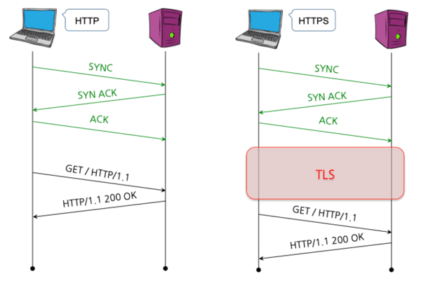

### HTTP (Hypertext Transfer Protocol)

* 서로 다른 시스템들 사이에서 통신을 주고받게 하는 가장 기본적인 프로토콜
* 서버에서 브라우저로 데이터를 전송하는 용도로 가장 많이 사용

### HTTPS(Hypertext Transfer Protocol Secure)

* HTTP에 데이터 암호화가 추가된 프로토콜 (443 포트 사용)
* SSL (보안 소켓 계층) 사용
  * SSL은 서버와 브라우저 사이에 안전하게 암호화된 연결을 만들 수 있게 도와주고, 서버와 브라우저가 민감한 정보를 주고 받을 때 해당 정보가 도난당하는 것을 막아줌
* HTTP 자체를 암호화하는 것은 아니다. HTTP body를 암호화

#### HTTPS 사용하는 이유

#### 보안성

* 중간에 데이터를 가로채도 내용을 알 수 없습니다.

#### 검색 엔진 최적화 (SEO)

* 대표적인 검색 엔진인 구글은 HTTPS 웹 사이트에 가산점을 부여
  * 즉, 검색엔진에 더 빈번하게 노출되고 싶다면, HTTPS는 불가피한 선택이 됨
* AMP를 만들 때 HTTPS 사용해야 함
  * AMP는 가속화된 모바일 페이지로 모바일기기에서 컨텐츠를 훨씬 빠르게 로딩하기 위한 방법(구글에서 만듦)

### HTTP 에 대한 설명

* HTTP 0.9 ~ 2 : TCP 사용

#### HTTP 특징

- 비연결성
  - **클라이언트와 서버가 한 번 연결을 맺은 후, 클라이언트 요청에 대해 서버가 응답을 마치면 맺었던 연결을 끊어 버리는 성질이다.**

- 무상태성
  - Connectionless로 인해 상태정보를 명시해주지 안하**서버는 클라이언트를 식별할 수가 없는데**, 이를 Stateless라고 합니다.

#### 각각의 보완책

- 비연결성을 보완하기 위해 keep-alive헤더 사용(Http1.1)
- 무상태성을 보완하기 위해 쿠키, 세션, 토큰을 통해 상태기억.

### HTTP 버전

#### HTTP 1.0 

* 1 Request & 1 response Per Connection
  * 매번 새로운 연결로 성능 저하되고 서버 부하 비용이 증가
* 하나의 요청에 대한 응답이 와야 그 다음 요청을 함. 

#### HTTP 1.1

* Persistence Connection 도입 : 지정 timeout 동안 커넥션을 닫지 않는 방식
* Pipelining : 하나의 커넥션에서 응답을 기다리지 않고 순차적인 여러 요청을 연속적으로 보내 그 순서에 맞춰 응답하는 방식으로 지연시간 줄이는 방법

#### HTTP 1.1 단점

* Head of Line Blocking
  * HOL Blocking이란, 네트워크에서 같은 큐에 있는 패킷이 첫번째 패킷으로 인해 지연되는 경우 발생하는 성능 저하 현상을 의미한다. 직관적인 예시로, 일차선 도로에서 앞차가 좌회전 신호를 기다리는 동안에, 내가 직진을 하고 싶어도 할 수 없듯이, 패킷이 다른 패킷을 기다리느라 지연이 되는현상을 의미
* Header 구조의 중복
  * 요청하는 헤더의 중복으로 요청자체가 무거워짐

#### HTTP 2.0

* 기존 HTTP/1.X 버전의 성능 향상에 초점을 맞춘 프로토콜
* 표준의 대체가 아니라 확장이 목적

* **HTTP 메세지 전송 방식의 변화** : 바이너리 프레이밍 계층 사용하여 파싱과 전송 속도를 증가시키고 오류 발생 가능성을 낮춤
  * 이것을 바탕으로 Request 와 Response multiplexing이 가능 
  * Head Of Line Blocking 해결 (메세지가 조립되기 때문에 순서가 필요 없음)
* **Stream Prioritization** : 리소스간의 가중치(우선순위)부여가 가능
* **Server Push** : 클라이언트가 요청하지 않은 것도 서버가 알아서 보낼 수 있음
* **Header Compression** : 헤더의 크기를 줄여 페이지 로드 시간 감소 (기존의 경우 헤더의 중복 무시했는데 2.0부터는 헤더의 중복을 검출하여 중복되지 않은 정보만 허프만 알고리즘으로 인코딩(85% 줄을 수 있음) 하여 전송 )

#### QUIC (HTTP 3)

* UDP 기반의 프로토콜 
* UDP를 사용하지만 기존의 신뢰성 있는 통신을 포기하지 않음
* 기존 TCP의 경우 수정이 어렵지만 UDP는 기능확장이 쉬움
* 현재 구글과 유튜브가 사용 중

**장점**

* 전송속도 향상 : 첫 연결 설정에서 필요한 정보와 함께 데이터를 전송

  * 3 way handshake 과정을 걸치지 않아도 되고 첫 연결에 1RTT만 소요
  * 첫 요청을 서버에게 보낼 때 서버의 세션키를 모르기 때문에 커넥션 ID를 사용하여 초기화키로 통신을 암호화하고 그 이후에는 서버가 그 설정을 캐싱해놓고 있고 있기 때문에 0 RTT만으로 통신 가능
  * Connection UUID라는 고유 식별자로 서버와 연결하기 때문에 클라이언트 IP가 변경되어도 커넥션 재수립이 필요 없음

* 보안성 향상 :

  * TLS 기본 적용되고 source IP 토큰을 발급해서 IP Spoofing과 Replay Attack 방지

* 독립 스트림으로 설계하여 향상된 멀티 플렉싱이 가능

  * Head of Line Blocking을 HTTP 2에서 해결했지만 TCP 자체 Head of Line Blocking이 존재한다. 

    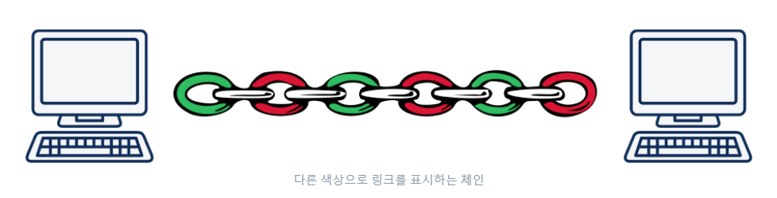

    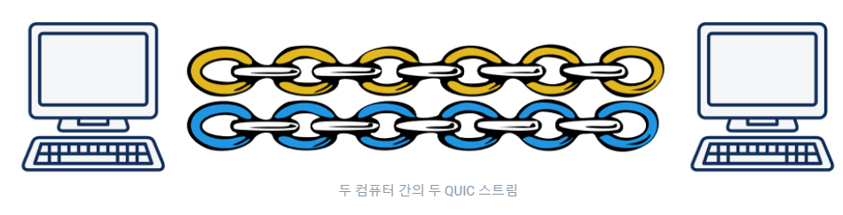

**참고자료**

[HTTP 버전별]: https://www.youtube.com/watch?v=xcrjamphIp4
[HTTP 개요]: https://developer.mozilla.org/ko/docs/Web/HTTP/Overview
[HTTP 3]: https://http3-explained.haxx.se/en/why-quic/why-tcphol

## #4. CORS (Cross-Origin Resource Sharing)

### 출처

**https://google.com** 와 같은 URL은 여러 구성 요소로 이루어져 있음

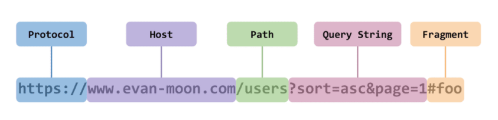

* **Protocol, Host** 그리고 :80, :443 과 같은 **포트** 번호를 **출처**라고 함

### SOP (Same-Origin Policy)

* 2011년에 등장한 보안 정책으로 "다른 출처의 리소스를 사용하는 것에 제한하는 보안 방식"임
* 하지만 웹 개발에 있어서 다른 출처의 리소스가 필요한 경우가 굉장히 많으므로 몇 가지 예외 조항을 두고 리소스 요청의 출처가 다르더라도 허용하는데 그것이 바로 **CORS**임

### CORS

* 교차 출처 리소스 공유는 추가 HTTP 헤더를 사용하여 어떤 한 출처에서 실행 중인 웹 어플리케이션이 다른 출처의 선택한 자원에 접근할 수 있는 권한을 부여하도록 **브라우저에게 알려주는 체제**
* 중요한 점은 출처를 비교하는 로직이 서버에 구현된 것이 아닌 **브라우저에 구현되어있는 스펙** 이라는 점
* CORS 정책을 위반한 리소스의 경우에도 서버는 정상적으로 응답하고 그 브라우저가 그 응답을 파기함

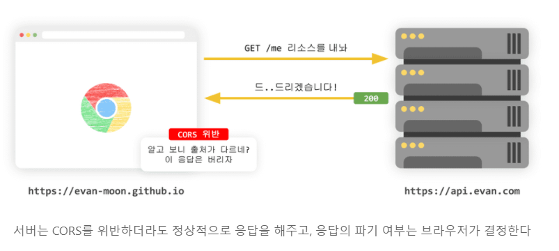

### CORS의 동작방법

* 웹 클라이언트 어플리케이션이 다른 출처의 리소스를 요청할 때는 HTTP 프로토콜을 사용하여 요청을 보낸다. 이때 브라우저는 요청 헤더에 **Origin**이라는 필드에 출처를 담아 보냄
* 이후 서버는 요청에 대한 응답을 할 때 **Access-Control-Allow-Origin**이라는 값에 리소스에 접근하는 것이 허용된 출처를 보내줌
* 브라우저는 자신이 보낸 Origin과 서버에서 보내준 **Access-Control-Allow-Origin**을 비교하여 응답을 파기할 지를 결정

### CORS 접근제어 시나리오

* 단순 요청 (Simple Request)
* 프리플라이트 요청 (Preflight Request)
* 인증정보 포함 요청 (Credentialed Request)

#### Preflight Request

* 사전 확인 작업으로 생각하면 쉬움

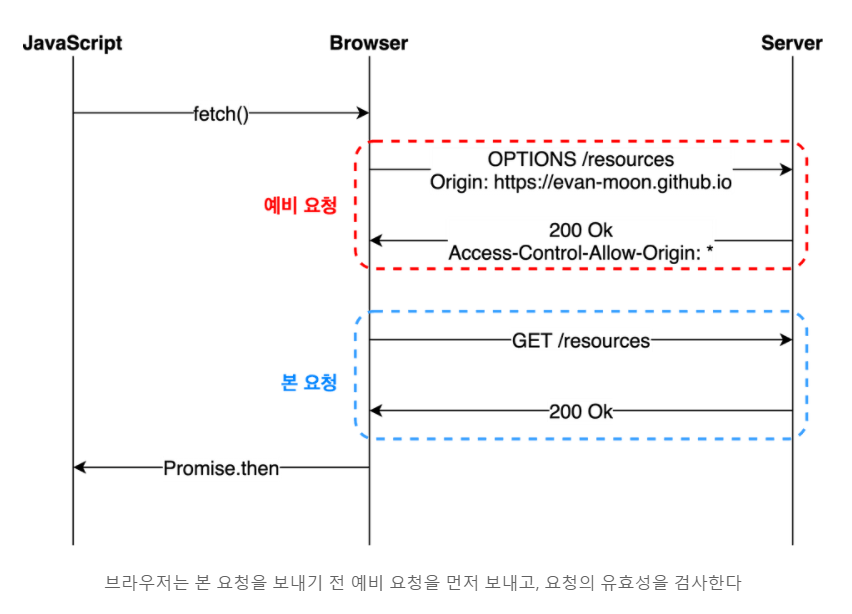

1. OPTIONS 메서드를 통해 다른 도메인의 리소스에 요청이 가능한지 확인 작업
2. 요청이 가능하다면 실제 요청을 보냄

> 실제 Preflight Request와 Response

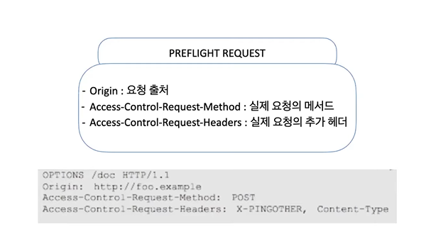

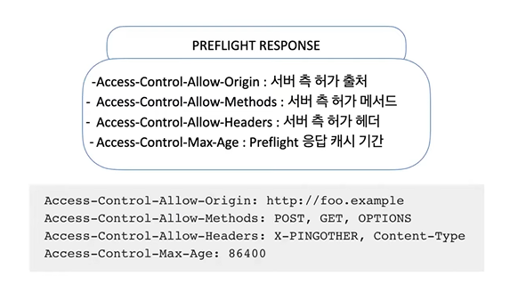

* 주의점 :
  * 예비 요청에 대한 정상 응답으로 200이 나와도 정상 응답과 상관없음. 왜냐하면 브라우저가 CORS 정책 위반 여부를 판단하는 시점은 **예비 요청에 대한 응답을 받은 이후**이기 때문
  * 중요한 것은 예비 요청의 성공/실패 여부가 아니라 응답 헤더에 **유효한 `Access-Control-Allow-Origin` 값이 존재하는가** 임

#### Simple Request

* 예비 요청을 보내지 않고 바로 서버에게 요청을 보내고 서버는 응답 헤더에 요청내용과 `Access-Control-Allow-Origin`을 보내게 되고 브라우저가 CORS 위반 여부를 검사하는 방식

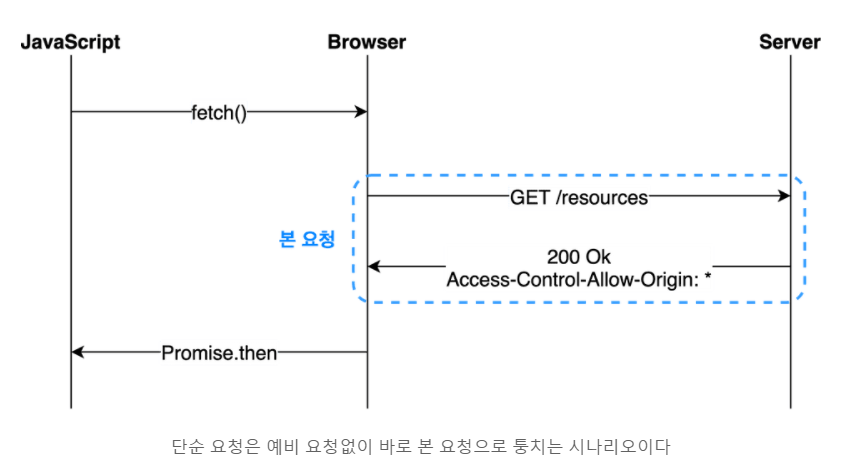

* Simple Request의 경우 특정 조건을 만족하는 경우에만 가능함
  * 요청의 메소드는 `GET`, `HEAD`, `POST` 중 하나여야 한다.
  * `Accept`, `Accept-Language`, `Content-Language`, `Content-Type`, `DPR`, `Downlink`, `Save-Data`, `Viewport-Width`, `Width`를 제외한 헤더를 사용하면 안된다.
  * 만약 `Content-Type`를 사용하는 경우에는 `application/x-www-form-urlencoded`, `multipart/form-data`, `text/plain`만 허용된다.

#### Credentialed Request

* 인증된 요청을 사용하는 방법으로 다른 출처 간 통신에서 조금 더 보안을 강화하고 싶을 때 사용하는 방법
* 기본적으로 브라우저가 제공하는 비동기 리소스 요청 API인 `XMLHttpRequest` 객체나 `fetch` API는 별도의 옵션 없이 브라우저의 쿠키 정보나 인증과 관련된 헤더를 함부로 요청에 담지 않음
* 그러나 `credentials` 옵션을 사용하면 요청에 인증과 관련된 정보를 담을 수 있다.
  * same-origin (기본값) : 같은 출처 간 요청에만 인증 정보를 담을 수 있음
  * include : 모든 요청에 인증 정보를 담을 수 있음
    * 인증모드가 include인 경우, 모든 요청을 허용한다는 의미의 `*`를 `Access-Control-Allow-Origin` 헤더에 사용하면 안됨
    * 요청에 인증 정보가 담겨있는 상태에서 다른 출처의 리소스를 요청하게 되면 브라우저는 CORS 정책 위반 검사에 두 가지를 추가함
      * `Access-Control-Allow-Origin`에는 `*`를 사용할 수 없으며, 명시적인 URL 있어야 함
      * 응답 헤더에는 반드시 `Access-Control-Allow-Credentials: true`가 존재해야 함
  * omit : 모든 요청에 인증 정보를 담을 수 있음

#### CORS를 해결할 수 있는 방법

##### 1. Access Control Allow Origin 세팅

* 와일드카드 *를 세팅하지 않고 명시적인 출처를 명시

##### 2. Webpack Dev Server로 리버스 프록싱

**참고자료**

[참고자료 1 ]: https://evan-moon.github.io/2020/05/21/about-cors/
[참고자료 2 ]: https://www.youtube.com/watch?v=-2TgkKYmJt4

## #5. REST (REprsentational State Transfer)

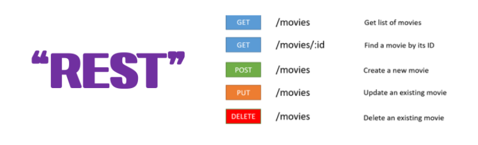

#### REST 정의

* 효율적, 안정적이며 확장가능한 분산시스템을 가져올 수 있는소프트웨어 아키텍처 디자인 제약의 모음
* HTTP URI(Uniform Resource Identifier)를 통해 자원(Resource)을 명시하고, HTTP Method(POST, GET, PUT, DELETE)를 통해 해당 자원에 대한 CRUD Operation을 적용하는 것을 의미

#### REST를 구성하는 스타일

##### Client - Sever 구조

* 자원이 있는 쪽이 Server, 자원을 요청하는 쪽이 Client

##### Stateless

* Client의 context를 Server에 저장하지 않음
* Server는 각각의 요청을 완전히 별개의 것으로 인식하고 처리 -> API 서비는 Client의 요청만을 단순히 처리

##### cache

* 웹 표준 HTTP 프로토콜을 그대로 사용하므로 웹에서 사용하는 기존의 인프라를 그대로 활용 -> HTTP의 강력한 특징인 캐싱 기능을 적용
* HTTP 프로토콜 표준에서 사용하는 Last-Modified 태그나 E-Tag를 이용하면 캐싱 구현이 가능
* 캐시 사용을 통해 응답시간이 빨라지고 REST Server 트랜잭션이 발생하지 않기 때문에 전체 응답시간, 성능, 서버의 자원 이용률을 향상

##### uniform interface

* identification of resources
* manipulation of resources through representation
* *self-descriptive messages*
  * 메세지가 스스로 자기 자신에 대해 설명할 수 있어야 함
  * API문서가 REST API 응답 본문에 존재해야하지만 문서 전체를 넣는 것은 불가능하기 때문에 적어도 API 문서가 어디있는지 알려줘야 함
* *hypermedia as the engine of application state(HATEOAS)*
  * hypermedia (링크)를 통해 어플리케이션 상태 전이가 가능해야하고 링크에 자기 자신에 대한 정보가 담겨야 함
  * [예시](https://wonit.tistory.com/454)

##### layered system

* 캐시 사용을 통해 응답시간이 빨라지고 REST Server 트랜잭션이 발생하지 않기 때문에 전체 응답시간, 성능, 서버의 자원 이용률을 향상
* REST Server는 다중 계층으로 구성
  * API Server는 순수 비즈니스 로직을 수행하고 그 앞단에 보안, 로드밸런싱, 암호화, 사용자 인증 등을 추가하여 구조상의 유연성을 줄 수 있음
  * 또한 로드밸런싱, 공유 캐시 등을 통해 확장성과 보안성을 향상시킬 수 있음
  * PROXY, 게이트웨이 같은 네트워크 기반의 중간 매체를 사용할 수 있음

##### code-on-demand

* Server로부터 스크립트를 받아서 Client에서 실행

#### REST API 설계 기본 규칙

[출처 + 예시]: https://gmlwjd9405.github.io/2018/09/21/rest-and-restful.html

> 시간날 때 다시 보기
>
> [그런 REST API로 괜찮은가](https://www.youtube.com/watch?v=RP_f5dMoHFc)

## #6. DNS (Domain Name System)

* www. naver.com Host Domain Name을 IP 주소로 변환해 주는 시스템

### 탄생 배경

* 과거에는 개인이 호스트 파일을 개인이 관리 
* SRI center가 host 파일을 관리하고 다운 받아 확인
* 많은 도메인이 생기므로 호스트 파일을 다운 받는 것도 쉽지 않아 Domain Name **System** 이 생김

### DNS 서버 구조

#### 1. 기지국 DNS 서버 (Local DNS server)

* **Domain Name을 입력했을 때 해당 IP를 찾기위해 가장먼저 찾는 DNS서버**
* 보통 통신사의 DNS 서버로 등록되어 있음

#### 2. Root DNS Server

* 최상의 DNS 서버
* 모든 DNS 서버들은 Root DNS server 주소를 기본적으로 갖고 있음
* Root DNS Server의 목록에도 해당 Domain Name의 IP가 없을 수 있음

### 3. Top Level Domain

* 최상위 도메인은 두 가지로 나뉨
  * 국가 코드 최상위 도메인 (Country Code Top-Level Domain, **ccTLD**) : (.kr, .jp, .CN, .US etc )
  * 일반 최상위 도메인 (generic top-level domain, **gTLD**) : (.com, .net, .org etc)

### 방법

#### recursive query

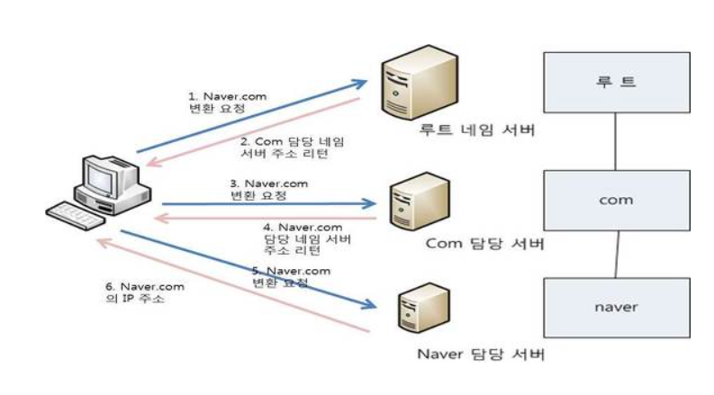

#### iterative query

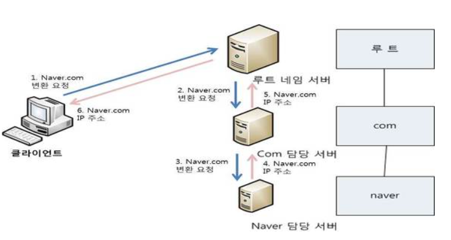

#### 실제 방법

* recursive query와 iterative query를 함께 사용함으로써 효율성을 높임
* 변환기가 직접 반복적 질의를 계속 수행하는 것이 아니라, 로컬네임서버에 재귀적 질의함으로써, 로컬네임서버에서 반복적 질의를 통해 IP 주소 얻을 수 있도록 한다. 이를 통해 사용자 호스트의 리소스 소비

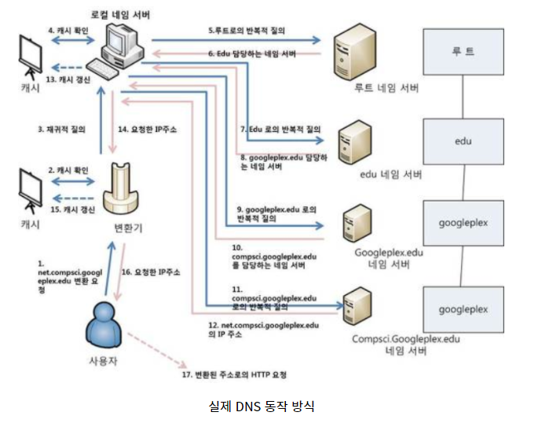

**참고자료**

[참고자료 1]: https://hwan-shell.tistory.com/320
[참고자료 2]: https://blog.daum.net/tlos6733/34

## #7. CSRF (Cross Site Request Forgery)

* CSRF 공격은 웹 어플리케이션 취약점 중 하나로 인터넷 사용자가 자신의 의지와 무관하게 공격자의 의도한 행위(수정,삭제,등록 등)를 특정 웹 사이트에 요청하게 만드는 공격

* CSRF 공격은 컴퓨터를 감염시키거나 페이스북 서버 해킹하는 공격이 아니기 때문에 아래의 조건을 만족해야한다. 

  * 위조 요청을 전송하는 서비스에 로그인 상태

  * 희생자가 해커가 만든 피싱 사이트에 접속

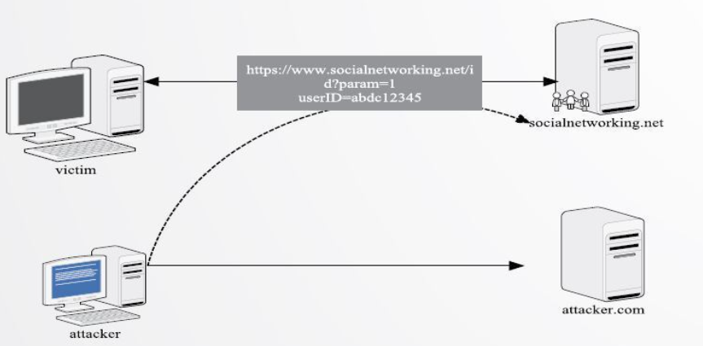

* 피싱사이트에 소셜네트워킹 글쓰기 요청 폼이 숨겨져 있고, user가 피싱 사이트에 접속하게 되면 본인 소셜네트워킹 계정으로 글을 작성하게 됨

### 방어기법

* 일반적으로 CSRF 공격 방어는 조회성(HTTP GET Method) 데이터에는 방어 대상에 두지 않고, 쓰기/변경이 가능한 POST, PATCH, DELETE Method에만 적용

#### 1. Referrer 검증

* Back-end 단에서 request의 referrer를 확인하여 domain (ex. *.[facebook.com](http://facebook.com/)) 이 일치하는 지 검증하는 방법
* 일반적으로 referrer 검증만으로 대부분의 CSRF 공격을 방어할 수 있음
* 같은 도메인 내의 페이지에 XSS 취약점이 있는 경우 CSRF 공격에 취약해질 수 있으나 domain 단위 검증에서 좀 더 세밀하게 페이지 단위까지 일치하는지 검증을 하면 된다.

#### 2. Security Token 사용 (A.K.A CSRF Token)

* 사용자의 세션에 임의의 난수 값을 저장하고 사용자의 요청 마다 해당 난수 값을 포함 시켜 전송
* Back-end 단에서 요청을 받을 때마다 세션에 저장된 토큰 값과 요청 파라미터에 전달되는 토큰 값이 일치하는 지 검증하는 방법

#### 3. **Double Submit Cookie 검증**

* Security Token 검증의 한 종류로 세션을 사용할 수 없는 환경에서 사용할 수 있는 방법

* 스크립트 단에서 요청 시 난수 값을 생성하여 쿠키에 저장하고 동일한 난수 값을 요청 파라미터(혹은 헤더)에도 저장하여 서버로 전송

* 서버단에서는 쿠키의 토큰 값와 파라미터의 토큰 값이 일치하는 지만 검사

* [출처](https://itstory.tk/entry/CSRF-%EA%B3%B5%EA%B2%A9%EC%9D%B4%EB%9E%80-%EA%B7%B8%EB%A6%AC%EA%B3%A0-CSRF-%EB%B0%A9%EC%96%B4-%EB%B0%A9%EB%B2%95)

