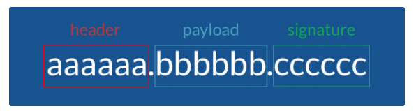
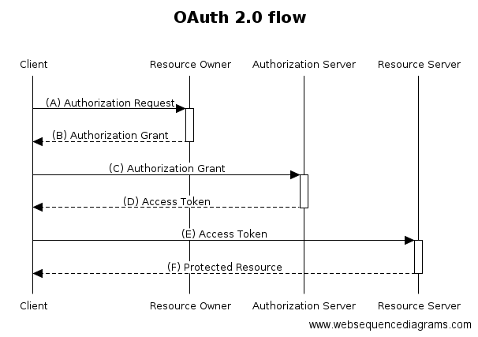
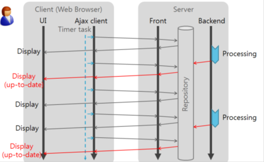
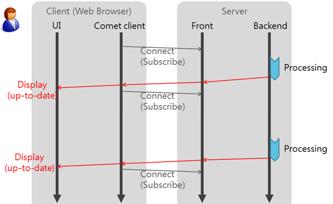
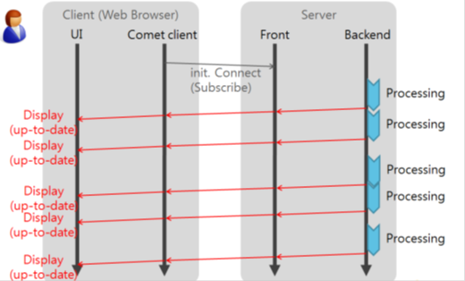
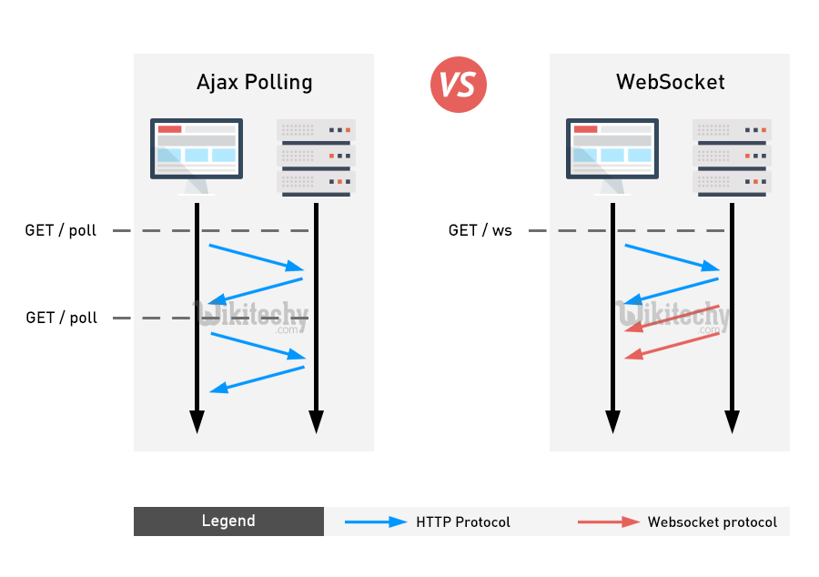
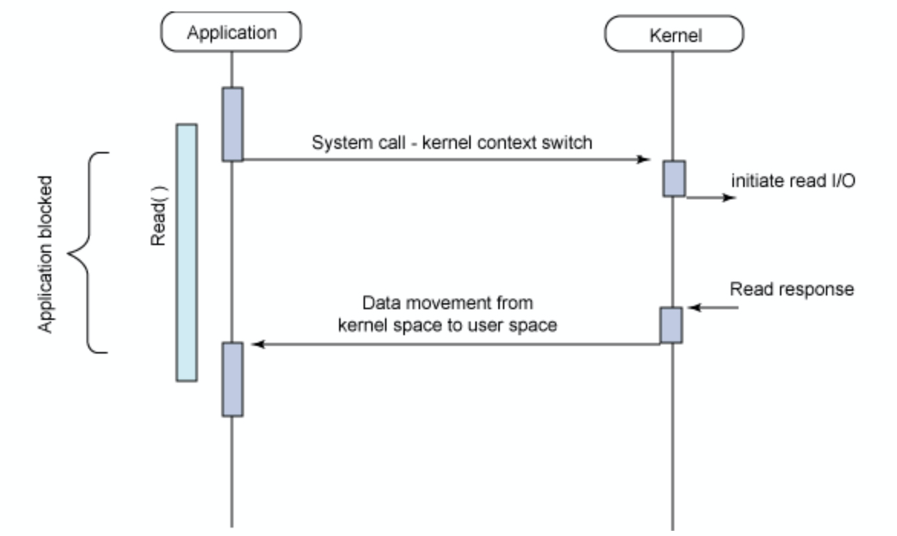

# 3주차

## 쿠키, 세션 & JWT

### 쿠키, 세션

쿠키와 세션은 HTTP의 특징인 Connectionless, Stateless에 의해 Stateful하게 데이터를 유지해야하는 상황에서 사용된다.

이러한 쿠키와 세션은 결국 웹 통신간에 정보를 유지하기 위해 사용하고, 쿠키는 브라우저에 저장되고 세션은 웹 서버의 메모리에서 유지된다.

### 쿠키
- 쿠키는 클라이언트(브라우저) 로컬에 저장되는 키와 값이 들어있는 작은 데이터 파일
- 사용자 인증이 유효한 시간을 명시할 수 있으며, 유효 시간이 정해지면 브라우저가 종료되어도 인증이 유지된다는 특징이 있음.
- 쿠키는 클라이언트의 상태 정보를 로컬에 저장했다가 참조.
- 클라이언트에 300개까지 쿠키저장 가능, 하나의 도메인당 20개의 값만 가질 수 있음, 하나의 쿠키값은 4KB까지 저장.
- Response Header에 Set-Cookie 속성을 사용하면 클라이언트에 쿠키를 만들 수 있음.
- 쿠키는 사용자가 따로 요청하지 않아도 브라우저가 Request시에 Request Header를 넣어서 자동으로 서버에 전송.

### 세션
- 세션은 쿠키를 기반하고 있지만, 사용자 정보 파일을 브라우저에 저장하는 쿠키와 달리 세션은 서버 측에서 관리.
- 서버에서는 클라이언트를 구분하기 위해 세션 ID를 부여하며 웹 브라우저가 서버에 접속해서 브라우저를 종료할 때까지 인증상태를 유지.
- 물론 접속 시간에 제한을 두어 일정 시간 응답이 없다면 정보가 유지되지 않게 설정이 가능.
- 사용자에 대한 정보를 서버에 두기 때문에 쿠키보다 보안에 좋지만, 사용자가 많아질수록 서버 메모리를 많이 차지.
- 즉 동접자 수가 많은 웹 사이트인 경우 서버에 과부하를 주게 되므로 성능 저하의 요인이 됨.
- 클라이언트가 Request를 보내면, 해당 서버의 엔진이 클라이언트에게 유일한 ID를 부여하는 데 이것이 세션 ID.


### JWT
JWT는 클라이언트와 서버 사이 통신시 권한을 인가하기 위해 사용하는 토큰입니다.
`헤더 - 페이로드 - 서명` 세 부분으로 이루어져 있는 것이 특징입니다.



**Header**
JWT를 검증하는데 필요한 정보를 가진 JSON을 Base64 알고리즘 기반으로 인코딩한 문자열입니다.
검증을 하기위한 내용을 가지고 있습니다.

**Payload**
JWT에 저장 된 값입니다.
(name,value)의 쌍으로 이루어져 있고, JWT에는 이 값들을 여러 개 할당 할 수 있습니다.
Payload의 값은 암호화되지 않기에, 비밀번호와 같은 민감한 값을 넣으면 안됩니다.

**Signature**
JWT를 인코딩하거나 유효성 검증을 할 때 사용하는 암호화 된 코드입니다.


### Access token과 Refresh Token


**1. Acess Token만을 이용한 서버 인증 방식**
- 사용자가 로그인을 합니다.
- 서버에서 사용자 확인 후, Access Token(JWT)에 권한 인증을 위한 정보를 Payload에 넣고 생성합니다.
- 생성한 토큰을 클라이언트에게 반환하고, 클라이언트는 이 토큰을 저장합니다.
- 클라이언트는 권한 인증이 필요한 요청을 할 때마다 이 토큰을 헤더에 실어 보냅니다.
- 서버는 헤더의 토큰을 검증하고, Payload의 값을 디코딩하여 사용자의 권한을 확인하고 데이터를 반환합니다.
- 만약, 토큰이 valid하지 않거나 만료되었다면 새로 로그인을하여 토큰을 발급받아야합니다.


**2. Refresh Token**
Access Token만을 이용한 인증 방식의 문제는 제 3자에게 토큰을 탈취당하게 되면, 토큰의 유효기간이 만료되기 전까지는 막을 방법이 없다는 점입니다. 그렇기에 대부분 토큰의 유효기간을 짧게 설정합니다. 하지만, 짧게 설정하면 로그인을 자주해야하는 단점이 있어 사용자가 불편을 겪게 됩니다. 이를 어떻게 해결할까요?

**Refresh Token으로 해결을하게 됩니다.** Refresh Token이란 Access Token과 같은 JWT입니다. 하지만 차이점이 있다면, Refresh Token은 아주 긴 유효기간을 가지며 Access Token이 만료되었을 때 새로 발급을 해주기 위한 토큰이라는 점입니다.

그래서 보통 Acess Token의 유효기간을 1시간, Refresh Token의 유효기간을 2주정도로 정합니다. 그후 Access Token이 만료되었을 때, Refresh Token이 만료되지 않았다면 Access Token을 재발급하는 형태로 인증을 하게 됩니다.

**3. Access Token과 Refresh Token을 모두 이용한 서버 인증 방식**


- 사용자가 로그인합니다.
- 서버에서 사용자 확인 후, Access Token(JWT)에 권한 인증을 위한 정보를 Payload에 넣고 생성하고 Refresh Token도 생성하여 서버에 저장한 후 두 토큰 모두를 클라이언트에게 반환합니다.
- 클라이언트는 두 토큰을 저장합니다.
- 클라이언트가 권한 인증이 필요한 요청을 할 때마다 Access Token을 헤더에 실어 보냅니다.
- 서버는 헤더의 토큰을 검증하고, Payload의 값을 디코딩하여 사용자의 권한을 확인하고 데이터를 반환합니다.
- 만약, 토큰이 만료되었다면 서버는 클라이언트에게 만료되었다는 응답을 보냅니다.
- 클라이언트는 만료 된 토큰을 재발급 받기위해, 만료 된 Access Token과 Refresh Token을 헤더에 실어 서버에게 새로운 토큰 발급을 요청합니다.
- 서버는 Access Token과 Refresh Token을 **모두** 검증 한 후, Refresh Token이 만료되지 않았다면 새로운 Access Token을 발급하여 클라이언트에게 반환합니다.

1번의 방식보다는 꽤 복잡하지만, 확실히 Access Token만을 사용했을 때보다 안전하다는 장점이 있습니다.


## OAuth

- OAuth는 인터넷 사용자들이 비밀번호를 제공하지 않고 다른 웹사이트 상의 자신들의 정보에 대해 웹사이트나 애플리케이션의 접근 권한을 부여할 수 있는 공통적인 수단으로서 사용되는, 접근 위임을 위한 개방형 표준

- 예시로는 아마존, 구글, 페이스북, 마이크로소프트, 트위터가 있으며 사용자들이 타사 애플리케이션이나 웹사이트의 계정에 관한 정보를 공유할 수 있게 허용

- 우리가 평소에 많이 사용하는, 카카오 아이디로 로그인, 구글 아이디로 로그인 등이 OAuth의 한 예시로 볼 수 있음.

### OAuth의 원리와 과정



1) Resource Owner(사용자)

2) Authorization Server(인증 서버)

3) Resource Server(REST API)

4) Client

위와 같은 4단계를 거치며 아래의 설명과 같은 방식으로 작동합니다.

1) Client가 어떤 사이트를 이용해보려고 하는데 아이디를 FaceBook으로 가입할 수 있다는 버튼을 발견합니다.

2) 버튼을 누르면 Facebook을 로그인 창이 나옵니다. 로그인을 합니다. (이 부분이 (A), (B) 과정입니다.)

3) 로그인을 하고 나면 서버에서 승인을 받아서 (B)단계가 지났다고 생각하면 됩니다.

4) 그리고 로그인 후에, 해당사이트의 접근을 허용 할 것인가? 확인 창이 나타나게됩니다.

5) 허용을 하게 되면 해당 사이트에서 로그인 목적으로 사용할 수 있는 Access Token을 받게 됩니다.( (C), (D)과정입니다.)

6) 실제로 보면 facebook의 Access token은 다음과 같이 던져줍니다.

```json
{
  "facebook":{
    "access_token":"EAAXCfLMud8M*",
    "expiration_date":"2017-01-02T07:43:09.000Z",
    "id":"15037283890"
  }
}
```
여기서 부터가 바로 발급받은 Access Token을 이용해서 서비스를 사용하는 과정( (E), (F) )입니다.

7) 이제 Access Token의 id를 가지고 access_token으로 서버의 제한된 resource(DB와 같은)을 expiration_date까지 사용할 수 있습니다.


### 왜 쓰는데?

다른 서비스가 구현해놓은 OAuth API를 이용하는 서버는 손쉽게 회원 정보를 관리할 수 있고, 사용자도 하나의 아이디로 여러 서비스를 편리하게 이용 가능.


## Socket & Socket.io

서버-클라이언트의 양방향 통신을 위한 방법 중 하나이며, HTML5에서 표준으로 등록되었음.

일단 이와 유사한 양방향 통신에 사용하는 Polling, Long Polling, Streaming 방법부터 알아보자.


### Polling

- 클라이언트에서 일정 주기마다 요청을 보내고 서버는 현재 상태를 바로 응답하는 방식
- 실시간으로 반영되는 것이 중요한 서비스에는 별로 좋지 않고 서버에서 변화가 없더라도 매 요청마다 응답을 내려주기 때문에 불필요한 트래픽이 발생
  
### Long Polling


- 클라이언트에서 요청을 보내고 서버에서는 이벤트가 발생했을 때 응답을 내려주고 클라이언트가 응답을 받았을때 다시 다음 응답을 기다리는 요청을 보내는 방식
- 실시간 반응이 가능하고 polling에 비해서 불필요한 트래픽은 유발하지는 않지만 오히려 이벤트가 잦다면 순간적으로 과부하가 걸리게 됨

### Streaming


- 이벤트가 발생했을때 응답을 내려주는데 응답을 완료시키지 않고 계속 연결을 유지하는 방식
- Long Polling에 비해 응답마다 다시 요청을 하지 않아도 되므로 효율적
- 연결 시간이 길어질수록 연결의 유효성 관리의 부담이 발생

### WebSocket


- websocket이란 웹 서버와 웹 브라우저간 실시간 양방향 통신환경을 제공해주는 실시간 통신 기술
- Polling 방식(요청-응답방식)과 다르게 양방향으로 원할때 요청을 보낼 수 있으며 stateless한 HTTP에 비해 오버헤드가 적으므로 유용하게 사용 가능
- 단 웹소켓의 구현 방식은 브라우저마다 다르고 지원하는 방식이 달라 사용시 주의가 필요.

### Socket.io

- WebSocket과 같이 클라이언트와 서버의 양방향 통신을 가능하게 해주는 모듈
- socket.io는 통신을 시작할 때, 각 브라우저에 대해서 websocket, pooling, streaming, flash socket 등에서 가장 적절한 방법을 찾아 메시지를 보내줌


## 로드 밸런싱(Load Balancing)

> 로드밸런서는 서버에 가해지는 부하(=로드)를 분산(=밸런싱)해주는 장치 또는 기술을 통칭

클라이언트와 서버 사이에서 작동하며 여러 대의 서버 사이에서 한 대의 서버에만 부하가 집중되지 않도록 트래픽을 분산시키는 역할을 해줌.

### 왜 로드밸런서가 나왔을까?

서버를 Scale Up ( 수직적 확장, 서버의 성능을 올리는 것 ) 은 한계가 있고 비용이 많이 드는 작업이지만, Scale Out ( 수평적 확장, 서버의 대수를 증설하는 것 ) 은 한계가 적으며 로드밸런서가 적절히 부하를 분산해주면 성능을 적절히 관리할 수 있음.

### 로드 밸런싱 알고리즘

- 라운드 로빈
  - 서버를 순서대로 돌아가면서 배정
- 가중 라운드 로빈
  - 서버의 가중치를 주고 가중치가 높은 곳에 우선적으로 배분
- IP 해시
  - IP 주소를 해싱하여 특정 서버로 매핑, 항상 동일한 서버로 연결 되는 것을 보장
- 최소 연결 방식
  - 가장 적은 연결 상태를 보이는 서버에 우선적으로 트래픽을 배분
- 최소 응답 시간 방식
  - 가장 적은 연결상태와 응답시간이 빠른 곳에 우선적으로 트래픽을 배분


## Blocking,Non-blocking & Synchronous,Asynchronous

### 먼저 간단한 요약

- Blocking VS Non-Blocking
  - 호출되는 대상이 직접 제어할 수 없는 경우 이를 구분할 수 있다.
  - Blocking: 직접 제어할 수 없는 대상의 작업이 끝날 때까지 기다려야 하는 경우
  - Non-Blocking: 직접 제어할 수 없는 대상의 작업이 완료되기 전에 제어권을 넘겨주는 경우

- Synchronous VS Asynchronous
  - 두 가지 이상의 대상(메서드, 작업, 처리 등)과 이를 처리하는 시간으로 구분한다.
  - Synchronous: 호출된 함수의 리턴하는 시간과 결과를 반환하는 시간이 일치하는 경우
  - Asynchronous: 호출된 함수의 리턴하는 시간과 결과를 반환하는 시간이 일치하지 않는 경우

### Blocking, Non Bolcking

Blocking
- 직접 제어할 수 없는 대상의 작업이 끝날 때까지 제어권을 주지 않는 것.

Non Blocking
- 제어할 수 없는 대상의 작업 처리 여부와 상관이 없음.


### Sync, Async

Sync
- 두 가지 이상의 대상이 서로 시간을 맞춰 행동
- 호출한 함수가 호출 된 함수의 작업이 끝나서 결과를 반환하기를 기다림
- 지속적으로 호출된 함수에게 확인 요청


Async
- 동기와 반대로 서로 시간을 맞추지 않는 것
- 호출한 함수가 호출 된 함수에게 작업을 맡겨놓고 신경을 안쓰는 것


## Blocking & Non-Blocking I/O

### Synchronous Non Blocking I/O


### Synchronous Blocking I/O



### Asynchronous Non Blocing I/O


### Asynchronous Blocking I/O

비효율적이기 때문에 실제로 사용 안함.

