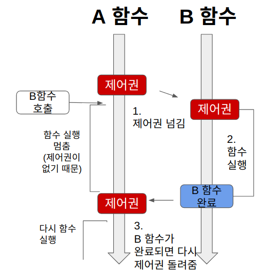
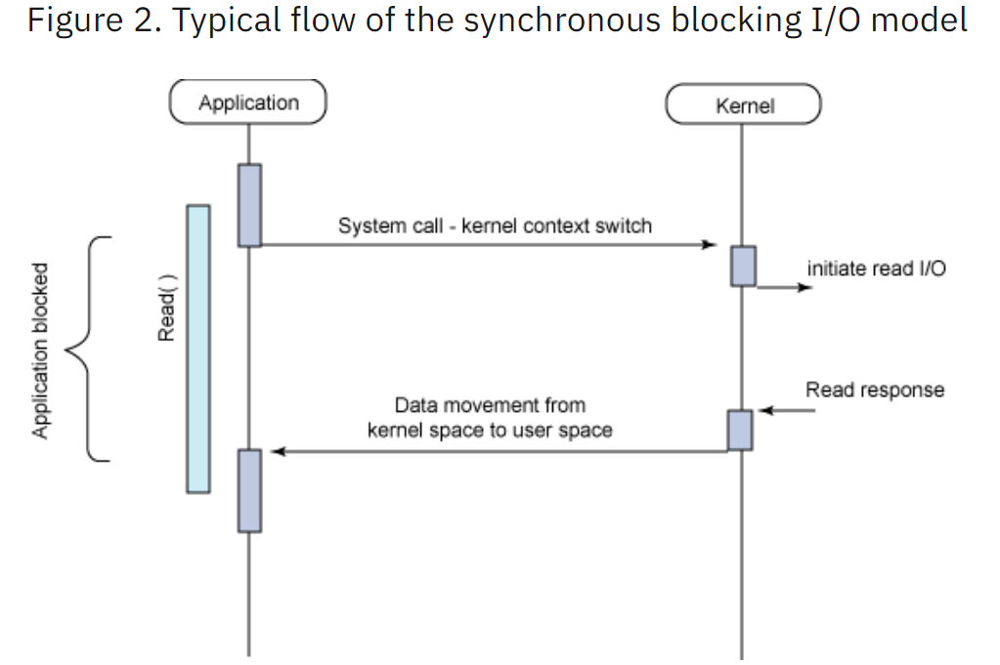

# 쿠키 세션 JWT

    HTTP 통신의 특성상 한번 연결이 된 후에는 클라이언트가 얘기 하지 않는 한 연결이 되지 않아서 유저가 새로고침을 할 때 마다 로그인을 다시 해야하는 문제가 존재한다. 이를 해결하기 위해서 만든 것이 사용자를 기억하는 쿠키, 세션,JWT 이다.

## 쿠키
    서버에서 정보를 줘서 클라이언트(브라우저)에 저장된 key 와 value 형식으로 이루어진 데이터이다. 쿠키를 이용해서 통신을 하는 과정은 크게 4가지로 나뉜다.

    1. 클라이언트가 로그인 요청
    2. 서버에서 쿠키 생성 후 클라이언트로 전달
    3. 클라이언트가 서버로 요청을 보낼 때 쿠키를 전송
    4. 쿠키를 이용해 유저 인증을 진행

근데 쿠키를 이용해서 유저 인증을 할 때 그냥 개인의 정보를 담게 되었는데 이 정보가 유출이 되게 된다면 위험하므로 일반적인 정보만 저장하는 용도로 사용한다.

## 세션 & 쿠키

이렇게 민감한 정보가 브라우저 상에 존재하지 않기 위해서 세션인증 방식을 활용한다. 서버는 사용자 정보를 서버에 세션 저장소에 저장을 하고 사용자에게 고유한 ID를 부여를 해서 사용자에게 보내면 사용자는 이것을 쿠키로 저장한다.

장점

 1. 서버가 클라이언트에 보낸 정보를 탈취 당하더라도 개인 정보와는 상관 없는 값이 들어가 개인정보 유출에서 안전하다.

단점

1. 만약에 클라이언트에 건네준 쿠키값을 탈취 당하게 된다면 다른 사람이 해당 클라이언트 행세를 하여서 자신이 원하는 행동을 할 수 있다.

2. 세션을 저장해야 하기 때문에 많은 사람이 접속 할 수록 서버에 과부하가 걸린다.
 
쿠키값을 탈취 당할 수 있다는 단점을 해결 하기 위해서 2가지 방법을 사용한다. 

1. 세션에 제한시간을 두어서 쿠키를 탈취 당하더라도 제한된 시간 동안만 세션이 사용 가능해서 피해를 최소화 할 수 있다.

2. http-only를 사용해서 자바스크립트로 해당 쿠키를 조회하는 것을 막아 XSS(Cross Site Scripting)을 막는게 가능하다.

* 세션 설계법 https://skogkatt.tistory.com/227
* http-only https://mitny.github.io/articles/2019-04/httpOnly-secureCookie

## JWT

세션/쿠키 방식과 가장 큰 차이점은 세션/쿠키는 세션 저장소에 유저의 정보를 넣는 반면, JWT는 토큰 안에 유저의 정보들이 넣는다는 점입니다. 물론 클라이언트 입장에서는 HTTP 헤더에 세션ID나 토큰을 실어서 보내준다는 점에서는 동일하나, 서버 측에서는 인증을 위해 암호화를 하냐, 별도의 저장소를 이용하냐는 차이가 발생합니다. [참조](https://www.okta.com/identity-101/what-is-token-based-authentication/)

### jwt의 구조

jwt는 3가지로 이루어진다.

* header

    Header는 이것이 어떤 종류의 토큰인지(지금의 경우엔 JWT), 어떤 알고리즘으로 sign(암호화) 할지가 적혀있다.

* payload

    Payload에는 정보가 담겨 있습니다. 물론 비밀번호나 민감한 정보는 담지 않는다.

* signature

    base64로 인코딩된 첫번째, 그리고 두번째 부분이 완성 되었다면(--> 이는 누구나 쉽게 decoding 할 수 있음), 원하는 비밀 키(암호화에 추가할 salt)를 사용하여 암호화한다

장점

* Statelessness & Scalability (무상태성 & 확장성)
    세션과 다르게 따로 저장공간을 만들 필요 없이 토큰의 유효성만 검토하면 된다.
* 어디서나 생성 가능하다
    토큰을 확인하는 서버가 토큰을 만들 필요가 없다. 로드 밸런싱을 할 때 용이하다.
* 권한 부여에 용이하다
    토큰에 권한 관련 정보를 넣어두고 해당 정보에 관해서만 권한을 주면된다.
단점

* 새션과 마찬가지로 토큰이 탈취당하면 공격자는 클라이언트 행세를 하고 마음대로 토큰을 사용가능하다. 이를 해결하기 위해서 유효기간이 짧은 acess token 과 비교적 유효기간이 긴 refresh token 을 활용한다.

# OAUTH [참조](https://tecoble.techcourse.co.kr/post/2021-07-10-understanding-oauth/)

## 필요성

* 다른 사이트에 자신이 이용하는 서비스에 대한 정보를 넘겨주고 싶을 때가 있음.
* 여기서 첫번째로 생각나는 방식은 계정과 비밀번호를 넘겨주는 방법이 있음 -> 보안상으로 아주 위험함
* 두번째 방법은 토큰을 이용해서 넘겨줄 정보만 선별적으로 넘겨주는 방법이 있다.

## OAUTH 참여자

* Resource Server : Client가 원하는 자원을 보유하고 있는 서버

* Resource Owner : 자원의 소유자, 한마디로 사용자

* Client : Resoure Server에 접속해서 자원에 접근하려고 하는 클라이언트

## 과정

1. 유저(resource owner)가 Client(접속하려는 사이트)에 인증 요청을 한다.

2. Client 는 유저가 인증할 수 있는 수단을 보낸다.

3. 인증을 완료한 유저가 client에 권한증서를 전달

4. 권한 증서를 가지고 Resource Server 에 접근

5. Resource Server는 해당 Client에 token과 해당하는 정보를 전달

# Socket & Socket.io

## Socket이란?

두 프로그램이 서로 데이터를 주고 받을 수 있게 양쪽에 생성되는 통신 단자이다. 이러한 소켓을 활용해서 하는 통신을 소켓 통신이라고 한다. HTTP와 다르게 클라이언트와 서버가 양방향으로 소통을한다.

패킷의 종류에 따라 2가지로 구분한다.

1. 스트림(TCP)

- connection-oriented
- 오류수정, 흐름제어
- 오버헤드가 존재함
- 대량의 데이터 전송에 적합함(이유를 모르겠음)

2. 데이터그램(UDP)

- connectionless
- 데이터 크기에 제한이 있음
- 전달한 데이터가 손실 될 수 있음
- 실시간 통신을 하기 위해 사용

## Socekt.io

이러한 소켓을 활용해서 브라우저와 서버의 양방향 통신을 지원 하는 것이 웹소켓이다. 그리고 이러한 소켓을 **활용**해서 양방향 통신을 지원하는 **라이브러리**가 Socket.io이다. ([Socekt.io]](https://socket.io/docs/v4/) 에서 인용) 

특징으로는 다음과 같은 특징이 있다.

* 만약 실패하면 HTTP 폴링으로 전환해서 통신을 시도한다.
* 자동 재연결을 지원한다.
* acknowledgement를 지원한다.
* broadcasting과 multicasting을 지원한다.

# 로드 벨런싱

* 서버를 운용하다가 부하(로드)가 쌓이면 두가지 방식이 존재한다. 서버 기계를 업그레이드를 하거나, 서버를 여러대 만들어서 부하를 분산 시키는 방법이 존재한다. 서버 기계를 업그레이드를 하는데는 한계가 존재하므로 서버를 여러대 만들어서 부하를 분산을 조절해서(로드 벨런싱) 하는 방식을 사용한다.

다음과 같은 기술이 로드 벨런싱에 쓰인다.

1. NAT(Network Address Translation)
    * 사설 ip 주소를 공인 ip주소로 바꾸는데 쓰인다(그림 참조)
2. Tunneling
    * 인터넷상에서 눈에 보이지 않는 통로를 만들어 통신할 수 있게 하는 개념
    * 데이터를 캡슐화해서 연결된 상호 간에만 캡슐화된 패킷을 구별해 캡슐화를 해제할 수 있습니다.
3. DSR(Dynamic Source Routing protocol)
    * 로드 밸런서 사용 시 서버에서 클라이언트로 되돌아가는 경우 목적지 주소를 스위치의 IP 주소가 아닌 클라이언트의 IP 주소로 전달해서 네트워크 스위치를 거치지 않고 바로 클라이언트를 찾아가는 개념입니다.

위와 같은 기술을 사용해서 다음과 같은 과정으로 로드 벨런싱이 수행된다.

계층에 따라서 L2, L3, L4(TCP, UDP), L7(HTTP, HTTPS)에서 밸런싱이 수행된다. 계층이 높아지면 구현을 섬세하게 할 수 있으나 가격이 비싸진다.

로드 밸런싱을 하는 중에 접속할 서버를 선택할 때 다음과 같은 알고리즘을 사용된다.

1. 라운드로빈

* 서버에 들어온 요청을 순서대로 돌아가며 배정하는 방식, 구현이 쉬우나 서버간의 처리 능력이 다르다면 적합하지 않기 때문에 가중 라운드 로빈을 쓴다.

2. 최소 연결 방식

* 요청이 들어온 시점에 가장 적은 연결 상태를 보이는 서버에 트래픽을 배정하는 방식.
서버에 분배된 트래픽들이 일정하지 않은 경우에 적합하다.

3. IP 해시 방식

* 클라이언트의 IP주소를 특정 서버로 매핑하여 요청을 처리하는 방식, 사용자가 항상 동일한 서버로 연결된다.

# Blocking,Non-blocking & Synchronous,Asynchronous

## 블록킹 vs 논 블록킹

해당 작업을 수행할 때 기존 프로세스를 중단 시키는지 아닌지의 여부에 따라서 블록킹, 논 블록킹을 구분한다.

### 블록킹

A함수 실행 도중 B함수를 호출하게 되면 A함수는 멈추고 B함수의 결과를 기다린 채로 함수 실행을 중단하고, B의 실행이 끝난 이후에 실행을 다시한다.

### 논 블록킹

위의 설명과 반대로 A함수 실행 도중 B함수를 실행하게 되면 A함수가 멈추는게 아니라 A함수 대로 실행을 하고 B함수의 결과 값을 기다린다.

## 동기 vs 비동기

### 동기

일의 처리 순서나 종료 여부에 대해서 신경을 쓰는것을 의미한다.

### 비동기

일의 처리 순서나 종료 여부에 대해서 신경을 쓰지 않는 것을 의미한다. 

# Blocking & Non-Blocking I/O

말 그대로 위의 설명에서 나온대로 입출력 과정을 하는 동안에 blocking을 해서 기존 프로세스를 중단 시키면 Blocking 이고 중단하지 않고 기존 프로세스를 돌리면 Non-Blocking 이다. 위의 동기 비동기와 결합하면 4가지 I/O가 나온다.(인터넷에 여러 의견이 있지만 여기서는 IBM 문서를 참조하였다)

## Synchronous blocking I/O

가장 처음에 생긴 io모델이며 가장 생각하기 쉬운 방법이다. 읽기 연산이 발생하면 프로그램은 제어권을 커널에 넘겨주고 커널이 읽기 연산을 마치고 제어권을 넘겨주면 그때 다시 작동한다. 읽기 작업마다 프로그램이 멈추기 때문에 비효율적이다.

## Synchronous non-blocking I/O

프로그램은 지속적으로 읽기 작업의 종료여부를 확인하는 대신 작업을 중단하지 않고 프로그램 내부의 작업을 지속적으로 수행한다. 위의 동기 블럭방식보다는 효율적이나 busy-wait 방식을 활용하기 때문에 계속 결과 값을 확인해주는 과정에서 비효율이 발생한다.

## Asynchronous blocking I/O

입출력이 일어나는 동안 원래 프로그램의 작업은 중단하고 입출력이 끝날 때 까지 기다린다. 작업 1개와 입출력 1개라면 blocking sync 과 차이가 없어 보이지만, 입출력이 여러개라면 얘기가 달라진다. 제일 이해가 안되는 개념이지만, select()라는 시스템콜의 예시가 있다. 요약해서 말하면 여러개의 입출력 중에서 시작 순서와 상관없이 끝나는 순서에 따라서 입력을 처리하는 방식이다.
[참조](https://pangtrue.tistory.com/31)

## Asynchronous non-blocking I/O (AIO)

입출력이 일어나는 동안 기존 프로그램은 중단되지 않고 계속 자신의 코드를 실행한다. 입출력이 끝났는지 신호를 확인하지 않다가 입출력이 끝나면 그 때 입출력으로부터 신호를 받아서 이후 계산을 처리한다.