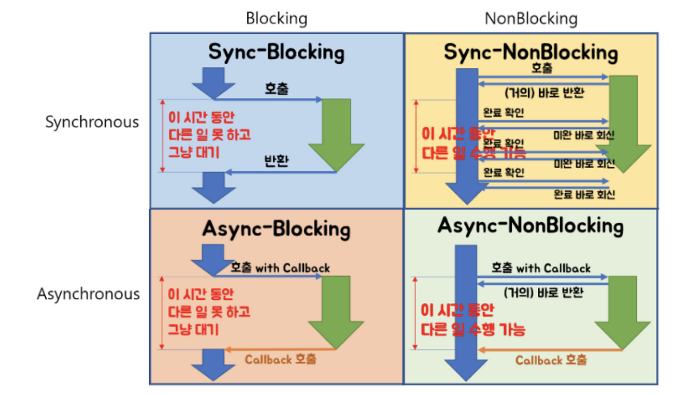

# 네트워크 3

## #1. 쿠키, 세션 & JWT

로그인과 관련된 내용을 알기 위해서는 인증과 인가에 대한 개념을 알아야 함

Authentication (인증)은 쉽게 말해 로그인이라고 생각하면 됨. 즉, 내가 이 사이트에 가입된 회원임을 아이디와 패스워드 등을 통해 **인증받는 것을 말함**

Authorization (인가) 한번 인증 받은 사용자가 이후 서비스의 여러 기능을 사용할 때 즉, 페이스북에서 로그인 계정만이 사용할 수 있는 기능들을 사용할 때 페이스북이 로그인 되어있음을 알아보고 **허가**내주는 것을 말함. 즉, 인가는 **로그인이 유지되고 있는 상태에서 자원 접근 권한에 대한 허가**임.

사용자가 웹 서비스에서 한번 로그인을 한 뒤 다른 기능을 사용할 때 내가 로그인 상태라는 것을 서버가 알아야 한다. 

그렇다면 서버는 어떻게 알 수 있을까?

서버는 각 요청이 들어올 때마다 로그인이 되어있는지를 확인하고 가능한 서비스를 제공한다.

로그인라는 것은 데이터베이스에 저장된 사용자 계정의 해시값을 사용자의 암호를 복잡한 알고리즘으로 계산한 값과 일치하는지를 확인하는 무거운 작업이기 때문에 매 요청마다 로그인을 시도하는 것은 무겁고 보안상 위험하기도 하다.

 

### Cookie & Session

전통적인 방식으로는 쿠키와 세션을 이용한 방식이다.

쿠키는 클라이언트(브라우저) 로컬에 저장되는 작은 데이터 파일을 말하고, 세션은 세션ID를 통해서 로그인 되어있음을 지속하는 상태를 말한다. 인증된 사용자의 식별자와 랜덤한 문자열로 세션 ID 만들어서 서버에 저장하고 응답헤더에 넘겨서 클라이언트가 저장할 수 있게 한다.

서버는 클라이언트로부터 session ID가 오면 저장된 세션 ID를 확인하고 인가할 수 있다. 하지만 서버가 여러 개인 경우, 즉, 클라이언트가 서버 1에서 인증을 받았으면 사용자의 세션 ID는 서버1에서 관리되고 있다. 두번째 필요한 인증이 필요할 때 이번에는 서버 2에서 처리를 한다면, 세션ID를 확인할 수 없어 에러가 발생할 수 있다.

이것을 해결하기 위해 **세션 스토리지**를 사용한다. 모든 서버가 세션 스토리지에서 세션 ID를 관리하게 하면 앞선 문제를 해결할 수 있다.

여기서 또 다른 문제가 발생하게 되는데, 사용자가 많아져서 많은 사용자가 세션 스토리지를 계속 접근하게 될 경우,,,, 서버에 무리가 가게 된다.

서버는 REST의 무상태성을 기초하기 때문에 어떤 상태를 기억한다는 것이 설계하기 복잡하고 까다롭다.

### JWT (Json Web Token)

Token은 서버의 무상태성(stateless)을 유지해줄 수 있는 인증 방법으로 등장하게 되었다.

##### JWT

* JWT를 자세히 보면 .(점)을 구분으로 3 부분으로 나눠져 있다.
* 앞부분은 HEADER , 가운데는 PAYLOAD, 마지막은 VERIFY SIGNATURE

* 페이로드를 base 64로 디코딩하면 JSON 형식으로 여러 정보들이 들어있다.
  * 누가 누구에게 발급했는 지 
  * 유효기간
  * 서비스가 사용자에게 토큰을 통해 공개하기 원하는 내용 (사용자의 닉네임, 권한 etc) 등등
  * 토큰에 담긴 데이터를 claim이라고 한다
* 헤더는 type (JWT) 과 alg가 들어있다. 여기서 alg는 VERIFY SIGNATURE(서명값)을 만드는데 사용할 알고리즘이 지정된다.
* 1번의 헤더와 2번의 페이로드 그리고 **서버의 비밀키**을 갖고 암호화 알고리즘에 넣으면 3번의 서명 값이 나오게 된다
  * 그래서 서버에게 토큰이 보내지면 서버는 1,2번과 서버의 비밀키로 계산된 값과 3번 서명값과 일치하는 결과가 나오는지 확인하고 토큰이 정상인지 확인하고 인증해줄 수 있다.

##### JWT 장점

서버가 늘어나도 서버가 가진 비밀키로 해독하는 과정을 걸치기 때문에 서버의 확장이 가능하다.

##### JWT 단점

token은 통제를 할 수 없다는 단점을 가지고 있다. 만약 해커가 토큰을 가지고 간다면 이 토큰을 무효화할 방법이 없다.

이 점을 보안하는 한 가지 방법으로 토큰이 몇 시간이나 몇 분이하로 짧은 access 토큰과 2주정도로 잡혀있는 refresh 토큰을 준다. 그리고 refresh 토큰은 상응값을 데이터베이스에도 저장한다. 유저는 access 토큰의 수명이 다하면 refresh 토큰을 보내고 서버는 데이터베이스 저장된 값과 비교하고 맞다면 새 access 토큰을 발급해준다. 

중간에 해커가 access 토큰을 빼앗아가도 수명 시간이 짧기 때문에 오래 사용할 수 없다. 하지만 여전히 짧지만 해커가 로그인을 막을 방법은 없다.

## #2. OAuth

* 사용자가 비밀번호를 제공하지 않고 다른 웹사이트 상에서 자신의 정보에 대해 접근 부여를 할 수 있는 개방형 표준 프로토콜이다.
* OAuth 2.0부터 표준 프로세스로 만들어지고 https를 필수로 사용하기 때문에 암호화는 https에게 맡기게 되었다.

> 예시 : 

* Resource owner (실 고객)
* Resource Server (페이스북, 카카오톡)
* Client (웹 서비스)

1. 로그인을 하면 GET 요청을 통해 파라미터를 보낸다. (clident ID, redirect url, scope)
2. 서버는 넘어온 파라미터를 검사해서 동일한 ID가 존재하는지 그리고 redirect url이 같은지 확인한다.
3. 검증이 마무리되면 서버는  Owner에게 다시 되묻고 승인하게 된다.
4. 승인하게 되면 redirect 로 임시 암호인 authorization code를 발급한다.
5. client는 비밀키 및 코드 를 서버에 전달하고 서버는 정보를 검사하고 access token을 발급해준다.
6. 토큰 발급시 사용자 정보가져오기로 GET 요청한다.

**참고자료**

[OAuth란 무엇일까?](https://showerbugs.github.io/2017-11-16/OAuth-%EB%9E%80-%EB%AC%B4%EC%97%87%EC%9D%BC%EA%B9%8C)

## #3. Socket & Socket.io

#### 웹소켓이란?

두 프로그램 간의 메세지를 교환하기 위한 통신 방법 중 하나이다. 현재 인터넷 환경 HTML5에서 많이 사용한다. 

#### 웹소켓의 특징

**양방향 통신(Full Duplex)**

* 데이터 송수신을 동시에 처리할 수 있는 통신 방법이다.
* 통상적인 Http 통신은 클라이언트가 요청을 보내는 경우에만 서버가 응답하는 단방향 통신이었다면, 웹소켓은 클라이언트와 서버가 서로에게 원할 때 데이터를 주고 받을 수 있다. 

**실시간 네트워킹**

* 웹 환경에서 연속된 데이터를 빠르게 노출시킬 경우 즉, 채팅, 주식, 비디오 데이터 등에서 사용된다.
* 여러 단말기에 빠르게 데이터를 교환한다.

#### 웹 소켓 이전의 비슷한 기술

#### Polling

* 클라이언트에서 일정 주기마다 요청을 보내고 서버는 현재상태를 바로 응답하는 방식이다.
* 폴링방식은 실시간으로 반영이 중요한 서비스에 좋지 않고 서버에 변화가 없더라도 매 요청마다 응답을 보내기 때문에 불필요한 트래픽이 발생하게 된다.

#### **Long Polling**

* 클라이언트에서 일정 주기마다 요청을 보내고 서버는 이벤트가 발생할 때까지 대기하다가 이벤트 발생시 응답한다. 클라이언트는 응답을 받았을 때 다시 요청하게 된다.
* polling에 비해 불필요한 트래픽을 유발하지 않지만 이벤트가 잦다면 과부하가 걸리게 된다.

  #### Streaming

* 서버는 응답을 한 뒤에도 연결을 끊지 않고 이벤트가 발생할 때마다 응답을 하는 방식이다.
* Long polling에 비해 응답마다 다시 요청하지 않아도 된다는 장점을 가지고 있지만 연결 시간이 길어질수록 연결의 유효성 관리의 부담과 클라이언트에서 서버로의 데이터 송신이 어렵다는 단점을 가지고 있다.

이 모든 방법이 HTTP를 통해 통신하기 때문에 Request와 Response 둘 다 Header가 불필요하게 크다.

### 웹 소켓의 동작방법

#### 핸드쉐이킹

1. client는 http 혹은 https를 통해 요청한다.
   * Upgrade : websocket 
     * 현재 프로토콜에서 다른 프로토콜로 업그레이드 하겠다는 의미
   * Connection : Upgrade
     * Upgrade 필드가 명시되었을 경우, 송신자는 반드시 Upgrade 옵션을 지정
   * Sec-WebSocket-Key : 임의의문자
     * 길이가 16바이트의 임의로 선택된 숫자를 base 64로 인코딩한 값으로 클라이언트와 서버가 서로간의 신원을 인증하기 위해 사용
2. Server는 응답해준다.
   + HTTP/ 1.1 101 Switching Protocols
     + 101 응답이 오면 연결되었다는 것을 의미
   + Sec-WebSocket-Accept : 문자열
     + 클라이언트에서 받은 Sec-WebSocket-Key 를 사용하여 계산된 값
     + Sec-WebSocket-Key 값에 특정 값을 붙인 뒤 SHA-1로 해싱하고 base 64로 인코등한 값을 Accept 헤더에 보낸다.
3. 핸드 쉐이킹 과정이 완료된다. 이때부터는 프로토콜이 ws(wss)로 변경된다. message라는 단위를 통해서 전송을 한다.
   * Message : 여러 frame이 모여서 구성하는 하나의 논리적 메세지 단위
   * Frame : communication에서 가장 작은 단위의 데이터로 작은 헤더와 페이로드로 구성된다. 웹소켓 통신에서 사용되는 데이터는 UTF8 인코딩이다.
   * 예 : 0x00 (보내고 싶은 데이터) 0xff

#### 프레임 헤더 구조

* Opcode : 프레임의 사용 상태를 나타냄
  * Continue (0x0) : 전체 메세지의 일부임을 의미
  * Text (0x1) : 포함된 데이터가 UTF-8 텍스트라는 의미
  * Binary(0x2) : 포함된 데이터가 이진 데이터라는 의미
  * Close (0x8) : Close 핸드쉐이크를 시작한다는 의미

#### 웹 소켓 프로토콜 특징

* 최초 접속에서만 http 프로토콜에서 핸드쉐이킹하기 때문에 http header을 사용한다. (http 80, http 443 포트 사용)
* 프레임으로 구성된 메세지라는 논리적 단위로 송수신한다.
* 메세지에 포함될 수 있는 교환 가능한 메세지는 **테스트, 바이너리**이다.

#### 웹소켓의 한계

* 웹소켓은 HTML5의 기술로 그 이전 기술로 구현된 서비스는 Socket.io 와 SockJs를 이용해야 한다.
  * 브라우저와 웹 서버의 종류와 버전을 파악하여 가장 적합한 기술을 선택하여 사용해야 함
* 웹소켓은 문자열들을 주고 받는 기능만 제공한다. 그래서 주고 받은 문자열의 해독은 어플리케이션 단에서 해결한다.
* 또한 HTTP같은 경우 형식이 있기 때문에 해석할 수 있지만 웹소켓은 형식이 정해져있지 않기 때문에 어플리케이션에서 쉽게 해석하기 힘들다. 그래서 웹소켓은 **sub-protocols**을 사용해 주고받는 메세지의 형태를 약속하는 경우가 많다.

#### STOMP(Simple Text Oriented Message Protocol)

* STOMP는 웹소켓 위에서 동작하는 프로토콜로 채팅 통신을 하기 위한 형식을 정의한다. HTTP와 유사하게 정의되어 해석하기 편한 프로토콜이다.

  예 : 

  

**참고자료**

[Web Socket](https://sjh836.tistory.com/166)

[websocket, socket.io를 이용한 양방향 통신](http://www.secmem.org/blog/2019/08/17/websocket-socketio/)

[우테코 - websocket](https://www.youtube.com/watch?v=MPQHvwPxDUw)

**다시 읽어보기**

[STOMP](https://dev-gorany.tistory.com/235)

## #4. 로드 밸런싱(Load Balancing)

### Proxy Server (네트워크 프록시)

* 클라이언트와 서버간의 중계서버로, 통신을 대리 수행하는 서버이다. 
* 캐시/보안/트래픽 분산 등 여러 장점을 가질 수 있음

#### Forward Proxy

* 일반적으로 말하는 proxy server를 말한다.

특징

* 캐싱 : 클라이언트의 요청을 캐싱해서 저장해둔다
  * 전송시간을 절약할 수 있고 
  * 불필요한 외부 전송이 생기지 않는다. 
  * 그로인해 네트워크 병목 현상을 방지할 수 있다.
* 익명성 : 클라이언트가 보낸 요청을 감출 수 있다.
  * forward proxy가 요청한 것처럼 보낼 수 있어서 서버는 요청을 누가 보냈지는 알지 못한다. 서버가 받은 요청의 IP는 proxy의 IP이기 때문이다.

#### Reverse Proxy

특징

* 캐싱 : 클라이언트의 요청을 캐싱해서 저장해둔다.
  * 앞서 포워드 프록싱과 같은 특징이다.
* 보안 : 서버 정보를 클라이언트로부터 숨길 수 있다.
  * 클라이언트들은 reverse proxy가 실제 서버라고 생각하여 요청하므로 실제 서버의 IP가 노출되지 않는다.
* **Load Balancing**

#### Load Balancing

* 로드 밸런싱은 부하 분산으로 해야할 작업을 나누어 서버의 부하를 분산시키는 것을 말한다.
  * Scale up : 서버의 하드웨어를 높이는 것
  * Scale out : 서버를 여러 대로 만드는 것
    * Scale out에서 로드 밸런싱이 필요하게 된다.

#### Load Balancer

* 여러 대의 서버가 분산 처리할 수 있도록 요청을 나누어주는 서비스를 말한다.

**기본 동작 방식**

1. 클라이언트가 브라우저에게 domain 입력
2. 클라이언트에 설정된 DNS 서버로 IP 주소를 물어본다
3. DNS 서버는 domain 주소를 관리하는 별도의 DNS 서버로 IP 주소를 문의하고
4. 별도 관리 DNS 서버는 로드밸런서의 IP(Virtual IP) 주소를 메인 DNS에게 알려준다.
5. 메인 DNS 서버는 획득한 VIP주소를 클라이언트에 전송한다
6. 클라이언트에서 로드밸런서의 VIP 주소로 http 요청한다
7. 로드밸런서는 별도의 로드밸런서 방법 (대표적으로 라운드 로빈 알고리즘 등)을 통해 서버에게 요청을 전송한다
8. 서버의 작업 결과를 받은 로드밸런서는 전달받은 http 결과를 클라이언트에게 전송한다

**Load Balancer 종류**

L2 : Mac 주소를 바탕으로 Load Balancing 한다.

L3 : IP 주소를 바탕으로 Load Balancing 한다.

**L4** : Transport Layer(IP & Port) Level에서 Load Balancing 한다.

**L7** : Application Layer(User Request) Level에서 Load Balancing 한다. (HTTP, HTTPS, FTP)

* URL 혹은 query param 등 어플리케이션 **요청하는 방법에 따라서** 어떤 서버로 로드밸런싱할지를 결정하는 것을 의미한다.

**참고자료**

[네트워크 부하분산 이해하기](https://www.stevenjlee.net/2020/06/30/%EC%9D%B4%ED%95%B4%ED%95%98%EA%B8%B0-%EB%84%A4%ED%8A%B8%EC%9B%8C%ED%81%AC%EC%9D%98-%EB%B6%80%ED%95%98%EB%B6%84%EC%82%B0-%EB%A1%9C%EB%93%9C%EB%B0%B8%EB%9F%B0%EC%8B%B1-load-balancing-%EA%B7%B8/)

[우테코 - 프록시, 로드밸런서](https://www.youtube.com/watch?v=YxwYhenZ3BE&t=6s)

## #5. Blocking,Non-blocking & Synchronous,Asynchronous

>  blocking/ non blocking : 다른 주체가 일을 할때 자신이 **제어**권이 있는지 없는지의 여부를 나타낸다.

### Blocking

* 호출된 함수가 자신의 작업을 모두 마칠때까지 제어권을 주지 않고 **호출한 함수를 대기**하게 만든다.
* 즉, 자신의 작업을 진행하다가 다른 주체의 작업이 시작되면 그 작업이 끝날 때까지 **기다렸다**가 자신의 작업을 수행한다.

### Non Blocking

* 다른 주체와 **관련없이** 자신의 작업을 한다. 그래서 다른 작업을 수행하는 순간 빠져나와 다시 자신의 일을 진행한다.

> Synchronous / Asynchronous : 결과를 돌려주었을 때 **순서와 결과에 관심**이 있는지 아닌지로 판단할 수 있다.

### Synchronous

* 호출한 함수가 작업 완료를 신경쓴다. 그래서 요청한 결과를 받으면 그 즉시 그 요청한 결과에 따른 일을 처리한다.

### Asynchronous

* 호출된 함수의 작업 완료에 신경쓰지 않는다. 그래서 요청한 결과가 와도 자신의 일을 다 처리한 후 처리 결과에 대한 일을 처리해도 된다.

* Async - blocking은 의도치 않게 발생하는 경우 많다고 한다.

  

**참고자료**

[우테코 - Blocking vs Non-Blocking, Sync vs Async](https://www.youtube.com/watch?v=oEIoqGd-Sns)

> 예시에 대해 조금 더 찾아보기!!

## #6. Blocking & Non-Blocking I/O

### Blocking I/O

I/O 작업은 유저레벨에서 직접 수행할 수 없다. 실제 I/O를 수행하는것은 커널레벨에서만 가능하기 때문에 프로세스(또는 쓰레드)는 커널에게 I/O를 요청한다. 

I/O에서 블로킹 형태의 작업은 유저 프로세스가 커널에게 I/O를 요청하는 함수를 호출고 자신의 작업을 중단한채 대기하고 있다. 

이때 IO작업은 CPU 자원을 거의 쓰지 않기 때문에 **리소스의 낭비가 심하다**.

### Non Blocking I/O

Blocking의 비효율성을 극복하고자 만들어진 방법으로 Non Blocking I/O 작업은 I/O 작업을 진행하는 동안 유저 프로세스의 작업을 중단하지 않는다. 

유저 프로세스가 커널에게 I/O 요청하는 함수를 호출하고 I/O 작업과 상관없이 결과를 반환한다. 

단, 입력 데이터가 없으면 입력 데이터가 없다는 결과 메세지인 (EWOULDBLOCK)를 반환한다. 입력데이터가 있을 때까지 이 과정을 반복하는데 반복적인 시스템 호출은 역시 자원이 낭비되게 된다.

### I/O 이벤트 통지모델

Non-Blocking에서 제기된 문제를 해결하기 위해서 고안되었다. 입력 버퍼에 데이터가 수신되어서 데이터의 수신이 필요하거나, 출력버퍼가 비어서 데이터의 전송이 가능한 상황을 알려준다면, 더 단순하고 효과적으로 다중 I/O모델을 처리할 수 있을 것이다.

#### 동기형 통지모델

동기형 통지모델의 프로세스는 커널에게 지속적으로 현재 I/O 준비상황을 체크하여 동기화한다. 유저 프로세스가 적극적으로 확인하며 커널은 수동적으로 프로세스의 요청에 따라 현재 상황을 보고한다.

#### 비동기형 통지모델

커널에게 I/O 작업을 맡기면 커널의 작업 진행사항에 대해서 프로세스가 신경쓸 필요가 없다. 커널은 I/O 작업이 완료되면 프로세스에게 알리고 프로세스는 자신의 할일을 하다가 통지가 오면 그 떄 I/O 처리를 하게된다. 

**참고자료**

[I/O 모델](https://ozt88.tistory.com/20)

**읽어보기** : [추가 설명](https://velog.io/@jsj3282/Blocking-IO-vs-Non-Blocking-IO-synchronous-IO-vs-asynchronous-IO-10k-problem)