# 4주차 - OS

## 운영체제란
> OS는 컴퓨터 시스템의 자원을 효율적으로 관리하고 사용자가 컴퓨터를 편리하고 효과적으롤 사용할 수 있도록 환경을 제공하는 프로그램의 모임.

주 기능으로는 아래와 같이 4가지로 나눌 수 있음.

1. 프로세스 관리
   1. 프로세스 스케줄링 및 동기화
   2. 프로세스 생성, 제거, 시작, 정지, 메시지 전달등의 기능
2. 기억장치 관리
   1. 프로세스에게 가상 메모리를 할당하고 관리
3. 주변장치 관리
   1. IO 장치를 스케줄링하고 전반적인 관리
4. 파일 관리
   1. 파일의 생성, 삭제, 변경 그리고 유지등의 관리
   

결국 실체가 있는 하드웨어를 가상화하여 사용자에게 편의를 제공하는 일을 함.

## 프로세스 vs 스레드
- 프로세스
    - 메모리에 적재되어 실행되고있는 프로그램
    - 운영체제에서 시스템자원을 할당받는 작업의 단위
    - 프로세스는 스택과 데이터 코드 힙을 가진다.
    - PCB?
        - Process Control Block으로 프로세스에대한 중요 정보를 저장하는 자료구조
        - Context Switching이 일어날 때 PCB에 정보를 저장.
- 쓰레드
    - 프로세스 내에서 실행되는 여러 흐름의 단위
    - 프로세스가 할당받은 자원을 이용하는 실행 단위
    - 스레드는 프로세스 내에서 스택만 할당받고 코드 데이터 힙 영역을 공유
        - 스택을 독립적으로 할당하는 이유
            - 함수 호출시 전달되는 인자, return address, 지역변수등을 저장하기 위해 사용
            - **스택이 독립적이라는 것은 독립적인 함수 호출이 가능. 이는 독립적인 실행 흐름이 추가**
        - PC를 독립적으로 할당하는 이유
            - 각각의 쓰레드는 스케쥴러에 의해 연속적으로 실행되지 못하고 Context Switching을 하게 될 텐데 그 때 PC가 없으면 어느 지점까지 수행했는지 기억하지 못함.

## 프로세스 주소 공간

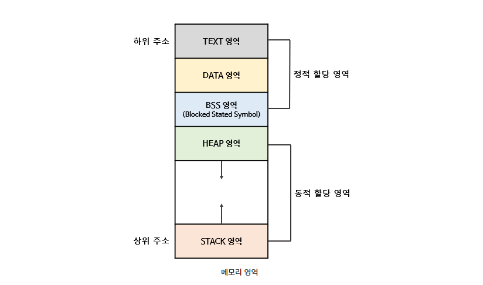

프로세스의 주소 공간은 아래와 같이 나눌 수 있음.

| Name | 특징 |
|------|-----|
| Code  | 프로그램의 코드가 저장되어 있으며, 읽기만 가능 |
| Data | 전역변수와 정적변수 같은 데이터가 저장되어있으며, 읽고 쓰기 가능 |
| BSS | 초기값이 없는 전역변수, 배열, 정적 변수가 저장 |
| Stack  | 지역변수와 매개변수 같은 데이터가 저장되어있으며, 읽고 쓰기가 가능 |
| Heap  | 동적으로 할당되는 참조형의 데이터가 저장되는 공간 |

1. Code 
   1. 코드가 저장되어있는 부분. 프로그램의 코드는 동작시에 변경되면 안되기 때문에 read only.
2. Data 
   1. 전역 변수를 관리하는 부분. read-write 가능
3. BSS ( Block Stated Symbol )
   1. 초기값이 없는 전역변수, 배열, 정적변수가 저장되는 공간으로 초기화된 값은 Data 영역에, 초기화되지 않은 값은 BSS 영역에 저장.
4. Stack 
   1. 함수와 지역변수를 저장. read-write 가능
   2. 높은 주소 값에서 낮은 주소값 방향으로 할당.  
5. Heap
   1. 런타임시에 크기가 결정되는 영역
   2. 사용자에 의해 메모리 공간이 동적으로 할당되고 해제
   3. 참조형의 데이터가 저장
   4. Stack과 반대로 낮은 주소값에서 높은 주소값 방향으로 할당.

이렇게 각 주소공간을 분리하면, Code 세그먼트는 다른 프로세스와 공유가 가능.

두 Stack과 Heap은 확장할 수 있어야하고, 서로 다른 방향으로 위치하게 함으로써 확장이 가능하도록 배치.

### Stack과 Data의 구분 이유
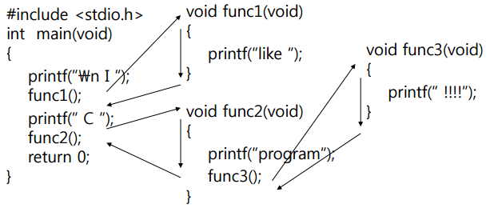

- main 함수부터 실행하고, 처음 printf를 수행한뒤 함수 func1을 실행
- 함수 func1이 실행되고, main에서 다시 printf를 실행하고 함수 func2를 실행
-  func2에서는 printf를 수행하고 func3를 실행

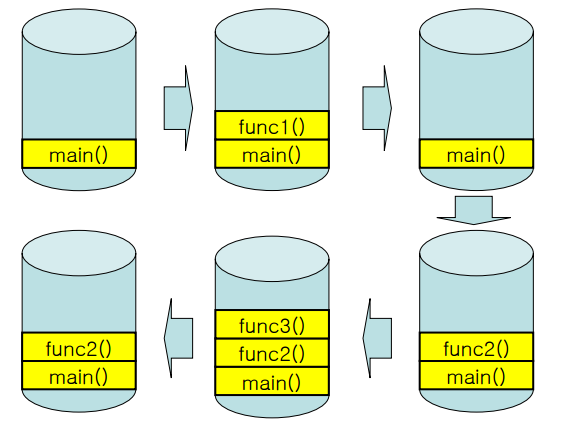

- 위 단계를 정리하면 사진과 같음.
- 함수는 결국 스택방식으로 작동하기 때문에, 각 함수의 지역변수를 스택으로 관리하고 어디서나 접근가능해야하는 전역변수는 Data 영역에서 따로 관리

## 인터럽트(Interrupt)

프로그램 실행 중, 입출력 하드웨어 등의 장치에서 예외사항이 발생하여 처리가 필요할 경우 CPU에게 알려 그것을 처리할 수 있도록 하는 것을 interrupt라고 함.

### Interrupt

하드웨어에서 발생시키는 인터럽트를 interrupt라고 부른다.

가장 대표적인 예시로 Timer interrupt가 있으며, CPU는 내장된 타이머를 이용해 특정한 tick마다 timer interrupt를 발생시켜 제어권을 커널이 갖도록 한다.

### Trap

소프트웨어에서 발생시키는 인터럽트를 trap이라고 부른다.

대표적인 예시로는 System Call 혹은 소프트웨어에서의 Exception이 있음.

- Exception : divide by zero, overflow, underflow ..
- System Call : 사용자가 특정 권한이 필요한 명령어를 실행하기 위해 사용하는 명령어로, 사용자가 의도적으로 발생시키는 것이 대부분.

#### Timer Interrupt

OS는 인터럽트가 발생하기 전까지 프로세스의 제어권을 가져올 수 있는 방법이 거의 없다.

프로세스가 끝나거나, 시스템콜을 호출하여 직접 제어권을 놓지않으면 OS가 간섭을 못하게 되고 프로세스는 영원히 혼자서 실행될 수도 있다.

이러한 것을 위해 timer interrupt를 사용하기 시작했고, 적절한 타이밍마다 타이머 인터럽트를 발생시킴으로써 OS는 제어권을 가져올 수 있다.

## 시스템 콜(System Call)

OS는 커널 모드와 유저 모드로 나누어 구동한다.

운영체제는 특정한 기능을 커널 모드에서만 동작할 수 있도록하는데, 예를 들어 파일 읽고 쓰기와 같은 작업이 대표적인 시스템콜.

이러한 예시로는 아래의 예시가 있음.

1. 프로세스 제어
2. 파일 조작
3. 장치 관리
4. 통신

위와 같은 시스템 콜은 수행되기 위해 아래와 같은 순서로 동작을 한다.

- 시스템 콜은 User mode의 프로세스가 Kernel mode에서 수행가능한 작업을 실행할 수 있게한다.
- 시스템콜이 실행되면, trap 명령으로 권한을 바꾸고 수행이 끝나면 OS가 return-from-trap 명령을 통해 원래의 권한으로 돌아옴.
- trap 명령이 실행되면 프로세스는 pc, flag, register 정보를 kernel stack에 넣음.
- 그 후 return-from-trap 명령이 수행되면 이 데이터를 모두 pop하여 다시 User mode에서 사용할 수 있게 합니다.

## PCB와 Context Switching

아래에서 알아볼 CPU 스케줄링에서, 프로세스는 프로세스간 전환할 때 Context Switching ( 문맥 교환 ) 이라는 것을 한다.

Context switch는 현재 실행 중인 프로세스의 레지스터 값들을 커널 스택 같은 곳에 저장(Context save)하고 새롭게 다시 실행 될 프로세스의 커널 스택으로부터 레지스터 값을 복원(Context restore)하는 것이다.

이러한 프로세스의 특정 값들을 커널의 PCB ( Process Control Block, 프로세스 제어 블록 ) 라는 곳에 Context Switchiing시 저장하게 되고, 다시 실행하게 될 때 PCB로부터 값들을 다시 가져옴으로써 프로세스는 이전 정보를 유지하면서 다시 시작할 수 있게 된다.

PCB는 당연하게도 각 프로세스가 생성될 때 마다 각자의 PCB를 가지게 되고, 프로세스가 종료되면 PCB는 사라진다.

PCB에는 보통 아래와 같은 정보를 가지고 있다.

- 프로세스의 상태
  - read, running, waiting 등의 상태정보를 가지고 있다.
- Process Counter
  - 프로세스가 다음에 실행 해야할 명령어의 주소를 가지고 있다.
- 레지스터
  - 프로세스가 실행하는 동안 필요한 레지스터 등의 정보를 가지고 있다.
- PID
  - Process ID로 프로세스 고유의 아이디를 뜻한다.

이 외에도 다른 여러 정보가 있는데 보통 이러한 정보들이 중요한 정보이니 기억해두도록 하자.

### Context Switching 비용

당연하게도 커널에 현재 프로세스의 정보를 저장하고, 다음 프로세스의 정보를 가져오는 행위를 하면서 지불하게 되는 비용에 대한 생각도 해야한다.

이러한 비용은 생각보다 꽤.. 크며 이러한 것을 스케줄링에서 적절히 조절을 함으로써 Context Switching 비용의 트레이드 오프를 생각해야한다.

#### Thread

당연하게도 쓰레드도 Context Switching을 한다.

이러한 쓰레드 간 Context Switching 비용은 프로세스간 전환보다 적다.

쓰레드는 스택 영역을 제외한 영역을 공유하기 때문에 Context Switching의 비용이 적다.

## IPC(Inter Process Communication)
프로세스 간 통신(Inter-Process Communication, IPC)이란 프로세스들 사이에 서로 데이터를 주고받는 행위 또는 그에 대한 방법이나 경로를 뜻한다.

각 프로세스는 완전히 독립되어 있기 때문에 보통 서로 영향을 주고 받지 않는다. 하지만 이러한 이유 때문에 통신이 어렵다.

그렇기에 IPC라는 방법을 통해서 프로세스간 통신을 하게 되는데, IPC는 아래와 같은 방식들을 사용한다.

1. 익명 PIPE

두 개의 프로세스를 파이프를 통해 연결하고, 하나의 프로세스는 데이터를 쓰기만, 다른 하나는 데이터를 읽기만 할 수 있게 함.

한쪽으로만 통신이 가능하여 Half-Duplex라고 하며 양쪽으로 통신을 하고 싶다면 두 개의 파이프를 사용해야 함.

매우 간단하게 사용가능하지만, 프로세스가 읽기와 쓰기를 모두 해야하면 파이프를 두 개 생성해야한다고 했었는데 이것의 구현 방식이 꽤 까다로움.

2. Named Pipe

익명 파이프는 통신 할 프로세스가 명확해야 사용가능. 보통 부모-자식 프로세스간 사용하는 경우가 많음.

하지만 Named Pipe는 그렇지 않으며 mkfifo와 같은 명령어를 통해 부모 프로세스가 아니더라도 다른 프로세스와 통신이 가능.

mkfifo를 통해 파일을 생성하여 통신을 하며, 그 파일을 통해 서로 정보를 주고 받게 됨.

익명 파이프와 마찬가지로 읽기 및 쓰기가 동시에 불가능하기 때문에 두 개의 파이프를 이용해야 한다는 단점이 존재.

3. Message Queue

Message Queue(메시지 큐)는 선입선출의 자료구조를 가지는 통신설비로 커널에서 관리 함.

Named PIPE와 다른 점이라면 Name PIPE가 데이터의 흐름이라면 메시지 큐는 메모리 공간.

메시지 큐는 쓸 데이터에 라벨링을 하여 여러 프로세스가 동시에 쉽게 데이터를 다룰 수 있게 함.

4. Shared Memory

데이터를 아예 공유하게 함으로써 지원. 프로세스간 메모리 영역을 공유해서 사용할 수 있도록 허용. 프로세스가 공유 메모리를 커널에 요청하면 커널은 해당 프로세스에 메모리 공간을 할당해주고, 그 공간은 어느 프로세스던지 접근 가능하게 됨.

5. Memory Map

Memory Map도 Shared Memory(공유메모리)공간과 마찬가지로 메모리를 공유한다는 측면에 있어서 유사함.

차이점은 이미 오픈된 파일을 메모리에 매핑하고 그것을 공유. 시스템의 전역적으로 공유할 수 있는 파일이기 때문에 프로세스간 통신이 가능하다.

6. Socket
   
socket 통신을 통해 소켓을 열고 그 소켓을 통해 통신을 하는 방법.

이전 주제에서 다루었던 Socket과 유사하게 생각하면 된다.

7. Semaphore

Semaphore는 Named PIPE, PIPE, Message Queue와 같은 다른 IPC설비들이 대부분 프로세스간 메시지 전송을 목적으로 하는데 반해, Semaphore는 프로세스 간 데이터를 동기화 하고 보호하는데 그 목적을 둠.

프로세스간 메시지 전송을 하거나, 혹은 Shared Memory를 통해서 특정 데이타를 공유하게 될 경우 발생하는 문제가 공유된 자원에 여러개의 프로세스가 동시에 접근하면 안되며, 단지 한번에 하나의 프로세스만 접근 가능하도록 만들어줘야 할 것이며, 이 때 사용되는 것이 Semaphore.

### 추가 정보

요즘은 아예 AMQP ( Advanced Message Queue Protocol ) 라는 프로토콜을 만들어, 미들웨어로 사용할 수 있게 나온 프로그램도 많음.

대표적인 것이 RabbitMQ, Kafka 같은 것이 있으며, 보통 Pub-Sub 구조로 Subscriber는 특정 Publisher의 메시지 큐를 구독하고 있다가 Publisher가 메시지를 publish하면 그것을 전달받아 데이터로 사용.

이것의 장점으로는 프로세스간의 결합도를 낮추어준다는 것이며, 메시지 큐 서비스가 죽지 않는 이상 메시지는 언젠가는 도달하기 때문에 도착을 보장해준다는 것.

## CPU 스케줄링

CPU는 각 프로세스를 실행하는 순서를 따로 스케줄러를 두어 스케줄러의 정책에 따라 프로세스를 그 정책에 따라 실행.

이러한 스케줄링의 여러가지 방법을 알아보자.

### FIFO

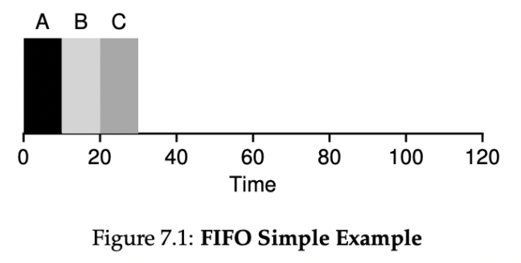

First In First Out (선입선출)이라는 말 그대로, 먼저 스케줄러에 도착한 프로세스를 실행

fifo의 단점은 "먼저 도착한 프로세스가 실행되는 시간이 길면" 뒤에 도착한 작업들이 일찍 끝나는 작업이여도 너무 늦게 실행 됨.

-> 이러한 현상을 Convoy effect.

### SJF

Shortest Job First (최단 작업 우선) 이라는 뜻으로, **현재 도착해있는** 프로세스 중 가장 짧은 실행 시간을 가진 작업을 먼저 실행시킴.

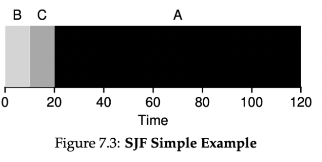

위 그림과 같이 A,B,C가 거의 동시에 도착했을 때 짧은 순서대로 실행하게 됨.

여기서 문제가 발생하는 것은 크게 두가지.

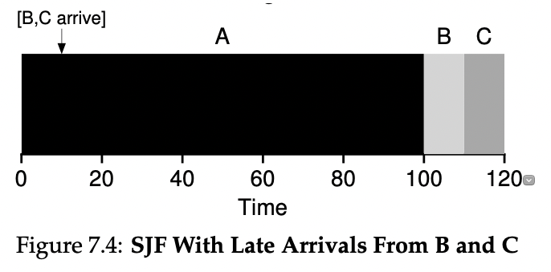

1. 긴 작업이 먼저오고 짧은 작업이 온다면?
   -> 위 그림을 보면 FIFO와 똑같이 Convoy effect가 발생.
2. 실제 프로세스의 작업시간을 어떻게 아는가? ( 미래 예측이라도 해야하나..? )
   

### STCF

Shortest Time-to-Completion First (최소 잔여시간 우선) 이라는 뜻으로, 현재 실행중인 작업의 잔여 실행 시간과 새로운 작업의 잔여 실행 시간을 비교하여, 잔여 실행 시간이 가장 작은 작업을 스케줄.

이 스케줄링 기법은 선점 스케줄러를 가정.

> 선점 스케줄러란? 어떤 작업을 수행하는 도중 다른 작업이 수행가능하도록하는 스케줄러. 즉, 작업 도중에 끝날 수 있음.

이러한 방식으로 스케줄을 하게 되면 다음과 같이 실행이 가능함.

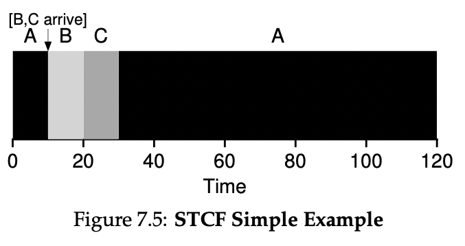

이러한 방식으로 확실하게 짧은 작업이 Convoy Effect를 겪을 일이 없다는 것을 알았음.

근데 여기서 문제는?

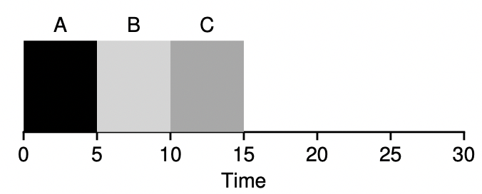

예를 들어 거의 동시에 어떠한 작업들이 도착했고, 작업들의 작업시간이 같다면.. 약간 늦게 도착한 작업들은 그냥 하염없이 기다려야한다.

=> 불공평함! (unfair)

또, 하나의 문제는 역시나 작업의 시간을 어떻게 예측할 것인가?

### RR

Round Robbin ( 라운드 로빈 ) 방식은 각 작업들을 일정시간 실행하고 다른 작업을 실행하는 방식.

타임 슬라이스 혹은 타임 퀀텀이라는 단위로 반복적으로 여러 작업을 돌아가면서 실행.

중요한건 타임 슬라이스가 타이머 인터럽트의 배수로 정해져있어야 나중에 OS에서 인터럽트를 통해 제어권을 가져와서 Context Switching이 가능.

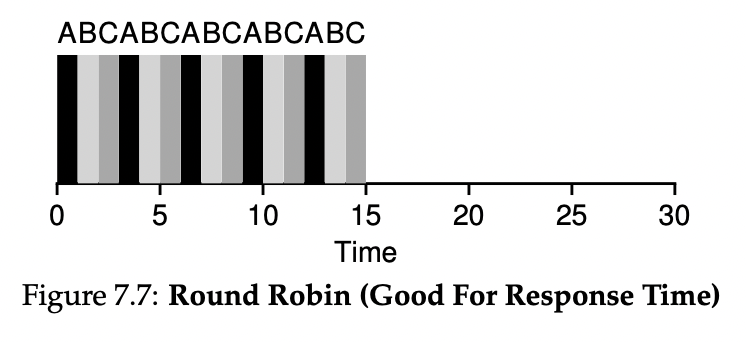

rr은 위 처럼 보면 공평해 보임. 하지만, 문제는 각 작업들이 시작하고 끝나는 시간을 평균을 내서 계산을 해보면 작업들이 평균적으로 늦게 끝난다는 단점이 있음.

=> SJF, STCF는 반환시간 ( 끝나는 시간 - 작업 도착 시간 ) 의 평균을 최적화하지만, 응답 시간 ( 작업이 실제로 스케줄링 되는 시간 - 작업 도착 시간 )의 평균이 좋지 않음.
=> RR은 반대.

즉, 항상 트레이드 오프는 있다. 적절한 것을 적절한 때에 사용하는 것이 좋음.

### 번외 ( I/O )

I/O 작업이 섞인 ( 중간에 CPU를 사용하지 않는 ) 작업이 있을 때는 어떻게 할까?

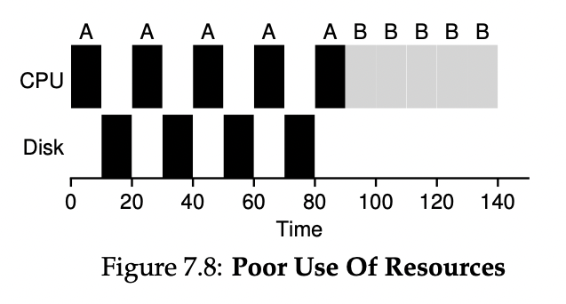
위와 같이 그냥 A가 CPU를 놓는동안 내버려두면 너무 CPU가 idle해짐.

자원이 낭비!

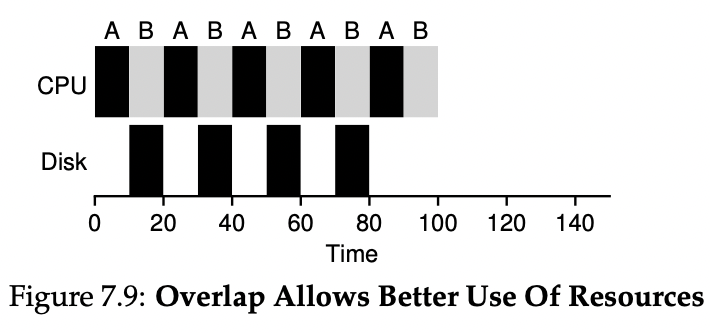

그래서 보통 위와 같이 한 프로세스가 놓고 있는 동안 다른 프로세스가 사용할 수 있도록 작업을 배정.

### MLFQ

MLFQ는 말 그대로 여러개의 우선순위를 가진 스케줄링 큐를 통해 작업을 실행하는 스케줄링 기법.

Multi-Level Feedback Queue는 아래의 두가지 문제를 해결하려고 사용.

- 짧은 작업을 먼저 실행시켜 반환 시간을 최적화.
- 대화형 사용자에게 응답이 빠른 시스템이라는 느낌을 주고 싶기에, 응답시간을 최적화.

#### MLFQ : 기본 규칙
MLFQ는 기본적으로 여러개의 큐로 구성되며, 각각 다른 우선 순위가 배정된다.

Ready 상태인 프로세스들은 모두 어떤 큐에 존재하며, MLFQ는 이 큐에 있는 프로세스를 어떠한 규칙에 맞춰서 실행시킨다.

이 규칙은 기본적으로 두 가지.

- 규칙 1 : 우선 순위가 높은 큐에 존재하는 프로세스들이 먼저 실행.

- 규칙 2: 작업들이 같은 우선 순위를 가진다면 RR을 사용하여 실행.

그런데, 이 규칙만을 사용하면 문제가 생김.

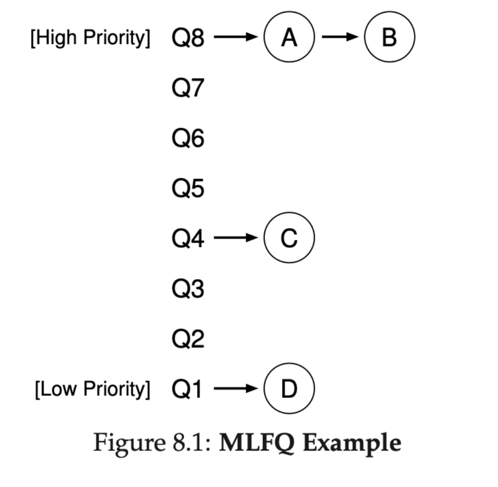

이러한 MLFQ에 프로세스들이 존재한다고 할 때, 규칙 1과 2에 따르면 C는 A와 B가 끝날 때까지 실행되지 않으며 D는 A,B,C가 끝날 때까지 실행되지 않음.

A와 B가 오랫동안 실행되면, C와 D의 응답시간이 좋지 않게 됨.

**시도 1 : 우선순위를 변경해주기**

우리는 위 문제를 해결하기위해 우선 순위를 변경하는 방법을 정해야 함.

다음과 같은 규칙을 사용.

규칙 3 : 작업이 시스템에 진입하면, 가장 높은 우선순위 즉 맨 위의 큐에 놓여진다.

규칙 4a : 각각의 큐는 타임슬라이스가 존재하며 주어진 타임 슬라이스를 모두 사용하면, 우선순위가 낮아진다. 즉 한 단계 아래 큐로 이동한다.

규칙 4b : 타임 슬라이스를 소진하기 전에 CPU를 양도하면 ( I/O 작업을 한다거나.. ) 같은 우선순위를 유지한다.

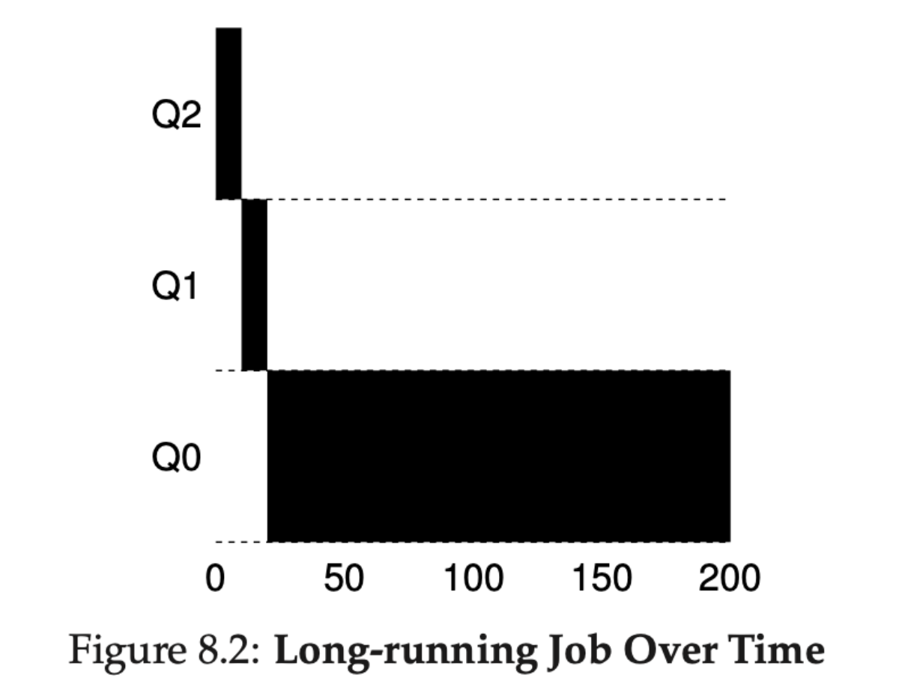

위 예시는 아래와 같은 방식으로 동작.

1. 작업은 일단 Q2에 도착하고 10초간의 실행.
2. 그 후 타임슬라이스를 소진했으니, Q1으로 이동하고 타임슬라이스를 소진하는 동안 실행.
3. 마지막으로 가장 우선순위가 낮은 Q0로 이동하고 이후 계속 Q0에 계속 머무르게 됨.

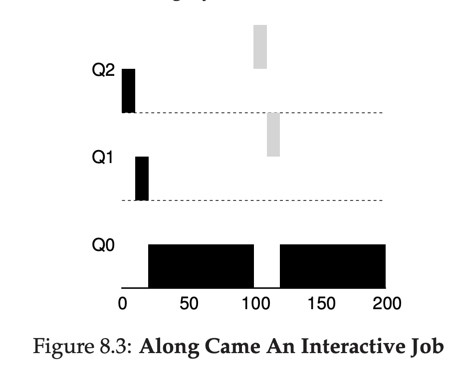

검은색 작업( A )와 회색 작업( B )가 스케줄러에 있다고 가정.

1. A는 스케줄러에 도착한 후 Q2 → Q1 → Q0로 순차적으로 우선순위가 낮아지면서 작업을 수행.
2. 그러던 도중에 B가 스케줄러에 도착하고, 규칙에 따라 Q2에 놓여지고 A를 멈추고 B를 수행.
3. Q2에서 타임슬라이스를 마친 B는, Q1으로 이동하고 아직도 A보다 우선순위가 높기 때문에 계속 실행.
4. Q1에서 작업을 마친 B는 종료되며, A는 Q0에서 재개.
   
이를 통해 알 수 있는 MLFQ의 특징

1. 작업이 짧은 작업인지, 긴 작업인지 알수 없기 때문에 일단 짧은 작업이라 가정하여 높은 우선순위를 부여.
2. 진짜 짧은 작업이라면 빨리 실행되고 바로 종료.
3. 짧은 작업이 아니라면 천천히 아래 큐로 이동하게 되고 스스로 긴 배치형 작업이라는 것을 증명.

I/O 처리는 어떻게 할까?

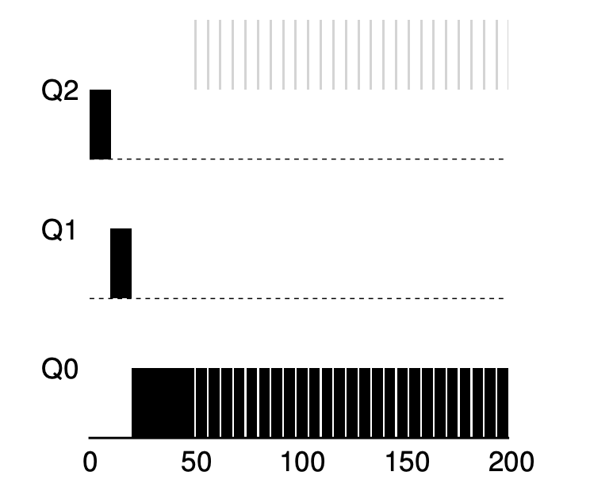

검은색 작업( A )와 회색 작업( B )가 스케줄러에 있다고 가정.

1. A는 스케줄러에 도착한 후 Q2 → Q1 → Q0로 순차적으로 우선순위가 낮아지면서 작업을 수행.
2. 그러던 도중에 B가 스케줄러에 도착하고, 규칙에 따라 Q2에 놓여지고 A를 멈추고 B를 수행.
3. B는 타임슬라이스가 소진되기전에, I/O 작업을 실행하며 그렇기에 우선순위를 유지.
4. A는 B가 I/O 작업을 진행하는 동안 작업을 수행.

=> B는 응답시간이 빠르게 진행되고, A는 반환시간이 적당히 빠르게 유지.

잘 되는 것 같다.

**하지만 여기서 문제점이 아직도 존재.**

- 기아 상태(starvation)가 발생가능.
  - 시스템에 너무 많은 대화형 작업이 존재하면 그것들이 모든 CPU 시간을 소모. 따라서 긴 실행 시간 작업은 그 작업들이 끝날때까지 CPU 시간을 할당 받지 못할 것임.
- 스케줄러를 속이기위해, 계속 우선순위를 높이는 프로그램이 존재할 수 있음.
  - 타임 슬라이스가 10초로 정해져있는 스케줄러에서, 9.9초 동안 수행하고 I/O 작업을 발생시킨다고 가정. 그럼 스케줄러의 규칙에 따라 계속 높은 우선순위를 유지하고 얘가 독점할 수도 있음.
- 프로그램이 수행되는 동안 특성이 변할 수도 있음
  - 초반에는 CPU만 오래 쓰는 작업인줄알고 계속 우선순위를 낮추었는데, 후반에는 I/O 및 대화형 작업을 하는 작업이면 다른 대화형 작업과 달리 빠른 반응속도를 유지할 수 없음.

**시도 2 : 우선순위의 상향 조정 ( Priority Boost )**
위의 문제를 해결하기위해 우리는 규칙을 하나 새로 정의.

규칙 5 : 일정 기간 S가 지나면, 시스템의 모든 작업을 다시 최상위 큐로 이동

새 규칙은 두 가지 문제를 한 번에 해결.

1. 프로세스가 굶어죽지 않는다는 것을 보장.
   - 최상위 큐로 돌아오는 순간 RR을 통해 타임 슬라이스동안 CPU를 사용할 수 있게 됨.
2. CPU의 위주 작업이 대화형 작업으로 변했을 때, 우선순위 상향을 통해 스케줄러가 변경된 특성에 적합한 스케줄링 방법을 진행.

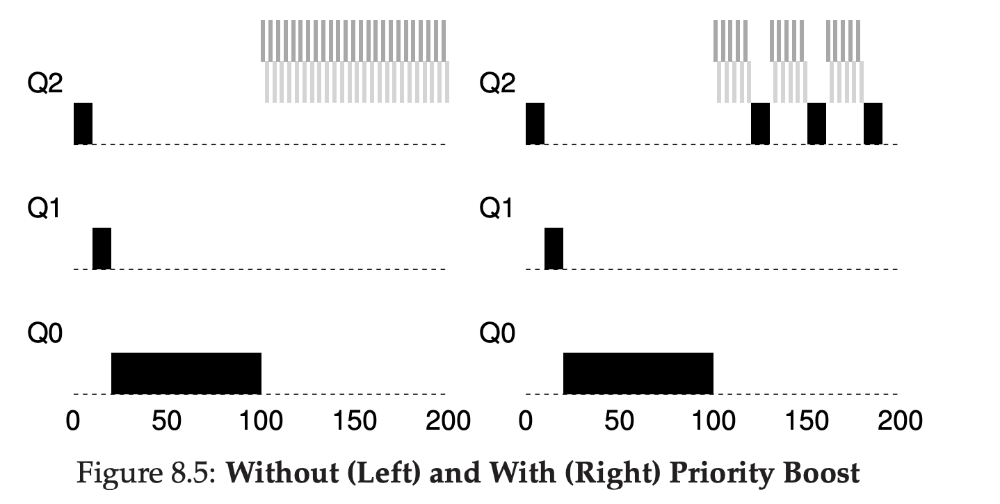

위 그림 왼쪽은 Priority Boost를 적용하지 않은 스케줄러, 오른쪽은 적용한 스케줄러.

적당히 봐도 중간 중간에 검은색 작업이 최상위 큐로 올라와서 다시 작업을 진행하게 되어, starvation을 발생시키지 않음.

**시도 3 : 더 나은 시간 측정**

현재는 각 작업이 실행되고 타임 퀀텀이 다시 배정되기 때문에 9.9초를 실행하는 악질의 프로세스를 방지시킬 수 없음.

규칙 4를 새로 정의해야 함.

규칙 4 : 주어진 단계에서 시간 할당량을 소진하면 ( CPU를 몇 번 양도하던 상관없이 ), 우선 순위는 낮아진다.

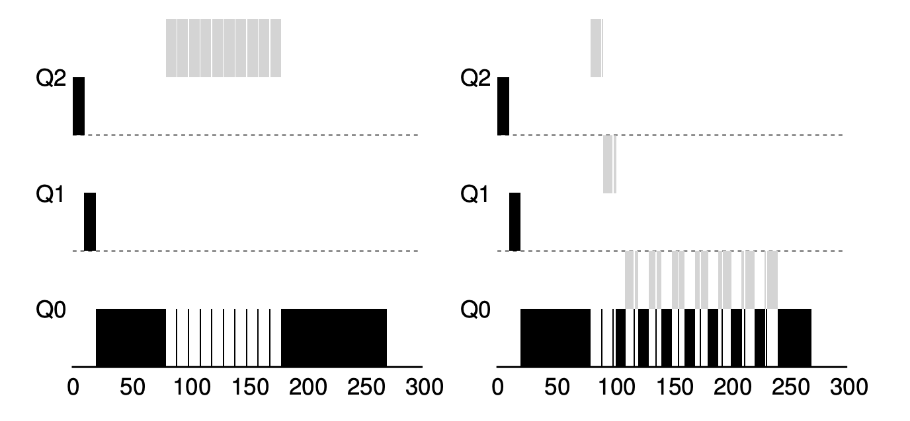
이를 통해 각 작업은 악용을해도, 위와 같이 결국 언젠가는 큐 아래로 내려가게 됨.

#### 규칙 요약 및 MLFQ 특징.

- 규칙 1 : 우선 순위가 높은 큐에 존재하는 프로세스들이 먼저 실행됩니다.
- 규칙 2: 작업들이 같은 우선 순위를 가진다면 RR을 사용하여 실행합니다.
- 규칙 3 : 작업이 시스템에 진입하면, 가장 높은 우선순위 즉 맨 위의 큐에 놓여진다.
- 규칙 4 : 주어진 단계에서 시간 할당량을 소진하면 ( CPU를 몇 번 양도하던 상관없이 ), 우선 순위는 낮아진다.
- 규칙 5 : 일정 기간 S가 지나면, 시스템의 모든 작업을 다시 최상위 큐로 이동시킵니다.

특징
- 멀티 레벨 큐를 가지고 있음.
- 작업의 우선순위를 정하기 위해 피드백을 사용. ( 과거에 보여준 행동이 우선순위를 정하는 지침. )
  - SJF, STCF에서 봤던 것 처럼 미래를 예측하지 안하고 피드백을 통해 개선.
  - CPU를 오래 점유하는 것들은 우선순위가 꾸준히 낮아지는 그러한 것.
 

### 공정 배분 스케줄러

추첨 스케줄러와 같은 방식이 있음. 작업마다 어느정도의 티켓을 주고 그 티켓의 우선순위에 따라 실행하는 방식.

잘 소개하지않는 스케줄러의 방식이므로, 궁금하면 아래의 링크 참조.

[스케줄링: 비례 배분](https://velog.io/@kshired/OSTEP-%EC%8A%A4%EC%BC%80%EC%A5%B4%EB%A7%81-%EB%B9%84%EB%A1%80-%EB%B0%B0%EB%B6%84)