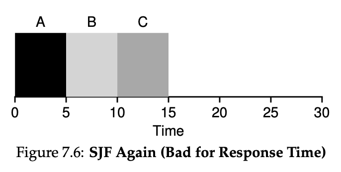

# 운영체제란?

* 컴퓨터 자원을 효율적으로 관리하고, 사용자가 컴퓨터를 편리하고, 효과적으로 사용할 수 있게 해주는 프로그램들의 모임. 운영체제는 컴퓨터 사용자와 컴퓨터 하드웨어 간의 인터페이스로서 동작하는 시스템 소프트웨어의 일종으로, 다른 응용프로그램이 유용한 작업을 할 수 있도록 환경을 제공해 줍니다.

## 운영체제의 성능

* 처리능력(Throughput)	 

    일정 시간 내에 시스템이 처리하는 일의 양

* 반환시간(Turn Around Time)

    시스템에 작업을 의뢰한 시간부터 처리가 완료될 떄까지 걸린 시간

* 사용가능도(Availability)

    시스템을 사용할 필요가 있을 때 즉시 사용 가능한 정도

* 신뢰도(Reliabilty)

    시스템이 주어진 문제를 정확하게 해결하는 정도

# 프로세스 vs 스레드

## 프로세스? 

* 프로세스란 컴퓨터에서 연속적으로 실행되는 컴퓨터 프로그램을 말하는 것이다. 한마디로 프로그램은 코드 덩어리 인데, 그것을 메모리 공간을 할당해서 실행하게 되면 프로세스가 되는 것이다.

컴퓨터에서 프로세스에 할당하는 자원은 다음과 같다.

* cpu시간

* 메모리를 운영하기 위한 메모리 공간

## 스레드

* 이러한 프로세스 주소 공간안에서 메모리를 공유하면서 실행이 되는 여러개의 작업이 스레드이다. 스레드는 프로세스 주소공간에서 코드영역, 데이터 영역, 동적 할당 영역을 공유한다. 

### 장점

* 시스템 자원 소모 감소 (자원의 효율성 증대)

* 시스템 처리량 증가 (처리 비용 감소)

* 스레드 사이의 작업량이 작아 Context Switching이 빠르다.

* 시스템 처리량 증가 (처리 비용 감소)

* 스레드 간 데이터를 주고 받는 것이 간단해지고 시스템 자원 소모가 줄어들게 된다.

## 단점

* 스레드가 잘못되면 다른 스레드에도 피해가 간다(stack 이 넘치면서 다른 스레드도 건드리기 때문)

* race condition이 발생할 우려가 크다.(같은 자원(ex.변수)을 두고 경쟁한다)

# 프로세스 주소 공간

프로세스가 실행될 때 메모리 공간안에서 할당 되어있는 공간일 지칭하는 말이다. 크게 정적 할당영역, 동적 할당 영역 2가지로 나눠진다. 정적 할당영역에는 코드영역, 데이터영역이 있고, 동적 할당 영역에는 스택과 heap 영역이 존재한다.

## 코드 영역

* 말 그대로 프로그램의 코드가 담긴 영역이다. 컴퓨터가 앞으로 실행할 코드들이 담겨 있는 영역이다. 프로그램이 실행되면 변하지 않는 공간이다.

## 데이터 영역

* 프로그램에서 전역변수, 정적변수에 해당하는 데이터가 담기는 공간이다. 

## stack 영역

* 컴파일 타임에 크기가 결정이 된다.

* 함수 내부에서 선언되는 지역변수와 매개변수(파라미터)가 저장되는 공간이다.

* 함수의 호출에 따라서 공간이 커지고, 함수가 반환되면서 공간이 줄어든다.

* stack 포인터를 움직여 주기만 하면 되므로 구현이 쉽고, 속도가 빠르다.

* 크기가 제한이 존재한다. 대표적으로 생기는 현상이 재귀함수를 너무 많이 부르면 터지는 현상인 stack overflow가 존재

* push를 할 때 그림과 같이 메모리 번지가 높은 곳에서 낮은 곳으로 가서 뺄셈을 해줘야 한다. pop을 할 때는 그 반대

## heap 영역

* 런타임에서 사용자에 의해서 크기가 결정된다.

* 사용자가 동적으로 메모리를 할당하고 해제하는것이 가능하다.

* Heap은 메모리의 낮은 번지에서 높은 번지로 할당된다.

* 대신 stack과 다르게 직접 메모리를 할당해줘야 하므로 메모리 할당 속도가 느리다.

# 인터럽트(Interrupt)

CPU가 프로그램을 실행하고 있을 때, 입출력 하드웨어 등의 장치나 예외상황이 발생하여 처리가 필요할 경우에 마이크로프로세서에게 알려 처리할 수 있도록 하는 것을 말한다.
하드웨어 인터럽트와 소프트웨어 인터럽트 2종류가 있다.

## 인터럽트 과정
인터럽트는 다음과 같은 과정을 통해 실행된다.

* 인터럽트 요청

* 프로그램 실행 중단

* 현재까지 실행중이던 프로그램 상태를 보관한다
    
    PCB(Process Control Block), PC(Program Counter)저장

* 인터럽트 백터를 읽고 ISR(Interrupt Serivce Vector)로 점프하여 루틴을 실행한다.

* 인터럽트가 종료된 이후에 원래 실행하던 프로그램의 상태를 복구한 이후에 다시 실행한다.

## 인터럽트 백터 테이블(IVT)

여러 인터럽트에 대해서 해당 인터럽트가 발생하면 처리하는 코드의 주소를 담은 테이블을 의미한다. 운영체제 마다 각자의 인터럽트 백터 테이블이 존재하며 인텔은 IDT라고 하며 cpu의 레지스터에 이 위치를 저장한다. 운영체제가 시작될 때 os는 해당 테이블의 값을 초기화 한다.

## 하드웨어 인터럽트
하드웨어적으로 발생하는 인터럽트로 다음과 같은 종류의 인터럽트가 존재한다. 

* 정전 또는 전원공급 이상
* cpu 혹은 다른 기계장치의 오류
* 타이머 인터럽트
* 하드웨어 입출력 장치

## 소프트웨어 인터럽트
스프트 웨어적으로 발생하는 인터럽트로 트랩이라고도 불리며 다음과 같은 인터럽트가 존재한다.

* 허가 되지 않은 메모리 참조
* 0으로 나누는 경우
* 시스템콜(운영체제만이 수행 할 수 있는 연산을 요구하는 경우)
* page fault

# 시스템 콜(System Call)

소프트웨어 인터럽트 중에서 운영체제에서 작동시키는 인터럽트를 의미한다. 

## Direct execution

프로그램이 실행 될 때 프로세스가 운영체제로 부터 모든 권한을 넘겨 받아서 실행 된다고 가정해보자.

이렇게 실행을 할 때 프로세스가 모든 권할을 맡게 된다면 context switching 이 발생하지 않아서 속도가 빠르다는 장점이 존재하지만,  무한루프 같은 상황이 발생할 때나 컴퓨터에 피해를 주는 연산을 수행할 때 운영체제가 프로세스를 멈추는 방법이 없게 된다.

## Limited Direct Execution

이렇게 프로세스가 모든 권한을 넘겨 받는것을 방지하기 위해서 
컴퓨터는 Limited Direct Execution을 수행하게 된다. 다른 말로 프로세스가 하는 일 중에서 os나 하드웨어를 직접적으로 건드리는 연산은 os가 프로세스를 대신해서 일을 처리를 해주는 것이다. 이 과정에서 프로세스가 os에 신호를 보낼 때가 system call 이라고 한다.

## system call

이렇게 시스템콜이 호출되면 위에서 얘기한 interrupt vector table(결국 시스템콜도 interrupt의 일종이므로)에서 system call에 해당하는 주소를 찾은 이후에 해당 루틴을 실행한다.

# PCB와 Context Switching

xv6의 pcb의 예시다.

## PCB란?
Process Control Block 의 약자로써 운영체제가 프로세스를 제어하기 위해 정보를 저장하는 곳을 가르킨다. 프로세스에 관한 다음과 같은 정보를 담고 있다.

* 프로세스 식별자(Process ID)

* 프로세스 상태(Process State) : 생성(create), 준비(ready), 실행 (running), 대기(waiting), 완료(terminated) 상태가 있습니다.

* 프로그램 계수기(Program Counter) : 프로그램 계수기는 이 프로세스가 다음에 실행할 명령어의 주소를 가리킵니다.

* CPU 레지스터 및 일반 레지스터

* CPU 스케줄링 정보 : 우선 순위, 최종 실행시각, CPU 점유시간 등

* 메모리 관리 정보 : 해당 프로세스의 주소 공간 등

* 프로세스 계정 정보 : 페이지 테이블, 스케줄링 큐 포인터, 소유자, 부모 등

* 입출력 상태 정보 : 프로세스에 할당된 입출력장치 목록, 열린 파일 목록 등

## Context Switching

현재 진행하고 있는 Task(Process, Thread)의 상태를 저장하고 다음 진행할 Task의 상태 값을 읽어 적용하는 과정을 말한다. 이 과정에서 PCB를 활용하여 현재 진행한 task의 상태를 저장한다. 그리고 레지스터에 다음에 실행될 pcb의 값을 불러온다. Context Switching을 빠르게 진행 하므로써 컴퓨터가 멀티테스킹을 하는 것 처럼 보이게 하는 효과가 존재한다.

# IPC(Inter Process Communication)
프로세스간 통신을 의미한다. 통신이 가능하다는 것은 서로 공유하는 메모리가 존재한다는 뜻이다. 스레드와는 달리 서로 다른 프로세스는 서로 다른 메모리 공간을 사용하므로 스레드끼리 통신하는 것 보다 구현이 난이도가 높다.

## IPC의 종류
IPC는 다음과 같은 종류의 IPC가 존재한다.

1. 공유 메모리

    

    메모리에서 한 공간을 정해준 다음에 그 공간을 메게로 데이터를 전달하는 방식이다. 따로 매개를 해줄 필요가 없어서 속도가 빠르지만, 두 프로세스 공간에 있는 메모리가 아니기 때문에 서로 메모리 공간에 변화가 있는지 여부를 확인해주는 기능을 추가로 구현해야한다. 또한 누군가가 메모리를 관리하는 것이 아니기 때문에 메모리가 침범 될 수도 있는 위험이 존재한다.

2. 메시지 전달 기법

    

    프로세스간의 메시지를 통해서 교환한다. 중간에 매게자가 있어서 메시지가 충돌하지 않으나 매게체의 존재로 인해서 속도가 느리다. 종류로는 시그널, 세마포어, 파이프, 소켓이 존재한다.

# CPU 스케쥴링

CPU는 한정된 시간과 메모리를 가지고 어떤 프로세스가 먼저 실행이 될지 생각을 해야한다. 이렇게 응답시간과 처리 시간을 생각해서 스케쥴링을 해야 작업 처리 능력이 올라가게 하기 위해서 스케쥴링을 하는 것이다. 

## 스케쥴링의 평가기준

* Turnaround Time

    task가 처음 시스템에 들어간 이후로 끝날 때 까지 시간을 의한다. 

* Respose Time

    말 그대로 응답시간이라는 의미로 task가 처음 시스템에 들어간 이후로 처음으로 작동 되기 전까지의 시간을 의미한다. 즉 첫 응답까지의 시간이다.

이제 이 두가지 평가 기준으로 프로그램을 평가 하겠다. 

**현재의 가정은 모든 task 는 I/O를 하지 않고 시스템은 해당 task 의 종료 시간을 알고 있다는 가정하에 진행한다.** 

## FIFO

First In, First Out 말 그대로 처음 들어간 task 가 처음 끝나는 방식이다. queue 자료구조를 생각하면 된다. 처음으로 시스템에 들어온 task가 제일 먼저 실행이 되고 끝날 때 까지 실행이 된다. 그러나 끔찍한 turn around time 과 response time을 가지고 있는데 아래의 예시를 참고하자

위의 그림과 같은 경우는 (A, B, C는 동시에 도착했다.)

* A의 turn around time은 10초 response time은 0초이다.
* B의 turn around time은 20초 response time은 10초이다.
* C의 turn around time은 30초 response time은 20초이다.

이런 케이스만 보면 별 이상이 없어 보이나 아래의 케이스에서는 좋지 않은 스케쥴링 방식임이 드러난다.(이전과 같이 task가 동시에 도착했다고 가정한다.)

* A의 turn around time은 100초 response time은 0초이다.
* B의 turn around time은 110초 response time은 100초이다.
* C의 turn around time은 120초 response time은 110초이다.

이런 케이스를 보면 실행시간이 긴 케이스 하나 때문에 다른 케이스들의 turn around time 과 response time이 안 좋아지는 현상이 나타났다. 이렇게 한 프로세스가 오래 실행이 되어서 뒤에오는 process의 turn around time 과 response time에 영향을 주는 현상을 convoy effect라고 한다.

## SJF (Shortest Job First)

이러한 convoy effect 를 해결하는 방법으로 수행시간이 짧은 task 부터 실행하려한다. shortest job first 실행 할 때 당시에 도착한 task 중에서 시간이 제일 짧은 케이스를 실행시킨다. (7.3에서 task 는 0초에 동시에 도착했다고 가정한다.)

* A의 turnaround time 은 120초 response time은 20초이다.
* B의 turnaround time 은 10초 response time은 0초이다.
* C의 turnaround time 은 20초 response time은 10초이다.

이렇게 그림 7.2 에서 나온 케이스는 해결이 되었으나 7.4 같은 케이스면 아래와 같이 문제가 생긴다.

A만 0초에 도착하고 나머지 task는 10초에 도착했다.

* A의 turnaround time 은 100초 response time은 0초이다.
* B의 turnaround time 은 100초 response time은 90초이다.
* C의 turnaround time 은 110초 response time은 100초이다.

convoy effect를 막으려고 했지만 해당 케이스같이 시간이 오래 걸리는 작업이 먼저 도착하면 막을 수 없다.

## STCF (Shortest Time-to-Completion First)

이러한 경우를 해결하기 위해서 shortest to completion first. 즉 수행 시간이 짧은 케이스와 종료 시간이 짧은 task를 우선적을 실행하는 개념이 나온다. 위의 스케쥴링과 차이점이라면 먼저 실행되는 작업이 있더라도 새로운 작업이 현재 실행되는 작업보다 먼저 끝나게 된다면 현재 작업을 중단하고 새로운 작업을 먼저 실행하는 차이점이 있다.

7.5의 케이스는 아까전의 7.4의 경우와 같이 A는 0초 B, C는 둘다 10초에 도착을 하는 경우를 나타냈다.

* A의 turnaround time 은 120초 response time은 0초이다.
* B의 turnaround time 은 10초 response time은 0초이다.
* C의 turnaround time 은 20초 response time은 10초이다.

이렇게 하면 아까전과는 다르게 turn around 타임이 전체적으로 줄어든 것을 알 수 있다. 또한 response time도 개선 되었다.

## RR

위의 스케쥴링 방법들은 모두 turn around time 을 개선하기 위해서 스케쥴링을 개선했다. 하지만 요즘 컴퓨터에서는 여러가지 작업을 실행하는 이유 때문에, 처음 task를 받고 처음으로 실행하는 시간인 response time도 중요하다. 만약 STCF 의 케이스가 아래와 같이 실행된다고 가정하자 

A B C 는 모두 0초에 도착했다고 가정한다.

A 의 response time 은 0초이고 B의 response time 은 5초이고 C의 response time은 10초이다. 여기서 문제인 것은 만약에 컴퓨터를 실행하는데 A의 실행 총 시간이 5초라고 해서 5초 동안 실행 시키게 되면 B와 C는 응답시간이 5초와 10초가 된다. 만약에 B와 C가 키보드나 마우스 입력이라면 컴퓨터를 지금과 같이 사용이 안되므로 다른 방법이 필요하다.

이러한 response time을 개선하기 위해서 나온게 round robin이다. 

위의 stcf 와는 다르게 특정 단위로 시간을 쪼개서 A B C를 해당되는 시간 만큼만 실행시켜주는 방식이다. 

* A의 response time 은 0초 turn around time 은 13초
* B의 response time 은 1초 turn around time 은 14초
* C의 response time 은 2초 turn around time 은 15초 이다.

이전 보다는 turn around time 이 악화 되었으나 response time 이 좋아졌다. 

위의 방법들의 문제가 존재하는데, 바로 I/O작업이 발생하지 않는다고 가정을 하고 task를 설계하였다는 점이다.

위와 같이 I/O가 발생한 시점에서 I/O가 종료 될 때 까지 CPU를 그대로 놔두게 된다면 자원의 낭비가 심하므로

7.9의 그림과 같이 A의 I/O를 수행하는 동안은 B를 스케쥴에 포함 시켜서 작업을 수행한다. 그렇게 되면 더 짧은 시간에 두 작업을 완료하는 것이 가능하다.

## MLFQ

위의 Round Robin 방식은 response time 은 좋으나 turn around time 은 끔찍하다는 단점을 지녔다. 이것을 어느정도 해소하기 위해서 MLFQ즉 Multilevel Feedback Queue를 사용해서 스케쥴링을 진행한다.

MLFQ는 다음과 같은 특징이 존재한다. 

1. 여러 층의 queue 를 가지고 있다.
2. 각각의 queue는 우선순위가 존재한다.
3. 같은 층의 task는 round robin으로 작동하고 다른 층의 task는 층의 우선순위로 작동한다.

처음으로는 1 , 2, 3 번을 단순하게 따른 mlfq를 제현해 보겠다. 이 때 task 중에 I/O를 많이 쓰는 interactive task는 우선순위가 높게 지정된다. 

이렇게 되면 문제점이 A와 B가 interactive 하나 총 cpu 시간을 많이 잡아먹게 된다면 아래에 있는 C와 D는 실행이 되지 않는다는 문제점이 존재한다. 이렇게 우선순위가 낮은 task가 cpu시간을 할당 받지 못하는 것을 starvation 이라고 부른다.

위의 starvation 을 막기위해서 새로운 규칙을 추가한다. 

1. 새로운 task가 시스템에 들어오면 가장 높은 우선순위를 부여한다.

2. task가 주어진 slice 를 모두 사용하면 우선순위를 감소 시킨다. 

3. task 가 주어진 slice를 모두 사용하기 전에 작업이 종료 된다면 우선순위를 유지한다.

그림 8.2, 8.3 같이 작업 시간이 오래될 수록 우선순위가 감소하는 것으로 보아 starvation 문제가 해결 된거 같아 보인다.

그러나 그림 8.5의 사례를 보자 B가 지속적으로 I/O를 불러서 우선순위에서 내려오지 않고 있다. 만약에 time slice가 10초인데 9.9초에 계속 I/O를 발생시키면 우선순위가 유지가 된다. 이를 악용해 스케쥴러를 속이는 것을 gaming이라고 표현한다.

이를 막기위해 새로운 규칙을 부여한다.

* 시스템에 들어온 일정 시간이 지나면 모든 작업이 우선순위가 가장 높게 이동한다. 

이렇게 하면 아까전에 발생했던 starvation 문제는 해결이 되는거 같다. 하지만 여전히 B와 C는 우선순위가 감소 하지 않는 문제점이 존재한다.

이러한 상황을 해결해주기 위해 위에서 정의한 규칙을 바꾼다.

* time slice와 상관없이 task가 queue에서 정해진 시간을 다 쓰면 우선순위에서 내려온다. 이렇게 하면 time slice 전에 끊어서 우선순위에서 내려오지 않는 꼼수를 쓸 수가 없게 된다. 무조건 해당 시간을 보내면 queue에서 그림 8.6같이 우선 순위에서 내려오게된다.