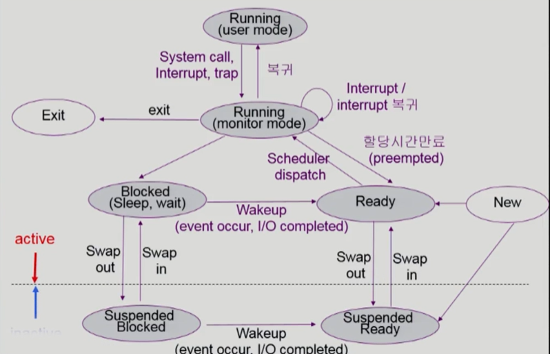

## 운영체제 목차

1. 운영체제란
2. 프로세스 vs 스레드
3. 프로세스 주소 공간
4. 인터럽트(Interrupt)
5. 시스템 콜(System Call)
6. PCB와 Context Switching
7. IPC(Inter Process Communication)
8. CPU 스케줄링

----------

# 01. 운영체제란?

CPU, 메모리, I/O 장치 등의 하드웨어 자원을 효율적으로 관리하고, 응용 프로그램과 하드웨어 사이에 인터페이스 역할을 하며, 시스템 동작을 제어하는 시스템 소프트웨어이다. 운영체제는 효율적 측면에서 주어진 자원으로 최대한의 성능을 낼 수 있도록 하는 동시에 형평성 측면에서특정 사용자나 프로그램이 지나치게 불이익 받지 않도록 해준다.

- 프로세스 관리 : 스케쥴링, IPC 통신
- 저장장치 관리 : 메모리 관리, 가상메모리, 파일 시스템
- 네트워킹 : TCP/IP , 기타 프로토콜
- 사용자 관리 : 계정관리 , 접근권한 관리
- 디바이스 드라이버 : 순차접근, 임의접근, 네트워크 장치

# 02. 프로세스 vs 스레드

프로세스는 실행 중인 프로그램을 말하며 현대 컴퓨팅 시스템에서 작업의 단위이다.  

* 여기서, 프로그램과 프로세스의 차이를 간단히 살펴보면 다음과 같다.
* 프로그램은 명령어 리스트 내용이 디스크에 저장된 파일을 말하고,
* 프로세스는 실행파일이 메모리에 적재되어 실행되는 것을 말한다.

 보통 프로그램이 실행되면 가상 메모리 영역을 통해 독자적인 주소 공간이 만들어지고 물리적 메모리 공간에 코드, 데이터, 힙, 스택이 메모리 영역에 올라가게 된다. 또한 PCB라는 블록을 생성한다.

* OS 커널도 일종의 프로그램이기 때문에 메모리에 상주해있다.
* OS 커널의 data 영역에는 모든 하드웨어, 프로세스를 관리하기 위한 자료구조를 가지고 있는데 여기 프로세스를 관리하기 위한 자료구조를 PCB라고 한다.

### 프로세스와 스레드

프로세스는 메모리 상에서 실행중인 작업을 의미하고, 스레드는 프로세스 안에서 실행되는 여러 흐름의 단위를 말한다.

프로세스는 별도의 주소 공간(스택, 데이터, 코드, 힙)을 할당받지만 스레드는 지역변수, 매개변수 등 임시 메모리 영역인 **stack을 할당**받고 나머지 영역(code, data, heap)은 공유한다.

- 스택을 독립적으로 할당하는 이유는 함수 호출시 전달되는 인자, 지역변수 등을 저장하기 위해서이며, 스택이 독립적이기 때문에 독립적인 함수 호출이 가능하다. 

  

웹 브라우저를 각각 사이트를 띄었을 때 똑같은 프로그램이기 때문에 code는 같을 수 있다. 단, code에서 어느 부분을 실행하는가만 다르다. 그렇기 때문에 프로세스를 여러개 이것은 비효율적이다. 

* 그러나 항상 멀티 프로세스보다 멀티스레드가 좋은 것은 아니다. 왜냐하면 멀티스레드의 경우 한 스레드의 문제가 발생하게 되면 다른 스레드에도 영향일 미치기 때문이다.
* 크롬의 경우에도 웹 브라우저 각각 사이트를 스레드로 사용하게 되면 보안성의 문제가 발생할 수 있기 때문에 창을 따로하면 각자의 프로세스로 관리한다.

#### 멀티스레드

- 하나의 프로세스 내에서 둘 이상의 스레드가 동시에 작업을 수행하는 것을 말한다. 공유 메모리를 사용하여 시간 자원 손실이 감소하고 전역변수와 정적 변수에 대한 자료 공유가 가능하다. 

- 하지만 동일 변수가 여러명이 접근시 발생하는 동기화의 문제가 발생합니다. 이런 문제는 크리티컬 섹션 기법을 통해 대비할 수 있습니다.

  **단점 : **

  - 단일 프로세스 시스템의 경우 효과 기대 어렵
  - 다른 프로세스에서 스레드를 제어할 수 없다
  - 하나의 스레드에 문제 발생시 전체 프로세스 영향

  **장점 : **

  * 스레드는 하나의 프로세스에 stack의 공간만 별도로 갖고 또한 PCB에서 PC값만 스레드별로 관리하면 되기 때문에 context switch보다 CPU가 스레드A에서 B로 넘어가는 것이 효율적으로 수행 가능하다. 즉, 비싼 오버헤드가 발생하지 않는다.

  - 시스템 처리량 증가 
    - 스레드 간 데이터를 주고 받는 것이 가능해져 자원 소모가 줄어든다.
  - 프로세스 통신보다 스레드간의 통신 부담 적다.
    - stack 제외한 모든 메모리를 공유하기 때문에 통신 부담이 적다. 
  - 프로세스 단일 스레드의 경우 I/O 발생시 CPU를 빼앗긴다. 하지만 멀티스레드인 경우 하나의 서버 스레드가 blocked 상태인 동안에도 동일한 태스크 내의 다른 스레드가 실행되어 빠른 처리를 할 수 있다.
    - 예 : http 문서를 보여주는 과정에서 text 외의 이미지가 있을 경우, 네트워크를 통해 이미지를 읽어오는 I/O과정에서 프로세스를 Blocked하지 않고 다른 스레드는 text를 읽어 표시해주면 응답성이 빨리진다.

# 03. 프로세스 주소 공간

- 코드 : 프로세스가 실행할 코드와 매크로 상수가 기계어로 저장된 공간이다. 컴파일 타임에 결정되고 중간에 코드를 바꿀 수 없게 read-only로 되어있다.
- data : 전역변수, static 변수, 배열 저장 / 전역변수, static 값을 참조한 코드는 컴파일하고나면 data 영역의 주소값을 가르키도록 바뀐다. 실행중에도 전역변수가 변경될 수 있으니 이 영역은 read-write로 지정
- heap : 프로그래머들이 필요할 때마다 사용하는 메모리 영역이다. 동적할당시 사용 , 런타임이 결정되고 사용한 뒤에는 반드시 메모리 해제를 해야한다. 그렇지 않으면 메모리 누수가 발생한다. 
- stack : 지역변수, 매개변수, 리턴 값 등을 저장하고 종료되면 제거한다. 기록하고 종료하는 메커니즘은 후위선출 방식이다.

# 04. 인터럽트

프로그램을 실행하는 도중에 예기치 않은 상황이 발생할 경우, 현재 실행중인 작업을 즉시 중단하고 발생된 상황에 대해 CPU에게 알리고 CPU제어권이 OS에게 넘어가게 된다.

* CPU에는 Interrupt line 이 존재하는데 **interrupt가 발생하면 CPU가 사용자 모드에서 OS로 넘어가게 된다.**

#### 하드웨어 인터럽트(interrupt)

* 하드웨어가 발생시킨 인터럽트이다.
* 예를들어, timer는 CPU 독점을 막기위해 부가적으로 도입된 하드웨어로 일정 시간이 흐른 뒤 다시 OS가 CPU를 점유하도록 한다.

#### 소프트웨어 인터럽트(Trap) 

* 넓은 의미의 인터럽트이며, 소프트웨어 인터럽트를 Trap이라고 부른다.
* 보통 Exception이나 System call에 의해 발생되는 인터럽트이다.
* 예1 : CPU에는 OS가 사용하는지 혹은 사용자 프로그램이 실행되는지를 판단할 수 있는 mode bit가 존재한다. mode bit가 1이면 사용자 프로그램이 CPU를 사용하는 것으로 보안을 해칠 수 있는 명령어 (eg. 특권명령)은 사용할 수  없다. 만약 권한 없는 명령어를 수행하게 되면 interrupt가 발생하고 이것을 소프트웨어 인터럽트라고 한다.
* 예2 : 사용자 프로그램A가 파일을 읽어와야 하는 경우 사용자 프로그램은 파일을 읽을 수 있는 권한이 없기 때문에 시스템 콜을 통해서 CPU를 OS에게 넘겨주고 OS는 CPU를 가지고 device controller에게 명령을 내리도록 한다.

#### 인터럽트와 폴링방식

MCU 자체가 하드웨어적으로 변화를 체크하고 변화 시에만 일정한 동작을 하는 방식인 인터럽트 방식과 명령어를 사용해 입력 핀의 값을 계속 읽어 변화를 알아내는 폴링 방식이 있다. 

* 폴링하는 시간에는 하던 일을 집중할 수 없으므로 많은 기능을 제대로 수행하지 못한다.

- 인터럽트 방식은 하드웨어를 지원받아야하는 제약이 있지만 실시간 대응이 필요한 경우 필수적인 기능이다.

#### 인터럽트 동작 순서 

1. 인터럽트 요청
2. 프로그램 실행 중단 : 현재 실행중인 micro operation까지 수행
3. 현재 프로그램 상태 보존 : PCB, PC
4. 인터럽트 처리 루틴 실행 : 인터럽트 요청한 장치를 식별
5. 인터럽트 서비스 루틴 실행 : 

- 인터럽트 원인 파악하고 실질적 작업 수행
- 서비스 루틴 중 우선순위가 높은 인터럽트 발생시 재귀적으로 1-5 수행
- 인터럽트 서비스 루틴을 실행할 때 인터럽트 플래그를 0으로 하면 인터럽트 발생 방지 할 수 있다.

6. 상태 복구 : 인터럽트 발생시 저장해둔 PC를 다시 복구
7. 중단된 프로그램 실행 : PCB 값을 이용해 이전에 수행중이던 프로그램 재개

# 05. 시스템 콜

* 운영체제는 **커널 모드(Kernel Mode)**와 **사용자 모드(User Mode)**로 나뉘어 구동
* 운영체제에서 프로그램이 구동되는데 있어 파일을 읽어 오거나, 파일을 쓰거나, 혹은 화면에 메시지를 출력하는 등 많은 부분이 커널 모드를 사용한다.
* 시스템 콜은 이러한 커널 영역의 기능을 사용자 모드가 사용 가능하도록, 즉 프로세스가 하드웨어에 직접 접근해서 필요한 기능을 사용할 수 있게 해준다.
* 시스템 콜의 유형
  * 프로세스 제어
  * 파일 조작 : 파일 생성, 삭제, 열기, 닫기, 쓰기 등등
  * 장치 관리 : 장치를 요구, 방출, 읽기, 쓰기 위치 변경, 장치 속성 설정 등
  * 정보 유지 : 시간과 날짜 설정과 획득, 시스템 데이터 설정과 획득 등
  * 통신 : 통신 연결 생성, 제거, 메세지 송수신, 상태 정보 전달 등

# 06. PCB와 Context Switching

앞서 잠깐 언급했듯이 프로세스를 관리하기 위한 자료구조를 Process Control Block (PCB)라고 한다.

CPU가 프로세스가 여러 개일 때, CPU 스케줄링을 통해 관리하는데 이때, CPU는 각 프로세스들이 누군지 알아야 관리가 가능하다. 이러한 프로세스들의 특징을 갖고 있는 것이 바로 **Process Metadata**이고 PCB에 저장한다.

### Process Control Block

* 프로세스 상태 : new, ready, running, waiting, halted 등
* 프로세스 ID : PID라고 하며, 프로세스 고유 식별 번호
* 프로세스 카운터 : 다음 실행할 명령어의 주소를 가르킴
* CPU 레지스터들 : 컴퓨터 구조에 따라 다양한 수와 유형을 가진다. accumulator, 인덱스 레지스터, 스택 레지스터 그리고 범용 레지스터들과 상태 코드 정보가 포함
* CPU 스케쥴링 정보 : 프로세스 우선순위, 스케줄 큐에 대한 포인터와 다른 스케줄 매개변수를 포함한다.

- 계정 정보 : CPU 사용시간의 정보, 각종 스케쥴러의 필요 정보를 기억
- 기억 장치 관리 정보 : 프로그램이 적재될 기억 장치의 상한치, 하한치, 페이지 테이블 등의 정보를 기억
- 입출력 정보 : 프로세스 수행시 필요한 주변장치, 파일 정보 기억

#### 프로세스 상태

Ready

* CPU를 기다리고 상태를 말하며. 메모리 등 다른 조건을 모두 만족한 상태이다.

Running

* CPU를 잡고 instruction을 수행중인 상태이다.
* user mode : 사용자 프로세스 A의 직접 코드를 실행
* monitor mode : System call 등을 통해 kernel code를 수행중이지만 A프로세스는 여전히 Running 상태로 간주, 그대신 monitor mode라고 한다.
  * 여기서 monitor mode의 Running이 커널의 상태를 표시하는 것은 아니다.

Blocked (Wait, Sleep)

* CPU를 주어도 당장 instruction을 수행할 수 없는 상태 즉, 공유데이터를 기다리는 경우이거나
* Process 자신이 요청한 event(예 : I/O)가 즉시 만족되지 않아 기다리는 상태 즉, 디스크에서 파일을 읽어와야하는 경우이다.

Suspended (Stopped)

* 외부적인 이유로 프로세스의 수행이 정지된 상태로 프로세스는 통째로 swap out 된다. 
  * 메모리의 경합이 심해서 프로세스를 쫓아내는 경우(중기 스케줄러에 의해)
  * 유저가 강제로 정지시키는 경우(break key)

> Blocked : 자신이 요청한 event가 만족되면 Ready 상태가 되지만
>
> Suspended : 외부에서 resume해 주어야 Active 된다.

#### Context Switching

CPU를 한 프로세스에서 다른 프로세스로 넘겨는 과정을 말한다. 즉, 사용자 프로세스 A로부터 B로 넘어갈 때 context switching이라고 한다. 

하지만, **사용자 프로세스 A에서 커널로 넘어가는 과정은 문맥교환이라고 하지 않는다.**

이때 프로세스의 상태의 정보를 저장하고 복원하는 과정 즉,다음 프로세스로 넘어가기 이전에 프로세스 PCB정보를 **레지스터에 적재**한다.

System call이나 interrupt 발생시 반드시 context switch가 발생하는 것은 아니다. 

하지만 1번처럼 문맥교환이 일어나지 않은 경우에도 일부 PCB를 저장해야 한다. 그 이유는 커널도 CPU를 사용하기 때문에 PC 값 등을 저장하지 않으면 다시 프로세스로 돌아갔을 때 어디서 할 수 있는지 알 수 없기 때문이다.

하지만 2번처럼 문맥 교환이 일어났을 때보다 비용이 훨씬 작다.

#### CPU가 다른 프로세스로 넘어갈 때,

* 운영체제는 프로세스 상태를 그 프로세스의 PCB에 저장한다. 
* 운영체제는 새롭게 얻은 프로세스의 상태를 PCB에서 읽어온다.
* PCB는 커널의 data에 저장되어 있다.

#### PCB 관리 방식

* 링크드 리스트 방식으로 관리
* PCB 리스트 헤더에 PCB들이 붙게 되어 주소값으로 연결되어 삽입 삭제가 용이하다.
* 프로세스 생성되면 해당 PCB가 생성되고 프로세스 완료시 제거된다.

 

# 07. IPC(Inter Process Communication)

프로세스는 완전히 독립된 실행 객체이다. 이것은 다른 프로세스의 영향을 받지 않는다는 장점이 있지만, 독립된 만큼 별도의 설비 없이 서로 통신이 어렵다는 단점이 있다. 통신하기 위해서는 커널 영역에서 IPC라는 내부 프로세스간 통신이 가능하다. 

기본적으로 2가지 모델이 있다.

공유메모리 :

* 협력 프로세스들에 의해 공유되는 메모리 영역이 구축된다.
* 공유 메모리 영역을 구축할 때만 시스템 콜이 필요하다. 우선 공유 메모리 영역이 구축되면 모든 접근은 일반적인 메모리 접근으로 취급되어 커널의 도움이 필요없다.

메시지 전달 : 

* 협력 프로세스들 사이에 교환되는 메시지를 통해 이루어진다.
* 충돌을 회피할 필요가 없기 때문에 적은 양의 데이터를 교환하는데 유용하다.
* 시스템 콜을 사용하여 구현됨으로 부가적인 시간 소비 작업이 필요하기 때문에 공유메모리보다 느리다.

#### PIPE 

- 동일한 PPID를 가진 프로세스간 통신 가능 (부모/자식 통신상대가 확실한 경우 사용)
- 한 방향으로 통신하는 반이중 통신, 한쪽은 쓰고 한쪽은 읽을수만 있다.
- 단순한 데이터 흐름을 가진다면 익명의 PIPE를 사용하면 된다. 
- 반이중 통신이기 때문에 읽기와 쓰기 모두 해야한다면 파이프를 두개 만들어야하고 구현이 복잡해질 수 있다.

#### Named PIPE(FIFO)

- 부모 프로세스와 무관하게 전혀 다른 프로세스 사이에서도 통신이 가능하다.

- Pipe name을 아는 모든 프로세스간의 통신이 가능하다.

- Named 파이프도 반이중 통신.

- 호스트 영역의 서버 클라이언트 간에 전이중 통신을 위해서는 결국 PIPE와 같이 두개의 FIFO파일이 필요

  > named pipe가 존재하는 방식 : 리눅스에서 모든 것은 파일로 통한다. named pipe도 파일로 존재한다. pipe 파일이 존재하고, 이 파일의 이름이 pipe name이다. 파일은 시스템 전역적으로 관리하는 객체이기 때문에 이름만 안다면 어떤 프로세스라도 접근 가능하다. 

#### Message Queue

- Queue(큐)는 선입선출의 자료구조를 가지는 통신설비로 커널에서 관리
- 입출력 방식으로는 Named와 동일하지만 메시지 큐는 파이프 처럼 데이터의 흐름이 아니라 **메모리 공간**이다.
- 컨테이너 벨트의 장점처럼 **사용할 데이터에 번호를 붙이면서** 여러 프로세스가 동시에 데이터를 쉽게 다룰 수 있다.

#### 공유메모리

- 데이터를 아예 공유하는 방법이다.
- **Shared Memory**는 **공유메모리가 데이터 자체를 공유하도록** **지원**하는 설비
- 프로세스는 자신만의 메모리 영역을 가지고 있다. 다른 프로세스가 접근하지 못하도록 커널에 의해 보호된다. (다른 프로세스가 메모리 영역을 침범할 경우 SIGSEGV 경고 시그널 발생)
- 공유 메모리는 프로세스간 메모리 영역을 공유해서 사용할 수 있도록 허용한다. 
  - 프로세스가 메모리 할당을 커널에 요청하면 커널은 해당 프로세스에 메모리 공간을 할당
  - 공유메모리는 중개자 없이 곧바로 메모리 접근이 가능하기 때문에 IPC 중 가장 빠르게 작동할 수 있다. 

#### 메모리 맵

- 공유 메모리와 비슷하지만 차이점은 메모리 맵의 경우 **파일을 메모리에 매핑시켜 공유**한다. 
- 파일은 시스템의 전역적인 자원으므로 다른 프로세스끼리 데이터 공유해도 문제가 없을 것으로 예상할 수 있다.

#### 소켓

- Socket은 프로세스와 시스템의 기초적인 부분이며, 프로세스 들 사이의 통신을 가능하게 함
- <sys/socket.h>라는 헤더를 이용하여 사용할 수 있으며, 같은 도메인에서의 경우에서 연결 될 수 있다.
- 소켓을 사용하기 위해서는 생성해주고, 이름을 지정해야 한다.
- 또한 domain과 type, Protocol을 지정해 주어야 한다.
- 서버 단에서는 bind, listen, accept를 해주어 소켓 연결을 위한 준비를 해주어야 하고, 클라이언트 단에서는 connect를 통해 서버에 요청하며, 연결이 수립 된 이후에는 Socket을 send함으로써 데이터를 주고 받게 된다. 연결이 끝난 후에는 반드시 Socket 을 close()한다.

# 08. CPU 스케줄링

CPU를 잘 사용하기 위해 프로세스를 배정하는 역할을 한다.

CPU Scheduler는 Ready 상태의 프로세스 중 CPU를 줄 프로세스 선택하는 역할을 하고 CPU Dispatcher는 실제로 CPU 제어권을 스케쥴러에서 결정된 프로세스에게 넘기는 역할을 한다. (CPU Dispatcher = context switch)

##### 상태 변화

* Running -> Blocked : I/O 요청하는 시스템 콜 (자진 반납 : nonpreemptive)
* Running --> Ready : timer interrupt에 의한 변화 (강제 반납 : preemptive)
* Blocked --> Ready : I/O 완료 후 인터럽트 (강제 반납 : preemptive)
* Terminate (자진 반납 : nonpreemptive)

##### 목표

- batch system : 가능한 많은 일 수행, 시간보다 처리량 중요
- interactive system : 빠른 응답시간, 적은 대기 시간
- real time system : 기한 맞추기

#### FCFS(First Come First Served)

##### 특징

- 먼저 온 고객을 먼저 서비스해주는 방식, 즉 먼저 온 순서대로 처리한다.
- 일단 CPU 를 잡으면 CPU burst 가 완료될 때까지 CPU 를 반환하지 않는다. 할당되었던 CPU 가 반환될 때만 스케줄링이 이루어진다.

##### 문제점

- convoy effect : 소요시간이 긴 프로세스가 먼저 도달하면 나머지의 대기 시간도 그 만큼 길어져 효율성이 낮아진다. 

#### SJF(Shortest - Job - First)

##### 특징

- SJF는 optimal하다. SJF 알고리즘은 최적화 되어있다.
- 주어진 프로세스의 평균 대기 시간이 최소함을 보장한다.

##### 두가지 방식

* Nonpreemptive
  * 일단 CPU를 잡으면, CPU burst가 완료될 때까지 CPU를 선점 당하지 않음
* Preemptive
  * 현재 수행중인 프로세스의 남은 burst time보다 더 짧은 프로세스가 도착하면 CPU를 빼앗길 수 있다. 
  * 이 방법을 Shortest Remaining Time First (SRTF)라고 한다.

##### 문제점

- starvation : 효율성을 추구하는게 가장 중요하지만 특정 프로세스가 지나치게 차별받으면 안된다. 이 스케줄링은 극단적으로 CPU 사용이 짧은 job 을 선호한다. 그래서 사용 시간이 긴 프로세스는 거의 영원히 CPU 를 할당받을 수 없다.
- CPU burst time이 짧은 job이 무엇인지 **추정만** 가능하다. 
  * 과거의 CPU burst time을 이용해서 추정 (exponential averaging)

#### HRN(Highest Response-ratio Next)

- 우선순위를 계산하여 점유불평등을 보완한 방법(SJF 단점 보완)
- 우선순위 = ( 대기시간 + 실행시간 ) / 실행시간

#### SRT(Shortest Remaining time First)

##### 특징

- 새로운 프로세스가 도착할 때마다 새로운 스케줄링이 이루어진다.
- 선점형 (Preemptive) 스케줄링으로 현재 수행중인 프로세스의 남은 burst time 보다 **더 짧은 CPU burst time 을 가지는 새로운 프로세스가 도착하면 CPU 를 뺏긴다**.

##### 문제점

- starvation
- 새로운 프로세스가 도달할 때마다 스케줄링을 다시하기 때문에 CPU burst time(CPU 사용시간)을 측정할 수가 없다.

#### Priority Scheduling

##### 특징

- 우선순위가 가장 높은 프로세스에게 CPU 를 할당하는 스케줄링이다. 우선순위란 정수로 표현하게 되고 작은 숫자가 우선순위가 높다.

##### 두 가지 방식

- 선점형 스케줄링(Preemptive) 방식 - 더 높은 우선순위의 프로세스가 도착하면 실행중인 프로세스를 멈추고 CPU를 넘겨준다. 
- 비선점형 스케줄링(Non-Preemptive) 방식 - 더 높은 우선순위의 프로세스가 도착하면 Ready Queue의 Head 에 넣는다.

##### 문제점

- starvation

##### 해결책

- aging : 시간에 흐름에 따라 자동적으로 우선순위를 높여준다.

#### Round Robin

##### 특징

- 각 프로세스는 동일한 크기의 할당 시간(time quantum)을 갖게 된다. (일반적으로 10-100 milliseconds)
- 할당 시간이 지나면 프로세스는 선점당하고 ready queue 의 제일 뒤에 가서 다시 줄을 선다.
- `RR`은 CPU 사용시간이 랜덤한 프로세스들이 섞여있을 경우에 효율적이다.  (homogenous보다 hetergenous할 때 사용)

##### 성능

* 할당 시간이 길면, FCFS와 같다
* 할당 시간이 짧으면, context swiching 오버헤드가 커진다

##### 장점

- SJF보다는 평균대기시간이 길지만 `Response time`이 더 짧다.
- 응답시간은 상호작용적인 job에서 중요한 역할을 수행한다.
  - 예를 들어, 짜장면 집에서 단무지, 반찬 등을 먼저 주는 역할
- 기다리는 시간이 자신이 사용하는 CPU burst time에 비례한다.
  - 프로세스가 기다리는 시간이 CPU 를 사용할 만큼 증가한다. 공정한 스케줄링이라고 할 수 있다.
- n 개의 프로세스가 ready queue 에 있고 할당시간이 q(time quantum)인 경우 각 프로세스는 q 단위로 CPU 시간의 1/n 을 얻는다. 즉, 어떤 프로세스도 (n-1)q time unit 이상 기다리지 않는다.

#### Multilevel-Queue (다단계 큐)

##### 특징

* Ready queue를 여러 개로 분할한다.
  * foreground (interactive)
    * RR 스케쥴링 알고리즘
  * background (batch - no human interaction)
    * 인간의 작업없이 일괄적으로 쓰는 job
    * FCFS : 긴 작업이기 때문에 context swtich가 일어나는 것이 비효율적이므로 FCFS사용

##### 큐에 대한 스케쥴링

* Fixed priority scheduling
  * foreground의 job이 다 처리된 후 background job 수행
  * starvation
* Time slice
  * 각 큐에 CPU time을 적절한 비율로 할당
  * foreground 80%, background 20%

#### Multilevel-Feedback-Queue (다단계 피드백 큐)

##### 특징

* 프로세스가 다른 큐로 이동이 가능
  * 맨 위의 큐가 우선순위가 가장 높다
* 에이징(aging) 같은 방식으로 구현할 수 있다.

##### Multilevel feedback queue scheduler를 정의하는 파라미터들

* Queue의 수
* 각 큐의 scheduling algorithm
* Process를 상위 큐로 보내는 기준
* Process를 하위 큐로 내쫓는 기준
* 프로세스가 CPU 서비스를 받으러 할 때 들어갈 큐를 결정하는 기준

##### 대표적인 구현의 예

* Three queues
  * Q0 : time quantum 8 milliseconds
  * Q1 : time quantum 16 milliseconds
  * Q3 : FCFS
* Scheduling
  * 새로운 job이 Q0으로 들어간다. 즉, 제일 위에 있는 큐로 들어간다.
  * CPU를 잡아서 할당 시간 8 milliseconds 수행된다. (RR 스케줄링)
  * 8 milliseconds 동안 일을 다 끝내지 못했을 경우 Q1로 내려간다
  * Q1에서 줄서서 기다리다가 CPU를 잡아서 16 ms 동안 수행한다
  * 16ms 동안 끝내지 못했을 경우 Q2로 내려간다.

##### 문제점

- 우선순위가 높은 프로세스가 들어오면 그것만 계속 실행됨. 낮은 순위는 starvation 문제가 발생한다.

##### 해결방안 

* aging 방식 도입

