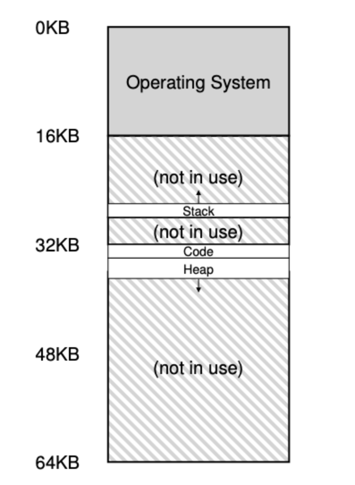
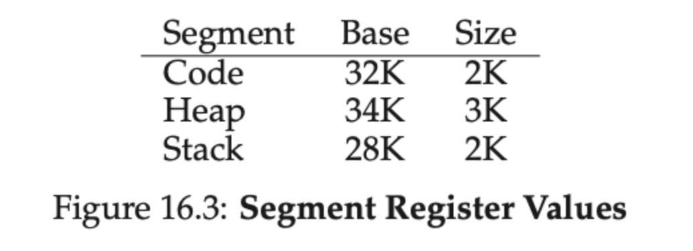
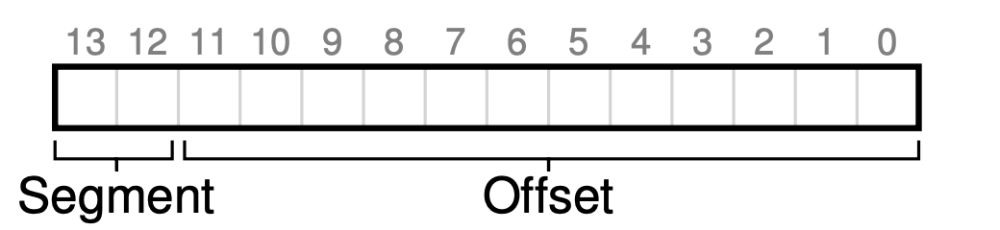
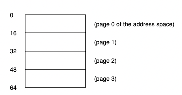
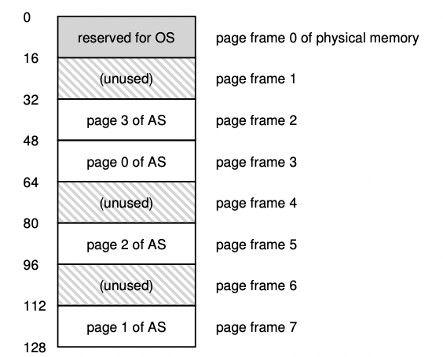

# 5주차 - OS

## Race Condition
- Race Condition
    - 실행하는 타이밍에 따라 비결정적인 결과를 일으키는 상태
- Critical Section
    - 동일한 자원을 동시에 접근하게 되는 경우가 존재하는 데 이러한 자원을 임계 영역이라고함.
- Critical Section Problem
    - 이러한 임계영역에 접근하게 되었을 때 Race Condition이 되며, 이것을 해결하기 위한 방법은 아래와 같다.
    - 상호배제 Mutual Exclustion
        - 한 프로세스 이 Critical Section에서 실행중이면, 다른 프로세스는 그 영역에서 실행 불가
    - 진행 Progress
        - Critical Section 에서 실행중인 프로세스가 없고, 별도의 동작이 없는 프로세스들만 Critical Section 진입 후보로서 참여될 수 있다.
    - 한정 대기 Bounded Waiting
        - Critical Section 에 진입 신청 후 부터 받아들여질 때가지, 다른 프로세스들이 Critical Section 에 진입하는 횟수는 제한이 있어야 한다.
        - 이것은 기아상태를 방지합니다.
- Lock
   - 하드웨어 기반 해결책으로써, 동시에 공유 자원에 접근하는 것을 막기 위해 Critical Section 에 진입하는 프로세스는 Lock 을 획득하고 Critical Section 을 빠져나올 때, Lock 을 방출함으로써 동시에 접근이 되지 않도록 한다.
  - Mutex는 락이 걸려있을 경우, 락이 풀릴때까지 기다리며 컨텍스트 스위칭을 진행.
    - CPU를 양보할 수 있어 다른작업을 동시에 진행할 수 있지만, 자원이 단시간 내로 얻을 수 있다면 컨텍스트 스위칭이 더 큰 낭비
## 데드락(DeadLock)

- 서로 상대방의 작업이 끝나기만을 기다리고 있기 떄문에 결과적으로 아무것도 못하는 상태입니다.
- process a → resource a 에대한 락을 획득하고
- process b → resource b 에대한 락을 획득하고 가정
- 이 때 process a가 resource b에 접근하려하고 , process b가 resource a에 접근하려 하면 서로 무기한 대기 상태에 빠지게 됩니다. 이것을 데드락 또는 교착 상태라고 부릅니다.
- 교착 상태의 조건
    - 상호 배제
        - 프로세스들이 필요로하는 자원에 대해 배타적인 통제권 요구
    - 점유 대기
        - 프로세스가 할당된 자원을 가진 상태에서 다른자원을 기다림
    - 비선점
        - 프로세스가 어떤 자원의 사용을 끝낼 때 까지 자원을 뺏을 수 없음.
    - 순환 대기
        - 프로세스는 순환적으로 다음 프로세스가 요구하는 자원을 가지고 있음.
- 교착상태의 예방
    - 상호배제 조건의 제거
        - 두 개 이상의 프로세스가 공유가능한 자원을 사용할 때 발생
    - 점유 대기 조건의 제거
        - 한 프로세스에 수행되기 전에 모든 자원을 할당. 점유하지 않을 때 프로세스가 자원을 요구하도록 하는 방법
        - 자원 과다 사용으로 인한 효율성, 기아상태, 무한 대기 등의 문제점
    - 비선점 조건의 제거
        - 비선점 프로세스에 대해 선점 가능한 프로토콜 만들기
    - 순환 대기 조건 제거
        - 자원 유형에 따라 순서를 매기기
    
    ⇒ 예방 방식은 보통 효율이 떨어지거나 비용이 많이 듦.
    
- 교착 상태의 회피
    - 순환 대기가 발생하지 않도록 자원 할당 상태를 검사
    - 자원 할당 그래프 알고리즘
    - 은행원 알고리즘
        - 안전 상태를 유지할 수 있는 요구만을 수락, 불안전한 상태를 초래할 사용자의 요구는 나중에 수락할 수 있을 때 까지 거절.
        - 안전상태: 시스템이 교착상태를 일으키지 않으면서 각 프로세스가 요구한 최대 요구량만큼 필요한 자원을 할당해 줄 수 있는 상태이다.
        - 불안전상태: 교착상태이기 위한 조건중에 하나로 불안전 상태에서만 교착상태가 발생한다. 그러나 불안전 상태라고 해서 무조건 교착상태가 발생하는 것은 아니다.
        - 시스템이 항상 안전상태를 유지할 수 있게 하는 것이 바로 은행원 알고리즘이다.
        - Max: 각 고객들이 은행에게 빌려달라고 요구하는 돈(자원).
        - Allocated: 각 고객들이 현재 빌린 돈(자원).
        - Available: 은행이 보유한 돈, 빌려줄 수 있는 돈(자원).
        - 장점
            1. 항상 안전상태를 유지할 수 있다.
        - 단점
            1. 최대 자원 요구량을 미리 알아야 한다. -> 안전 상태인지 불안전 상태인지를 판단하는데 필요하다.
            2. 항상 불안전 상태를 방지해야 하므로 자원 이용도가 낮다. -> 불안전 상태가 될 가능성이 있다면 자원을 이용하지 않으므로 이용도가 낮아진다.

## 세마포어(Semaphore) & 뮤텍스(Mutex)

- 소프트웨어상에서 공유자원이 여러개일 때, Critical Section 문제를 해결하기 위한 동기화 도구
- **종류**
    - OS 는 Counting/Binary 세마포를 구분한다
    - 카운팅 세마포
        - **가용한 개수를 가진 자원** 에 대한 접근 제어용으로 사용되며, 세마포는 그 가용한 **자원의 개수** 로 초기화 된다. 자원을 사용하면 세마포가 감소, 방출하면 세마포가 증가 한다.
    - 이진 세마포
        - MUTEX 라고도 부르며, 상호배제의 (Mutual Exclusion)의 머릿글자를 따서 만들어졌다. 이름 그대로 0 과 1 사이의 값만 가능하며, 다중 프로세스들 사이의 Critical Section 문제를 해결하기 위해 사용한다.
- **단점**
    - Busy Waiting(바쁜 대기)
        - Spin lock이라고 불리는 Semaphore 초기 버전에서 Critical Section 에 진입해야하는 프로세스는 진입 코드를 계속 반복 실행해야 하며, CPU 시간을 낭비했었다. 이를 Busy Waiting이라고 부르며 특수한 상황이 아니면 비효율적이다. 일반적으로는 Semaphore에서 Critical Section에 진입을 시도했지만 실패한 프로세스에 대해 Block시킨 뒤, Critical Section에 자리가 날 때 다시 깨우는 방식을 사용한다. 이 경우 Busy waiting으로 인한 시간낭비 문제가 해결된다.

## 페이징 & 세그먼테이션 (PDF)

### 세그멘테이션

- 세그멘테이션은 MMU에 하나의 base와 bound가 존재하는 것이 아닌, 세그멘트마다 base와 bound를 사용하는 방법
- 세그멘트는 특정길이를 가지는 연속적인 주소 공간으로 코드, 스택, 힙의 세 종류의 세그멘트가 존재
- 세그멘테이션을 사용하면, OS는 각 세그멘트를 물리 메모리의 각기 다른 위치에 배치가 가능해지고 사용하지않는 주소 공간이 메모리를 차지하는 것을 막을 수 있음.

위와 같이 code, data, heap 영역으로 세그먼트를 분리하여 배치.

이렇게 배치함으로써 사용하지 않는 주소 공간이 메모리를 차지하는 것을 막고, 단편화를 줄여줌.

각 세그먼트가 주소공간의 어디에서 시작하고 size는 어떻게 되는지를 레지스터에 기록함으로써, 가상주소에서 실제 주소 변환시 base로부터 변환을 시작하고, size를 넘으면 세그멘테이션 폴트가 발생.

보통 위와 같이 최상위 2비트를 Code, Heap, Stack을 구분하는데 사용하고, 나머지 비트를 offset으로 사용하여 Base + offset을 통해 실제 주소를 구함.

스택은 다른 세그먼트와 다르게 거꾸로 확장하게 되므로, base - offset을 통해 주소를 계산.

### 페이징 

페이징은 세그먼트와 다르게 고정된 크기의 단위로 주소 공간을 분할함.

이 고정 크기의 단위를 페이지라고 부르며, 물리 메모리도 똑같은 크기의 페이지 프레임으로 분할.

가상 주소 공간을 위와 같이 16byte로 나누었을 때, 각각의 슬롯을 페이지라고 부름.

물리 메모리는 128byte라고 가정하게 되면, 16byte 단위의 페이지 프레임으로 나뉘게 되며 당연히 8개의 공간으로 나뉨.

#### 장점
- 프로세스의 주소 공간 사용방식과는 상관없이 효율적으로 주소 공간 개념을 지원
- 힙과 스택이 어느 방향으로 커지는가, 어떻게 사용되는가 같은 생각을하지 않아도 됨
- 단순하게 배치가 가능. 가상 주소 공간을 물리 메모리에 배치하려면, 각각의 페이지를 어느 페이지 프레임에 넣을지만 생각하면 됨.

#### 페이지 테이블

- 주소 공간의 각 가상 페이지에 대한 물리 메모리 위치 기록을 위하여 운영체제는 프로세스마다 페이지 테이블 ( page table ) 이라는 자료구조를 유지

예를 들어, 위에서 보여주었던 그림 예시에서는 ( VP 0 → PF 3 ) , ( VP 1 → PF 7 ) , ( VP 2 → PF 5 ), ( VP 3 → PF 2 ) 과 같이 매핑.

당연하게도 **페이지 테이블은 프로세스마다 존재**

#### TLB ( Translation Looakside Buffer )

자주 참조되는 VPN, PFN 을 저장하는 주소 변환 캐시.

TLB는 다른 여타의 캐시와 같이 주소 변환 정보가 대부분의 경우 캐시에 존재한다는 가정 ( 캐시 히트 비율이 높을 것이라는 가정 ) 을 하고 만들어짐.

먼저 가상 주소 변환시, TLB에 접근하게 되고 만약 TLB에 존재하지 않는 VPN이라면 실제 페이지 테이블에 접근하여 TLB를 업데이트하고 다시 TLB에 접근하여 PFN을 찾는 과정을 거침.

보통 TLB도 사이즈의 제한이 있기 때문에 캐시 교체 정책을 사용하여 TLB 내부의 데이터를 교체하게 되는데 보통 LRU를 자주 사용하게 됨.

## 페이지 교체 

모든 페이지는 물리 메모리의 실질적인 크기 때문에 페이지를 모두 탑재하지 못함.

그래서 추가적인 스왑 공간이라는 물리 디스크에 페이지를 저장.

### 스왑 공간

위의 예제에서는 물리 메모리와 Swap 공간에는 각각 4개의 Page와 8개의 Page를 위한 공간이 존재.

이 예제에서는 세 개의 프로세스 ( Proc 0 ~ Proc 2 ) 가 물리 메모리를 공유하고, 세 프로세스는 몇 개의 유효 페이지들만 메모리에 존재하며, 나머지는 Swap out 되어 디스크에 존재.

Proc3의 주소 공간은 모두 디스크에 Swap out 되어 있으므로, 현재 실행중이 아님을 알 수 있음.

이러한 페이지들은 Present bit를 통해 해당 페이지가 실제 물리 메모리에 존재하는지, 아니면 스왑 공간에 존재하는지를 알 수 있음.

Present bit가 1이라면 물리 메모리에 해당 페이지가 존재한다는 것이고, Present bit가 0이라면 메모리에 해당 페이지가 존재하지 않고 디스크에 존재한다는 것.

물리 메모리에 존재하지 않는 페이지를 접근하는 행위를 일반적으로 **Page Fault**.

### 페이지 폴트

만약 요청된 페이지가 메모리에 없고, 디스크로 스왑되어 있다면 운영체제는 해당 페이지를 메모리로 스왑해옴.

페이지 폴트 발생시, 페이지 테이블에서 PFN과 PTE를 보고 디스크에 어느 위치에 있는지 파악하고 메모리로 탑재.

이 때 메모리에 빈공간이 없다면, 새로운 페이지를 위한 공간을 확보하기위해 다른 페이지들을 page out해야하며 이것을 교체라고 하며 이를 위해 페이지를 선택하는 것을 **페이지 교체 정책**이라고 함.

### 페이지 교체 정책

#### OPT - Optimal 
- 앞으로 가장 오랫동안 사용되지 않을 페이지 교체
- 미래를 예측하는 방법.. -> 즉 불가능.

#### FIFO
- First In First Out
- 먼저 들어온 페이지를 먼저 내보내는 가장 단순한 정책.
- Belady's Anomaly라는 프레임수가 많아져도 페이지 폴트 횟수가 감소하지 않는 현상이 발생 가능.

#### LRU 
- Least Recently Used
- 가장 오랫동안 사용되지 않은 페이지 교체
- 보통 가장 많이 쓰이는 알고리즘
- 추가적인 자료구조를 통해 참조 시간과 같은 데이터를 기록해야해서 오버헤드 발생 가능.
- LRU를 approximate하기 위해 보통 클락 알고리즘 같은 것을 사용.

#### LFU 
- Least Frequently Used
- 참조 횟수가 가장 작은 페이지 교체
- 가장 최근에 불러온 페이지가 교체 될 수 있다는 단점이 존재

#### MFU 
- Most Frequently used
- 참조 횟수가 가장 많은 페이지 교체
- 가장 많이 사용된 페이지는 한동안 안쓸 것이라는 가정하에 사용 -> ~~왜 쓰는지 모르겠음.. 솔직히~~

#### NUR 
- Not Used Recently
- 최근에 사용하지 않은 페이지 교체
- LRU Approximate 알고리즘.
- 적은 오버헤드로 적절한 성능을 줌.
- 각 페이지마다 참조비트, 더티비트를 사용하여 교체를 함.

### 교체는 실제로 언제 일어나는가?

메모리에 항상 어느 정도의 여유 공간을 비워두기 위해, 대부분의 운영체제는 여유 공간에 관련된 최댓값(High Watermark)과 최솟값(Low Watermark)을 설정하여 교체 알고리즘 작동에 활용.

운영체제가 여유 공간의 크기가 최솟값보다 작아지면 여유 공간의 확보를 담당하는 쓰레드가 동작. 쓰레드가 여유 공간의 크기가 최댓값에 이를 때까지 페이지를 제거.

위 같은 백그라운드 쓰레드를 일반적으로 스왑 데몬 혹은 페이지 데몬이라고 부름.

충분한 여유공간이 확보되면 백그라운드 쓰레드는 슬립.

보통 성능을 위해 일시에 여러개( 클러스터나 그룹으로 묶은 다수의 페이지 )를 교체하는 방식을 사용하는 배치 작업을 진행.

