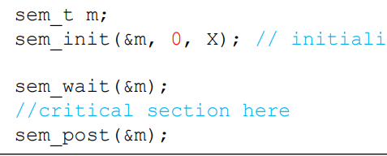

# Race Condition

race condition이란 서로 다른 프로세스나, 스레드간의 공유하는 자원에 접근할 때의 상황을 race condtion이라고 한다.

## 예시

예시의 코드는 counter라는 변수에 스레드 2개를 이용해서 덧셈을 수행하는 코등드이다. 두 스레드를 이용해서 어떤 한 변수에 각각 100000을 더하는 실행을 하면 결과 값은 200000이 나와야 하지만 결과는 예상과 달리 다음과 같이 나온다.

200000이 나오지 않는다. 그 이유는 다음과 같다. 덧셈 연산에는 3가지 절차가 수행된다.

1. counter 변수의 값을 memory로 부터 register로 가져온다.
2. register의 값을 증가 시킨다.
3. 다시 memory로 더한 counter변수의 값을 넣는다.

문제의 과정은 다음과 같다. (스레드 A와 B가 있으며 counter변수가 memory에서 7일 때를 가정하자) 

1. counter 변수의 값을 memory로 부터 스레드 A가 register로 가져온다.

2. register의 값을 증가 시킨다. register의 내부 값은 8이 된다.

3. context switch가 일어나서 스레드 A는 중단이 되고 스레드 B가 실행된다.

4. 스레드 B는 위의 3가지 절차를 모두 실행해서 memory에 있는 counter의 값은 8이 된다.

5. 스레드 A는 3의 과정을 실행해서 register에 있는 값인 8을 memory에 적제한다. 결국 memory에 있는 counter값은 8이 된다.

이렇게 자원에 동시에 접근하게 된다면 race condtion이 발생해 의도하지 않은 연산이 발생하게 된다. 이러한 현상을 방지하기 위해서 

# 세마포어(Semaphore) & 뮤텍스(Mutex)

위에서 발생한 race condtion의 문제를 해결하기 위해서 mutex와 semaphore를 사용한다. 

## 뮤텍스

* MUTal EXclusion 쉽게 말해 상호 배제라는 의미다. 

* 한 스레드나 프로세스가 한 자원에 접근할 때 다른 스레드나 프로세스의 접근을 차단함 

* 이렇게 함으로써 위의 덧셈 같은 경우 해당 스레드가 계산을 다할 때 까지는 다른 스레드가 계산 연산을 수행하지 못하므로 race condtion을 해결 할 수 있다.

* 단, 상호 배제라는 정의에 맞게 스레드나 프로세스간에서 실행되지 못한다. 오직 자원 접근만 차단하는 역활을 한다.

## 세마포어

*  뮤텍스와는 달리 숫자를 통해서 현재 자원의 상태를 나타 내주는 객체이다. 숫자를 조절해서 뮤텍스와 마찬가지로 lock도 설정이 가능하고, signal을 보내는 것도 가능하다.

* sema_wait 와 sema_post라는 루틴을 통해서 제어가 가능하다.

* 또한 상호배제라는 mutex와 달리 여러개의 스레드나 프로세스가 동시에 연산을 수행하는 것도 가능하게 한다.

1. sema_wait ()
    * semaphore를 1을 낮춘다.
    * 만약에 해당 semaphore의 값이 0미만이면 계속 기다린다.

2. sema_post()
    * semaphore를 1을 올린다.
    * 만약에 wait상태인 thread가 있다면 해당 thread를 깨운다.

### 예시

* 위의 코드가 있고 X의 값을 1로 초기화한다.

* 해당 sem_wait에 스레드가 진입하고 sema_wait를 실행해서 X를 0으로 만든다.

* 이후에는 다른 스레드나 프로세스가 해당 critical section에 접근하려고 하면 sema_phore의 값이 음수가 되어서 wait 상태가 되므로 critical section 을 실행 시킬 수 없게 된다. 이렇게 상호 배제를 구현한다.

* X를 0으로 초기화 한다.

* child thread를 생성한다. 이후로 2가지 시나리오로 나뉜다.

* 만약에 parent가 먼저 실행되면 sem_wait로 인해서 프로세스가 중단되고, child process가 sem_post를 해줘서 parent 스레드를 깨운다.

* 만약에 child 가 먼저 실행되면 계속 실행되다가 sem_post를 통해서 X를 1로 만든다. 이후에 parent가 실행되어도 X의 값은 0이 되므로 sem_wait에서 걸리지 않고 계속 실행이 된다.

# 데드락(DeadLock)

예를 들어 A라는 프로세스는 B의 결과 값이 있어야 자신의 계산 값을 낸다고 하자, B도 마찬가지로 A의 연산값이 있어야 자신의 계산 값을 낸다고 하면 결국에는 A와 B 둘다 계산 값이 나올 수가 없다.

## 발생이유

데드락이 발생하는 이유는 4가지가 존재한다. 이중 하나라도 실현되지 않으면 데드락은 발생하지 않는다.

1. Mutal-exclusion

    자원을 한 프로세스만 독점한다.

2. Hold and wait

    자원을 이미 점유하고서는 다른 프로세스에 할당되어 사용하고 있는 자원을 추가로 점유하기 위해 대기하는 프로세스가 있다.

3. No preemption

    프로세스에 할당 되어 있는 자원을 회수가 불가능 하다.

4. Circular Wait

    프로세스가 서로 요구하는 자원이 순환을 이룬다. (ex) 1번은 2번, 2번은 3번 .... n번은 1번)

## 해결책

1. Mutal-exclusion

    Mutal-exclusion 을 사용하지 않고 하드웨어 연산(ex) compare and swap)을 사용해서 원하는 연산을 수행. 제한된 연산이 수행되고, 방법의 특성상 stop-and-wait방식을 사용해서 효율이 낮다.

2. Hold-and-wait

    프로세스 진행을 위한 락을 모두 한번에 요구하고 한번에 풀게해서 점유대기가 발생하지 않게 한다. 예를들면 모든 락 바깥에 별도의 lock을 씌워서 해당 lock을 거쳐야만 프로세스가 시작이 되도록 한다. 단점은 lock을 추가하면서 concurrency가 저하되고 오버헤드가 발생한다.

3. No preemption

    어떠한 프로세스가 어떤 락을 잡을 때 해당 락이 잡히지 않는다면, 스스로 이미 가지고 있는 락도 포기하게 만들어서 preemption하게 작동하게 만든다.

4. Circular Wait

    항상 락을 획득하는 순서를 동일하게 한다. 예를 들면 락 B는 무조건 락 A를 획득한 이후에 획득하게 코딩을 하는 것이다.

# 페이징 & 세그먼테이션 (PDF)

## 세그먼테이션(segmentation)

코드 공간이 있을 때 코드는 다음과 같이 배치가 된다. 
문제는 그림과 같이 heap과 stack이 얼마나 늘어날지 모른다. 코드 공간을 크게 할 수도 없다!
👉 메모리 종류마다 공간을 분리하자!

장점

1. 코드 공간이 분리가 되어 프로세스당 공간을 줄 필요가 없음

2. 필요한 만큼 세그먼트를 옮길 수 있음(전에는 프로세스 단위로 옮겨야 했음)

3. text segment 같은 경우는 read-only 로 

단점

1. 이렇게 segment가 여러개 있게 된다면, external fragmentation이 일어나서 효율적인 메모리 관리가 힘들게 된다.

## 페이징

위의 external fragmentation 문제를 해결하기 위해서 등장한 방식이다. segment 와 달리 메모리를 일정한 공간으로 나눠서 코드를 배분한다. 

장점

1. 위의 segment와 달리 stack 이나 heap 이 늘어나면 새로운 page 에 할당하면 끝이기 때문에 external fragmentation이 발생 하지 않음
2. segment 보다도 더 동적으로 페이지 할당이 가능하다. segment는 현재 존재하는 stack과 heap을 고려하면서 메모리 공간을 배분해야 하기 때문

단점

1. page의 크기를 작게하면 page를 할당할 때 page의 개수가 많아져서 관리가 어렵다. 그렇다고 한 page를 크게하면 내부 공간을 완전히 안쓰는 internal-fragmentation이 일어나서 page하나의 크기 조절이 중요하다.

# 페이지 교체 알고리즘

메모리(RAM)은 하드 디스크나 주기억 장치의 일부를 가져와서 메모리에 넣어 놓는다. 하지만 이러한 메모리에 주기억 장치의 전부를 가져 올 수가 없다. 계속해서 메모리에 기록만 하게 된다면 결국 쓸 공간이 없게된다. 👉 메모리에서 어떤 공간은 비워야 할지 결정해야 한다!

## Optimal 페이지 교체

* 가장 이상적으로 페이지 교체가 일어난 케이스를 가정하는 경우로 뒤에 요구들을 보고 어떤 페이지를 교체 할지 결정한다.

* 가장 효율적인 방법이나 가장 중요한 미래를 다 알아야 한다는 점에서 불가능한 알고리즘이다. 다른 케이스의 효율성을 비교 할 때 쓰이는 방식이다.

## FIFO

* 말 그대로 FIFO(first in first out) queue 의 형식으로 가장 먼저 들어온 페이지를 교체한다.

* 만약에 자주 쓰이는 페이지가 단지 오래전에 queue 안에 들어왔다는 이유로 교체 된다면 9번째 2의 경우처럼 비효율이 발생할 가능성이 크다.

* 또한 아래의 경우와 같이 더 큰 버퍼가 꼭 더 좋은 성능을 의미하지 않는다. 이를 belady's anamoly 라고한다.

## LFU

* 가장 빈도수가 적게 쓰인 페이지를 걸러낸다.

* 단점은 모든 수에 대해서 빈도 수를 저장해야 한다는 점과 처음에 안쓰이던 수가 나중에 자주 쓰이게 되면 손해를 입는 것이 단점이다.

## LRU

* 메모리에 있는 블럭중 최근에 가장 적게 쓰인 블럭을 교체를 해준다. 앞의 FIFO와 달리 자주 쓰이는 블럭들은 교체를 안 할 수가 있어서 효율이 좋다.

* 실제로 구현은 효율 때문에 queue 구조로 하기 보다는 reference bit을 이용한 clock 알고리즘을 사용해서 한다.