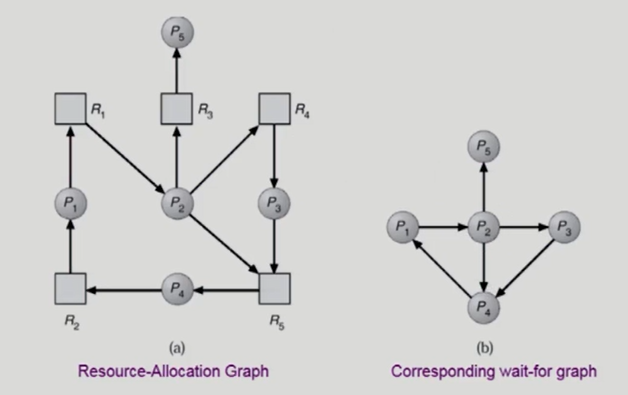

## 목차

1. 데드락(DeadLock)
2. Race Condition
3. 세마포어(Semaphore) & 뮤텍스(Mutex)
4. 페이징 & 세그먼테이션 (PDF)
5. 페이지 교체 알고리즘

----------


# 01. 데드락 (DeadLock)

* 일련의 프로세스들이 서로가 가진 자원을 기다리며 block된 상태로 두 개 이상의 작업이 서로 상대방의 작업이 끝나기만을 기다리고 있기 때문에 결과적으로 아무것도 완료되지 못하는 상태를 말한다.

* 자원 :

  * 하드웨어, 소프트웨어 등을 포함하는 개념
  * IO device, CPU cycle, memory space, semaphore 등

  

## DeadLock 발생하는 4가지 조건

1. Mutual exclusion (상호배제)

   매 순간 하나의 스레드만이 자원을 사용할 수 있음을 말한다. 만약 사용중에 다른 스레드가 요청하면 요청 스레드는 자원이 방출될 때까지 기다려야 한다.

2. No preemption (비선점)

   자원들은 강제로 빼앗길 수 없다(선점 당할 수 없다). 자원을 점유한 스레드는 태스크를 종료 후에 자발적으로 자원을 내놓는다. 

3. Hold and wait (점유대기)

   스레드는 자원을 점유한 채, 다른 스레드가 현재 점유한 자원을 얻기 위해 대기하고 있음을 의미한다. 

4. Circular wait (순환대기)

   대기하고 있는 스레드는 스레드간의 사이클을 형성하며 자원을 대기함을 말한다.


## Deadlock 처리방법

1. Deadlock Prevention (예방)
2. Deadlock Avoidance (회피)
3. Deadlock Detection and recovery
4. Deadlock Ignorance

### 1. Deadlock prevention (예방)

* 데드락의 4가지 조건 중 최소한 하나를 없으므로써 교착 상태의 발생에 대해 **예방**할 수 있는 방법이다. 

* deadlock을 처리하는 가장 강력한 방법이지만 자원이용률을 감소, throughput(처리율) 감소, starvation 문제 등이 발생할 수 있다.

  

#### Mutual Exclusion

일반적으로 상호배제 조건을 거부함으로써 교착 상태를 예방하는 것은 불가능하다. 왜냐하면 어떤 자원들은 근본적으로 공유가 불가능하기 때문이다.

#### Hold and Wait 

이 조건을 없애기 위해선 스레드가 자원을 요청할 때마다 다른 자원을 보유하지 않으면 된다. 

* 방법 1 : 프로세스나 스레드의 실행이 시작되기 전 필요한 모든 자원을 할당받는다. 

  * 자원 요청의 동적인 특성으로 인해 실용적이지 않다.

  * 자원이 할당되었지만 장시간 사용되지 않을 수 있기 때문에 자원이용률이 낮다. 

* 방법 2 : 스레드가 자원을 전혀 갖고 있지 않을 때만 자원을 요청할 수 있도록 허용하는 방법이다. 스레드가 추가 자원에 대한 요청이 있을 시 보유한 자원을 모두 놓고 다시 요청한다. 

  * 기아 현상이 발생할 가능성이 있다.


#### No Preemption

비선점의 조건은 이미 할당된 자원이 선점되지 않는다는 것을 말한다. 이 조건을 없애기 위해서는 

* 방법 1 : 스레드가 다른 스레드가 점유하는 자원을 요청하면 현재 점유하고 있는 모든 자원이 선점된다. 즉, 다른 스레드가 점유했던 자원들은 묵시적으로 방출됨을 말한다.
* 방법 2 : 한 스레드가 자원을 요청하면, 자원이 즉시 사용 가능한지 검사하고 부여한다. 만약 자원이 다른 스레드에게 할당되어 있고 **대기 중**이라면, 그 자원들을 선점해서 요청한 스레드에게 부여한다. 만약 자원을 이용할 수 없거나 다른 대기 스레드에게 점유되지 않았다면 요청 스레드는 대기한다.

#### Circular Wait

앞서 말한 3가지 조건들은 대부분 상황에서 일반적으로 실용적이지 않다. 마지막 조건인 순환 대기의 무효화는 실용적인 해결책을 제공할 수 있다.

* 해결방안 : 모든 자원 유형에 전체적인 순서를 부여하여 프로세스가 순서대로 자원을 요청하는 것이다. 

하지만 복잡한 프로그램의 경우 락 순서를 정하는 것은 매우 구현하기 어렵다. 이 문제를 해결하기 위해 락 획득 순서를 System.identityHashCode(-Object ) 메소드를 통해 사용한다.

그럼에도 불구하고 락 순서가 교착 상태 **예방을 보장하지는 않는다**.

예를들어, 두 계좌간의 송금 기능을 가진 함수

```java
void transaction(Account from, Account to, double account)
{
    mutex lock1, lock2;
    lock1 = get_lock(from);
    lock2 = get_lock(to);
    
    acquire(lock1);
    acquire(lock2);
    
    witdraw.... deposit....
    
    release(lock2);
    release(lock1);
}
```

한 스레드는 `transaction(checking_acccount, savings_account, 25)`

다른 스레드는  `transaction(savings_account, checking_acccount, 25)` 호출된 경우 교착 상태의 가능성이 있다. 


### 2. Deadlock Avoidance (회피)

* 스레드가 평생 요구할 자원에 대한 부가적인 정보를 미리 제공할 것을 요구한다. 이런 추가적인 정보를 가지고 운영체제는 각 요청에 대한 스레드의 대기 여부를 결정한다. 
* 시스템이 unsafe state에 들어가지 않는 것을 보장한다.
* 보통 자원 할당이 데드락으로부터 안전한지를 동적으로 조사해서 안전한 경우에 할당하는 방법이다
* 가장 단순하고 일반적인 모델은 프로세스들이 필요한 자원의 최대량을 미리 선언하는 방법이다. 미리 최대 자원 정보를 알게된다면 교착 상태에 들어가지 않는 알고리즘을 만들 수 있다. 교착 상태 회피 알고리즘은 순환 대기 상황이 발생하지 않도록 자원 할당 상태를 검사한다.


#### 2가지 경우의 알고리즘

##### Resource Allocation Graph algorithm (자원 할당 그래프 알고리즘)

* single instance per resource types

* 프로세스 생명주기동안 필요한 자원을 점선으로 표현하고 그것을 이용해 안전한 경우의 한해서 자원을 전달하고 데드락을 방지하는 방법이다.


* 점선으로 표시된 간선(Claim edge)은 프로세스가 자원을 미래에 요청할 수 있음을 의미한다.
* 그리고 해당 자원을 요청하는 경우 실선(Request edge)으로 바뀌게 된다.
* 자원을 할당받으면 방향이 반대인 간선(Assignment edge)이 된다.
* 만약 자원을 다 쓰고 반납하게 되면 다시 Claim edge로 바뀐다. 

 

##### Banker's Algorithm

* multiple instance per resource types
* 추가요청 가능성 자원과 가용자원을 비교해서 결정내린다.


### 3. Deadlock Detection and recovery

여유자원이 있으면 무조건 준다. 즉, 데드락 발생은 허용하되 그에 대한 detection하고 데드락 발생시 recovery하는 방법이다.

#### Deadlock Detection

##### Resource type 당 single instance인 경우

* 자원 할당 그래프에서의 사이클이 곧 데드락을 의미합니다. 

* 자원할당 그래프에서 resource를 빼고 process만 연결한 wait for graph를 만들면 더 쉽게 데드락의 가능성을 알 수 있다.

  

##### Resource type 당 multiple instance인 경우 

* Banker's algorithm가 유사한 방법을 사용하면 된다.


* 하지만 데드락 회피의 banker's algorithm과 다르게 **현재만**으로 내어준다. 즉, 현재 요청한 자원이기 때문에 회피 방식처럼 미래를 확인하는 게 아니라 낙관적으로 현재 요청자원으로 내어준다.


#### Deadlock Recovery

##### Process termination (프로세스 종료)

* 데드락에 관련된 모든 프로세스를 죽인다.
* 혹은 데드락에 관련된 프로세스를 하나씩 죽여서 데드락 사이클이 사라졌는지 확인한다. 이 방법은 프로세스가 하나 중지될 때마다 탐지 알고리즘을 호출해 확인해야 함으로 오버헤드가 크다.

##### Resource Preemption (자원 뺏기)

* 비용을 최소화할 희생자를 선정하고 그 프로세스의 자원을 선점하기 위해서 safe state로 rollback한다.
* Starvation 문제 : 동일한 프로세스가 계속해서 희생자가 되는 경우, 롤백 횟수도 같이 고려해서 희생자 선정한다.


### 4. Deadlock ignorance (무시)

* 다른 처리 방법에 비교했을 때 비용이 적게드는는 방법이다.
* 무시라는 방법은 데드락의 발생이 드물기 때문에 오히려 운영체제가 일을 한다는 것이 낭비라는 관점에서 사용하는 것으로 아무것도 처리하지 않는 방법을 말한다. 
* UNIX, windows 등 대부분의 범용 OS가 채택


# 02. Race Condition

 Race condition은 여러 개의 프로세스가 동일한 자료에 접근하여 조작하고, 그 **실행 결과가 접근이 발생한 특정 순서에 의존하는 상황을 말하며 이것을 경쟁상황**이라고 한다.


이런 경쟁 상황으로부터 보호하기 위해서 프로세스들의 **동기화가 필요**하다. 


## 운영체제의 Race Condition이 발생하는 예

1. kenel 수행 중 인터럽트 발생시

2. 프로세스가 시스템 콜을 사용하여 kernel mode로 수행중인데 context switch가 발생하는 경우

3. Multiprocessor에서 shared memory 내의 kernel data


### 1. kenel 수행 중 인터럽트 발생시


### 2. 프로세스가 시스템 콜을 사용하여 kernel mode로 수행중인데 context switch가 발생하는 경우


### 3. Multiprocessor에서 shared memory 내의 kernel data

Multiprocessor의 경우 앞선 경우 처럼 interrupt enable/disable로 해결되지 않는다. 왜냐하면 하나의 CPU의 interrupt를 diable했다고 다른 CPU에서 데이터를 읽어올 수 없는 것은 아니기 때문이다. 

##### 해결방법 :

1. 한번에 하나의 CPU만이 커널에 들어갈 수 있게 하는 방법

2. 커널 내부에 있는 각 공유 데이터에 접근할 때마다 **그 데이터에 대한 lock/unlock**을 하는 방법


## **The Critical section problem**

임계 영역은 둘 이상의 스레드가 동시에 접근해서는 안되는 **공유 자원(자료 구조 또는 장치)을 접근하는 코드**의 일부를 말한다. 


임계구역 문제에 대한 해결안은 다음 세가지 요구 조건을 충족해야 한다.

1. Mutual Exclusion (상호 배제)
   * 프로세스 Pi가 critical section 부분을 수행 중이면 다른 모든 프로세스들은 그들의 critical section에 들어가면 안된다
2. Progress (진행)
   * 아무도 critical seciton에 있지 않은 상태에서 CS에 들어가고자 하는 프로세스가 있으면 들어갈 수 있어야 한다.
3. Bounded Waiting (유한 대기)
   * 프로세스가 critical section에 들어가려고 요청한 후부터 그 요청이 허용될 때까지 다른 프로세스들이 critical section에 들어가는 횟수에 한계가 있어야 한다. 


### Peterson의 해결안

```jav
while(true){
	flag[i] = true; // i는 현재 자신, 준비되었다.
	turn = j;	// 진입
	
	while(flag[j] && turn == j);
	
	/* critical section */
	
	flag[i] = false;
	
	/* 남은 구역*/
	
}
```

* Mutual Exclusion (상호 배제), Progress (진행), Bounded Waiting (유한 대기) 조건을 모두 만족하는 방법이다.
* 하지만 계속해서 CPU와 memory를 사용하는 **Busy Waiting(= spin lock)** 방식이다.


> 피터슨의 해결안은 최신 컴퓨터 아키텍처에서 보장할 수 없다. 왜냐하면 시스템 성능을 위해 프로세서 및 컴파일러가 종속성이 없는 읽기 및 쓰기 작업을 재정렬할 수 있기 때문이다. 데이터를 공유하는 다중 스레드 응용 프로그램의 경우 명령 순서가 바뀌면서 데이터의 일관성이 깨지거나 예기치 못한 결과를 낳을 수 있다.
>
> 동기화를 위한 하드웨어 지원 : 
>
> 1. 메모리 장벽 또는 메모리 펜스의 명령어를 통해 순서를 보장한다.
> 2. 명령어가 원자적으로 실행되는 하드웨어적 명령어 : test_and_set(), compare_and_swap
> 3. 원자적 변수


### Semaphores

Semaphores S는 정수 변수로 mutex와 유사하지만 프로세스의 행동을 더 정교하게 동기화할 수 있는 방법을 제공한다.

* P(S) : 자원을 획득하는 과정
* V(S) : 자원을 반납하는 과정


#### Busy Wait


#### Block & Wakeup(=sleep lock) 

while문을 돌지 않고 CPU를 아예 반납하고 blocked 상태에 돌아가고 mutex의 값이 생길때 wake up하는 방식으로 변환하면 busy wait가 발생하지 않는다.

Critical section의 길이가 긴 경우나 일반적으로 Block/Wakeup 방식이 더 좋지만 Critical section의 길이가 매우 짧은 경우 Block/Wakeup 오버헤드가 busy wait 방식의 오버헤드보다 더 커질 수 있다.


##### 세마포의 단점

* 코딩하기 힘들다.
* 정확성의 입증이 어렵다.
* 자발적 협력이 필요하다.
* 한번의 실수가 모든 시스템에 치명적 영향을 준다.


### Monitor


동시 수행중인 프로세스 사이에서 abstract data type의 안전한 공유를 보장하기 위한 high - level synchronization construct으로 고급 언어 차원에서 제공하는 동기화 방법이다.

세마포는 공유 데이터 접근을 프로그래머가 책임을 진다면 모니터는 **공유 데이터에 대한 모든 책임을 담당**한다. 즉, 공유데이터의 접근은 모두 모니터의 operation을 통해 처리된다.


#### 특징

* 모니터 내에서는 한번의 하나의 프로세스만 활동가능 (하나의 프로세스만 활성화)

  * 자원이 있을 때는 수행을 하면 됨
  * 자원이 없을 때는 blocked 시켜야 함. 이 때 condition variable을 사용하여 프로세스가 모니터 안에 기다릴 수 있도록 (x 큐에 대기) 함
    * x.wait( ) : 잠재우기 == P(S)
    * x.signal( ) : 깨우기 == V(S)
* 모니터는 자원의 개수를 세지 않고 자원의 여부가 없을 때 큐에 잠 재운다.
* java의 synchronized 가 모니터를 응용한 방식이다.  [참고](https://youtu.be/yWprp019_n4)

​	

#### Dining - Philosophers Problem (식사하는 철학자)

철학자들은 생각하거나 밥먹는 일을 한다. 식탁에서는 젓가락 한짝식이 사람 수 별로 존재하고 사람들 사이에 존재한다. 배가 고파질 경우 왼쪽과 오른쪽 젓가락을 획득해야 밥을 먹을 수 있다.

##### 세마포


**문제점 **

* 모든 철학자가 동시에 배가 고파져 왼쪽 젓가락을 집어버린 경우 -> deadlock 가능성이 존재

**해결방안**

1. 4명의 철학자만이 테이블에 동시에 앉을 수 있도록 함

2. 젓가락을 두 개 모두 잡을 수 있을 때만 젓가락을 집을 수 있게 함

   

3. 비대칭 : 짝수 철학자는 왼쪽, 홀수 철학자는 오른쪽 젓가락을 먼저 집도록 함

##### 모니터


# 03. 세마포어(Semaphore) & 뮤텍스(Mutex)

#### Mutex

운영체제 설계자들이 임계 구역 문제를 해결하기 위해 상위 수준 소프트웨어 도구를 개발했고 그 중 가장 간단한 도구가 mutext 락이다. Mutex = Mutual exclusion 축약 형태로 단어 자체가 상호배제라는 의미이다.

* acquire(), release() 함수 호출

#### Semaphore

mutex와 유사하지만 프로세스의 행동을 더 정교하게 동기화할 수 있는 방법을 제공한다. 

##### 종류

* Counting Semaphore
  * 도메인이 0 이상인 임의의 정수값
  * 주로 resource counting에 사용
* Binary Semaphore(= mutex)
  * 0 또는 1 값만 가질 수 있는 세마포
  * 주로 mutual exclusion (lock/ unlock)에 사용


# 04. 페이징 & 세그먼테이션 (PDF)


* 실행파일을 실행하면 physical memory에 프로세스가 올라가게 된다.
* 그전에 가상 메모리 영역을 통해 독자적인 주소공간을 가지게 된다. (0부터 몇번까지)
* 이 중에서 당장 사용될 부분은 물리적인 메모리 영역에 올라가고 당장 사용되지 않을 부분은 swap area 영역에 있다.


#### Logical address (=virtual)

* 프로세스마다 독립적으로 가지는 주소 공간
* 각 프로세스마다 0번지부터 시작
* CPU가 보는 주소는 Logical address임

#### Physical address

* 메모리가 실제 올라가는 위치


>Symbolic Address  -> Logical Address -> Physical address


## 주소 바인딩 (Address Binding) or 주소 변환

* Logical Address -> Physical address로 넘어가는 과정을 말한다.

#### 3가지 시점


#### Compile time binding (컴파일 시점)

* 물리적 메모리 주소가 컴파일시 알려짐
* 시작 위치 변경시 재 컴파일
* 컴파일러는 절대 코드를 생성 
* 현대적인 방법은 아님. 예전의 한 컴퓨터 당 한 프로그램만 사용할 때 썻던 방식
* **논리적인 주소가 곧 물리적인 주소**이기 때문에 주소변환이 필요없고 바로 메모리에 올려서 실행가능


#### Load time binding (실행 시작시)

* Loader의 책임하에 물리적 메모리 주소 부여
* 실행되는 시점에 결정되고 중간에 바뀌지 않는다.

* 컴파일러가 재배치가능코드(relocatable code)를 생성한 경우 가능


#### Execution time binding(= Run time binding)

* 실행되는 시점에 결정되지만 **수행이 시작된 이후에도 프로세스의 메모리 상 위치를 옮길 수 있음**
* CPU가 주소를 참조할때마다 binding 점검 (address mapping table)
* **하드웨어적인 지원이 필요 (MMU)** 


### Memory Management Unit (MMU)

Logical address를 Physical address로 매핑해주는 즉, 주소변환을 하는 하드웨어이다.

* MMU scheme : 사용자 프로세스가 CPU에서 수행되며 생성해내는 모든 주소값에 대해 base register(=relocation register)의 값을 더 함

  * base register 프로세스의 시작주소를 알고 있음
  * limit register : 논리적 주소의 범위(크기)를 갖고 있음

  
  
* 사용자 프로그램은 logical address만을 다룬며 실제로 physical address를 볼 수 없고 알 필요도 없음


## Allocation of Physical Memory

#### 사용자 프로세스 영역의 할당 방법

1. **Contiguous Allocation( 연속 할당 )** 

   각각의 프로세스가 메모리의 **연속적인 공간에 적재**도록 하는 것

   **Fixed Partition Allocatoin ( 고정 분할 )**

   **Variable Partition Allocation (가변 분할 )**

2. **NonContiguous Allocation( 불연속 할당 )**

   하나의 프로세스가 메모리의 **여러 영역에 분산**되어 올라가도록 하는 것

   **Paging**

   **Segmentation**

   **Paged Segmentation**


## Contiguous allocation (연속 할당)

각각의 프로세스가 메모리의 연속적인공간에 적재되도록 하는 방식으로 프로세스가 쪼개지지 않고 통째로 올라간다. 현재는 사용하지 않는 방식임


* Fixed Partition allocation (고정분할 방식)

  * 물리적 메모리를 영구적 분할로 나눈 방식
  * 분할당 하나의 프로그램 적재
  * 동시에 메모리에 load되는 프로그램 수 고정
  * 내부조각, 외부조각 발생

* Variable Partition allocation (가변분할 방식)

  * 프로그램의 크기를 고려해서 할당
  * 분할 크기, 개수가 동적으로 변함
  * 외부조각 발생
    * B가 끝나고 D가 수행될 때 B에서 사용했던 공간이 적기 때문에 D는 다른 곳에 적재되고 그로 인해 외부 조각이 발생함


## Noncontiguous allocation (비연속 할당)

### 1. Paging

프로세스 virtual memory를 동일한 사이즈의 page 단위로 나누고 page의 단위로 비연속적으로 할당한다. 

##### Basic method

물리적 메모리는 동일한 크기의 frame으로 나누고 논리적 메모리도 frame과 동일한 크기의 page로 나눈다.

모든 가용 frame을 **page table을 사용해 logical address를 physical address로 변환**한다.


#### Page Table

* page Table은 main memory에 상주
* Page table base register (PTBR) : page table 가리킴
* Page table length register(PTLR) : 테이블 크기 보관
* 모든 메모리 접근 연산에는 2번의 메모리 접근이 필요
  * 주소변환을 위해 page table에 한번 접근하고
  * 변환된 주소로 접근해 총 2번 접근이 필요하다
* 두 번 접근으로 시간이 오래걸리기 때문에 **주소변환을 전담하는 캐시메모리 TLB** 사용( associative register or translation look aside buffer)


* page table은 배열이라는 자료구조를 통해 저장하고 있기 때문에 p번째라는 인덱스를 통해서 바로 접근할 수 있다.

* 하지만 TLB는 페이지 테이블에서 빈번히 참조되는 일부 엔트리만 캐싱하고 있기 때문에 page num과 frame num을 쌍으로 가지고 있어야 한다.

  * TLB는 하나씩 찾게되면 오래걸리기 때문에 parallel search 즉, 병렬적으로 찾는 하드웨어를 이용해 찾음

* TLB는 context switch 때 flush 함(remove old entries)


#### Two Level Page Table

* 32bit address 사용시 : 2^32 (4G)의 주소공간
  * page size가 4K(2^12)시 100만개의 page table entry 필요
  * 각 page entry가 4B시 프로세스당 4MB의 page table 필요
  * 그러나 **대부분의 프로그램은 4G 주소공간 중 일부분만 사용하므로 page table 공간이 심하게 낭비**
* page table 자체를 page로 구성하고
* 사용하지 않는 주소공간에 대한 outer page table 엔트리값은 NULL 로 처리되어 안쪽 page table 자체가 안 만들어져 있지면 테이블 사용 메모리 크기를 줄일 수 있다


* page 당 4KB이고 4KB안에서 바이트 단위로 위치구분을 위해 12비트가 필요
* page table도 4KB인데 entry 하나가 4byte이기 때문에 1024 개를 구분하기 위한 2^10 즉, 10비트 필요
* 그리고 12 + 10 비트를 32비트에 뺀 나머지 10비트가 outer page table를 표현하는 비트임


#### Memory Protection

Page Table의 각 entry 마다 아래의 비트가 있다.


* Protection Bit : page에 대한 접근 권한 즉, 쓰고 읽을 수 있는지 혹은 읽을 수만 있는지
  * 코드는 읽기만 가능해야 함
  
* Valid-Invalid bit
  * valid :  해당 주소의 프레임에 유효한 내용이 있음을 뜻함
  
  * invalid : 해당 주소의 프레임에 유효한 내용이 없음을 뜻함 -> page fault
  


#### Shared Pages (Re-entrant Code = Pure Code)


* 동일한 프로그램을 사용하게 될 경우 코드 영역은 똑같다. 동일한 코드가 여러번 올라가면 메모리가 낭비될 수 있기 때문에 한번만 메모리에 올리게 된다.
* shared memory는 read/write가 모두 가능했지만 shared code는 **read only로 올리는 것**이기 때문에 약간의 차이가 있다.
* shared code는 모든 프로세스의 **동일한 logical address space**에 있어야 한다. 


### 2. Segmentation

프로그램을 구성하는 여러 의미 단위로 segment를 나눈다. 그렇기 때문에 메모리 공간이 다 다르게 되고 그로인해 동일한 크기로 frame을 나눠 관리할 수 없다.

* 일반적으로 code, data, stack 부분이 하나의 세그먼트로 정의될 수 있다. 


* Logical address는 <segment-number, offset> 으로 구성

  

* Segment table base register (STBR) : 물리적 메모리에서의 segment table의 위치

* Segment table length register (STLR) : 프로그램이 사용하는 segment의 수


#### Sharing

* segment는 의미 단위로 쪼개지기 때문에 공유와 보안에 있어서 paging보다는 훨씬 효과적이다

#### Allocation

* segment의 길이가 동일하지 않기 때문에 어느 곳에 먼저 할당하느냐에 따라서 다르므로 가변 분할 방식과 동일한 문제들이 발생 (외부조각 발생)

* 구현 측면에서 세그먼트는 entry가 몇 개 없지만 페이지는 백 만개가 있기 때문에 다단계 페이징 기법을 사용하는 것이다. 하지만 pure segmentation 기법을 실제 사용하지 않는다. (가변 크기 등의 문제로)
* 실제로는 페이징 기법을 근간으로 많이 사용하고 있다.

 

### 3. Paged Segmentation

기본적으로 segmentation 기법(논리적 단위로 나눔)을 사용하지만 segment는 page 길이의 배수로 나눈다. (내부조각 발생할 수 있음) 그리고 segment를 구성하는 page 단위로 물리적 메모리에 올라간다.

* 세그먼트 당 페이지 테이블이 존재한다.


# 05. 페이지 교체 알고리즘

### Demand Paging

필요한 페이지만 적재하는 방식으로 가상 메모리 시스템에서 일반적으로 사용된다. 즉, 요청이 있으면 그 페이지를 메모리에 올리겠다는 의미이다.
* 디스크에서 물리적 메모리로 올리는 작업을 I/O 작업이라고 한다. 요청이 있을 때만 메모리에 적재하기 때문에 전부 다 올리는 것보다 I/O 양이 감소하고 메모리의 사용량도 감소한다. 

* 물리적인 메모리가 줄어들기 때문에 멀티 프로그래밍 환경에서 더 많은 프로그램, 더 많은 사용자가 동시에 메모리에 올릴 수 있고 더 효과적이다. 그리고 그로 인해 응답시간도 더 빨라진다.
  
* 앞서 page table에서 invalid의 경우 backing storage 즉, swap 영역에 있거나 아예 사용이 되지 않음을 의미한다.
  * 요청한 페이지가 메모리에 없는 경우 = page fault이고 CPU는 자동적으로 OS에게 넘어가서 디스크에서 메모리에 올리는 작업이 일어난다.


### Page Fault


* Invalid page에 접근하면 MMU가 page fault trap을 발생시킨다.
* 커널 모드로 들어가서 page fault handler가 invoke되게 되고 아래의 순서로 page fault를 처리한다.
  1. 프로세스 내부 테이블(PCB)와 검사해 메모리 참조가 유효한지 체크  
     * 프로세스가 사용되지 않는지 혹은 protection violation인지 혹은 잘못된 주소인지 확인
  2. 무효한 페이지의 참조라면 프로세스는 중단하고, 유효한 참조인데 페이지가 아직 메모리에 올라오지 않았다면 **가용 프레임(Free Frame)**을 찾고 백업 저장장치에서 해당 페이지를 읽도록 요청 (trap)
  3. disk에서 memory로 읽어오고 페이지 테이블을 갱신, 프로세스 테이블을 수정
     * disk I/O가 끝나기까지 프로세스는 CPU를 뺏김 (block)
     * disk read가 끝나면 page table entry에 기록하고 valid bit에 체크
     * ready queue에 프로세스를 다시 넣고 후에 dispatch한다
  4. 프로세스가 CPU를 잡고 다시 running
  5. 트랩에 의해 중단했던 명령어를 다시 수행


> 요구페이징을 위한 필수적인 요구사항 : 페이지 폴트 처리 후 명령어를 다시 시작할 수 있어야 한다.
>
> 예 1 : A, B를 더하여 페이지 C에 연산결과를 저장하려는 중에 페이지 폴트 발생시 페이지 C를 가져오고 연산을 다시 수행한다.
>
> 예 2 : 256바이트를 한장소에서 다른 장소로 이동 시키는 MVC 명령어 수행 중 블록이 페이지 경계에 겹쳐져 있는 경우 이동이 끝나지 않은 경우에도 페이지 폴트가 발생할 수 있다. 
>
> ​	이 경우에는,
>
> ​	a. 마이크로 코드로 양 블록의 두 끝을 겹치치 않게 확인 후 시도한다. 만약 페이지 폴트의 가능성있다면, 이동 전에 페이지 폴트를 발생시킨다.
>
> ​	b. 이전 내용들을 임시 레지스터에 저장하고 문제가 발생하면 임시 레지스터에서 다시 원래 상태로 복구한다. 


### Free frame() 이 없는 경우

#### Page replacement

* **운영체제가 **어떤 frame을 빼앗아올지 결정해야한다. 

#### replacement algorithm

* page fault rate을 최소화하는 것이 목표이다.
* 비어있는 프레임이 없다면 페이지 교체 알고리즘을 통해 victim을 결정하고 
  * 만약 희생자가 write로 새로운 내용이 적힌 경우 디스크에 반영해야 한다.
  * 만약 변경되지 않았다면 메모리에서 삭제한다.
* 테이블을 수정하고 다시 페이지 폴트가 발생한 지점부터 프로세스를 계속한다.


### Algorithm

#### Optimal Algorithm

* 미래에 참조되는 페이지를 알고 있다고 가정하기 때문에 가정 최적화된 알고리즘이다. 
* 가장 먼 미래에 참조되는 page를 replace 시킨다. 
* 하지만 미래를 알 수 없기 때문에 실제로 적용될 수 없다.
  * 다른 알고리즘 성능에 대한 upper bound를 제공
  * 즉, 다른 알고리즘의 성능을 평가할 때 참고할 수 있다.


#### FIFO (First In First Out) Algorithm

* FIFO : 먼저 들어온 것을 먼저 내쫓는다.
* belady's Anomaly : frame 수가 늘어났는데 오히려 page fault가 늘어나는 현상을 말한다.


#### LRU (Least Recently Used) Algorithm


* 가장 오래 참조된 것을 먼저 지운다.


#### LFU (Least Frequently Used) Algorithm

* 참조 횟수가 가장 적은 페이지를 지움
* 최저 참조 횟수가 여러개 있는 경우 임의로 선정한다. 하지만 성능 향상을 위해 가장 오래 전 참조된 page를 지우게 구현할 수도 있다.
* LRU처럼 직전 참조 시점만 보는 것이 아니라 장기적 시간 규모를 보기 때문에 page의 인기도를 정확하게 반영할 수 있다.
* 하지만 **참조 시점의 최근성을 반영**하지 못하고 LRU보다 구현이 복잡한 단점을 가지고 있다.


* LRU의 경우, 링크드 리스트로 연결해서 최신의 참조된 경우 아래로 내린다. 비교할 필요가 없기 때문에 O(1)으로 처리 가능하다.
* LFU의 경우, 링크드 리스트로 구현하면 최악의 경우 O(n)이 될 수 있기 때문에 heap 구조를 사용하게 된다. 최악의 경우 O(log n) 이 수행된다.


### Paging System에서 LRU, LFU 가능한가?

주소변환 과정에서 운영체제는 전혀 관여하지 않는다. 하지만 페이지 폴트가 발생한 경우에만 운영체제가 관여하게 된다.

즉, 주소변환 과정에서 이미 페이지가 메모리에 존재하는 경우 운영체제의 역할 없이 하드웨어적으로 작업이 완료되는 것이다. LRU 알고리즘 구현에 있어서 최근 참조했던 시간이 중요하게 되는데 이 시각의 정보를 운영체제는 알 수 없게 된다.

운영체제는 맨 처음 페이지 폴트가 발생했을 때 페이지를 올린 시간은 알지만 다시 참조되는 경우의 시간을 알지 못하게 되어 **반만 알고 있는 것이 된다.**

그래서 실제 사용하는 알고리즘은 LRU, LFU를 근사시킨 **clock algorithm**을 사용하게 된다.


### Clock Algorithm


LRU 근사 알고리즘으로 Second chance algorithm라고 하며 
* NUR(Not Used Recently) 또는 NRU(Not Recently Used) 라고도 한다.

* reference bit을 사용해서 교체 대상 페이지 선정하는데 circular list 사용하기 때문에 시계와 비슷하다고 해서 Clock algorithm라고도 한다.

* 운영체제가 페이지 폴트로 페이지를 교체해야한다고하면, referrence bit를 확인해서
  * 만약 1이면 최근에 사용한 페이지로, 0으로 바꾸고 다음 클락으로 넘어간다.
  * 만약 0이면, 최근에 사용하지 않은 페이지로 페이지를 쫓아낼 수 있다.
  * **bit를 1로 바꾸는 것은 하드웨어**가 처리하고, **0으로 바꾸는 것은 OS가 처리**함 
  * 자주 사용되는 페이지라면 second chance가 왔을 때 1이다.


#### Clock algorithm의 개선

* reference bit(access bit)과 **modified bit(dirty bit)**을 함께 사용한다.
* reference bit = 1 : 최근 참조된 페이지
* modified bit = 1 : 최근에 변경된 페이지(I/O 동반하는 페이지)
* 페이지에 대한 읽기만 발생했을 경우, reference bit만 1로 바뀜
* 페이지에 대한 수정되었을 경우, reference bit, modified bit 둘 다 1로 바꾼다.
  * 쫓아낼 때 디스크에 수정을 반영되어야 하기 때문이다.

> 네 가지 등급
>
> 1. (0,0) 최근에 사용하지도 변경되지도 않은 경우 - 교체하기 가장 좋은 페이지
> 2. (0,1) 최근에 사용하지 않았지만 변경은 된경우 - 페이지를 뺏어오기 위해서는 디스크에 내용을 기록해야하므로 교체에 적당하지 않음
> 3. (1,0) 최근에 사용은 되었으나 변경되지 않은 경우 - 이 페이지는 곧 다시 사용될 가능성이 높다
> 4. (1,1) 최근에 사용도 되었고 변경도 된 경우 - 아마 다시 사용될 것이며 뺏으면 역시 디스크에 기록해야한다.


### Page Frame의 Allocation

* 프로세스에게 미리 page frame을 할당한다는 의미이다.

#### Allocation의 필요성

* 프로그램을 실행되기 위해서는 어느 정도의 page frame이 필요하다.
* 명령어 수행을 위해 최소한 할당되어야 하는 frame 수가 있다.
* 만약 loop를 구성하는 프로그램이 있다면, 최소한의 allocation이 없다면 매 loop마다 page fault가 발생하게 된다.

#### Allocation Scheme

* Equal allocation : 모든 프로세스에 똑같은 개수 할당
* Proportional allocation : 프로세스 크기에 비례하여 할당
* Priority allocation : 프로세스의 우선순위에 따라 다르게 할당
  * 예 : 프로세스가 CPU를 바로 사용할 수 있는다면 우선순위 높여주기

#### Global vs Local Replacement

##### Global

* 할당 개념없이 경쟁하는 구조
* replace시 다른 프로세스에 할당된 프레임을 빼앗을 수 있다.
* 메모리를 많이 사용하는 프로그램이 메모리 독식이 발생할 수 있음

##### Local

* 자신에게 할당한 frame에서만 replacement


### Thrashing

* 메모리에 올라간 프로그램 개수가 올라갈수록 CPU의 이용률이 올라가다가 어느순간 갑자기 이용률이 뚝 떨어지는 순간이 발생한다.


* 예를들어,

  프로세스 개수가 하나일 경우, IO를 하러간다면 CPU가 놀기 때문에 이용률이 낮다. 프로세스 개수가 두개일 경우, 하나가 IO를 하러갔다면 다른 프로세스가 CPU를 사용하기 때문에 이용률이 올라간다. 일반적으로 메모리에 프로그램이 많아질수록 CPU의 이용률이 올라가게 된다.

  그러다가 갑자기 CPU이 이용률이 뚝 떨어지는 경우가 발생하게 되는데 이것을 Thrashing이라고 한다.

  그 이유는 메모리에 너무 많은 프로그램이 올라가서 프로그램이 원활하게 실행되기 위해 필요한 최소한의 메모리마저 얻지 못하기 때문이다.

  각각의 프로그램이 메모리를 너무 조금 갖고 있기 때문에 CPU를 줘봐야 page fault가 계속 발생하게 된다.

  즉, CPU는 놀게 되고 page fault를 처리하는 작업(IO)이 많아지게 된다. 


#### Working set Model

* Thrashing을 방지하기 위해 등장하게 되었다.
* 적어도 locality set 부분은 보장을 해줘야지 프로세스가 원활하게 실행된다.

##### Locality of reference

* 프로세스는 특정 시간 동안 일정 장소만을 집중적으로 참조한다.
* 집중적으로 참조되는 해당 page들의 집합을 locality set이라고 한다.

##### Working set Model

* Locality의 기반하여 프로세스가 일정 시간 동안 원활하게 수행되기 위해 한꺼번에 메모리에 올라와 있어야하는 page들의 집합을 의미한다.

* Working set 모델에서는 프로세스의 **working set 전체가 메모리에 올라와있어야 수행되고 그렇지 않은 경우 모든 frame을 반납한 후 swap out(suspend)**한다.
  * 메모리가 남아돌때 suspend 되었던 것이 다시 보장받음 
  
* 이것을 통해 Multiprogramming degree를 결정할 수 있다.

* Working set의 결정
  
  * 현재 시점부터 과거의 delta 크기만큼 window를 지정하고 움직이는데 window 안에 사용되는 페이지를 working set이라고 한다. 
  


* 결국 Global, Local replacement를 혼합한 것임.
