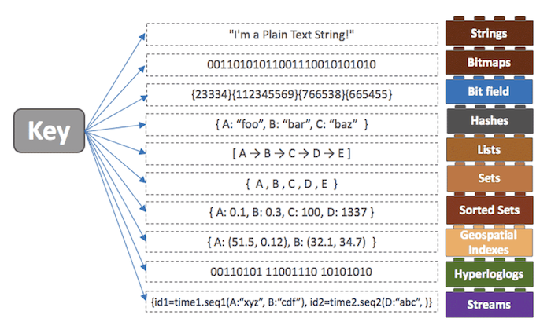

# 6주차 - OS, DB

## 메모리

### 메모리 시스템의 구조


- CPU 레지스터: 가장 자주 이용하는 데이터 보관(locality)
- 캐시: SRAM. CPU부근에서 비교적 느린 메인메모리에 저장된 데이터와 인스트럭션들의 부분집합에 대한 준비장소
- 메인메모리: DRAM. 크고 느린 디스크들에 저장된 데이터를 준비하는 데 사용, 이 디스크들은 네트워크로 연결된 다른 머신들의 디스크에 저장된 데이터를 위한 준비장소

### RAM

#### SRAM (정적 RAM)

SRAM, 즉 정적 램은 동적 램보다 더 빠르고 훨씬 비싸다. 캐시메모리로 사용되며 CPU칩 내부 또는 외부에 장착된다. 일반적으로 테스크톱 시스템은 수십 메가바이트의 SRAM을 가진다.

SRAM은 각 비트를 이중안정(bistable) 메모리 셀에 저장한다. 이중안정 본성으로 인해 SRAM 메모리 셀은 자신의 값을 전원이 공급되는 한 무한히 유지한다. SRAM은 DRAM과 달리 리프레시가 필요 없고, 외란에 민감하지 않다. 대신 DRAM보다 트랜지스터를 더 많이 사용하며 더 낮은 밀도를 가지고 더 비싸고 전력을 많이 소모한다.

#### DRAM (동적 RAM)

DRAM은 메인메모리와 그래픽 시스템의 프레임 버퍼로도 사용된다. 일반적으로 테스크톱 시스템은 수백 내지 수천 메가바이트의 DRAM을 가진다.

DRAM은 주기적으로 메모리의 모든 비트를 읽었다가 다시 써 주는 방식으로 리프레시(refresh)해야 한다. 또한 DRAM은 빛이나 전기적 잡음 같은 외란에 민감하다.

SRAM과 DRAM 모두 전원이 꺼지면 정보도 잃어버리는 휘발성 성질을 갖는다.

### 비휘발성 메모리

- 비휘발성 메모리는 전력이 끊겨도 데이터를 보관해야 하므로 메모리 내부가 복잡하고 속도가 느리며 가격이 비싸다.
- 플래시 메모리 : 디지털 카메라, MP3, USB 드라이버같이 전력 없어도 데이터를 보관하는 저장장치로 사용
- SSD : 하드디스크 대신 사용하도록 만든 비휘발성 메모리로 가격이 비싸지만 빠른 데이터 접근 속도, 저전력 등 떄문에 개인용 컴퓨터, 노트북에 자주 사용된다.

### ROM

롬은 전력이 끊겨도 데이터를 보관하는 것이 장점이지만 데이터를 한 번 저장하면 바꿀 수 없다. 이러한 특성 때문에 BIOS(Basic Input Output System) 를 롬에 저장한다.

## 파일 시스템

컴퓨터에서 파일이나 자료를 쉽게 발견 할 수 있도록, 유지, 관리하는 방법.
즉, 저장매체에는 많은 파일이 있으므로, 이러한 파일을 관리하는 방법을 말함.

- 사용자 영역이 아닌 커널 영역에서 동작
- 파일을 빠르게 읽기, 쓰기, 삭제 등 기본적인 기능을 원활히 수행하기 위한 목적

파일 시스템 특징

- 계층적 디렉터리 구조를 가진다.
- 디스크 파티션 별로 하나씩 둘 수 있다.

파일 시스템의 역할

- 파일관리 : 파일 저장, 참조, 공유
- 보조 저장소 관리 : 저장 공간 할당
- 파일 무결성 메커니즘 : 파일이 의도한 정보만 포함하고 있음을 의미
- 접근 방법 : 저장된 데이터에 접근할 수 있는 방법 제공

파일 시스템 개발 목적

- HDD와 메인 메모리 속도차 줄이기
- 파일 관리 용이
- HDD의 막대한 용량을 효율적으로 이용

주요 파일 시스템

- Windows : FAT(FAT12/16/32,exFAT), NTFS
- Linux : ext(ext2/3/4)
- Mac OS : HFS, HFS+
- Google : GFS ( Google File System으로 구글에서 사용하는 분산 파일 시스템 )

파일 시스템 구조

- 메타 영역과 데이터 영역 두가지 영역으로 구분이 된다.
- 메타 영역 : 데이터 영역에 기록된 파일의 이름, 위치, 크기, 시간정보, 삭제유무 등 파일의 정보
- 데이터 영역 : 파일의 데이터

\* 윈도우 탐색기를 이용하여 검색할때 메타 영역을 탐색하면서 파일을 찾는다.

## 데이터 베이스 기본 정리

- 데이터 베이스를 사용하는 이유
  - 데이터베이스가 존재하기 이전에는 파일 시스템을 이용하여 데이터를 관리하였다. (현재도 부분적으로 사용되고 있다.) 데이터를 각각의 파일 단위로 저장하며 이러한 일들을 처리하기 위한 독립적인 애플리케이션과 상호 연동이 되어야 한다. 이 때의 문제점은 데이터 종속성 문제와 중복성, 데이터 무결성이다.
- 데이터 베이스의 특징
  - 데이터의 독립성
    - 물리적 독립성 : 데이터베이스 사이즈를 늘리거나 성능 향상을 위해 데이터 파일을 늘리거나 새롭게 추가하더라도 관련된 응용 프로그램을 수정할 필요가 없다.
    - 논리적 독립성 : 데이터베이스는 논리적인 구조로 다양한 응용 프로그램의 논리적 요구를 만족시켜줄 수 있다.
  - 데이터의 무결성
    - 여러 경로를 통해 잘못된 데이터가 발생하는 경우의 수를 방지하는 기능으로 데이터의 유효성 검사를 통해 데이터의 무결성을 구현하게 된다.
  - 데이터의 보안성
    - 인가된 사용자들만 데이터베이스나 데이터베이스 내의 자원에 접근할 수 있도록 계정 관리 또는 접근 권한을 설정함으로써 모든 데이터에 보안을 구현할 수 있다.
  - 데이터의 일관성
    - 연관된 정보를 논리적인 구조로 관리함으로써 어떤 하나의 데이터만 변경했을 경우 발생할 수 있는 데이터의 불일치성을 배제할 수 있다. 또한 작업 중 일부 데이터만 변경되어 나머지 데이터와 일치하지 않는 경우의 수를 배제할 수 있다.
  - 데이터 중복 최소화
    - 데이터베이스는 데이터를 통합해서 관리함으로써 파일 시스템의 단점 중 하나인 자료의 중복과 데이터의 중복성 문제를 해결할 수 있다.
- 데이터베이스의 성능
  - 디스크 I/O 를 어떻게 줄이느냐에서 시작된다. 디스크 I/O 란 디스크 드라이브의 플래터(원판)을 돌려서 읽어야 할 데이터가 저장된 위치로 디스크 헤더를 이동시킨 다음 데이터를 읽는 것을 의미
  - 디스크의 성능은 디스크 헤더의 위치 이동 없이 얼마나 많은 데이터를 한 번에 기록하느냐에 따라 결정
  - 순차 I/O 가 랜덤 I/O 보다 빠를 수 밖에 없다. 하지만 현실에서는 대부분의 I/O 작업이 랜덤 I/O 이다. 랜덤 I/O 를 순차 I/O 로 바꿔서 실행할 수는 없을까? 이러한 생각에서부터 시작되는 데이터베이스 쿼리 튜닝은 랜덤 I/O 자체를 줄여주는 것이 목적

## 키

- primary key

  - Data-Table에 있는 유일하게 구분되는 Data-Key를 기본 키(Primary Key)라 부른다.
  - Primary Key는 유일한 값이기 때문에 중복된 값을 가질 수 없다.
  - Primary Key는 공백을 가질 수 없습니다
  - 기본적으로 b-tree의 index로 사용 됨
  - primary key ⇒ candidate key 중 하나.

- foreign key

  - 한 테이블과 참조 되는 다른 테이블 간의 연결되는 pk column
  - foreign Key는 다른 Primary Key를 참조하는 속성 또는 속성들의 집합을 의미한다.
  - Foreign Key는 참조관계의 기본 키와 같은 속성을 가진다.


- 슈퍼키
  - 테이블에서 **각 행을 유일하게 식별할 수 있는 하나 또는 그 이상의 속성들의 집합**이다. 슈퍼키는 유일성만 만족하면 슈퍼키가 될 수 있다.
  - **유일성**이란 하나의 키로 특정 행을 바로 찾아낼수 있는 **고유한 데이터 속성**을 말한다. 예를 들면 전국에서 나를 구별할 수 있는 유일하고 고유한 속성은 주민번호이듯이 말이다. 주민번호는 전국민이 모두 겹치지 않아 유일하고 고유한 구별 방법으로 쓰인다.
  - 학번, 주민번호, 이름+나이 가 각각 슈퍼키


- 후보 키 (Candidate Key)

  - 테이블에서 **각 행을 유일하게 식별할 수 있는 최소한의 속성들의 집합**이다. 후보키는 기본키가 될 수 있는 후보들이며 유일성과 최소성을 동시에 만족해야한다
  - Primary Key와 Foreign Key와 같은 각 Data를 식별하기 위해 사용되는 속성들의 집합입니다.
  - Candidate Key는 유일성과 최소성을 모두 만족합니다.
  - 유일성(Unique) : 하나의 Key 값으로 하나의 Data를 식별하는 성질
  - 최소성(Minimality) : 모든 Data를 유일하게 식별하는 속성으로만 구성되는 성질
  - 최소성을 만족하기 위해서는 1개가 최소임 ⇒ 학번, 주민번호


- 대체키
  - 후보키가 2개 이상이여서 1개를 pk로 썼을 때, 나머지 것들을 대체키라고한다.
  - 여기서 주민번호가 대체키.

## SQL - 기본

### SELECT

기본 구조

```SQL
SELECT 필드이름
FROM 테이블이름
```

여러 필드 조회

```SQL
SELECT 필드이름1, 필드이름2
FROM 테이블이름
```

모든 필드 조회

```SQL
SELECT *
FROM 테이블이름
```

중복 데이터를 제거하고 조회

```SQL
SELECT DISTINCT 필드이름
FROM 테이블이름
```

조건식 사용

```SQL
SELECT 필드이름
FROM 테이블이름
WHERE 필드이름=조건
```

여러 조건식을 사용

```SQL
SELECT 필드이름
FROM 테이블이름
WHERE 필드이름1=조건1
AND 필드이름2=조건2
OR 필드이름3=조건3
```

조건식의 종류

```SQL
WHERE 필드이름 BETWEEN 0 AND 100
WHERE 필드이름 NOT BETWEEN 0 AND 100

WHERE 필드이름 IN (0, 10, 100)
WHERE 필드이름 NOT IN (0, 10, 100)

WHERE 필드이름 IS NULL
WHERE 필드이름 NOT IS NULL

WHERE 필드이름 LIKE '김__'
WHERE 필드이름 NOT LIKE '김__'

WHERE 필드이름 LIKE '김%'
WHERE 필드이름 NOT LIKE '김%'
```

정렬

```SQL
SELECT 필드이름
FROM 테이블이름
ORDER BY 필드이름 DESC(혹은 ASC)
```

정렬 기준이 여러개일 때

```SQL
SELECT 필드이름
FROM 테이블이름
ORDER BY 필드이름1 DESC, 필드이름2 ASC
```

별칭 ( Alias )

```SQL
SELECT A.필드이름
FROM 테이블1 A, 테이블2 B
WHERE A.필드이름 = B.필드이름
```

### INSERT

```SQL
INSERT INTO 테이블이름(필드이름1, 필드이름2)
VALUES (값1, 값2)
```

### Update

```SQL
UPDATE 테이블이름 SET 필드이름1=값1, 필드이름2=값2
WHERE 조건
```

### DELETE

```SQL
DELETE FROM 테이블이름
WHERE 조건
```

## SQL - JOIN


### INNER JOIN -> 교집합

```SQL
SELECT 필드이름
FROM 테이블1 A
INNER JOIN 테이블2 B
ON A.필드이름1 = B.필드이름2
```

### LEFT/RIGHT JOIN -> 부분 집합

```SQL
SELECT 필드이름
FROM 테이블1 A
LEFT JOIN 테이블2 B
ON A.필드이름1 = B.필드이름2
```

```SQL
SELECT 필드이름
FROM 테이블1 A
LEFT JOIN 테이블2 B
ON A.필드이름1 = B.필드이름2
```

### OUTER JOIN -> 합집합

```SQL
SELECT 필드이름
FROM 테이블1 A
FULL OUTER JOIN 테이블2 B
ON A.필드이름1 = B.필드이름2
```

## SQL injection

SQL Injection 이란 악의적인 사용자가 보안상의 취약점을 이용하여, 임의의 SQL 문을 주입하고 실행되게 하여 데이터베이스가 비정상적인 동작을 하도록 조작하는 행위.

인젝션 공격은 OWASP Top10 중 첫 번째에 속해 있으며, 공격이 비교적 쉬운 편이고 공격에 성공할 경우 큰 피해를 입힐 수 있는 공격.

### Error based SQL Injection


논리적 에러를 이용한 SQL Injection

SQL 공격 기법은 여러 가지가 있는데 논리적 에러를 이용한 SQL Injection은 가장 많이 쓰이고, 대중적인 공격 기법.

### Union based SQL Injection


Union 명령어를 이용한 SQL Injection

SQL 에서 Union 키워드는 두 개의 쿼리문에 대한 결과를 통합해서 하나의 테이블로 보여주게 하는 키워드. 정상적인 쿼리문에 Union 키워드를 사용하여 인젝션에 성공하면, 원하는 쿼리문을 실행할 수 있게 됨. Union Injection을 성공하기 위해서는 두 가지의 조건이 있음. 하나는 Union 하는 두 테이블의 컬럼 수가 같아야 하고, 데이터 형이 같아야 함.

### 대응방안

#### 입력 값에 대한 검증

SQL Injection 에서 사용되는 기법과 키워드는 엄청나게 많음. 사용자의 입력 값에 대한 검증이 필요. 서버 단에서 화이트리스트 기반으로 검증해야 함. 블랙리스트 기반으로 검증하게 되면 수많은 차단리스트를 등록해야 하고, 하나라도 빠지면 공격에 성공하기 때문. 공백으로 치환하는 방법도 많이 쓰이는데, 이 방법도 취약한 방법. 예를 들어, 공격자가 SESELECTLECT 라고 입력 시 중간의 SELECT가 공백으로 치환이 되면 SELECT 라는 키워드가 완성되게 됩니다. 공백 대신 공격 키워드와는 의미 없는 단어로 치환되어야 함.

#### Prepared Statement 구문사용

Prepared Statement 구문을 사용하게 되면, 사용자의 입력 값이 데이터베이스의 파라미터로 들어가기 전에 DBMS가 미리 컴파일 하여 실행하지 않고 대기. 그 후 사용자의 입력 값을 문자열로 인식하게 하여 공격쿼리가 들어간다고 하더라도, 사용자의 입력은 이미 의미 없는 단순 문자열 이기 때문에 전체 쿼리문도 공격자의 의도대로 작동하지 않음.

#### Error Message 노출 금지

공격자가 SQL Injection을 수행하기 위해서는 데이터베이스의 정보(테이블명, 컬럼명 등)가 필요. 데이터베이스 에러 발생 시 따로 처리를 해주지 않았다면, 에러가 발생한 쿼리문과 함께 에러에 관한 내용을 반환. 여기서 테이블명 및 컬럼명 그리고 쿼리문이 노출이 될 수 있기 때문에, 데이터 베이스에 대한 오류발생 시 사용자에게 보여줄 수 있는 페이지를 제작 혹은 메시지박스를 띄우도록 해야 함.

#### 웹 방화벽 사용

웹 공격 방어에 특화되어있는 웹 방화벽을 사용하는 것도 하나의 방법. 웹 방화벽은 소프트웨어 형, 하드웨어 형, 프록시 형 이렇게 세가지 종류로 나눌 수 있는데 소프트웨어 형은 서버 내에 직접 설치하는 방법이고, 하드웨어 형은 네트워크 상에서 서버 앞 단에 직접 하드웨어 장비로 구성하는 것이며 마지막으로 프록시 형은 DNS 서버 주소를 웹 방화벽으로 바꾸고 서버로 가는 트래픽이 웹 방화벽을 먼저 거치도록 하는 방법.

## SQL vs NoSQL


### SQL ( RDBMS )

- 데이터 무결성을 보장
- 관계형 데이터 모델을 사용하여 정형화된 데이터 처리
- 확장성 이슈가 있어 분산 환경에 부적합
- ACID를 통해 데이터 일관성 및 안정성 보장
- JOIN을 사용하여 다른 테이블의 데이터와 관계를 맺어 사용
- 중요한 트랜잭션 처리가 요구되는 경우에 사용ㄴ

### NoSQL

- 관계형 데이터 모델을 **지양** 하며 대량의 분산된 데이터를 저장하고 조회하는 데 특화되었으며 스키마 없이 사용 가능하거나 느슨한 스키마를 제공하는 저장소를 말한다.
- 종류마다 쓰기/읽기 성능 특화, 2 차 인덱스 지원, 오토 샤딩 지원 같은 고유한 특징을 가진다. 대량의 데이터를 빠르게 처리하기 위해 메모리에 임시 저장하고 응답하는 등의 방법을 사용한다. 동적인 스케일 아웃을 지원하기도 하며, 가용성을 위하여 데이터 복제 등의 방법으로 관계형 데이터베이스가 제공하지 못하는 성능과 특징을 제공한다.
- NoSQL에서 join

  - nosql에서 join은 어려움.
  - 그래서 아래와 같은 방식으로 join을 대체
  - Denormalization ( 비정규화 )
    - 아예 처음부터 join 된 테이블(컬렉션)을 하나 만들어서 관리
  - **Aggregation**
    - 여러 집계 메소드를 이용해 join과 유사하게 사용
  - **Application Side Join**

    - Application Join을 하려면, Table 1에서 Primary Key로 한 ROW 를 읽어온 후에, TABLE 2를 가리키는 컬럼 값을 Key로 해서 다시 TABLE 2에 쿼리를 합니다.
      

      Application Side Join 은 필요한 테이블 수 만큼 NoSQL로의 Request/Response I/O가 발생하는 만큼 다소 Application 단에서 부담이 있지만, 반대로, Denormalization등에 비해서는 스토리지 사용량을 절약할 수 있습니다.

  - **1 : N relation**
    - embedded document를 사용
    - 여러 도큐먼트들이 자주 같이 사용된다면, 그걸 embedded document 형식으로 사용하면 좋음.

- 종류
  - **Key-Value Model**
    - 가장 기본적인 형태의 NoSQL 이며 키 하나로 데이터 하나를 저장하고 조회할 수 있는 단일 키-값 구조를 갖는다. 단순한 저장구조로 인하여 복잡한 조회 연산을 지원하지 않는다. 또한 고속 읽기와 쓰기에 최적화된 경우가 많다. 사용자의 프로필 정보, 웹 서버 클러스터를 위한 세션 정보, 장바구니 정보, URL 단축 정보 저장 등에 사용한다. 하나의 서비스 요청에 다수의 데이터 조회 및 수정 연산이 발생하면 트랜잭션 처리가 불가능하여 데이터 정합성을 보장할 수 없다. *ex) Redis*
  - **Document Model**
    - 키-값 모델을 개념적으로 확장한 구조로 하나의 키에 하나의 구조화된 문서를 저장하고 조회한다. 논리적인 데이터 저장과 조회 방법이 관계형 데이터베이스와 유사하다. 키는 문서에 대한 ID 로 표현된다. 또한 저장된 문서를 컬렉션으로 관리하며 문서 저장과 동시에 문서 ID 에 대한 인덱스를 생성한다. 문서 ID 에 대한 인덱스를 사용하여 O(1) 시간 안에 문서를 조회할 수 있다.
    - 대부분의 문서 모델 NoSQL 은 B 트리 인덱스를 사용하여 2 차 인덱스를 생성한다. B 트리는 크기가 커지면 커질수록 새로운 데이터를 입력하거나 삭제할 때 성능이 떨어지게 된다. 그렇기 때문에 읽기와 쓰기의 비율이 7:3 정도일 때 가장 좋은 성능을 보인다. 중앙 집중식 로그 저장, 타임라인 저장, 통계 정보 저장 등에 사용된다. *ex) MongoDB*
  - **Column Model**
    - 하나의 키에 여러 개의 컬럼 이름과 컬럼 값의 쌍으로 이루어진 데이터를 저장하고 조회한다. 모든 컬럼은 항상 타임 스탬프 값과 함께 저장된다.
    - 구글의 빅테이블이 대표적인 예로 차후 컬럼형 NoSQL 은 빅테이블의 영향을 받았다. 이러한 이유로 Row key, Column Key, Column Family 같은 빅테이블 개념이 공통적으로 사용된다. 저장의 기본 단위는 컬럼으로 컬럼은 컬럼 이름과 컬럼 값, 타임스탬프로 구성된다. 이러한 컬럼들의 집합이 로우(Row)이며, 로우키(Row key)는 각 로우를 유일하게 식별하는 값이다. 이러한 로우들의 집합은 키 스페이스(Key Space)가 된다.
    - 대부분의 컬럼 모델 NoSQL 은 쓰기와 읽기 중에 쓰기에 더 특화되어 있다. 데이터를 먼저 커밋로그와 메모리에 저장한 후 응답하기 때문에 빠른 응답속도를 제공한다. 그렇기 때문에 읽기 연산 대비 쓰기 연산이 많은 서비스나 빠른 시간 안에 대량의 데이터를 입력하고 조회하는 서비스를 구현할 때 가장 좋은 성능을 보인다. 채팅 내용 저장, 실시간 분석을 위한 데이터 저장소 등의 서비스 구현에 적합하다.

## 레디스(Redis)

Redis는 Memcached와 비슷한 캐시 시스템으로서 동일한 기능을 제공하면서 영속성, 다양한 데이터 구조와 같은 부가적인 기능을 지원. 레디스는 모든 데이터를 메모리에 저장하고 조회. 즉, 인메모리 데이터베이스.

빠른 성능은 레디스의 특징 중 일부분. 다른 인메모리 디비들과의 가장 큰 차이점은 레디스의 다양한 자료구조를 지원한다는 것.



이렇게 다양한 자료구조를 지원하게 되면 개발의 편의성이 좋아지고 난이도가 낮아진다는 장점이 존재.

예를들어, 어떤 데이터를 정렬을 해야하는 상황이 있을 때, DBMS를 이용한다면 DB에 데이터를 저장하고, 저장된 데이터를 정렬하여 다시 읽어오는 과정은 디스크에 직접 접근을 해야하기 때문에 시간이 더 걸린다는 단점이 있음. 하지만 이 때 In-Memory 데이터베이스인 Redis를 이용하고 레디스에서 제공하는 Sorted-Set이라는 자료구조를 사용하면 더 빠르고 간단하게 데이터를 정렬할 수 있음.

NoSQL로서 Key-Value 타입의 저장소인 레디스(Redis, Remote Dictionary Server)의 주요 특징은 아래와 같음.

- 영속성을 지원하는 인메모리 데이터 저장소
- 읽기 성능 증대를 위한 서버 측 복제를 지원
- 쓰기 성능 증대를 위한 클라이언트 측 샤딩(Sharding) 지원
- 다양한 서비스에서 사용되며 검증된 기술
- 문자열, 리스트, 해시, 셋, 정렬된 셋과 같은 다양한 데이터형을 지원. 메모리 저장소임에도 불구하고 많은 데이터형을 지원하므로 다양한 기능을 구현
