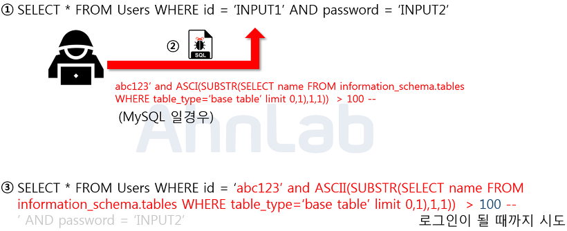

# 메모리(Memory)

파일 시스템 관점에서 메모리 할당은 6가지 방식으로 나뉜다.

## Contiguous

이름에서 알 수 있듯이 연속적으로 메모리에 데이터를 할당하는 방식이다. IBM 360 같은 OS에서 쓰였던 방식이다. 

장점

* 파일을 읽는데 오버헤드가 없다
* 계산이 어렵지 않다

단점

* 외부 단편화가 심각함
* 파일 확장을 못함

## Extent

기존의 파일 매핑을 일일히 하는 방식과는 달리, 인접한 곳에 메모리 뭉터기를 받아서 block이 연속된 공간에 저장되도록한다.

장점

* 여전히 성능은 좋다
* 계산이 쉽다
* 메타데이터로 인한 overhead는 적다

단점

* 외부단편화를 어느정도는 해결함(완벽히는 아님)
* extent가 모자랄 때 까지는 파일이 커지는게 가능하다.

## Linked Allcation

말 그대로 linked list의 형태로 파일을 할당해서 다음 파일이 어디 있는지를 이전노드를 통해 따라가면서 할당하는 방식이다.

장점

* 외부단편화는 전혀 발생하지 않는다
* 파일의 확장이 매우 쉽다(Linked list 구조이므로)

단점

* random access에 매우 취약하다(n번 노드에 접근한다면 1번 부터 타고 올라가야한다)

* linked list pointer로 인해서(저장할 공간) 내부 단편화가 발생한다.(블럭하나를 pointer를 위해서 할당해야함)

## File Allocation Table

linked list의 한 종류로써 linked list의 정보를 개별 노드가 아닌 FAT라는 테이블이 가지고 있다. 장점은 linked list와 동일하고 단점은 매번 file access 가 발생할 때마다 2번의 읽기 연산이 수행된다는 점이다(FAT table + 파일)

## Multi-Level Indexed Allocation

파일을 할당할 때 메모리의 주소를 알 수 있게 fixed-size의 pointer block을 파일에 각각 할당해준다.

장점

* random access 에 강함
* external fragmentation 걱정이 없음
* 파일이 커지는게 가능하다.(제한이 있긴하나 거의 무한대임)

단점

* 파일을 접근하는데 파일이 커지면 속도가 느려짐

# 파일 시스템

## 파일이란 무엇인가?

* 쓸 수 있거나 읽을 수 있는 바이트 단위의 모임을 의미한다. 디렉토리도 하나의 파일의 종류이다.

## 파일의 이름의 종류

파일의 이름에는 다음과 같은 3가지 종류가 존재한다.

* INODE number
* PATH
* File Descriptor

### INODE number

* 파일이 시스템에서 가지는 컴퓨터 방식의 이름이다. 숫자로 이루어져 있다. 

### PATH

* 위의 inode number대로 파일 이름을 지정하면 문제는 사용자가 파일을 특정하게 힘들게 된다. 그렇게 해서 파일 이름을 문자열로 나타내고 inode number와 일대일 대응을 저장해 놓는 파일을 따로 생성한다. 또한 파일을 root폴더 보다는 폴더별로 세분해서 담는게 분류에도 좋기 때문에 디렉토리로 나눠서 담는다.

하지만 이러한 단점이 존재한다. 예를 들어 inode x번 파일을 읽는다고 하면 바로 읽는 것이 가능하나, 다음과 같이 /etc/bashrc/settings 를 읽는다고 하면 과도하게 read연산이 많이 소요된다.

### File Descriptor

* 위의 path를 매 연산마다 수행하게 되면 연산도 늘고 효율성도 떨어지게 되므로 현재 읽는 파일에 대해서 해당 프로세스의 메모리안에 해당 파일의 주소를 넣는 방식이다.

## 디스크 내에서 구조

디스크 내에 있는 파일은 VSFS의 경우 다음과 같은 구조가 된다. 

* Super block

현재 해당 파일 시스템 내부에 대해서 전반적으로 기록하는 노드이다. 블럭의 크기, inode 의 번호, inode table 의 시작점이다. 파일 시스템이 처음 디스크에 mount 될 때 컴퓨터에서 읽는 정보다.

* Inode bitmap

inode table 에서 어떤 inode 가 현재 사용중인지 표시하는 bitmap이다.

* Data bitmap

Data 영역에서 어느 부분이 쓰이는지 아닌지를 비트맵으로 표현한 구간이다.

* Inode table

파일들의 inode와 여러가지 정보를 저장하는 테이블이다. 안에는 또다른 inode를 가르킬 수 있는 table이 있어 inode 테이블에서 또다른 inode로 된 data block을 가르킬 수 있게하는 간접 포인터도 존재한다.

# 키(Key) 정리

## Key란?

키(Key)는 데이터베이스에서 조건에 만족하는 튜플을 찾거나 순서대로 정렬할 때 다른 튜플들과 구별할 수 있는 유일한 기준이 되는 Attribute(속성)입니다. 

## Key의 종류 
[출처](https://jerryjerryjerry.tistory.com/49)

* 슈퍼키(Super Key)

    

    테이블에서 각 행을 유일하게 식별할 수 있는 하나 또는 그 이상의 속성들의 집합을 의미한다. 슈퍼키는 유일성만 만족하면 슈퍼키가 될 수 있다. 최소성은 성립하지 않아도 된다. 이 표의 예시로 들면 학번+주민번호, 학번+이름+나이도 superkey가 될 수 있다.

    ※ 유일성이란?
    
    유일성이란 해당 키의 값이 해당 테이블 안에서 해당 튜플에만 **유일**하게 존재하는지 여부이다.

    ※ 최소성이란?

    해당키가 유일성이 성립하고 여러개의 키로 이루어져 있을 때 해당 키를 이루는 키 중에서 하나라도 빠지면 유일성이 성립하지 않을 때 최소성이 성립한다고 한다. 최소한의 키의 개수로 유일성이 성립하는지를 의미하는 것이다.

* 후보키(Candidate Key)
    
    

    슈퍼키중에서 희소성을 만족한 키만이 후보키가 되는 것이다. 위의 사례에서 이름 + 나이가 후보키가 안되는 이유는 이름만으로도 이미 충분이 각 튜플들을 구분이 가능하기 때문이다. 고로 후보키는 학번, 주민번호, 이름이다.

* 기본키(Primary Key)
    
    

    이러한 후보키들 중에서 유일하게 선택하여서 튜플을 구분하는 키이다. **NULL 값을 절대로 가질 수 없다**

* 교체키(Alternative Key)

    후보키중에서 기본키 이외의 나머지 키이다.

* 외부키(Foreign Key)

    테이블이 다른 테이블을 참조하여 테이블간의 관계를 연결해주는 키 참조 되는 테이블 쪽에서는 반드시 해당 키가 기본키여야 한다. 예를들어 R1, R2 가 있을 때 R2에서 R1키중 하나를 참조했을 때 해당 외부키는 R1에서 기본키여야 한다.

# SQL - 기본

    SQL은 사용 용도에 따라서 DDL(Data Definition Language) DML(Data Manipulation Language) DCL(Data Control Language)로 나뉜다.

## DDL(데이터 정의어)

    SCHEMA, DOMAIN, TABLE, VIEW 등을 정의하거나 변경 또는 삭제 하기 위해서 사용하는 언어이다.

* CREATE

    말 그대로 해당 데이터 구조를 만드는 것이다.

    EX) CREATE TABLE 테이블명;

* ALTER

    TABLE에 대한 정의를 바꾸는데 사용한다.

    EX) ALTER TABLE 해당테이블 ADD 속성이름 데이터타입;
        ALTER TABLE 해당테이블 DROP COLUMN 열이름;

* DROP

    해당 자료구조를 없에기 위한 명령어다.(DELETE와는 다르다!)

    EX) DROP TABLE 테이블명;

## DML(데이터 조작어)

    데이터베이스에 사용자가 저장된 데이터를 실질적으로 처리하는데 사용되는 언어이다.

* SELECT

    테이블에서 조건에 맞는 튜플을 검색한다.

        SELECT 필드이름
            
        FROM 테이블 이름

        [WHERE 조건식]

* INSERT

    테이블에 새로운 튜플을 삽입함

        INSERT INTO 테이블명
        VALUES (데이터1, 데이터2 ...)

* DELETE 

    테이블에서 조건에 맞는 튜플을 삭제함

        DELETE 
        FROM 테이블명
        [WHERE 조건식];

* UPDATE
    
    테이블에서 조건에 맞는 튜플의 내용을 변경함

        UPDATE 테이블명
        SET 속성명 = 데이터
        WHERE 조건;

## DCL(데이터 제어어)

    데이터의 보안, 무결성, 회복, 병행 수행 제어등을 정의하는데 사용되는 언어이다.

* COMMIT

    수행된 결과를 실제 물리적 디스크로 저장하고 데이터베이스 조작 작업이 완료되었음을 관리자에게 알려줌

            
* ROLLBACK

    데이터베이스 조작 작업을 이전 상태로 돌릴 때 사용하는 명령어
    
* GRANT 

    데이터베이스 사용자에게(TO) 사용 권한을 부여함

        GRANT 권한 ON 테이블명 TO 사용자;
    

* REVOKE
    
    GRANT 와 반대로 해당 권한을 사용자로부터(FROM) 가져올 때 사용하는 명령어

        REVOKE 권한 ON 테이블명 FROM 사용자;

# SQL - JOIN
[참조](https://gent.tistory.com/376) 

JOIN 이라는 말은 여러 SQL 테이블을 조합하여서 하나의 SQL 열로 표현한 것이다. JOIN에는 크게 3가지 종류가 존재한다. inner, outer, cross JOIN 이 존재한다. 

## INNER JOIN

쉽게 말하면 교집합에 해당되는 JOIN이다. 공통된 값을 가지는 열만 SELECT 된다.

## OUTER JOIN

* LEFT OUTER JOIN

    

    

    왼쪽 테이블에서 데이터를 오른쪽 테이블과 합치고 싶은데 오른쪽 테이블에 데이터가 없는 열이 있더라도 해당 데이터를 NULL로 표시하고 JOIN 해준다.

* RIGHT OUTER JOIN

    

    

    LEFT JOIN과 마찬가지로 행에 없는 데이터가 있더라도 데이터를 NULL로 표시하고 JOIN해준다.

* FULL OUTER JOIN

    

    이름의 FULL로 알 수 있듯이 LEFT 와 RIGHT 의 결과값을 합쳐준다.

## CROSS JOIN

두 테이블에서 곱집합을 반환한다. 다시말해, 오른쪽 테이블로 부터 왼쪽 테이블에서 각각 행이 한번씩 결합된 열을 만든다. 

# SQL Injection
[참조](https://noirstar.tistory.com/264)

[참조](https://velog.io/@yanghl98/Database-SQL-Injection)

SQL 인젝션이란 악의적인 사용자가 보안상의 취약점을 활용하여 자신이 원하는 SQL문을 주입하는 공격방식이다.

## 공격 종류 및 방법

* 인증 우회

    SQL 인젝션 공격의 대표적인 경우로, 로그인 폼(Form)을 대상으로 공격을 수행한다. 정상적인 계정 정보 없이도 로그인을 우회하여 인증을 획득할 수 있다.

    

    위의 예시와 같이 로그인을 할 때 사용되는 sql문에 ' OR 1 = 1문을 넣어서 모든 유저들의 데이터를 가져올 수 있게 해준다. (--의 뒤는 모두 주석 처리 된다.)

* 데이터 노출

    시스템에서 발생하는 에러 메시지를 이용해 공격하는 방법이다. 예시로는 union, boolean, time 기반의 sql이 존재한다.

    

    * table을 합쳐서 보여준다는 union 의 특성을 활용해서 모든 유저들의 id 와 비밀번호를 가져올 수 있게 해주는 문장이다. 단, union의 특성에 맞게 원래 불러오는 테이블의 열 수와 불러올 열 수가 같아야 하므로  null 값을 넣어준다.

    

    * 해당 예시는 첫 번째 글자가 ascii code로 100인지를 비교해서 만약에 일치한다면 로그인을 되어서 첫번 째 글자를 알아내는 방식이다. 이를 무차별 대입하게 된다면 테이블 이름을 알아낼 수 있다.

    

    * 응답이 동일한 경우 응답을 지연시키는 query를 사용해서 참인지 거짓인지를 판별하는 방식이다.

## 방어법

* 입력 값에 대한 검증

    입력 값에 만약에 특수 문자가 있다면 요청을 막게 된다면 sql injection에 대한 피해를 줄인다

* error message 노출 금지

    error message를 노출하지 않는다면 데이터 베이스 내부에 대한 정보를 알 수 없게 되므로 공격에 덜 취약하다.

* prepared statement 구문 사용

    INSERT INTO MyGuests VALUES(?, ?, ?)

    입력을 문자열 처리를 하므로써 sql injection을 원천적으로 차단하는 방식이다.

# SQL vs NoSQL

## SQL 

* 특징

    * 다른 말로 관계형 데이터 베이스이다.
    * 정해진 형식에 따라 테이블에 저장이 된다.
    * 수직적 확장만 지원

## NOSQL

* 특징

    * 비-관계형 데이터 베이스임
    * 데이터가 고정 되어 있지 않다.
    * 유형으로는 문서, 키-값, 그래프가 있다.
    * schema가 비교적 유연해서 데이터를 읽을 때 스키마에 따라서 읽는다. 이를 schema on read라고 한다.

* 종류

    Key-Value 타입
    * 속성을 Key-Value의 쌍으로 나타내는 데이터를 배열의 형태로 저장한다. 딕셔너리와 비슷
    * Redis, Dynamo 등이 대표적인 Key-Value 형식의 데이터베이스이다.
    
    문서형(Document) 데이터베이스
    * 데이터를 테이블이 아닌 문서처럼 저장하는 데이터베이스를 의미한다. JSON과 유사한 구조를 지녔다
    * 각각의 문서는 하나의 속성에 대한 데이터를 가지고 있고, 컬렉션이라고 하는 그룹으로 묶어서 관리한다. 
    * 대표적인 문서형 데이터베이스에는 MongoDB 가 있다.
    
    그래프(Graph) 데이터베이스
    
    * 그래프의 형식으로 데이터를 나타낸다.
    * 각 노드간 관계를 연결해서 표시한다.
    * 대표적인 예시로는 Neo4J, InfiniteGraph 가 있다.

## 차이점 및 사용해야 되는 경우

### SQL

1. 데이터 흐름의 안정성을 지켜야 하는 경우
2. 사용하는 데이터가 구조가 있고 일관성이 있는 경우

### NOSQL

1. 구조가 없는 대용량의 데이터를 사용하는 경우
2. 데이터의 구조가 자주 변하는 경우

# 레디스(Redis)

레디스는 Remote Dictionary Server의 약자로써 키-값 구조의 데이터를 관리하기 위한 비정형 데이터 관리 시스템이다. 특징으로는 모든 데이터를 메모리에 저장하고 있다는 점이다.

## 특징

1. 위의 그림과 같이 다양한 자료형을 제공할 수 있으므로 다양한 자료를 형식과 상관 없이 처리 할 수 있게 되어서 사용한다.

2. I/O 계산은 발생하게 되면 상당한 오버헤드가 발생하는데 만약 서버단위에서 수백건의 I/O계산을 직접처리하려면 애로사항이 발생하게 되므로 일단 메모리에 저장해서 I/O계산으로 인한 불편함을 해소한다.

3. 디스크에 저장하기 위해 모든 로그를 파일에 기록하는 방식인 AOF(append on file)과 메모리에 있는 모든 것을 디스크에 기록하는 snapshotting 방식을 활용한다.