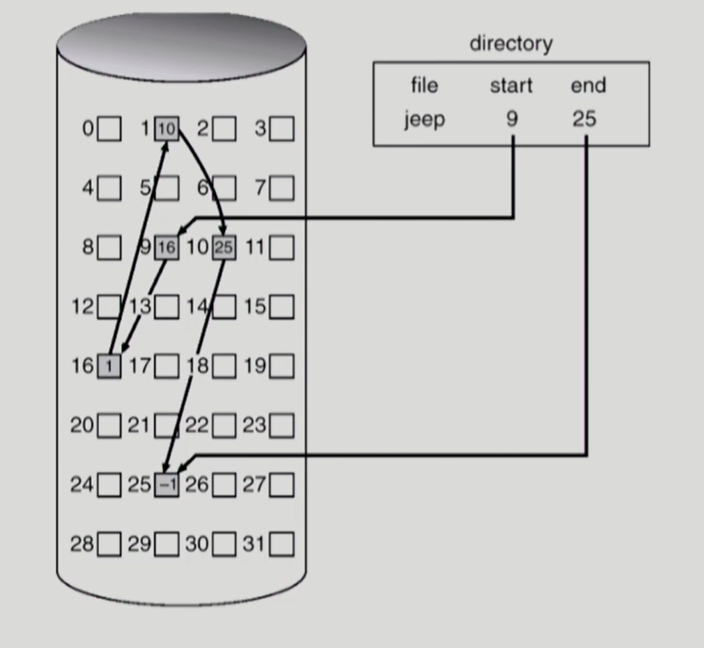

## 목차

#### 운영체제

1. 메모리(Memory)
2. 파일 시스템

#### 데이터베이스

1. 키(Key) 정리
2. SQL - 기본
3. SQL - JOIN
4. SQL Injection
5. SQL vs NoSQL
6. 레디스(Redis)


------------

# OS 1. 메모리(Memory)

### 메모리 계층 구조


 CPU에 가까울수록 속도가 빠르고 단위당 가격이 비싸다.

#### 1. 메인 메모리(RAM)

CPU가 직접 접근할 수 있는 기억 장치이다. 프로세스가 실행되려면 프로그램이 메인 메모리에 올라와야 한다.

#### 2. MMU(메모리 관리 장치)

CPU가 메모리에 접근하는 것을 관리하는 하드웨어 부품이다. 필요한 데이터가 없을 경우 디스크에서 해당 메모리를 가져온다. 

 5주차에서 배웠듯, MMU는 Logical address를 Physical address로 매핑해주는 즉, 주소변환을 하는 하드웨어이다. 

##### MMU가 하는 일

1. 데이터를 가져오면서 base와 limit register을 활용해 프로세스 합법적인 주소를 가져오는지 확인하고 trap을 발생시켜 보호할 수 있다.
2. MMU는 logical memory를 physical address로 변환해줄 수 있기 때문에 logical address를 사용할 수 있다. 이것은 실제 메인메모리의 사이즈보다 더 큰 사이즈로 메모리를 프로세스에 할당할 수 있있음을 말한다. 
   * 프로세스 실행 도중 페이지 폴트가 발생한 경우 OS로 CPU 제어권이 넘어가고 OS 페이지 교체 알고리즘으로 victim 선정 후 그곳에 I/O 작업으로 불러온다.

#### 3. 캐시 메모리

메인 메모리와 CPU 사이에 자주 사용하는 데이터의 일부를 임시로 저장하는 기억장치로 메인 메모리에서 읽어오는 것보다 훨씬 빠르게 내용을 읽을 수 있다. 

CPU에서 주소를 전달 후 캐시메모리에 명령이 존재하는지 확인하고 바로 줄 수 있다. 캐시를 잘 활용한다면 비용을 많이 절감할 수 있기 때문에 CPU가 어떤 데이터를 원할지 예측할 수 있어야 한다.

이때 ```지역성의 원리```를 사용한다.

* 시간 지역성 : 최근에 참조된 주소가 곧 다음에도 참조될 수 있다.
* 공간 지역성 : 참조된 주소와 인접한 주소가 다시 참조될 수 있다.

##### 캐시라인

캐시를 관리하는 방식으로 Full Associative, Set Associative, Direct Mapped 등이 있다.

먼저 제일 간단한 “direct map” 방식부터 살펴보면, ```메모리 주소의 일부```를 인덱스(위에서 태그로 표현한 부분)로 사용하여 관리하는 방식이다. 이러한 방식 때문에, 같은 인덱스를 갖는 메모리가 인접하여 액세스되는 경우 cache miss가 발생할 수 있다. 데이터 블록 크기만큼 캐시되지 않으면서, 주소의 부분만을 인덱스로 사용하는 방식이기 때문에 캐시되지 않은 인접 데이터로 인해 cache miss가 발생하는 시나리오다.

다음은 “Full Associative” 방식으로 쉽게 설명하면 비어있는 캐시메모리가 있으면 그냥 마음대로 주소를 저장하는 방식이다. 이 때문에, 반드시 DRAM이 아닌 SRAM을 사용해야 하며 저장할 때는 크게 알고리즘이 필요없어서 간단한데, 찾을 때가 문제다.  어떠한 조건이나 규칙이 없으니 ```특정 캐쉬 Set내의 모든 블럭을 한 번에 찾아 원하는 데이터가 있는지 검사```해야 하며 이를 위해 CAM (Content Addressable Memory) 라는 특수한 형태의 메모리 구조를 사용해야 한다. 여기서는 인덱스 대신 index + tag 조합으로 된 태그 부분으로 구성된다.

마지막으로 Set Associative 방식이다. 여러 개의 Direct Mapped 방식으로 나누어 사용한다고 생각하면 된다. 본래 메모리 주소의 일부만을 이용하여 태그로 사용하는 Direct Mapped 방식이기에 이를 2개, 4개로 구성한 여러 개의 Direct Mapped 방식에 Multiplexer와 OR gate를 조합한다. -> [출처](https://seokbeomkim.github.io/posts/cache-line/)

#### 4. 가상 메모리

가상 메모리는 물리 메모리의 크기와 관계없이 메모리를 사용할 수 있도록 지원하는 기술이다. 현대 메모리 관리에서는 이러한 가상 메모리를 통해 물리 메모리의 크기와 프로세스가 올라갈 메모리의 위치를 신경쓰지않고 프로그래밍하도록 지원한다.

* 장점 : 물리적 메모리에 제약을 받지 않는다. 병행성 및 cpu 이용률이 올라간다.
* page falut 하는 경우 전반적인 속도 저하가 있다.


# OS 2. 파일 시스템

## File and File System

**File : 관련 정보를 이름을 가지고 저장**

* 일반적으로 비휘발성의 보조기억장치에 저장
* 운영체제는 일반파일뿐만 아니라 다양한 저장 자치들을 file이라는 논리적 단위로 관리


**File attribute (or metadata)**

* 파일 자체의 내용이 아니라 파일을 관리하기 위한 각종 정보들
  * 파일 이름, 유형, 저장된 위치, 파일 사이즈
  * 접근 권한(읽기/쓰기/실행), 시간(생성/변경/사용), 소유자 등
* 보통 파일의 메타데이터는 파일이 포함된 디렉토리에 기록


**File System**

* 운영체제에서 파일을 관리하는 소프트웨어 부분
* 파일 및 파일의 메타데이터, 디렉토리 정보 등을 관리
* 파일의 저장 방법 결정할지 혹은 파일 보호 등을 담당


### Directory and Logical Disk 

* 일반 파일은 그 ```파일의 내용```을 담고 있지만 디렉토리 파일은 디렉토리 파일안에 존재하는 ```파일이 어떤 것```인지, 그 디렉토리 안에 있는 파일의 메타데이터를 내용으로 하는 일종의 파일이다.
  * 디렉토리는 일부 메타 데이터는 직접 저장하지만 일부 데이터는 다른 곳에 저장하기도 한다. 

**Partition (= logical Disk)**

* 하나의 물리적인 디스크를 파티션을 통해 여러 논리적인 디스크로 구분할 수 있다.
* 하나의 물리적 디스크 안에 여러 파티션을 두는게 일반적이다.
* 혹은 여러 개의 물리적인 디스크를 하나의 파티션으로 구성하기도 한다.
* 물리적 디스크를 파티션으로 구성한 뒤 각각의 파티션에 file system을 깔거나 swapping 등 다른 용도로 사용할 수 있다.


#### Open

* 파일의 메타 데이터를 디스크에서 메인 메모리로 올려놓는 작업이다.


예를 들어, open("a/b")인 경우

1. 사용자 메모리 영역의 프로세스가 open ("a/b") 하겠다는 system call 호출한다.
2. CPU 제어권이 OS로 넘어가고 directory path를 search한다.
   * OS에는 프로세스별 PCB가 존재하고 전체 프로그램들의 open file을 관리하는 global한 테이블이 있다. root metadata는 미리 OS에게 알려져있기 때문에 root metadata를 open한다.
3. root metadata는 파일의 위치 정보가 들어있기 때문에 이동 후 metadata의 content를 확인하고 그 안에 하위 파일인 a의  metadata를 찾는다.
4. "a"의 metadata를 메모리에 올려놓는다. 즉, "a"를 open한다. 
5.  a의 metadata는 a 파일시스템의 위치 정보가 들어있다. a의 위치정보에서 a의 content를 확인하고 그 안에 하위의 "b"의 metadata를 찾는다.
6. 파일 "b"의 metadata를 메모리에 올려놓는다. b의 open이 끝나면, system call이 끝나서 결과값을 리턴하게 된다.

> metadata를 통해 위치 확인 후 이동, 이동 후 content 확인하여 그 하위 파일의 metadata를 찾아 메모리에 올려놓는다.(open)


보통 프로세스 PCB에는 **각 프로세스가 오픈한 파일들의 metadata point를 가지고 있는 배열** 이 있는데 그곳의 b파일의 metadata point를 저장한다. 배열의 index 번호가 파일 디스크립터이자 리턴값이 된다.

Directory path search는 많은 시간이 소요되지만 한번 open한 파일은 파일 디스크립터로 위치를 파악할 수 있기 때문에 read / write시 directory search가 불필요하다.


#### read(fd)

* read할 때 파일 디스크립터만 쓰면 된다. 예 : read(fd) 
* 그러면 파일 디스크립터 (즉, 인덱스)를 통해서 metadata 읽고 - metadata 안에 파일 위치 확인 -  content 읽기 
* content에서 파일을 읽으면,  ```사용자 프로그램에게 직접주는 것이 아니라``` OS에서 자신의 메모리 공간 buffer에 놓고 그 내용을 ```copy```해서 사용자 프로그램에게 전달한다.
  * 다른 프로그램이 동일한 파일을 동일한 위치를 요청하게 되면, 디스크까지 가지 않아도 OS에서 저장된 것을 바로 줄 수 있다.  -> 이것을 ```buffer caching```이라고 한다.


#### buffer caching

paging 기법은 이미 메모리에 올라와있는 page의 경우 운영체제가 별도의 작업을 하지 않는다. 하드웨어가 바로 주소 변환을 통해서 바로 접근했다. 즉, page fault가 난 경우만 운영체제가 swap영역에서 읽어오는 작업을 했다.

반면 파일 시스템의 경우, OS가 버퍼캐시를 가지고 있고, 요청한 내용이 버퍼캐시에 있든 없든 **운영체제에게 CPU 제어권이 넘어가게 된다.** 즉, 모든 정보를 운영체제가 알기 때문에 LRU, LFU 알고리즘을 사용할 수 있다.


#### open file table

현재 open 된 파일들의 메타데이터 보관소(in memory)이다. 

메타 데이터가 디스크에서 메모리로 올라가게 되면 디스크의 메타데이터보다 몇 가지 정보가 추가된다.
* open한 프로세스의 수

* file offset : 파일 어느 위치 접근 중인지 표시(별도 테이블 필요)

  * offset은 프로세스마다 별도로 가지고 있다. 

  * a라는 프로세스가 A라는 파일의 어떤 위치에 접근했는지
  * b라는 프로세스가 A라는 파일의 어떤 위치에 접근했는지 가 다르기 때문이다.

* file descriptor (file handle, file control block)
  * open file table에 대한 위치 정보(프로세스 별)

  

## File System의 Mounting


각각의 논리적인 디스크는 파일 시스템을 설치에서 관리할 수 있다.

루트 파일 시스템을 사용하는데 만약 다른 파일 시스템의 접근하고자할 때 사용하는 방식이 바로 Mounting이다. 특정 디렉토리 이름을 또 다른 파티션의 파일시스템의 루트에 연결시키는 것을 의미한다. 그래서 서로 다른 파일 시스템에 접근할 수 있게 된다.


## File System Implementation

1. Contiguous Allocation

   * 파일이 연속, 순차적으로 저장

   

   ##### 단점 : 

   * ```외부 조각 ```발생할 수 있다.
   * 파일의 크기는 중간중간에 변경된다. 이때 파일의 크기를 커지는 것에 제약이 있을 수 있다.
   * 커질 것을 대비해서 빈 공간을 미리 확보하는 방법이 있지만 여전히 커지는 것이 제약이 있고, 당장 사용하지 않는 공간이기 때문에 ``내부 조각``이 발생할 가능성이 있다.

   ##### 장점 :

   * fast I/O 가능 : 디스크에서 읽어오는 대부분의 시간은 헤드가 움직이는 시간이 차지하게 된다. 보통은 읽거나 쓰는 시간은 별로 많지 않다. 그렇기 때문에 contiguous한 방법은 많은 양의 데이터를 가져올 수 있다. 즉, 한번 seek를 하면 나머지 연속된 부분을 헤드의 움직임없이 한꺼번에 가져올 수 있다. 
   * 보통 프로세스의 swapping 용도에서 많이 사용된다. swap area부분은 계속 저장되는 디스크 부분이 아니라 임시로 프로세스의 일부분을 임시로 저장하는 공간으로  공간효율성보다 ```속도 효율성```이 중요하기 때문에 빠른 I/O를  contiguous allocation을 사용한다.
   * 또는 real time이 중요한 경우 사용한다.
   * Direct (직접 접근)이 가능하다. 배열처럼 필요한 인덱스부분을 확인할 수 있다.  

2. Linked Allocation

   * 파일의 시작 위치만 가지고 있고 그 다음 위치를 기록해놓는 방법이다.

   

   ##### 장점

   * 외부 조각이 발생하지 않는다.

   ##### 단점

   * 디스크는 직접접근이 가능하지만 이 방법을 사용하게 되면 순차접근만 가능하게 된다.
     * Seek를 계속하기 때문에 I/O가 느리다
   * Reliability 문제 - 파일을 구성하는 sector가 고장나면 pointer가 유실되면 뒷 부분의 순서도 잃어버리게 된다.
   * pointer를 위한 공간이 block의 일부가 되어서 공간 효율성이 떨어진다.
     * 한 sector는 512byte저장 가능하다 그리고 포인터 저장은 4byte

   **File allocation table(FAT)** 파일 시스템

   * 포인터를 별도의 위치에 보관하여 Reliability와 공간 효율성 문제를 해결한방법이다.

3. Indexed Allocation

   * 직접 접근이 가능하기 위해서 한 block에 인덱스 정보를 저장하는 방식이다. 
   * 4번째 블록을 보고 싶으면 10으로 이동하면 된다.

   

   **단점**

   * 아무리 작은 파일이어도 최소 2개의 block이 필요하다. 그래서 작은 파일인 경우 공간 낭비가 발생한다. 또한 실제로 많은 파일들이 작은 파일에 해당한다.
   * 너무 큰 파일인 경우 하나의 인덱스 블록으로 다 표현할 수 없게 된다. 
     * linked scheme : 파일의 위치를 적다가 다 채울 수 없다고 판단한 경우 마지막 부분에 또 다른 인덱스 블럭을 적는다.
     * multi-level index : 2단계 페이지 테이블을 사용하는 것처럼 첫번째 인덱스 블록이 다른 인덱스 테이블 블록을 가리키도록 하는 방법이다.

   **장점**

   * 외부 조각이 발생하지 않는다.
   * Direct Access가 가능하다.

   

## 실제 사용하는 파일 시스템의 저장방법

### UNIX 파일 시스템 구조

Indexed Allocation을 변형해서 사용한다. 


#### Boot Block

* 부팅에 필요한 정보(bootstrap loader) 가장 처음에 있다.

#### Super Block

* 파일 시스템에 관한 총체적인 정보를 담고 있다.
  * 어디까지 빈 block이고 어디까지 사용한 block인지를 관리
  * 어디까지 Inode인지 등등

#### Inode list

* 파일 이름을 제외한 파일의 모든 **메타 데이터를 저장**한다.
* 파일의 메타데이터는 파일이 포함된 디렉토리에 들어있는데 유닉스의 경우 디렉토리가 메타데이터를 일부 가지고 있고 실제 메타데이터들은 별도의 공간에서 보관하게 된다. 그 공간이 바로 Inode list 부분이다.
* 파일 하나당 inode가 하나씩 할당된다. (빨간 네모)
* 파일의 메타데이터 중 **파일의 이름은 디렉토리**가 가지고 있다.

#### Data Block

* 파일의 실제 내용을 보관한다.


### FAT File System

* Linked Allocation을 사용한 방법이다.


#### FAT

* 파일의 메타데이터의 일부(**위치정보**만)를 FAT에 저장하고 나머지 메타 데이터는 Directory file이 가지고 있다.
* FAT은 Data block에 들어있는 n개의 파일 개수만큼의 길이를 갖는다.
* FAT은 **그 다음 블록의 주소**를 가지고 있다. 
  * 예를 들어 A라는 파일의 217 block에 있을 경우 다음 block은 618번이라는 것을 FAT을 통해 쉽게 알 수 있다.
  * 이를 통해 **직접 접근도 가능**하다. 예를 들어 A파일의 3번째 block에 접근할 경우 217 FAT을 보고 217-618-339으로 한번에 파악할 수 있다.
  * Linked Allocation을 단점을 극복했다고 볼 수 있다. block 유실되더라도 FAT을 통해 그 다음을 확인할 수 있음
* 보통 FAT은 중요한 정보이기 때문에 2 copy로 가지고 있다.


>  대표적으로 2개의 파일시스템을 보았지만 실제로 사용하는 파일시스템은 많이 있다.


## 비어있는 파일시스템 공간 관리(Free Space Management)

1. Bit map or bit vector

   * 비트맵을 통해서 비어있는 파일 시스템 공간을 관리하는 방법이다.
   * 비트맵의 크기는 block 개수로 만큼 있어서 각각의 비트를 통해서 0과 1로 표시한다. 
   * 비트맵은 부가적인 공간이 필요하다. (but 한 공간당 1비트만 차지하기 때문에 아주 작은 공간만 필요한 것임)
   * 연속적인 n개의 free block을 찾는데 효과적이다. 

2. Linked list

   * 비어있는 block들을 링크로 연결시키는 방법이다.
   * 비트맵처럼 추가적인 공간 낭비는 존재하지 않지만 연속적인 가용공간을 찾는 것이 쉽지 않다

   

3. Grouping

   * indexed allocation 방법과 비슷한 방법이다.
   * 첫번째 free block에 비어있는 공간의 pointer을 가지는 방법이다. 마지막 부분은 또 다른 인덱스 블록을 가르키도록 한다. 

   

   * 연속적인 빈 공간을 찾기는 쉽지 않다.

4. Counting

   * 빈 공간 자체에 대한 포인터와 그 위치부터 연속적으로 몇개가 비어있는지를 알려줌으로써 연속적인 빈 블록에 대해 쉽게 접근할 수 있는 방법이다.
   * 첫번째 빈 공간을 가르키고 연속적인 빈 블록이 몇 개인지를 쌍으로 관리하는 방법이다.
   * (first free block, # of contiguous free blocks)


# DB 1. 키(Key) 정리


### 1. 후보키

릴레이션을 구성하는 속성들 중에서 튜플을 **유일하게 식별할 수 있는 속성들의 부분집합을 의미**한다. 릴레이션에 있는 모든 튜플에 대해서 **유일성과 최소성을 만족**시키고 기본키가 될 수 있는 후보이다.

예를 들어, <학생> 릴레이션에서 '학번'이나 '주민번호'는 다른 레코드를 유일하게 구별할 수 있는 기본키로 사용할 수 있기 때문에 후보키가 될 수 있다.

### 2. 기본키

 후보키 중에서 선택한 주키(Main Key)이다. 한 릴레이션에서 **특정 튜플을 유일하게 구별할 수 있는 속성**으로 **Null 값을 가질 수 없다.** 그리고 기본키로 정의된 속성에는 **동일한 값이 중복되어 저장될 수 없다.**

### 3. 대체키

후보키가 둘 이상일 경우 기본키를 제외한 나머지 후보키를 말한다. 보조키라고 할 수 있다.

예를 들어, <학생> 릴레이션에서 '학번'이나 '주민번호' 중 '학번'을 기본키로 정의하면 주민번호는 후보키이자 대체키가 된다.

### 4. 슈퍼키

한 릴레이션 내에 있는 속성들의 집합으로 구성된 키로 유일성은 만족하지만 최소성은 만족하지 않는다.

예를 들어, <학생> 릴레이션에서는 '학번', '주민번호', '학번'+'주민번호', '학번'+'주민번호'+'성명' 등으로 슈퍼키를 구성할 수 있다. 앞에 나온 예시는 모두 튜플들을 유일하게 구분할 수 있는 키이지만 키가 최소한으로 이루어져 있지 않다.

### 5. 외래키

관계(Relation)를 맺고 있는 릴레이션 R1, R2에서 릴레이션 R1이 참조하고 있는 릴레이션 R2의 기본키를 말한다.  외래키는 **참조되는 릴레이션의 기본키와 대응되어 릴레이션 간에 참조 관계를 표현하는데 중요한 도구**로 사용되기 때문에 참조 테이블의 기본키에 없는 값은 입력할 수 없다.

예를 들어, <수강> 릴레이션이 <학생> 릴레이션을 참조하고 있으므로 <학생> 릴레이션의 '학번'은 기본키이고, <수강> 릴레이션의 '학번'은 외래키이다. <수강> 릴레이션의 '학번'에는 <학생> 릴레이션의 '학번'에 없는 값은 입력할 수 없다.


# DB 2. SQL - 기본

## SQL이 지원하는 기능


### DDL(Data Definition Language)

데이터베이스를 정의하는 언어이며, 데이터베이스를 생성, 수정, 삭제하는 등의 구조를 정의한다.

#### Create

데이터베이스, 테이블 등을 생성하는 역할을 한다.

**테이블 만들기**

```sql
create table customer(
    ID		int			not null,
    name 	varchar(20) not null,
    age 	int			not null,
    address char(25)
);
```

**기존에 존재하는 테이블과 동일한 구조를 가진 테이블 생성**

```sql
CREATE TABLE NEW_TABLE AS
SELECT * FROM OLD_TABLE WHERE 1=2
```

**기본키 제약조건 추가**

```SQL
ALTER TABLE CUSTOMER
ADD CONSTRAINT pk_customer primary key (ID);
```

**테이블과 함께 기본키 생성**

```sql
create table customer(
    ID		int			not null,
    name 	varchar(20) not null,
    age 	int			not null,
    address char(25)
    constraint pk_customer primary key (ID)
);
```

#### Alter

테이블을 수정하는 역할을 한다.

예시 : 테이블에 새로운 컬럼을 추가하는 경우

``` SQL
ALTER TABLE EMPLOYEE
ADD SALARAY INT NOT NULL
```

#### Drop | Truncate

데이터베이스, 테이블을 삭제하는 역할을 한다.

Drop : 테이블 전체를 삭제하고 공간, 객체를 모두 삭제한다.

Truncate : 테이블의 데이터가 삭제되지만 테이블 자체가 지워지는 것은 아니다.

#### 

### DML(Data Manipulation Language)

데이터 조작어라고 하며 데이터베이스의 입력된 레코드를 조회하거나 수정, 삭제, 추가하는 역할을 한다.

##### SELECT 

```SQL
SELECT * FROM TABLE WHERE 조건절
```

##### INSERT

```sql
INSERT INTO TABLE VALUES (값1, 값2 ...)
// 테이브의 모든 열 구성에 맞게 입력
```

##### UPDATE

```SQL
UPDATE TABLE SET 열 = 값 [WHERE 조건식]
```

##### DELETE

```SQL
DELETE FROM TABLE [WHERE ..]
// 조건식에 맞춰 데이터 삭제 , 조건식이 없다면 모든 데이터 삭제
```


### SQL 실행순서

##### 문법 작성 순서

````
1. SELECT 컬럼명
2. FROM 테이블명
3. WHERE 조건식
4. GROUP BY 컬럼명
5. HAVING 조건식
6. ORDER BY 컬럼명
````

##### 실행 작동 순서

```
1. FROM
2. ON
3. JOIN
4. WHERE
5. GROUP BY
6. CUBE | ROLLUP
7. HAVING
8. SELECT
9. DISTINCT
10. ORDER BY
11. TOP
```


# DB 3. SQL - JOIN

두 개 이상의 테이블이나 데이터베이스를 연결하여 데이터를 검색하는 방법이다. 여러 개의 테이블을 하나의 테이블인것처럼 활용할 수 있다.

### 조인의 종류

- INNER JOIN
- LEFT OUTER JOIN
- RIGHT OUTER JOIN
- CROSS JOIN
- SELF JOIN


``` SQL
SELECT A.NAME, B.AGE
FROM TABLE_A
INNER(OUTER LEFT,OUTER RIGHT) JOIN TABLE_B ON 조건식
```

### INNER JOIN


**교집합**으로 생각하면 쉽다. 테이블간의 중복된 값을 보여준다.


### LEFT OUTER JOIN , RIGHT OUTER JOIN


LEFT OUTER JOIN은 ```기준테이블의 값과 중복된 값```을 조회한다.

RIGHT OUTER JOIN은 ```JOIN 테이블의 값과 중복된 값```을 조회한다.


#### CROSS JOIN


```SQL
SELECT A.NAME, B.AGE
FROM TABLE_A
CROSS JOIN TABLE_B ON 조건식
```

JOIN하는 테이블과 기준 테이블의 모든 ROW를 JOIN하는 방식으로 N * M개의 결과가 나오게 된다.  보통 많이 사용하는 JOIN은 아니고 비용도 매우 큰 연산이다.


#### SELF JOIN


셀프 조인은 자기 자신과 조인함을 의미한다. 셀프 조인은 위계성의 데이터를 다루거나, 순차성 데이터, 관계성을 명시되어야할 데이터가 여러개 존재할 경우 사용된다.

사용예시를 통해 왜 셀프조인 필요한지 알 수 있다.


직속상관의 이름 확인하기

``` SQL
SELECT E.*
FROM EMPLOYEE AS E
INNER JOIN EMPLOYEE AS M ON E.MANAGER_ID = M.ID
```


# DB 4. SQL Injection

> 참고 : 다양한 웹 서비스 해커 공격이 있기 때문에 공개되어있는 해킹 보안 방법을 검색하여 적용하면 된다.
>
> 예 : django sql injection 예시 및 방지 - [django injection 방지](https://www.stackhawk.com/blog/sql-injection-prevention-django/)

### SQL 인젝션이란?

데이터베이스가 연동되는 웹 어플리케이션에서 공격자가 입력가능한 폼에 조작된 질의문을 삽입하여 웹 서비스의 데이터베이스 정보를 열람하고 조작할 수 있는 취약점이다.


### SQL 인젝션의 종류와 공격방법

#### Error Based SQL Injection

Where 절 이후 동적쿼리가 되어있다고 가정했을 때, 사용자 입력값에 ``` or 1 =1 --(주석)```을 넣으면 or 라는 연산으로 인해 1 = 1이 참이므로 항상 참이된다. 그래서 비밀번호 유효성 검증을 하지 않고 로그인을 할 수 있다.

```sql
SELECT * FROM MEMBER WHERE id = "사용자 입력값" and password = ' 아무값' or 1=1 --
```

#### Union Based SQL Injection

2개 이상의 쿼리를 요청하여 결과를 얻어내는 UNION 연산자를 이용한 공격방법이다.

UNION 연산자를 이용하기 위해서는 2개의 테이블의 동일한 필드 개수를 가져야하기 때문에 사전 공격을 통해 해당 정보를 알아내야 한다.

```honggd’ UNION SELECT cardNo, password FROM card_log --'```을 입력하면 성공한다.

```sql
SELECT name, age FROM member WHERE id = 'honggd' UNION SELECT cardNo, password FROM card_log -- '
```

#### Blind Based SQL Injection

DB에서 데이터를 얻어내는 방법들과 다르게 쿼리의 참거짓으로 값을 유추하는 방법이다.

보통 자동화 프로그램을 이용해서 리턴되는 값을 알아내고 DB정보와 버전을 알아낼 수 있다.

만약 참거짓의 응답결과(리턴값)가 같은 경우 시간 지연시키는 쿼리를 주입해 시간 차이로 injection한 결과가 참인지 거짓인지 파악하고 값을 유추한다.


### SQL injection을 방어하는 방법

- DB 계정의 권한을 제한한다.
- 쿼리 스트링을 사용하지 않고 PreparedStatement, SqlCommand 등을 이용한다.
- 가능한 한 동적 쿼리를 지양한다.
- 클라이언트 측 뿐만아니라 서버 측에서도 사용자 입력 값에 주석, DB 연산자가 있는지 유효성 검사를 한다.
  - 서버단에서 화이트리스트(영어,숫자)인지 체크한다.
  - javascript에서만 검증하지 않고 서버단에서 다시한번 체크해야 한다.
  - 사용자 입력값을 데이터베이스에 그대로 저장하지 않고 해시 함수로 해싱후 저장한다.
- 데이터베이스의 에러 메세지를 사용자 화면에 보여주지 않는다.

#### Parameter Binding

```java
statement = connection.createStatement();
String query = "SELECT * FROM USERS WHERE name =' " + loginName + 
    "' And Password '" + loginPassword + "'";
boolean resultSet = statement.execute(query);
```

입력값을 바로 쿼리에 넣어 처리하지 말고 

```java
String prepareStatementQuery = "SELECT * FROM USERS WHERE name = ? And password = ?";
PreparedStatement preparedStatement = connection.prepareStatement(prepareStatementQuery);

preparedStatement.setString(1, loginName);
preparedStatement.setString(2, loginPassword);
```

이렇게 처리하면된다.

SetString 을 실행하면  ```isEscapeNeededForString```의 내부 함수를 통해 입력값을 확인하며 escape해준다. 

기존에 입력된 값이 : " 1234' or '1' = '1 " 라면

setString을 통해 ```" '1234" or "1" = "1' "``` 변경된다.

[참고자료](https://velog.io/@dimstar/SQL-Injection-%EA%B0%9C%EB%85%90)


# DB 5. SQL vs NoSQL

#### SQL (Structured Query Language)

SQL은 관계형 데이터베이스 관리 시스템(RDBMS)의 데이터를 관리하기 위해 설계된 특수 목적의 프로그래밍 언어이다.


#### RDBMS(Relational Database Management System)

관계형 데이터베이스는 자료를 테이블과 열,칼럼으로 표현한다. 그리고 대표적인 RDBMS로는 MySQL, 오라클 데이터베이스, PostgreSQL 등이 있다. SQL를 사용하면 여러 테이블에 있는 데이터를 그 관계에 따라 join하여 합칠 수 있다.


#### NoSQL 

NoSQL은 비관계형 데이터 베이스라고 한다. 전통적인 관계형 데이터베이스 보다 덜 제한적인 ```일관성 모델```을 이용한다. NoSQL 데이터베이스는 빅데이터와 실시간 웹 어플리케이션의 널리 쓰이고 SQL 계열의 쿼리 언어를 사용할 수 있다는 점을 강조하기 위해서 Not Only SQL이라고도 불린다.

대표적인 것으로는 CouchDB, Neo4j, Cassandra, HBase, Amaxon DynamoDB 등이 있다. 비 관계형 데이터 베이스의 경우 일반적으로 조인 연산은 지원하지 않는다.

NO SQL의 경우 다시 네 분류로 나눠질 수 있다.

1. 키-값 저장소 (key-value store)
2. 그래프 저장소(graph store)
3. 칼럼 저장소 (column store)
4. 문서 저장소 (document store) : 객체 또는 JSOn 유사 형식의 문서로 표시, 이 형식은 개발자에게 효율적이고 직관적인 데이터 모델이다. 


#### NoSQL이 적합한 이유

1. 유연성 : 일반적으로 유연한 스키마를 제공하여 빠르고 반복적인 개발을 가능하게 해준다. 또한 이런 유연한 모델은 반정형 및 비정형 데이터를 이상적으로 만들어준다.

2. 확장성 : 고가의 강력한 서버를 추가하는 대신 분산형 하드웨어 클러스터를 이용해 확장하도록 설계되었다. scale-out 가능

3. 고성능 : 특정 데이터 모델 및 액세스 패턴에 대해 최적화되어 관계형 데이터베이스를 통해 유사한 기능을 충족하려는 때보다 더 뛰어난 성능을 보여준다.

   예를들어, RDMS는 정규화가 되어있어서 여러 테이블의 조인 연산을 통해 쿼리를 수행하지만 NoSQL의 경우 쿼리에 최적화된 형태로 저장하기 때문에 한 테이블의 자료만으로 쿼리를 처리할 수 있어 더 빠르게 처리가 가능하다.

4. 고기능성 : 각 데이터 모델에 맟춰 특별히 구축된 API와 데이터 유형을 제공한다.


#### NoSQL 단점

- ACID(Atomicity, consistency, isolation, durability) **트랙잭션이 보장되지 못한다.**

- 데이터의 **중복을 제거하지 않고 쿼리에 최적화된 형태로 저장**하기 때문에, 당연히 같은 데이터 저장에 대해 더 많은 공간이 필요하다.


# DB 6. 레디스(Redis)


 메모리 기반의 “키-값” 구조 데이터 관리 시스템이며, 모든 데이터를 메모리에 저장하고 조회하기에 빠른 Read, Write 속도를 보장하는 **비 관계형 데이터베이스**이다.

Redis는 빠른 오픈 소스 인 메모리 키-값 데이터 구조 스토어이며, ```다양한 인 메모리 데이터 구조 집합```을 제공하므로 사용자 정의 애플리케이션을 손쉽게 생성할 수 있다.

레디스는 크게 5가지< String, Set, Sorted Set, Hash, List >의 데이터 형식을 지원한다.

redis는 데이터베이스, 캐시, 메시지 브로커로 사용된다.

* 캐시 : 나중의 요청에 대한 결과를 미리 저장했다가 빠르게 사용하는 것을 말한다.
* 인 메모리 방식이란 컴퓨터의 메인 메모리에 데이터를 올려서 사용하는 방법을 말한다. 이 방식은 빠른 속도라는 장점을 가지고 있다.   


### Redis의 등장배경

Database보다 더 빠른 memory에 **자주 접근하고 덜 자주 바뀌는 데이터**를 저장해볼까하는 생각으로 등장하게 되었다. 


### 레디스의 자료구조


redis 는 key-value 형태로 데이터를 저장한다. key 는 문자열이며, 최대 512MB 까지 가능하다. key 를 가독성있게 잘 설계하는 것이 중요하다

#### key 와 관련된 커맨드

- EXISTS <key> : 해당 key 가 존재하는지 확인
- DEL <key1> <key2> ... : key 삭제
- TYPE <key> : key의 value 가 어떤 데이터타입을 사용하고 있는지 반환
- SCAN <cursor> [match pattern] [count] : key의 목록을 커서단위로 얻어옴


### 레디스의 특징

1. 레디스는 single thread를 사용한다. 그 결과 atomic함을 보장하고 race condition을 회피할 수 있지만 오래 걸리는 명령을 실행할 경우 오랜 시간이 걸려 다른 명령에도 영향을 줄 수 있기 때문에 O(N)이 걸리는 명령은 되도록 피한다.
   * single Thread를 사용하는 이유는 주로 CPU를 사용하는 것이 아니라 ```IO bound process```를 주로 사용하고 개발의 단순화를 위해서이다. 
2. 영속성 보장을 위해 보관과 백업기능이 있다 하지만 영속성으로 레디스를 사용하는 것은 많은 노력이 소요됨으로 추천되지는 않는다. 기존에도 cache의 용도로 사용되기 때문이다.
   * redis는 shutdown이 되면 모든 데이터가 날아갈 수 있기 때문에 ```AOF(Append Only File)``` 혹은 ```RDB(snapshot)```을 지원한다.
3. 읽기 성능 증대를 위한 서버 측 복제를 지원한다.
4. 쓰기 성능 증대를 위한 클라이언트 측 ```샤딩(Sharding)```을 지원한다.
5. 문자열, 리스트, 해시, 셋, 정렬된 셋과 같은 다양한 데이터형을 지원한다.
6. Redis Server는 **1개의 싱글 쓰레드로 수행**되며, 따라서 서버 하나에 여러개의 서버를 띄우는 것이 가능하다.
   * 버전 6부터는 부분적으로 멀티스레드가 도입되었다.
     1. 클라이언트에서 전송한 명령을 읽고 파싱하는 부분
     2. 명령어 처리 결과를 클라이언트에게 전송하는 부분
     3. 명령어 실행자체는 메인스레드에서 처리함으로 여전히 싱글스레드로 봐야한다.


### 레디스 메모리 관리

#### Memory 파편화

RAM에서 메모리의 공간이 작은 조각으로 나뉘어져 사용가능한 메모리가 충분히 존재하지만 할당이 불가능한 상태를 **메모리 단편화**라고 한다.

메모리 단편화를 해결하기 위해서 4.x대부터 jemalloc을 사용하여 메모리를 할당하는데 만약 jmalloc이 메모리 페이지 사이즈를 **4096byte**로 잡으면 **1byte**만 저장하게 되어도 **4096byte**를 할당된다. 그렇기 때문에 사용하지 않는 메모리 공간이 발생하게 되고 개발자는 정확한 메모리 사용량을 파악하기 어렵다.

#### 가상 메모리의 Swap

 Redis는 메모리에 데이터를 저장하여 사용한다. 만약 ``물리적인 메모리``보다 더 많은 용량을 사용하려고 한다면 swap 공간을 만들어 저장한다. swap이 있다면 swap 사용으로 해당 메모리 page 접근시 늦어지는 ``latency``가 발생할 수 있다.(because single thread이기 때문) 그렇기 때문에 swap을 사용할 것인지 말것인지를 고려해야한다.  

#### Replication - Fork

redis 서버는 단독으로 사용되지 않는다. 보통 **영속성과** **고가용성**을 높이기 위해 클러스링 방식으로 많이 사용한다. Master-Replica(구; Slave라고 부름) 형태로 구성된다. Master의 데이터를 Replica로 복제한다.

전체 메모리 용량이 8GB인 서버에서 Master가 사용중인 메모리 용량이 5GB라고 하면 fork로 순간적인 메모리 사용량이 10GB로 메모리 부족이 일어나서 fork가 발생하지 않고 죽는 현상이 발생할 수 있다.


[참고자료 1]( https://sjh836.tistory.com/178)

[참고자료 2](https://zangzangs.tistory.com/72)

[참고자료 3](https://www.oss.kr/storage/app/public/festival/track2/2-1.pdf)

> 아직 안봄 (꼭 보기) : 
>
> [우테크세미나](https://www.youtube.com/watch?v=mPB2CZiAkKM&t=1240s)
