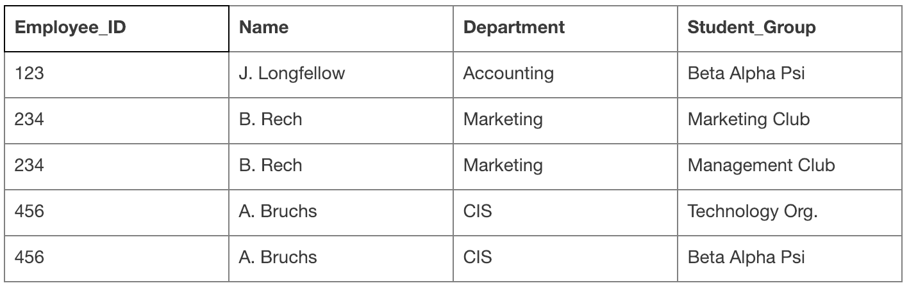
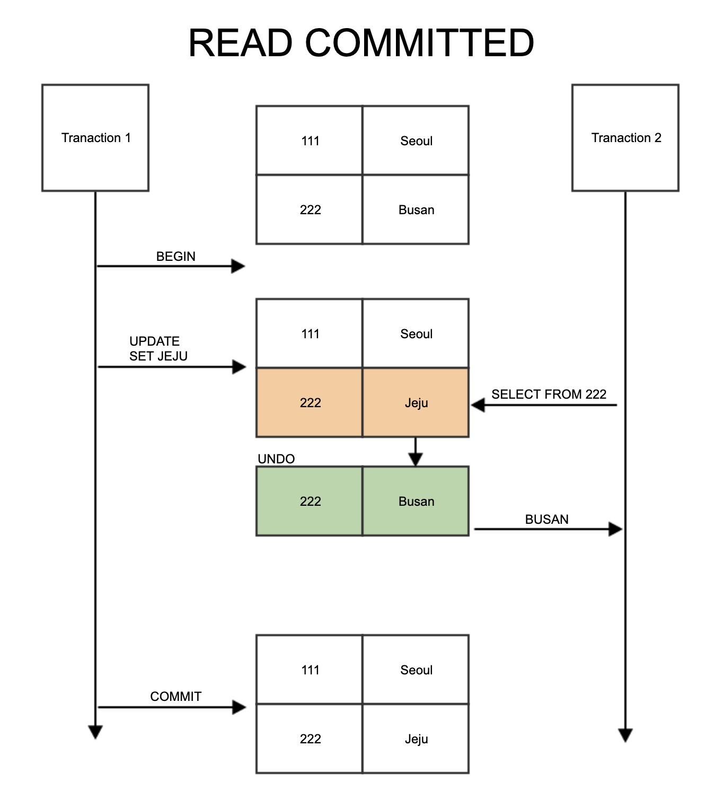
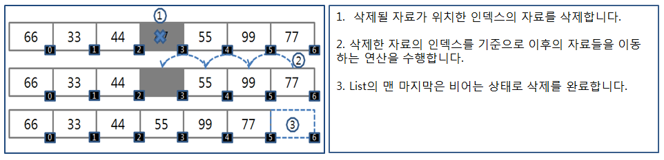

# 7주차 - DB, 자료구조

## 정규화

데이터베이스 정규화란 데이터베이스의 설계를 재구성하는 테크닉.

정규화를 통해 불필요한 데이터(redundancy)를 없앨 수 있고, 삽입/갱신/삭제 시 발생할 수 있는 각종 이상현상(Anamolies)들을 방지할 수 있음.

### 정규화의 목적

데이터베이스 정규화의 목적은 주로 두 가지.

1. 불필요한 데이터(data redundancy)를 제거한다.

2. 데이터 저장을 "논리적으로" 한다.

### 정규화를 하지 않았을 때 문제점


와 같이 정규화가 되지 않은 구조의 테이블(Adam이라는 학생이 두 번 들어가 있다.)의 경우, 데이터 핸들링시 다양한 이상현상이 발생.

1. Update : Adam의 Address가 변경되었을 때, 여러줄의 데이터를 갱신해야 함. 이로인해 데이터의 불일치(inconsistency)가 발생할 수 있음.

2. Insert : 만약 학생이 아무 과목도 수강하지 않는다고 하면, Subject_opted 컬럼에는 NULL이 들어갈 것임.

3. Deletion : 만약 Alex 학생이 과목 수강을 취소한다면 Alex의 레코드가 아예 테이블에서 지워짐.

위와 같이 정규화가 제대로 되지 않은 테이블의 경우 갱신/삽입/삭제 시 다양한 문제점이 발생할 수 있음.

이를 테이블의 구성을 논리적으로 변경하여 해결하고자 하는 것이 바로 정규화.

정규화의 법칙(Normalization Rule)은 1차정규화, 2차정규화, 3차정규화, BCNF, 4차정규화, 5차정규화로 나눌 수 있음.

실무적으로 4차, 5차 정규화까지 하는 경우는 많지 않음.

### 1차 정규화


1차 정규형은 각 로우마다 컬럼의 값이 1개씩만 있어야 함.

이를 컬럼이 원자값(Atomic Value)를 갖는다고 함.

예를 들어, 아래와 같은 경우 Adam의 Subject가 Biology와 Maths 두 개 이기 때문에 1차 정규형을 만족하지 못함.

위의 정보를 표현하고 싶은 경우 이렇게 한 개의 로우를 더 만들게 됨.

결과적으로 1차 정규화를 함으로써 데이터 redundancy는 더 증가. 데이터의 논리적 구성을 위해 이 부분을 희생.


### 2차 정규화

2차 정규화부터가 본격적인 정규화의 시작이라고 볼 수 있음. 2차 정규형은 테이블의 모든 컬럼이 **완전 함수적 종속**을 만족하는 것.

즉, **기본키중에 특정 컬럼에만 종속된 컬럼(부분적 종속)이 없어야 한다는 것.**

위 테이블의 경우 기본키는 (Student, Subject) 두 개로 볼 수 있음. 이 두 개가 합쳐져야 한 로우를 구분할 수가 있음.

근데 Age의 경우 이 기본키중에 Student에만 종속되어 있음. 즉, Student 컬럼의 값을 알면 Age의 값을 알 수 있음. 따라서 Age가 두 번 들어가는 것은 불필요한 것으로 볼 수 있음.

**Student Table**


**Subject Table**


이를 해결하기 위한 방법은 위처럼 테이블을 분리.

그러면 두 테이블 모두 2차 정규형을 만족. 위 테이블의 경우 삽입/갱신/삭제 이상을 겪지 않게 됨.

하지만 조금 더 복잡한 테이블의 경우, 갱신 이상을 겪기도하는데 이를 해결하는 것이 바로 3차 정규화.

### 3차 정규화


이와 같은 데이터 구성을 가정.

Student_id가 기본키이고, 기본키가 하나이므로 2차 정규형은 만족하는 것으로 볼 수 있음. 하지만 이 데이터의 Zip 컬럼을 알면 Street, City, State를 결정할 수 있음.

또한 여러명의 학생들이 같은 Zip코드를 갖는 경우에 Zip코드만 알면 Street, City, State가 결정되기 때문이 이 컬럼들에는 중복된 데이터가 생길 가능성이 있음.

정리하면 3차 정규형은 기본키를 제외한 속성들 간의 **이행적 함수 종속**이 없는 것. 즉, **기본키 이외의 다른 컬럼이 그외 다른 컬럼을 결정할 수 없는 것**

3차 정규화는 2차정규화와 마찬가지로 테이블을 분리함으로써 해결, 두 개의 테이블로 나눔으로써 3차 정규형을 만족할 수 있습니다.


이를 통해 데이터가 논리적인 단위(학생, 주소)로 분리될 수 있고, 데이터의 redundancy도 줄었음을 알 수 있습니다.

### BCNF

BCNF는 (Boyce and Codd Normal Form) 3차 정규형을 조금 더 강화한 버전.

이는 3차 정규형으로 해결할 수 없는 이상현상을 해결할 수 있음. BCNF란 3차정규형을 만족하면서 모든 결정자가 후보키 집합에 속한 정규형.

아래와 같은 경우를 생각해보면, 후보키는 수퍼키중에서 최소성을 만족하는 건데, 이 경우 **(학생, 과목)**.

(학생, 과목)은 그 로우를 유일하게 구분할 수 있음. 근데 이 테이블의 경우 교수가 결정자.

(교수가 한 과목만 강의할 수 있다고 가정) 즉, 교수가 정해지면 과목이 결정. 근데 교수는 후보키가 아님. 따라서 이 경우에 BCNF를 만족하지 못함.

3차 정규형을 만족하면서 BCNF는 만족하지 않는 경우는 언제일까? 주로 일반 컬럼이 후보키를 결정하는 경우입니다.


위와 같이 테이블이 구성된 경우에 데이터가 중복되고, 갱신 이상이 발생. 예를 들어 Mr.Sim이 강의하는 과목명이 바뀌었다면 두 개의 로우를 갱신해야함. 이를 해결하기 위해서는 마찬가지로 테이블을 분리.

교수 테이블


수강 테이블


## 이상

좋은 관계형 데이터베이스를 설계하는 목적 중 하나가 정보의 이상 현상(Anomaly) 이 생기지 않도록 고려해 설계하는 것.

이상 현상은 갱신 이상(Modification Anomaly), 삽입 이상(Insertion Anomaly), 삭제 이상(Deletion Anomaly) 으로 구성.

- 갱신 이상(Modification Anomaly): 반복된 데이터 중에 일부를 갱신 할 시 데이터의 불일치가 발생.
- 삽입 이상(Insertion Anomaly): 불필요한 정보를 함께 저장하지 않고서는 어떤 정보를 저장하는 것이 불가능.
- 삭제 이상(Deletion Anomaly): 필요한 정보를 함께 삭제하지 않고서는 어떤 정보를 삭제하는 것이 불가능.

### 예시

나쁜 설계의 예시



위 테이블은 한 회사의 근무자(employee) 테이블.

근무자가 속한 부서(Department), 참여하고 있는 학생 그룹(Student_Group)을 나타냄.

- 갱신 이상: 만약에 A. Bruchs의 부서가 CIS에서 Marketing으로 바뀌었다고 가정. 테이블의 4, 5번째 행의 CIS를 둘 다 바꾸지 않고 하나만 바꾼다면 A.Bruchs의 부서는 어느 부서에 속해있는지 알 수 없게 됨.
- 삽입 이상: 새로운 부서 Engineering이 신설되었고 아직 근무자는 없다고 가정. 하지만 이 부서에 관련한 정보는 불필요한 정보를 함께 입력하지 않는 한 위 테이블에 입력할 수 없음.
- 삭제 이상: 만약에 Accounting 부서에 속한 사람이 J.Longfellow 단 한 명이라고 가정. J.Longfellow의 정보(첫번째 행)를 삭제하면 Accounting 부서에 대한 정보도 사라지게 됨.

## 인덱스

- 인덱스
  - 책의 맨 처음 또는 맨 마지막에 있는 색인이라고 할 수 있다
  - 이 비유를 그대로 가져와서 인덱스를 살펴본다면 **데이터는 책의 내용이고 데이터가 저장된 레코드의 주소는 인덱스 목록에 있는 페이지 번호**가 될 것
  - DBMS 도 데이터베이스 테이블의 모든 데이터를 검색해서 원하는 결과를 가져 오려면 시간이 오래 걸린다. 그래서 칼럼의 값과 해당 레코드가 저장된 주소를 키와 값의 쌍으로 인덱스를 만들어 두는 것
  - DBMS 의 인덱스는 **항상 정렬된 상태를 유지하기 때문에 원하는 값을 탐색하는데는 빠르지만 새로운 값을 추가하거나 삭제, 수정하는 경우에는 쿼리문 실행 속도가 느려진다**. 결론적으로 DBMS 에서 인덱스는 데이터의 저장 성능을 희생하고 그 대신 데이터의 읽기 속도를 높이는 기능
  - 또한, 인덱스가 많아지면 데이터 저장성능이 떨어져 오히려 역효과만 발생
- 인덱스 자료구조
  - B+-Tree
    - 칼럼 값을 변형하지않고, 원래의 값을 통해 인덱싱
      
      
  1. **모든 key, data가 리프노드**에 모여있습니다. B트리는 리프노드가 아닌 각자 key마다 data를 가진다면, B+트리는 리프 노드에 모든 data를 가집니다.
  2. **모든 리프노드가 연결리스트**의 형태를 띄고 있습니다. B트리는 옆에있는 리프노드를 검사할 때, 다시 루트노드부터 검사해야 한다면, B+트리는 리프노드에서 선형검사를 수행할 수 있어 시간복잡도가 굉장히 줄어듭니다.
  3. **리프노드의 부모 key는 리프노드의 첫번째 key보다 작거나 같습니다.** 그림의 B+트리는 리프노드의 key들을 트리가 가지고 있는 경우여서, data 삽입 또는 삭제가 일어날 때 트리의 key에 변경이 일어납니다. 해당 경우뿐만 아니라 data의 삽입과 삭제가 일어날 때 트리의 key에 변경이 일어나지 않게 하여 더욱 편하게 B+트리를 구현하는 방법도 존재하기 때문에 **작거나 같다**라는 표현을 사용하였습니다.
  - **Hash Index 알고리즘**
    - 칼럼의 값으로 해시 값을 계산해서 인덱싱하는 알고리즘으로 매우 빠른 검색을 지원한다. 하지만 값을 변형해서 인덱싱하므로, **특정 문자로 시작하는 값으로 검색을 하는 전방 일치와 같이 값의 일부만으로 검색하고자 할 때는 해시 인덱스를 사용할 수 없다**. 주로 메모리 기반의 데이터베이스에서 많이 사용한다
  - **왜 index 를 생성하는데 b-tree 를 사용하는가?**
    - 데이터에 접근하는 시간복잡도가 O(1)인 hash table 이 더 효율적일 것 같은데? SELECT 질의의 조건에는 부**등호(<>) 연산도 포함이 된다**. hash table 을 사용하게 된다면 등호(=) 연산이 아닌 **부등호 연산의 경우에 문제**가 발생한다. 동등 연산(=)에 특화된 `hashtable`은 데이터베이스의 자료구조로 적합하지 않다.
  - SELECT 쿼리의 성능을 월등히 향상시키는 INDEX 항상 좋은 것일까?
  - 쿼리문의 성능을 향상시킨다는데, 모든 컬럼에 INDEX 를 생성해두면 빨라지지 않을까? *결론부터 말하자면 그렇지 않다.* 우선, 첫번째 이유는 INDEX 를 생성하게 되면 INSERT, DELETE, UPDATE 쿼리문을 실행할 때 별도의 과정이 추가적으로 발생한다. INSERT 의 경우 INDEX 에 대한 데이터도 추가해야 하므로 그만큼 성능에 손실이 따른다. DELETE 의 경우 INDEX 에 존재하는 값은 삭제하지 않고 사용 안한다는 표시로 남게 된다. 즉 row 의 수는 그대로인 것이다.
- **Composite Index**
  여러 컬럼을 복합적으로 지정하는 인덱스.
  인덱스로 설정하는 필드의 속성이 중요하다. title, author 이 순서로 인덱스를 설정한다면 title 을 search 하는 경우, index 를 생성한 효과를 볼 수 있지만, author 만으로 search 하는 경우, index 를 생성한 것이 소용이 없어진다. 따라서 SELECT 질의를 어떻게 할 것인가가 인덱스를 어떻게 생성할 것인가에 대해 많은 영향을 끼치게 된다.
  결합 인덱스를 생성할 때 순서도 중요함.
  a,b 순서로 composite index를 사용하면 a를 통해 최대한 많이 걸러낸 데이터를 이용하여 b를 조회.
  그렇기 때문에 더 많이 걸러낼 수 있는 것을 앞의 index로 잡아야함.
  
  

## 트랜잭션

- **트랜잭션(Transaction)이란 무엇인가?**
  - 트랜잭션은 작업의 **완전성** 을 보장해주는 것이다. 즉, 논리적인 작업 셋을 모두 완벽하게 처리하거나 또는 처리하지 못할 경우에는 원 상태로 복구해서 작업의 일부만 적용되는 현상이 발생하지 않게 만들어주는 기능이다. 사용자의 입장에서는 작업의 논리적 단위로 이해를 할 수 있고 시스템의 입장에서는 데이터들을 접근 또는 변경하는 프로그램의 단위가 된다.
- **트랜잭션과 Lock**

  - 잠금(Lock)과 트랜잭션은 서로 비슷한 개념 같지만 사실 잠금은 동시성을 제어하기 위한 기능이고 트랜잭션은 데이터의 정합성을 보장하기 위한 기능이다. 잠금은 여러 커넥션에서 동시에 동일한 자원을 요청할 경우 순서대로 한 시점에는 하나의 커넥션만 변경할 수 있게 해주는 역할을 한다. 여기서 자원은 레코드나 테이블을 말한다. 이와는 조금 다르게 트랜잭션은 꼭 여러 개의 변경 작업을 수행하는 쿼리가 조합되었을 때만 의미있는 개념은 아니다. 트랜잭션은 하나의 논리적인 작업 셋 중 하나의 쿼리가 있든 두 개 이상의 쿼리가 있든 관계없이 논리적인 작업 셋 자체가 100% 적용되거나 아무것도 적용되지 않아야 함을 보장하는 것이다. 예를 들면 HW 에러 또는 SW 에러와 같은 문제로 인해 작업에 실패가 있을 경우, 특별한 대책이 필요하게 되는데 이러한 문제를 해결하는 것이다.
  - Shared Lock
    Read Lock라고도 하는 공유락은 데이터를 읽을 때 사용하는 Lock입니다. Read Lock은 같은 Read Lock 끼리는 동시에 접근이 가능합니다. Database의 주요 기능인 데이터 일관성과 무결성을 해치지 않기 때문입니다. 사용자가 데이터를 읽어 갈 뿐, 데이터 변경이 없기 때문에 가능합니다.
    대신 그 다음에 나올 **Exclusive Lock의 접근을 막습니다.**
  - Exclusive Lock
    Write Lock이라고도 하는 베타락은 데이터를 변경할 때 사용하는 Lock입니다. 트랜잭션이 완료될 때까지 유지됩니다. Exclusive Lock이 끝나기 전까지 어떠한 접근도 허용하지 않습니다. 이 Lock은 다른 트랜잭션이 수행되고 있는 데이터에 대해서 접근하여 Lock을 걸 수 없습니다.
  - **Shared Lock, Exclusive Lock 특징 정리**
    - 여러 트랜잭션이 동시에 한 Row에 Shared Lock을 걸 수 있다. 즉, 여러 트랜잭션이 동시에 한 Row를 읽을 수 있다.
    - Shared Lock이 걸려있는 Row에 다른 트랜잭션이 Exclusive Lock을 걸 수 없다. 즉, 다른 트랜잭션이 읽고 있는 Row를 수정하거나 삭제할 수 없다.
    - Exclusive Lock이 걸려있는 Row에는 다른 트랜잭션이 Shared Lock, Exclusive Lock 둘 다 걸 수 없다. 즉, 다른 트랜잭션이 수정하거나 삭제하고 있는 Row는 읽기, 수정, 삭제가 전부 불가능하다.
    - Shared Lock을 사용하는 쿼리끼리는 같은 Row에 접근이 가능하다. 반면, Exclude Lock이 걸린 Row는 다른 어떠한 쿼리도 접근이 불가능하다.
  - **Record Lock**
    Record Lock은 Row가 아니라 **DB의 index record에 걸리는 Lock**이다. 여기도 row-level lock과 마찬가지로 **Shared Lock**과 **Exclusive Lock**이 있다.
    Record Lock의 예시를 들어보자. `c1`이라는 column을 가지는 테이블 `t`가 있다고 하자. 이 때 한 트랜잭션에서 밑과 같은 쿼리를 실행했다. 그러면 `t.c1`의 값이 `10`인 index에 Exclusive Lock이 걸린다.
    ```sql
    (Transaction A)
    SELECT c1 FROM t WHERE c1 = 10 FOR UPDATE;
    ```
    이 때, 다른 트랜잭션에서 밑의 쿼리를 실행하려고 하면, `t2.c1 = 10`인 index record에 Exclusive Lock을 걸려고 시도한다. 하지만 해당 index record에는 이미 Transaction A가 이미 Exclusive Lock을 건 상태이다. 따라서 Transaction B는 Transaction A가 commit되거나 rollback이 되기 전까지, `t.c1 = 10`인 row를 삭제할 수 없다. 이는 `DELETE` 뿐만 아니라 `INSERT`나 `UDPATE` 쿼리도 마찬가지다.
    ```sql
    (Transaction B)
    DELETE FROM t WHERE c1 = 10;
    ```
  - Gap Lock
    Gap Lock은 **DB index record의 gap에 걸리는 Lock**이다. 여기서 **gap이란 index 중 DB에 실제 record가 없는 부분**이다. 예를 들어 설명해보자.
    `id` column만 있는 테이블이 있고, `id` column에 index가 걸려있다고 하자. 현재 테이블에는 `id = 3`인 row와 `id = 7`인 row가 있다. 그러면 DB와 index는 아래 그림과 같은 상태일 것이다.
    
    그러면 현재 `id <= 2`, `4 <= 1d <= 6`, `8 <= id`에 해당하는 부분에는 index record가 없다. 이 부분이 바로 index record의 gap이다. 그리고 Gap Lock은 이러한 gap에 걸리는 Lock이다. 즉, Gap Lock은 해당 gap에 접근하려는 다른 쿼리의 접근을 막는다. Record Lock이 해당 index를 사용하려는 다른 쿼리의 접근을 막는 것과 동일하다. 둘의 차이점이라고 하면, Record Lock은 이미 존재하는 Row가 변경되지 않도록 보호하는 반면, **Gap Lock은 조건에 해당하는 새로운 Row가 추가되는 것을 방지하기 위함**이다.
    Gap Lock에 대한 예시를 살펴보자. c1이라는 column 하나가 있는 테이블 t가 있다. 여기에는 `c1 = 13`, `c1 = 17`이라는 두 Row가 있다. 이 상태에서 한 트랜잭션에서 밑과 같은 쿼리를 실행했다.
    ```sql
    (Transaction 1)
    SELECT c1 FROM t WHERE c1 BETWEEN 10 AND 20 FOR UPDATE;
    ```
    그러면 `t.c1`의 값이 `10`과 `20` 사이 중 실제 record가 없는 부분인 gap에 Lock이 걸린다. 즉, `10 <= id <= 12`, `14 <= id <= 16`, `18 <= id <= 20`에 해당하는 gap에 lock이 걸린다. 이 상태에서 다른 트랜잭션이 `t.c1 = 15`인 row를 삽입하려고 하면, Gap Lock 때문에 트랜잭션 A가 commit 되거나 rollback 될 때까지 삽입되지 않는다. `INSERT` 뿐만 아니라 `UPDATE`, `DELETE` 쿼리도 마찬가지다. Gap은 하나의 index 값일 수도, 여러 index 값일, 혹은 아예 아무 값도 없을 수도 있다.

- **트랜잭션의 특성**

  - *트랜잭션은 어떠한 특성을 만족해야할까?* Transaction 은 다음의 ACID 라는 4 가지 특성을 만족해야 한다.
  - **원자성(Atomicity)**
    - 만약 트랜잭션 중간에 어떠한 문제가 발생한다면 트랜잭션에 해당하는 어떠한 작업 내용도 수행되어서는 안되며 아무런 문제가 발생되지 않았을 경우에만 모든 작업이 수행되어야 한다.
  - **일관성(Consistency)**
    - 트랜잭션이 완료된 다음의 상태에서도 트랜잭션이 일어나기 전의 상황과 동일하게 데이터의 일관성을 보장해야 한다.
  - **고립성(Isolation)**
    - 각각의 트랜잭션은 서로 간섭없이 독립적으로 수행되어야 한다.
  - **지속성(Durability)**
    - 트랜잭션이 정상적으로 종료된 다음에는 영구적으로 데이터베이스에 작업의 결과가 저장되어야 한다.

- **트랜잭션을 사용할 때 주의할 점**
  - 트랜잭션은 꼭 필요한 **최소의 코드에만 적용**하는 것이 좋다. 즉 **트랜잭션의 범위를 최소화**하라는 의미다. 일반적으로 데이터베이스 **커넥션은 개수가 제한적**이다. 그런데 각 단위 프로그램이 커넥션을 소유하는 시간이 길어진다면 사용 가능한 여유 커넥션의 개수는 줄어들게 된다. 그러다 어느 순간에는 각 단위 프로그램에서 커넥션을 가져가기 위해 기다려야 하는 상황이 발생할 수도 있는 것이다.
- **교착상태**
  - 복수의 트랜잭션을 사용하다보면 교착상태가 일어날수 있다. 교착상태란 두 개 이상의 트랜잭션이 특정 자원(테이블 또는 행)의 잠금(Lock)을 획득한 채 다른 트랜잭션이 소유하고 있는 잠금을 요구하면 아무리 기다려도 상황이 바뀌지 않는 상태가 되는데, 이를 `교착상태`라고 한다.
- **교착상태의 예(MySQL)**
  

  - MySQL [MVCC](https://en.wikipedia.org/wiki/Multiversion_concurrency_control)에 따른 특성 때문에 트랜잭션에서 갱신 연산(Insert, Update, Delete)를 실행하면 잠금을 획득한다. (기본은 행에 대한 잠금)
    트랜잭션 1이 테이블 B의 첫번째 행의 잠금을 얻고 트랜잭션 2도 테이블 A의 첫번째 행의 잠금을 얻었다고 하자.

    ```sql
    Transaction 1> create table B (i1 int not null primary key) engine = innodb;
    Transaction 2> create table A (i1 int not null primary key) engine = innodb;

    Transaction 1> start transaction; insert into B values(1);
    Transaction 2> start transaction; insert into A values(1);
    ```

    트랜잭션을 commit 하지 않은채 서로의 첫번째 행에 대한 잠금을 요청하면

    ```sql
    Transaction 1> insert into A values(1);
    Transaction 2> insert into B values(1);
    ERROR 1213 (40001): Deadlock found when trying to get lock; try restarting transaction
    ```

    Deadlock 이 발생한다. 일반적인 DBMS는 교착상태를 독자적으로 검출해 보고한다.
    mysql은 deadlock 발생시 트랜잭션을 검사하여 변경이 적은 트랜잭션을 roll back 시킴

- **교착 상태의 빈도를 낮추는 방법**
  - 트랜잭션을 **자주 커밋**한다.
  - **정해진 순서로 테이블에 접근**한다. 위에서 트랜잭션 1 이 테이블 B -> A 의 순으로 접근했고, 트랜잭션 2 는 테이블 A -> B의 순으로 접근했다. 트랜잭션들이 동일한 테이블 순으로 접근하게 한다.
  - **읽기 잠금 획득 (SELECT ~ FOR UPDATE)의 사용을 피한다.**
  - 한 테이블의 복수 행을 복수의 연결에서 순서 없이 갱신하면 교착상태가 발생하기 쉽다, 이 경우에는 테이블 단위의 잠금을 획득해 갱신을 직렬화 하면 동시성을 떨어지지만 교착상태를 회피할 수 있다.

## 트랜잭션 격리 수준

- Isolation Level
  - ACID의 원칙을 **너무 타이트하게 지키면 동시성에 대한 퍼포먼스가 너무 떨어짐**. Isolation Level 별로 차등을 두어 동시성에 대한 이점을 가질 수 있게 함. 하지만, 문제가 발생할 가능성이 커짐.
  - 동시에 여러 트랜잭션이 처리될 때
    - 특정 트랜잭션이 다른 트랜잭션에서 변경하거나 조회하는 데이터를 볼 수 있도록 허용할지 말지를 결정하는 것.
  - READ UNCOMMITTED
    - 각 트랜잭션에서의 변경 내용이 `COMMIT`이나 `ROLLBACK` 여부에 상관 없이 다른 트랜잭션에서 값을 읽을 수 있다.
    - 정합성에 **문제가 많은 격리 수준이기 때문에 사용하지 않는 것을 권장**한다.
    - 아래의 그림과 같이 `Commit`이 되지 않는 상태지만 `Update`된 값을 다른 트랜잭션에서 읽을 수 있다.
      
    - `DIRTY READ`현상 발생
      - 트랜잭션이 작업이 완료되지 않았는데도 다른 트랜잭션에서 볼 수 있게 되는 현상
  - READ COMMITTED
    - RDB에서 대부분 기본적으로 사용되고 있는 격리 수준이다.
    - Dirty Read와 같은 현상은 발생하지 않는다.
    - 실제 테이블 값을 가져오는 것이 아니라 Undo 영역에 백업된 레코드에서 값을 가져온다.
      
      
    - `트랜잭션-1`이 **Commit한 이후 아직 끝나지 않는 `트랜잭션-2`가 다시 테이블 값을 읽으면 값이 변경됨을 알 수 있다.**
    - 하나의 트랜잭션내에서 똑같은 SELECT 쿼리를 실행했을 때는 항상 같은 결과를 가져와야 하는 `**REPEATABLE READ`의 정합성에 어긋난다.\*\*
    - Non-repeatable read
    - 이러한 문제는 주로 입금, 출금 처리가 진행되는 금전적인 처리에서 주로 발생한다.
      - 데이터의 정합성은 깨지고, 버그는 찾기 어려워 진다.
  - REPEATABLE READ
    - MySQL에서는 **트랜잭션마다 트랜잭션 ID를 부여하여 트랜잭션 ID보다 작은 트랜잭션 번호에서 변경한 것만 읽게 된다**.
    - 업데이트 삭제는 불허하지만, 삽입은 허용 ⇒ **phantom read 발생**
    - Undo 공간에 백업해두고 실제 레코드 값을 변경한다.
      - 백업된 데이터는 불필요하다고 판단하는 시점에 주기적으로 삭제한다.
      - Undo에 백업된 레코드가 많아지면 MySQL 서버의 처리 성능이 떨어질 수 있다.
    - 이러한 변경방식은 [MVCC(Multi Version Concurrency Control)](https://en.wikipedia.org/wiki/Multiversion_concurrency_control)라고 부른다.
      
    - PHANTOM READ 발생
      - 다른 트랜잭션에서 수행한 변경 작업에 의해 레코드가 보였다가 안 보였다가 하는 현상
      - 이를 방지하기 위해서는 쓰기 잠금을 걸어야 한다.
        
  - SERIALIZABLE
    - **가장 단순한 격리 수준이지만 가장 엄격한 격리 수준**
    - 성능 측면에서는 **동시 처리성능이 가장 낮다.**
    - `SERIALIZABLE`에서는 `PHANTOM READ`가 발생하지 않는다.하지만.. 데이터베이스에서 거의 사용되지 않는다.

## Array

- 여러 데이터를 하나의 이름으로 그룹핑해서 관리 하기 위한 자료구조. index와 값의 쌍으로 구성
- index는 값에 대한 unique한 id와 같은 역할이자 Array에서는 순서를 나타냄.
- 논리적 저장 순서와 물리적 저장 순서가 일치 => index로 해당 원소에 접근할 수 있다. (O(1))
- 연속된 메모리의 공간으로 이루어져 있다
- 배열은 정의와 동시에 길이를 지정하며 길이를 바꿀 수 없다.

### 장점

- 인덱스를 통한 검색이 용이함.
- 연속적이므로 메모리 관리가 편하다.

### 단점

- 크기가 고정되어 있기 때문에 어떤 엘리먼트가 삭제되면, 삭제된 상태를 빈 공간으로 남겨두어야 한다. => 메모리 낭비
- 정적이므로 배열의 크기를 컴파일 이전에 정해주어야 한다.
- 컴파일 이후 배열의 크기를 변동 할 수 없다.

## LinkedList

- 리스트는 순서가 있는 엘리먼트의 모임으로 배열과는 다르게 빈 엘리먼트는 절대 허용하지 않는다.
- 리스트는 배열이 가지고 있는 인덱스라는 장점을 버리고 대신 빈틈없는 데이터의 적재 라는 장점을 취함
- 리스트에서 인덱스는 몇 번째 데이터인가 정도(순서)의 의미를 가진다.
- 빈 엘리먼트는 허용하지 않는다. => java에서는 허용하는 경우가 있음
- 순차성을 보장하지 못하기 때문에 spacial locality 보장이 되지 않아서 cash hit가 어렵다.(데이터 갯수가 확실하게 정해져 있고, 자주 사용된다면 array가 더 효율적이다.)
- 불연속적으로 메모리 공간을 차지.
- 포인터를 통한 접근

### LinkedList의 삽입 및 삭제


### 장점

- 포인터를 통하여 다음 데이터의 위치를 가르켜고 있어 삽입 삭제의 용이.
- 동적이므로 크기가 정해져 있지 않다.
- 메모리의 재사용 편리
- 불연속적이므로 메모리 관리의 편리

### 단점

- 검색 성능이 좋지 않다.
- 포인터를 통해 다음 데이터를 가르키므로 추가적인 메모리 공간 발생.

## Array & ArrayList & LinkedList

### ArrayList

일반 배열과 ArrayList는 인덱스로 객체를 관리한다는 점에서 동일하지만, 크기를 동적으로 늘릴 수 있다는 점에서 차이점이 있음.

ArrayList는 내부에서 처음 설정한 저장 용량(capacity)가 있다. 설정한 저장 용량 크기를 넘어서 더 많은 객체가 들어오게 되면, 배열 크기를 1.5배로 증가시킴.

```java
// DEFAULT_CAPACITY=10
// 기본 저장용량 10으로 리스트 생성
List<String> list = new ArrayList<>();

// 저장 용량을 100으로 설정해 ArrayList 생성
List<String> list = new ArrayList<>(100);
```

ArrayList에서 특정 인덱스의 객체를 제거하게 되면, 제거한 객체의 인덱스부터 마지막 인덱스까지 모두 앞으로 1칸씩 앞으로 이동. 객체를 추가하게 되면 1칸씩 뒤로 이동하게 된다.
인덱스 값을 유지하기 위해서 전체 객체가 위치가 이동한다. 따라서 잦은 원소의 이동, 삭제가 발생할 경우 ArrayList보다 LinkedList를 사용하는 것이 좋다.

### ArrayList의 삽입 및 삭제




### Array와 ArrayList의 차이

- 배열은 크기가 고정되어있지만 arrayList는 사이즈가 동적인 배열이다.
- 배열은 primitive type(int, byte, char 등)과 object 모두를 담을 수 있지만, arrayList는 object element만 담을 수 있다.
- 배열은 제네릭을 사용할 수 없지만, arrayList는 타입 안정성을 보장해주는 제네릭을 사용할 수 있다.
- 길이에 대해 배열은 length 변수를 쓰고, arrayList는 size() 메서드를 써야한다.
- 배열은 element들을 할당하기 위해 assignment(할당) 연산자를 써야하고, arrayList는 add() 메서드를 통해 element를 삽입한다.

### ArrayList와 LinkedList의 차이

- LinkedList는 노드 간에 연결(link)을 통해서 리스트로 구현된 객체이다. ArrayList는 배열과 같이 연속적인 메모리에 저장.
- LinkedList는 다음 노드의 위치 정보만 가지고 있으며 인덱스를 가지고 있지 않기 때문에 탐색시 순차접근만 가능. (노트 탐색 시 시간이 많이 소요될 수 있음)(randomAccess 불가능) 하지만, ArrayList는 가능.
- 노드 추가/삭제는 위치정보의 수정만으로 가능하기 때문에 성능이 좋음. ArrayList는 사이즈를 늘려 뒤로 한 칸씩 밀거나, 땡기는 작업을 해야하기 때문에 성능이 좋지 않음.
- LinkedList는 ArrayList와는 달리 List 인터페이스를 구현한 AbstractList를 상속하지 않고 AbstractSequentialList를 상속.
