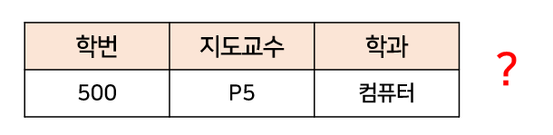

# 이상(Anomaly)

[참고](https://rebro.kr/159)

이상현상이란 테이블 내의 데이터들이 불필요하게 중복되어 데이터를 조작할 때 발생되는 불일치 현상이다. 3가지 종류가 있으며 정규화를 통해서 이상현상을 막을 수 있다.

위와 같은 표가 있다고 하자

1. 삽입이상
    
    위의 표에서 다음과 같은 자료를 삽입한다고 가정하자

    
    
    강의를 수강하지 않은 학생의 정보를 삽입하고 싶을 때 과목 번호와 성적에 관한 정보가 없게 되므로 삽입을 할 때 과목 번호와 성적에 NULL값을 넣어줘야 하는 문제가 생긴다.

2. 삭제 이상

    

    학번 300번이 과목 C-73을 들었다는 사실을 삭제하려고 했지만 지도 교수와 같은 정보도 모두 사라지게 된다.

3. 갱신 이상

    위의 표에서 123번 학생의 지도교수가 바뀌게 된다면 모든 튜플에서 123의 지도교수는 P1이 아닌 다른 값이 되어야 하나, 갱신 이상이 발생하면 갱신하지 않은 정보와 갱신한 정보간의 충돌이 발생한다.

# 정규화(Nomalization)

Relation을 분해하여 이상현상을 없에는 과정, 종속성을 없에는 방향으로 움직인다.

## 함수 종속성

* 데이터들이 기준값에 대해 종속되는 현상

* X에 대해서 오직 하나의 Y만이 존재하면 Y는 X에 함수적으로 종속한다고 하고, 기호로는 X→Y라고 표기한다. 여기서 X는 **결정자** Y는 **종속자**라고 한다.

## 함수 종속성의 유형

1. 완전 함수 종속

    X'⊂X 이고 X'→Y를 만족하는 attribute X'가 존재하지 않는다. 다르게 말해서 attribute가 2개 이상인 기본키가 있을 때 어느 한 쪽이라도 단독으로 함수 종속성이 성립하면 안 된다는 의미이다.

2. 부분 함수 종속
    
    X'⊂X 이고 X'→Y를 만족하는 attribute X'가 존재한다는 의미이다. attribute중 1개가 단독으로 함수 종속성이 성립한다는 의미이다.

3. 이행 함수 종속성
    
    relation에 atttribute X Y Z 가 있을 때 X→Y, Y→Z가 성립할 때 X→Z가 성립하면 이행적 함수 종속성이 성립한다고 한다.

## 원칙

정규화는 다음과 같은 3가지 원칙을 따른다.

1. 정보의 무손실

    분해된 릴레이션이 표현하는 정보는 분해전의 모든 정보를 담고 있어야 한다.

2. 데이터 중복성 감소
    
    중복으로 인한 이상현상(anamoly)감소

3. 분리의 원칙
    
    하나의 독립된 관계성은 하나의 독립된 릴레이션으로 분리하여 표현(1차 정규화 예외)

## 유형

유형은 다음과 같은 5가지 유형이 존재한다.

### 기초적 정규화

*  1차 정규화

    * 반복되는 속성제거 
    * relation에 존재하는 모든 domain이 원자값(attribute 하나에 한개의 atrribute)만으로 되어있는 경우

* 2차 정규화

    * 부분함수 종속성을 제거한다.
    * 1차 정규화를 마치고 기본키가 아닌 attribute가 기본키에 종속할 경우
    * 결정자가 2개 이상일 때, 2개중 하나의 결정자에 의해서만 함수 종속성인 경우(쉽게 말해서 하나의 Y값에 대해 하나의 X값만 존재해야 한다는 뜻)

* 3차 정규화

    * 이행함수의 종속성을 제거한다.
    * 2차 정규화를 완료하고, 기본키 이외의 attribute간에 함수적 종속석을 지니지 않는다.

* Boyce-Codd Normal Form(BCNF)
    * 결정자의 함수 종속성 제거
    * relation의 모든 결정자가 후보키이다.

### 진보적 정규화

*  4차 정규화

    * 다중값 종속성 제거
    * BCNF이고 relation 내부의 모든 attribute 에 대해서 A->X이고 A가 후보키이다.

* 5차 정규화

    * 결합 종속성 제거
    * relaion에 존재하는 모든 join dependency가 후보키를 통해서만 성립하는 경우

# 인덱스(INDEX)

https://coding-factory.tistory.com/746

데이터베이스의 테이블에 대한 검색 속도를 높여주는 자료구조이다. 

## 사용 이유(장점)

* 다음과 같이 Table에 자료가 있다고 하자, SELECT 문을 쓰게 된다면 INDEX가 존재하지 않는다면  company_id 가 18인 튜플을 찾을 때 Table을 처음부터 끝까지 찾게 된다. 매번 자료를 찾을 때 마다 Full Table Scan을 하게 되면 효율성이 메우 떨어지게 된다. Index를 만들어서 Index내부에서 company_id가 18인 자료의 위치를 모아놓게 되면 일일히 Table안에서 Full Scan을 할 필요가 없게 된다. 

* 또한 정렬을 할 때도 미리 정렬을 해서 Index에 넣어놓게 되면 Order by문을 쓸 때 효율적이다.

* 최대 최소를 찾을 때도 Full Table Scan을 할 필요 없이 정렬 된 자료 값에서 맨 앞과 뒤만 살피면 되기 때문에 효율적이다.

## 단점

* 위에서 얘기를 한 것과 같이 항상 정렬이 된 상태가 유지가 되야 하는데 이로 인해서 자료가 추가되거나 바뀌거나 삭제되면 오버헤드가 발생한다. 그러므로 INDEX에서는 바뀌거나 삭제하는 연산을 해당 자료를 사용하지 않는 것으로 연산을 대신한다. 이렇게 계속 자료가 추가 되거나 삭제가 되면 결국에는 INDEX가 Table의 크기를 넘어가는 순간이 생기게 된다.

## 사용처

* 위의 장점과 단점을 생각해보면 INDEX는 결국 자료의 수정과 삭제가 적게 일어나고 SELECT와 ORDER BY 연산이 자주 일어나며 자료의 크기가 큰 relation에 쓰면 된다.

# 트랜잭션(Transaction)

# 트랜잭션 격리 수준(Transaction Isolation Level)

# 다음 주제
- Array
- LinkedList
- Array & ArrayList & LinkedList
