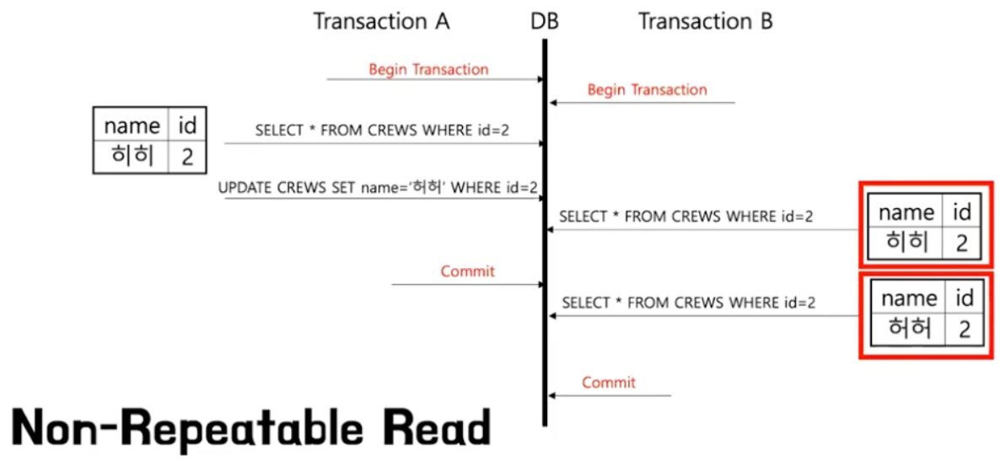

## 목차

1. 이상(Anomaly)과 정규화(Nomalization)
2. 인덱스(INDEX)
3. 트랜잭션(Transaction)
4. 트랜잭션 격리 수준(Transaction Isolation Level)
4. ArrayList & LinkedList


--------

# 1. 이상(Anomaly)과 정규화(Nomalization)

### 이상(Anomaly)

 이상이란 릴레이션에서 일부 속성들의 종속이나 데이터의 중복으로 인해 데이터 조작시 불일치가 발생하는 것을 말한다. 즉, 테이블 설계가 잘못되어 데이터의 삽입,삭제,수정시 논리적 오류가 생기는 현상이다. 

* 삽입 이상 (Insertion Anomaly) : 의도하지 않은 자료까지 삽입해야 원하는 데이터를 추가할 수 있는 현상이다.
* 갱신 이상 (Update Anomaly) : 갱신하고자 하는 내용의 일부만 변경하여, 데이터가 불일치하는 모순의 문제가 발생한다.
* 삭제 이상 (Deletion Anomaly) : 어떤 데이터를 삭제하면 의도하지 않은 데이터까지 함께 삭제되는 현상이다. 


### 정규화 (Normalization)

테이블의 ``중복을 허용하지 않음``으로써 ``무결성``을 유지하고 DB의 저장 용량을 줄여 효율적으로 관리할 수 있다. 

* <> 반정규화 : 성능향상을 위해 의도적으로 정규화를 깨트리는 것을 말한다.


### 정규화의 종류

정규화의 종류에는 1, 2, 3, BCNF, 4, 5단계의 정규화가 있다.

```
1 정규화 : 테이블의 컬럼이 원자값 (하나의 값)만 갖도록 테이블을 분해한다. 
2 정규화 : 부분적 함수 종속을 제거해야 한다. 즉, 완전 함수적 종속 관계를 만족한다.
3 정규화 : 이행적 종속 관계를 제거해야 한다.
BCNF 정규화 : 결정자가 모두 후보키인 경우를 말한다. 어떤 속성도 키가 아닌 속성에 대해서는 완전 종속할 수 없다.
4 정규화 : 다치 종속성이 제거해야 한다.
5 정규화 : 조인 종속성이 만족되어야 한다.
```


###  1. 제1 정규형 (1NF)

**도메인 원자값** 

릴레이션에 속하는 속성의 속성 값이 모두 원자값(Atomic Value)만으로 구성되어야 한다.


#### 제 1 정규형 이상 현상

도메인 원자값을 통해 제 1 정규화를 만들었음에도 불구하고 이상현상은 있을 수 있다. 

 

##### 삽입 이상

학생(학번)이  새 과목을 수강 신청할 때 필요하지 않은 정보들 즉, 학과와 지도교수가 반드시 필요하다. 

##### 삭제 이상

300번 학생이 C400 과목을 취소하면, 해당 과목에 대한 정보가 모두 사라진다. 

##### 갱신 이상

100번 학생이 지도교수를 변경할 때, P1인 행을 모두 찾아서 변경해주어야 한다. 


###  **2. 제2 정규형 (2NF)**

 앞서 예시에서 살펴본 제1 정규형은 기본키(primary key)가 아닌 속성들이 기본키에 완전 함수 종속되지 못하고 ``부분 함수 종속``되어 있다. 기본키의 일부 속성에만 의존하기 때문에 이상현상이 발생했다. 

즉, 기본키가 (학번, 과목 번호)임에도 지도교수와 학과는 (학번) 기본키의 부분에만 종속되어있기 때문이다. 

 제 2정규형은 기본키(primary key) ``완전 함수 종속`` 되도록 정규화시켜야 한다.  완전 종속되도록 변경하는 방법은 종속되는 키를 구분으로 테이블을 쪼개면 된다.


#### 제 2 정규형 이상 현상

부분 함수 종속 제거를 통해 제 2정규화를 만들었음에도 불구하고 이상현상은 있을 수 있다. 


##### 삽입 이상

지도교수가 학과에 소속되어 있음을 추가할 때 반드시 지도 학생이 있어야 한다.

##### 삭제 이상

300번 학생이 자퇴하는 경우 지도교수와 학과 정보가 삭제된다. 

##### 갱신 이상

만약 지도교수가 담당하는 학생이 여러 명인 경우 지도교수의 학과가 변경될 때 해당 지도 교수를 가진 튜플을 찾아서 모두 변경시켜주어야 한다. 


###  3. 제3 정규형 (3NF)

제2 정규형의 이상현상은 ``이행적 함수 종속성`` 으로 인해 발생한다. 이행적 함수 종속은  A→B이고, B→C이면서 A→C의 관계에 있는 것을 말한다. 

위의 예시는 학번 → 지도교수, 지도교수 → 학과, 학번 → 학과의 관계가 존재한다. 

그렇기 때문에 지도교수의 학과를 추가하기 위해서 지도 학생까지 필요하게 되고, 학생을 삭제하기 위해 지도교수의 학과 정보가 사라지는 문제점이 발생하게 되는 것이다. 

제 3정규형은 이행적 함수 종속성을 제거한다.


#### 제 3 정규형 이상 현상


제 3 정규화임에도 불구하고 이상현상이 발생한다.

##### 삽입 이상

새로운 교수가 특정 과목을 담당한다는 정보는 적어도 한 명이상의 수강학생이 있어야만 추가할 수 있다.  

##### 삭제 이상

학번 100이 C234 과목을 취소하면, P2가 C234 과목을 담당한다는 정보도 삭제된다. 

##### 갱신 이상

P1의 과목이 변경되면 P1인 행을 모두 찾아 변경시켜주어야 한다. 


###  4. BCNF 정규형

제 3정규화에서 이상현상이 발생하는 이유는 ``결정자(Determinant)가 후보키(Alternative Key)로 취급되고 있지 않기 때문이다. ``

(학번, 과목명)이나 (학번, 담당교수)가 후보키가 된다. 담당 교수만으로는 후보키가 될 수 없지만 후보키가 아님에도 과목명을 결정할 수 있기 때문에 담당 교수는 결정자에 속한다. 

모든 결정자는 항상 후보키가 되도록 릴레이션을 분해해주면 강한 제3 정규형, 즉 BCNF를 만족하게 된다.


###  5. 제 4정규형 (4NF) 

전혀 상관없는 관계의 컬럼들을 묶어놓으면 데이터의 심각한 중복성이 발생하게 되고 ``다치 종속성``이 발생하게 된다.

다치 종속이란 여러 값을 가진 독립된 속성이 1 : N로 대응하는 관계를 말한다. 


위의 경우 {학생} ->> {수강과목 }를 다치종속한다고 한다. 왜냐하면 학생은 수강과목의 값을 하나 결정하는 것이 아니라 여러 개의 값, 즉 값의 집합을 결정하기 때문이다.  

##### 삽입 이상

임꺽정이라는 학생이 새로운 동호회에 가입한다면, 2개의 데이터 즉, (물리학, 축구)와 (화학, 축구)가 들어가야한다.  

##### 삭제 이상

예를 들어, 하나의 취미, 하나의 동호회를 가입했다면 그 하나 남은 동회를 삭제하는 순간 하나의 취미도 삭제되어야 한다. 

##### 갱신 이상

홍길동이 스키반 동호회를 수정하면 홍길동과 스키반이 있는 모든 행을 찾아 변경해야 한다. 


###  6. 제 5정규형(5NF)

 4정규화를 만족하면서 ``조인종속성``을 만족하면 제 5정규형이 된다.  

``조인 종속성``은 주어진 테이블보다 더 작은 테이블의 join으로 구성할 수 없을 때, 즉 더 이상 테이블을 분해하면 원래 가지고 있던 정보가 손실될 때 ``제 5정규형``이라고 한다.  

아래의 예시는 더 이상 테이블을 쪼개면 다시 join 했을 때 원래의 결과값이 나올 수 없으므로 조인 종속성을 가지고 제 5정규형이라고 한다. 


# 2. 인덱스(INDEX)

추가적인 쓰기 작업과 저장 공간을 활용하여 데이터베이스 테이블의 ``검색 속도를 향상시키기 위한 자료구조`` 이다. 데이터베이스의 index는 책의 색인과 같다.

데이터베이스에서도 테이블의 모든 데이터를 검색하면 시간이 오래 걸리기 때문에 데이터와 데이터의 위치를 포함한 자료구조를 생성하여 빠르게 조회할 수 있도록 돕고 있다.

#### 장점

- 테이블을 조회하는 속도와 그에 따른 성능을 향상시킬 수 있다.
- 전반적인 시스템의 부하를 줄일 수 있다.

#### 단점

- 인덱스를 관리하기 위해 DB의 약 10%에 해당하는 저장공간이 필요하다.
  - 인덱스도 하나의 데이터베이스 객체이다.
  - oracle, DB2 등에서는 스키마 객체이고, MySQL, SQL server 등에서는 테이블 내의 객체이다.

- 인덱스를 관리하기 위해 추가 작업이 필요하다.
- 인덱스를 잘못 사용할 경우 오히려 성능이 저하되는 역효과가 발생할 수 있다.
- select에서 인덱스는 효율적이지만, delete, update, insert 성능 저하된다.
  * 인덱스는 테이블과 별도의 객체이기 때문에 insert가 두번 들어가게되고, 순서에 맞게 재정렬 가능성이 있음
  * delete - 인덱스를 삭제하는 것이 아니라 사용안함으로 처리
  * update - 인덱스는 업데이트 개념이 없어서 delete를 하고 insert를 하게됨 

 만약 CREATE, DELETE, UPDATE가 빈번한 속성에 인덱스를 걸게 되면 인덱스의 크기가 비대해져서 성능이 오히려 저하되는 역효과가 발생할 수 있다. 그러한 이유 중 하나는 DELETE와 UPDATE 연산 때문이다. 앞에서 설명한대로, UPDATE와 DELETE는 기존의 인덱스를 삭제하지 않고 '사용하지 않음' 처리를 해준다고 하였다. 만약 어떤 테이블에 UPDATE와 DELETE가 빈번하게 발생된다면 실제 데이터는 10만건이지만 인덱스는 100만 건이 넘어가게 되어, SQL문 처리 시 비대해진 인덱스에 의해 오히려 성능이 떨어지게 될 것이다. 


**인덱스(index)를 사용하면 좋은 경우**

- 규모가 작지 않은 테이블
- INSERT, UPDATE, DELETE가 자주 발생하지 않는 컬럼
- JOIN이나 WHERE 또는 ORDER BY에 자주 사용되는 컬럼
- 데이터의 중복도가 낮은 컬럼


#### 인덱스 생성

1. 인덱스는 열 단위로 생성되는데, 하나의 열에서 인덱스를 생성할 수 있고, 여러 열에 하나의 인덱스를 생성할 수 도 있다.
2. 테이블 생성시 하나의 열에 `Primary Key`를 지정하면 자동으로 `Clustered Index`가 생성된다.
   * PK와 클러스트 인덱스는 밀접한 관련이 있다. 
3. `UNIQUE` 제약 조건이 있는 테이블을 만들면 데이터베이스 엔진에서는 자동으로 `Non-Clustered Index`를 만든다.
4. `Primary Key`를 지정하는 열에 강제적으로 `Non-Clustered Index`를 지정 가능하다.
5. 기존 테이블에 `PRIMARY KEY` 제약 조건을 적용하려 하거나 해당 테이블에 `Clustered Index`가 이미 있으면 `Non-Clustered Index`를 사용하여 기본 키를 적용한다.
6. 제약 조건 없이 테이블 생성시에 `Index`를 만들 수 없으며**, **`Index`가 자동 생성되기 위한 열의 제약 조건은 `Primary Key`또는 `Unique` 뿐이다.


### Clustered Index

데이터와 무리를 이룬 index로 데이터를 포함한 인덱스이다. 


비유하면 페이지를 알고 있어서 해당 페이지를 펼치는 것과 같다. 데이터가 테이블에 삽입되는 순서와 상관없이 ``index``로 생성되어있는 컬럼을 기준으로 정렬되어 삽입한다. 

clustered index는 테이블당 한 개만 생성이 가능하다. 테이블에서 가장 효율적일 것 같은 컬럼을 clustered index로 지정한다. 

Clustered Index를 구성하기 위해 행 데이터를 열로 정렬 후 ``루트 페이지``를 만든다.

루트페이지와 리프 페이지로 구성되어있고, ``리프 페이지는 데이터 그 자체``이다. 

Clustered Index는 물리적으로 정렬되어 있어 검색속도가 더 빠르지만 데이터의 삽입, 삭제, 수정에도 정렬을 수행하여 속도가 느리다.


### Non-Clustered Index

목차에서 찾고자하는 내용의 페이지를 찾고 해당 페이지로 이동하는 것과 같다.

물리적으로 데이터를 배열하지 않은 상태로 데이터 페이지가 구성된다. 즉, 테이블의 데이터는 그대로 두고 지정된 ``컬럼에 대해 정렬시킨 인덱스``만 만든다.

Non-Clustered Index는 검색속도는 느리지만 데이터의 입력/삭제/수정에서 더 빠르며 테이블당 여러 개 존재할 수 있다. 

* 입력/삭제/수정시 인덱스 페이지만 변화가 일어난다. 


### Clustered ,Non-Clustered Index


만약 이런 구조를 채택하게 된다면 페이지 조회는 더 오랜시간이 필요있다. 하지만 데이터가 삽입했을 때 더 효율적이다.


클러스트 인덱스는 리프페이지에 데이터를 추가했을 때 정렬이 일어나야한다. 그러면 주소값이 바뀔 수 있고 재정렬을 해야한다. 하지만 이 구조에서는 재정렬할 필요가 없다.

또 다른 주의사항은 삭제할 때 규칙이 있다. non-clustered index를 먼저 삭제하고 clustered index를 삭제해야한다.


#### 인덱스 자료 구조

* B-tree : 이진트리에서 변형되어서 자식 노드가 2개 이상을 가지고 있고 높이가 같다.
* 수직적으로 첫번째 조건에 해당되는 레코드에 들어간뒤 리프노드에서 수평적으로 찾는다.
* 인덱스 컬럼 설정을 카디널리티의 수로 삼아야 한다. 예를 들면, 이름 주민번호 나이가 있을 때 주민번호가 카디널리티가 높다고 할 수 있다. 왜냐하면 종류가 더 많기 때문이다.


#### 인덱스 사용시 주의사항

1. 컬럼에 인덱스를 생성해도 select문의 where 절에 사용하지 않는 컬럼이라면, 큰 효율이 없다.
2. 사용하지 않은 인덱스를 삭제해야한다.
3. 외래키에 지정한 열에는 자동으로 외래 키 인덱스가 생성된다


# 3. 트랜잭션(Transaction)

트랜잭션은 여러 쿼리를 논리적으로 하나의 작업으로 묶어주는 것을 말한다. 데이터베이스에 저장된 데이터베이스의 무결성과 동시성의 성능을 지키기 위해 트랜잭션의 설정이 중요하다.


### 트랜잭션의 특징 ACID

트랜잭션이 안전하게 수행된다는 것을 보장하기 위한 성질이다.

#### 원자성 (Atomicity) 

트랜잭션은 DB에 모두 반영되거나, 반영되지 않아야 한다. 완료되지 않은 트랜잭션의 중간 상태를 DB에 반영해서는 안된다.

#### 일관성 (Consistency) 

트랜잭션의 작업결과는 항상 일관성이 있어야 한다. 데이터베이스는 항상 일관된 상태로 유지되어야 한다.

#### 독립성 (Isolation)

둘 이상의 트랜잭션이 동시에 병행 실행되고 있을 때, 어떤 트랜잭션도 연산에 끼어들 수 없다. 각각의 트랜잭션은 서로 간섭없이 독립적으로 이루어져야 한다.

#### 지속성 (Durability)

트랜잭션이 성공적으로 완료되면, 결과는 영구적으로 반영되어야 한다.


### 트랜잭션의  매커니즘


```sql
BEGIN TRAN
UPDATE accounts SET balance = balance - 10000 WHERE user = "구매자"
UPDATE accounts SET balance = balance + 10000 WHERE user = "판매자"
COMMIT TRAN
```

1. UPDATE accounts SET balance = balance - 10000 WHERE user = "구매자" 쿼리 실행

2. 업데이트에 필요한 데이터를 데이터 캐시에 요청하여 있는지 체크한다. 만약 캐시에 없다면 데이터 파일에서 데이터를 가져온다.

3. ``데이터 캐시``에 데이터를 로드하고 ``로그 캐시``에 로그를 기록한다. 

4. Redo 로그에는 변경 후 값을 기록한다. Undo 로그에는 변경전 값을 기록한다.

   Redo 로그

   ```
   트랜잭션_1 START
   트랜잭션_1 UPDATE accounts 구매자.balance 0
   ```

   Undo 로그

   ```
   로그_1 account 구매자.balance 10000
   ```

5. 로그 기록 후 데이터 캐시에 있는 값을 변경한다. 

6. UPDATE accounts SET balance = balance + 10000 WHERE user = "판매자" 두번째 쿼리 실행

7. 판매자 데이터를 데이터 캐시에 요청하여 있는지 체크하고 만약 캐시에 없다면 데이터 파일에서 데이터를 가져온다.

8. ``데이터 캐시``에 데이터를 로드하고 ``로그 캐시``에 로그를 기록한다. 

   Redo 로그

   ```
   트랜잭션_1 START
   트랜잭션_1 UPDATE accounts 구매자.balance 0
   트랜잭션_2 UPDATE accounts 판매자.balance 10000
   ```

   Undo 로그

   ```
   로그_1 accounts 구매자.balance 10000
   로그_2 accounts 판매자.balance 0
   ```

9. 데이터 캐시의 데이터를 업데이트한다.

10. 트랜잭션의 한 단위를 끝낸다.


#### rollback 시

Undo 로그를 통해 연순으로 기록을하게 되면 데이터가 이전 상태로 원복된다.

#### 예상치 못한 오류 발생시

Redo로그와 Undo 로그를 통해 복구한다. Redo 로그를 순차적으로 실행해 데이터를 다시 일관성있게 만들어주고 다시 Undo를 역순으로 실행하여 커밋되지 않은 것들을 다시 이전 상태로 돌려준다.


# 4. 트랜잭션 격리 수준(Transaction Isolation Level)

트랜잭션 격리수준(isolation level)이란 동시에 여러 트랜잭션이 처리될 때, ``트랜잭션끼리 얼마나 서로 고립``되어 있는지를 나타내는 것이다.

즉, 간단하게 말해 특정 트랜잭션이 다른 트랜잭션에 변경한 데이터를 볼 수 있도록 허용할지 말지를 결정하는 것이다.

트랜잭션이 독립적인 수행을 하도록 Locking을 통해, 다른 트랜잭션이 관여하지 못하도록 막는 것이 필요하다.

하지만 무조건 Locking을 통해 동시에 수행되는 수많은 트랜잭션들을 순서대로 처리하면 데이터베이스 성능이 떨어진다. 하지만 locking의 범위를 줄인다면, 잘못처리될 가능성이 있다. 그래서 효율적인 locking이 필요하다.

* lock : 트랜잭션 처리의 순차성을 보장하기 위한 방법
  * 공유 락 : 데이터를 읽을 때 사용되어지는 락, 동시 접근이 가능하다
  * 배타 락 : 데이터를 변경하고자 할때 사용하고, 트랜잭션이 완료될 때까지 유지된다. lock이 해제될때까지 ``다른 트랜잭션(읽기포함)은 해당 리소스에 접근할 수 없다``


## 격리수준

격리수준은 크게 아래의 4개로 나뉜다.

* READ UNCOMMITTED : ``커밋 전`` 트랙잭션의 변경을 다른 트랜잭션이 읽는 것을 허용

- READ COMMITTED : ``커밋이 완료``된 데이터만 다른 트랜잭션에서 조회가능

- REPEATABLE READ : 트랜잭션 범위 내에서 조회한 내용은 항상 동일함을 보장

- SERIALIZABLE : 한 트랜잭션이 사용하는 데이터를 다른 트랜잭션이 접근 불가

아래로 내려갈수록 트랜잭션간 고립 정도가 높아지며, 성능이 떨어지는 것이 일반적이다.
일반적인 온라인 서비스에서는 READ COMMITTED나 REPEATABLE READ 중 하나를 사용한다. (oracle = READ COMMITTED, mysql = REPEATABLE READ)


### READ UNCOMMITTED

어떤 트랜잭션의 변경내용이 COMMIT이나 ROLLBACK과 상관없이 다른 트랜잭션에서 보여진다.

#### 문제점 : dirty Read

커밋되지 않은 데이터를 read하는 것을 말한다. 


 예를 들어, A 트랜잭션에서 1번의 사원 이름 변경하고 커밋하지 않았을 경우에도, B 트랜잭션에서 1번 사원의 이름을 조회하면 변경된 이름으로 조회된다. 이것을 ``dirty Read``라고 한다. 트랜잭션 A가 커밋 하지 않았음에도 트랜잭션 B는 무효된 값을 읽고 처리할 가능성이 생긴다. 


### READ COMMITTED

어떤 트랜잭션의 ``변경 내용이 COMMIT`` 되어야만 다른 트랜잭션에서 조회할 수 있다. 오라클 DBMS에서 기본으로 사용하고 있고, 온라인 서비스에서 가장 많이 선택되는 격리수준이다.

#### 문제점 : NON-REPETABLE READ



같은 트랜잭션 내에서 READ시 값이 다르게 나오는 데이터 불일치 문제이다. 즉, 하나의 트랜잭션에서 동일한 쿼리를 두 번 이상 수행할 때, 동일한 쿼리임에도 다른 결과를 얻는 문제점이다. 

 ``REPEATABLE READ`` 정합성 : ``하나의 트랜잭션 내``에서 똑같은 SELECT를 수행했을 경우 ``항상 같은 결과를 반환``해야 한다는 것에 어긋난다.

예를 들어, 오늘의 입금 총 합을 보여주는 트랜잭션이 있다면, 총합을 계산하는 select 쿼리는 실행될 때 마다 다른 결과 값을 가져온다는 것을 말한다.


### REPEATABLE READ

트랜잭션이 ``시작되기 전에 커밋된 내용``에 대해서만 조회할 수 있는 격리수준이다. 즉, 자신의 트랜잭션 번호보다 ``낮은 트랜잭션 번호`` 에서 커밋한 내용만 볼 수 있다. MySQL DBMS에서 기본으로 사용하고 있고, 이 격리수준에서는 NON-REPETABLE READ 의 한 종류인 ``Phantom Read``가 발생한다. 

#### 문제점 : Phantom Read


하나의 트랜잭션 내에서 일점범위의 레코드를 두 번 이상 읽을 때, 똑같은 쿼리임에도 첫번째 쿼리에 없던 레코드가 두번째 쿼리에서 나타나는 현상이다.


### SERIALIZABLE

가장 단순하고 엄격한 격리 수준이다. 격리수준이 SERIALIZABLE일 경우 읽기 작업에도 `공유 잠금`을 설정하게 되고, 이러면 동시에 다른 트랜잭션에서 이 레코드를 변경하지 못하게 된다.
이러한 특성 때문에 동시처리 능력이 다른 격리수준보다 떨어지고, 성능저하가 발생하게 된다.


## 트랜잭션 경계설정

트랜잭션은 격리 수준 설정을 통한 독립성 보장하지만 데이터 베이스 작업이 들어왔을 때 모든 작업의 독립성을 보장해 하나씩 순차적으로 진행하게 된다면, CPU는 DBMS보다 input, output 작업이 빈번히 수행되기 때문에 응답을 기다리는 시간이 길어져 프로그램이 비효율적으로 동작하게 된다.

데이터베이스는 각각의 명령을 하나의 트랜잭션으로 보고 보장해주기 때문에 여러 명령을 하나의 트랜잭션으로 묶고 싶은 경우 개발자가 직접 ``트랜잭션의 경계설정``을 통해 트랜잭션을 명시하는 일이 필요하다.

### Spring Framework에서 경계설정

#### 1. PlatformTransactionManager

interface인 ``PlatformTransactionManager``을 제공하여 다양한 DataSource에 맞게 트랜잭션을 관리할 수 있게 한다. getTransaction부터 rollback or commit까지가 경계설정이다. 

* getTransaction : 파라미터를 통해 전달되는 TransactionDefinition에 따라 트랜잭션을 시작한다.
* rollback
* commit

> PlatformTransactionManager 의 구현체

1. DataSourceTransactionManager : jdbc, 하나의 데이터베이스를 사용하거나 각각의 데이터를 독립적으로 사용하는 로컬 트랜잭션에서 사용
2. JpaTransactionManager : JPA, 하나의 데이터베이스를 사용하거나 각각의 데이터를 독립적으로 사용하는 로컬 트랜잭션에서 사용
3. JtaTransactionManger : 하나 이상의 데이터베이스에 사용되는 경우에 글로벌 트랜잭션에서 사용된다. 여러 개의 데이터베이스에 대한 작업을 하나의 트랜잭션으로 묶을 수 있고 다른 서버에 분산된 것도 묶을 수 있다. 

#### 2. 선언적 트랜잭션

선언적 트랜잭션은 tx 네임스페이스를 사용하는 방안과 어노테이션 기반으로 설정하는 방안이 있다. 

##### tx 네임스페이스

Bean 설정 파일에서 트랜잭션 매니저를 등록하고 속성과 대상을 정의해 트랜잭션을 적용하겠다고 명시하는 것이다. 이 방식을 사용하면 코드에 영향주지 않고 일괄적으로 트랜잭션을 적용하고 변경할 수 있다는 장점이 있다. 

##### @Transactional (어노테이션 기반)

* 메서드, 클래스, 인터페이스 등에 적용할 수 있다.
* 중첩되어 존재하는 경우에는 클래스 메소드, 클래스, 인터페이스 메소드, 인터페이스 순으로 우선순위를 갖고 적용된다.
* 어노테이션이 적용된 메소드는 메서드 시작부터 트랜잭션이 시작되고, 메소드가 성공적으로 끝마치면 트랜잭션 커밋한다.
* 보통 데이터베이스에 여러번 접근하면 하나의 작업을 수행하는 서비스 계층 메소드에 붙이는 것이 일반적이다. 

```java
@service
@Transactional
public class CrewService{
    ....
}
```


### 트랜잭션 전파 타입

```java
@Transactional(propagation=Propagation.REQUIRED)
```

트랜잭션 경계에서 이미 진행중인 트랜잭션이 있을 때 어떻게 동작할지를 결정하는 것을 말한다.

#### REQUIRED (=default)


* 현재 진행중인 트랜잭션이 존재하면 해당 트랜잭션을 사용한다.
* 존재하지 않으면 새로운 트랜잭션을 생성한다.
* 두 메서드가 하나의 트랜잭션에서 실행되기 때문에 어느 메서드에서 문제가 발생해도 실행했던 모든 쿼리가 롤백된다.

#### SUPPORTS

* 진행중인 트랜잭션이 있다면 Required처럼 진행중 트랜잭션을 사용한다.
* 진행중인 트랜잭션이 없다면 트랜잭션 없이 메서드를 실행한다.

#### MANDATORY

* 진행중인 트랜잭션이 있으면 참여하고 없으면 예외를 발생시킨다. 혼자서는 트랜잭션을 실행할 수 없고 메소드도 실행할 수 없다.

#### REQUIREDS_NEW

* 항상 새로운 트랜잭션을 시작한다.
* 진행중인 트랜잭션이 존재하면 기존 트랜잭션을 중지하고 새로운 트랜잭션을 시작한다.
* 새로운 트랜잭션이 종료하면 기존에 중지한 트랜잭션을 다시 시작시킨다.

#### NOT_SUPPORTED

* 이미 시작된 트랜잭션이 있으면 보류하고 자신의 메소드를 실행하는 즉, 트랜잭션을 사용하지 않는 설정이다.

#### NEVER

* 트랜잭션을 사용하지 않도록 강제한다.
* 이미 진행중인 트랜잭션이 없다면 자신의 메소드를 실행하지만 실행중인 트랜잭션이 있다면 예외를 발생시킨다.

#### NESTED

* 이미 진행중인 트랜잭션이 있으면 ``그 안``에 새로운 트랜잭션을 만드는 설정이다.
* 트랜잭션 2는 부모의 커밋, 롤백에 영향을 받지만 트랜잭션 2의 커밋과 롤백은 트랜잭션 1에게 영향 미치지 못한다.


### 트랜잭션 고립

```java
@Transaction(isolation=Isolation.DEFAUTL) // 데이터베이스 기본설정따름
@Transaction(isolation=Isolation.READ_COMMITTED)
@Transaction(isolation=Isolation.READ_UNCOMMITTED)
@Transaction(isolation=Isolation.REPEATABLE_READ)
@Transaction(isolation=Isolation.SERIALIZABLE)
```


### readOnly

```java
@Transaction(readOnly=true)
```

* 트랜잭션 작업안에서 update, insert, delete 작업이 일어나는 것을 방지한다.

* 해당 옵션을 적용하면 flush 모드가 manual로 설정되어 JPA의 더티체킹 기능을 무시하여 성능향상에 도움이 된다.


>  참고자료 :
>
> [트랜잭션 정리](https://devlopsquare.tistory.com/237)


# 5. ArrayList & LinkedList

### ArrayList

메모리 공간에 할당할 사이즈를 미리 지정하고 사용하는 자료구조이다. 따라서 계속 데이터가 늘어날 때, 최대 사이즈를 알 수 없을 때는 사용하기에 부적합하다. 새로운 요소를 삽입하는 것은 공간을 만들고 기존 요소를 전부 이동하기 때문에 비용이 많이 든다. 


### Linked List

배열처럼 크기를 정해주지 않아도 된다. array는 인덱스가 중요하다면 list는 순서가 중요하다. 임의로 엑세스할 때 순차적으로 액세스해야하는 단점을 가지고 있다. 크기가 정해져 있지 않기 때문에 중간에 데이터의 추가 혹은 삭제가 수월하다.

```java
List<Object> list = new ArrayList<Object>();
ArrayList<Object> list = new ArrayList<>();
```

대부분 아래보다 위와 같은 형태로 선언하여 사용한다.

위와 같이 업캐스팅하면 나머지 코드는 이 데이터가 List형이라는 것을 알기 때문에 List 인터페이스에 따르게 코드를 작성할 수 있고 List 인터페이스를 구현한 다른 자료형으로도 쉽게 전환할 수 있다. (즉, 인터페이스 내에서 변경하기 쉽도록하기 위해서이다.)

