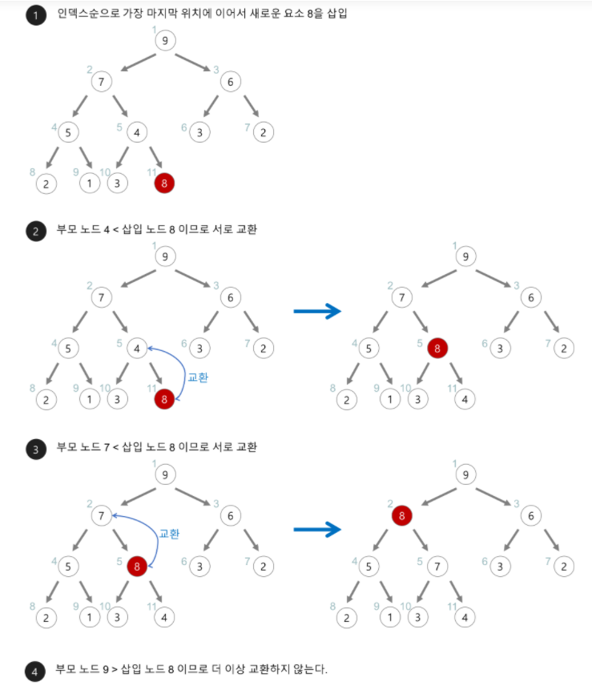
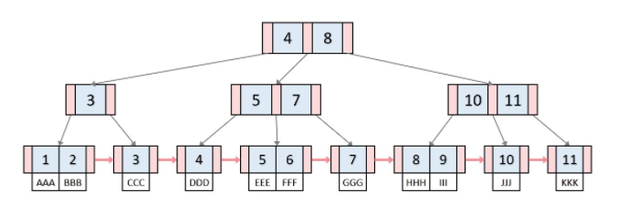

## 목차

1. 스택(Stack) & 큐(Queue)
2. 힙(Heap)
3. 트리(Tree)
4. 이진탐색트리(Binary Search Tree)
5. 해시(Hash)
6. 트라이(Trie)
7. B-Tree & B+Tree


------------

# 1. 스택 & 큐

## 스택


스택 : 책을 쌓는 것처럼 쌓아올린 형태의 자료구조

#### 특징

* 삽입, 삭제 연산이 한 방향에서 이루어지는 선형 자료구조
* 한 방향에서 삽입과 삭제가 이루어지기 때문에 나중에 삽입된 데이터가 먼저 삭제되는 후입선출(LIFO, Last In First Out) 구조를 가진다.
* 스택에 데이터가 삽입될 위치를 Top이라고 한다.
* 비어있는 스택에서 원소를 추출하려고 할 때 stack underflow가 발생하고, 스택이 넘치는 경우를 stack overflow라고 한다.

#### 활용예시

* 웹 브라우저 방문기록 (뒤로 가기) : 가장 나중에 열린 페이지부터 다시 보여준다.

* 역순 문자열 만들기 : 가장 나중에 입력된 문자부터 출력한다.

* 실행 취소 (undo) : 가장 나중에 실행된 것부터 실행을 취소한다.

* 후위 표기법 계산

* 수식의 괄호 검사 (연산자 우선순위 표현을 위한 괄호 검사)
* 재귀 알고리즘


## 큐


큐 : 화장실에서 줄서서 기다리고 처리하는 형태의 자료구조

#### 특징

* 한 방향에서는 삽입연산이, 반대편에서는 삭제연산이 이루어지는 자료구조
* 스택과 마찬가지로 선형 자료구조이다.
* 한쪽 방향에서 삽입이, 반대편에서 삭제가 이루어지기 때문에 먼저 삽입된 데이터가 먼저 삭제되는 선입선출(FIFO) 구조를 가진다.
* 데이터가 삭제될 위치를 Front / Head 마지막 데이터가 삽입된 위치를 Rear / Tail 이라 부른다.
* 양 방향에서 삽입연산과 삭제연산이 이루어지는 큐를 덱(Deque)이라고 한다.

#### 활용 예시

* 우선순위가 같은 작업 예약 (프린터의 인쇄 대기열)
* 프로세스 관리
* 너비 우선 탐색(BFS, Breadth-First Search) 구현
* 캐시(Cache) 구현


# 2. 힙(Heap)


완전 이진 트리형태의 자료구조

#### 특징

* 힙 조건의 예시를 만족한다. 

  * 예시 1 : 각 노드의 키 값은 자식 노드의 키 값보다 같거나 더 크다 == 최대 힙

  * 예시 2 : 각 노드의 키 값은 자식 노드의 키 값보다 같거나 더 작다 == 최소 힙

* 힙은 반 정렬 상태를 유지하며 중복된 값을 허용한다.
* 일반적으로 그룹을 정렬하거나 입력된 데이터 안에서 최소/최대 값을 찾을 때 사용한다.
* 데이터의 삽입과 삭제가 빠르며 각 수행시간이 O(logN)이다.


#### 구현

* 힙을 저장하는 표준적인 자료구조는 배열 이다.
* 구현을 쉽게 하기 위하여 배열의 첫 번째 인덱스인 0은 사용되지 않는다.
* 특정 위치의 노드 번호는 새로운 노드가 추가되어도 변하지 않는다.
* 힙에서의 부모 노드와 자식 노드의 관계
  * 왼쪽 자식의 인덱스 = (부모의 인덱스) * 2
  * 오른쪽 자식의 인덱스 = (부모의 인덱스) * 2 + 1
  * 부모의 인덱스 = (자식의 인덱스) / 2


#### 삽입

* 트리의 가장 마지막 위치에 노드를 삽입한다.
* 추가된 노드와 그 부모 노드가 힙 조건을 만족하는지 확인한다.
* 만족하지 않는다면 부모와 자식의 키 값을 바꾼다.
* 조건에 만족하거나 추가된 노드가 루트에 도달할 때까지 위를 반복한다.



#### 삭제

* 힙의 삭제 연산은 항상 루트 노드를 삭제한다.
* 트리의 가장 마지막 노드를 루트 자리로 삽입한다.
* 바꾼 위치를 노드의 힙 조건을 만족하는지 확인한다.
* 만족하지 않는다면 왼쪽 자식과 오른쪽 자식 중 적합한 노드와 키 값을 바꾼다.
* 조건을 만족하거나 리프 노드에 도달할 때까지 위를 반복한다.


> 참고 자료 :
>
> [참고 1](https://gmlwjd9405.github.io/2018/05/10/data-structure-heap.html)


# 3. 트리(Tree)

#### 특징

* 자료들 사이의 ``계층적 관계``를 나타내는데 사용하는 자료구조로 부모-자식 관계로 표현된다.
* 트리는 1개 이상의 노드를 갖는 집합으로 다음의 조건을 만족한다.
  * 루트 노드가 존재한다.
  * 트리의 부분트리 또한 트리 구조를 따른다.
* 트리는 DAG(Directed Acyclic Graphs, 방향성이 있는 비순환 그래프)의 한 종류이다.
  * loop나 circuit이 없다. 당연히 self-loop도 없다. 즉, 사이클이 없다.
* 노드가 N개인 트리는 항상 N-1개의 간선(edge)을 가진다. 즉, 간선은 항상 (정점의 개수 - 1) 만큼을 가진다.
* 루트에서 어떤 노드로 가는 경로는 유일하다.
* 임의의 두 노드 간의 경로도 유일하다. 즉, 두 개의 정점 사이에 반드시 1개의 경로만을 가진다.
* 한 개의 루트 노드만이 존재하며 모든 자식 노드는 한 개의 부모 노드만을 가진다.
* 순회는 Pre-order, In-order 아니면 Post-order로 이루어진다. 이 3가지 모두 DFS/BFS 안에 있다.
* 트리는 이진 트리, 이진 탐색 트리, 균형 트리(AVL 트리, red-black 트리), 이진 힙(최대힙, 최소힙) 등이 있다.


#### 트리 용어


* 루트노드 (Root Node) : 트리 최상위 노드, 유일하다.
* 깊이 (Depth) : 루트 노드에서 해당 노드까지 도달하는데 사용하는 간선의 개수, 루트 노트의 경우 자기 자신까지 도달하는 간선의 개수는 0이므로 깊이는 0이다.
* 레벨 (Level) : 노드 깊이 + 1
* 부모 노드 (Parent Node) : 부모 자식 관계에서 상위 계층에 있는 노드이다. 상위 계층에 있을 수록 노드의 깊이와 레벨이 낮다.
* 자식 노드 (Child Node) : 부모 자식 관계에서 하위 계층에 있는 노드
* 형제 노드 : 부모가 동일한 노드 
* 조상 노드 : 해당 노드의 부모노드로부터 루트노드까지 가는 경로에 존재하는 노드
* 후손 노드 : 해당 노드를 루트노트로 하는 서브트리에 있는 모든 노드를 그 노드의 후손 노드라고 한다.
* 노드의 차수 (Degree) : 노드의 자식 수, 차수가 0인 노드를 단말 혹은 리프노드라고 한다.
* 트리의 차수 : 해당 트리 내 모든 노드의 차수 중 최댓값
* 내부 노드 (internal / nonterminal Node) : 자식이 있는 노드
* 외부 노드 (Leaf / external / terminal Node) : 자식이 없는 노드
* 높이 (Height) : 루트노드에서 해당 노드까지 도달하는데 지나간 정점의 개수, 노드 중 가장 높이가 높은 노드를 트리의 높이라고 한다. 


#### 트리의 종류

##### 이진 트리(Binary Tree)

* 각 노드가 최대 두 개의 자식을 갖는 트리이다.

##### 이진 탐색 트리(Binary Search Tree)

* 모든 노드가 아래와 같은 특정 순서를 따르는 속성이 있는 이진 트리
* 모든 왼쪽 자식들 <= N < 모든 오른쪽 자식들

##### 균형 트리

* O(logN) 시간에 insert와 find를 할 수 있을 정도로 균형이 잘 잡혀있는 경우
* 예 : 레드 - 블랙 트리, AVL 트리


# 4. 이진탐색트리(Binary Search Tree)

트리의 차수가 2이하인 트리를 말한다. 대부분의 트리 자료 구조는 이진 트리 형태에서 나온다.

#### 특징

* 자식이 최대 2개이기 때문에 자식을 왼쪽 자식과 오른쪽 자식으로 구분한다.
* 높이가 N인 이진 트리의 최대 노드 개수는 2^N -1개이다.


#### 이진트리의 종류


##### 전 이진 트리 (Full Binary Tree) 

* 모든 노드의 차수가 0 또는 2인 이진트리

##### 포화 이진트리(Perfect Binary Tree)

* 전 이진 트리에서 모든 단말 노드의 ``깊이가 같은 이진트리``
* 높이가 H인 포화 이진 트리의 노드 개수는 2^H -1개이다.
* 반대로 노드가 N개인 포화 이진트리의 높이는 log2(N+1)이다.
* 깊이가 D인 포화 이진 트리의 단말 노드 개수는 2^D개이다.

##### 완전 이진트리 (Complete Binary Tree)

* 마지막 레벨을 제외하고 모든 레벨이 완전히 채워져 있다.
* 마지막 레벨은 왼쪽부터 오른쪽으로 채워져 있다. 

##### 사향 이진트리 (Skewed Binary Tree)

* 연결리스트처럼 한 줄로 연결되어 있는 형태의 이진트리


# 5. 해싱(Hashing)

#### 특징

* 입력된 데이터(key)를 해시 함수(Hash Function)를 통해 얻은 주소로부터 그 위치를 직접 참조하는 방법이다.
  * Hash Function는 key를 고정된 길이의 hash로 변경해주는 역할을 한다. 
* 탐색, 삽입, 삭제 연산 모두 해시 함수를 거치는 시간만 소요되기 때문에 일반적으로 O(1) 시간 복잡도를 가진다.
* 해시 충돌이 발생할 가능성이 있다.
* 데이터가 저장되기 전 저장 공간을 미리 만들어야하고 공간이 만들어졌어도 공간을 채우지 않는 경우도 발생한다.
* 해시 함수에 대한 의존도가 높다. 해시 함수가 복잡하다면 hash를 만드는데 오래 걸린다.


#### 해시 테이블 구성

##### key

- 고유한 값, hash function의 Input이 된다.
- key값을 그대로 저장소의 색인으로 사용할 경우 key의 길이만큼의 정보를 저장해야한 공간도 따로 마련해야 하기 때문에 고정된 길이의 해시로 변경한다.

##### hash function

- key를 **고정된 길이**의 hash로 변경해주는 역할을 한다.
- 서로 다른 key가 hashing 후 같은 hash값이 나오는 경우가 있다. 이를 ``해시충돌``이라고 부른다. 해시 충돌은 해싱의 검출 속도를 떨어뜨리고 버킷 크기를 넘어 저장되어 오퍼플로우가 발생한다. 

##### value

- 저장소(버킷,슬롯)에 최종적으로 저장되는 값으로, hash와 매칭되어 저장되어진다.

##### hash table

- 해시함수를 사용하여 키를 해시값으로 매핑하고, 이 해시 값을 주소 또는 색인 삼아 데이터(value)를 key와 함께 저장하는 자료구조이다.
- 데이터가 저장되는 곳을 버킷, 슬롯이라고 한다.


### 해시 충돌 해결법

#### Open Addressing Method

* 선형 조사 : 충돌이 일어난 바로 뒷 자리 값으로 넣어준다. 
* 이차 조사 : 충돌시 제곱만큼 건너뛴 버킷에 저장
* 이중 해시 : 충돌시 다른 해시 함수를 한번 더 적용한 결과를 저장
* 재해싱 : 해시 테이블의 크기를 늘리고 새로운 해시 테이블의 크기에 맞춰 다시 모든 데이터를 해싱하는 방법

장점 

* 포인터가 필요 없고, 지정한 메모리 외 추가적인 공간이 필요 없다.
* 삽입 삭제시 오버헤드가 작다

단점

* 최악의 경우, 비어있는 버킷을 찾지 못하고 탐색한 위치로 돌아올 수 있다.
* 특정한 위치에 몰려있을 수 있다.


#### Closed Addressing Method

체이닝 : 해시 충돌 발생시 키에 해당하는 데이터을 연결

* 연결 리스트 사용
  * 연결리스트로 만들어 해당 버킷에 리스트 추가하는 방식
  * 삭제 또는 삽입이 간단하다
  * 작은 데이터를 저장할 때 연결리스트 자체의 오버헤드가 부담
* 트리 사용(레드 블랙 트리)
  * 트리를 사용하는 방식은 메모리 사용량이 많다


### 자바에서 사용하는 Hash

`hashTable`이란 JDK 1.0부터 있던 Java의 API이고, `HashMap`은 Java2에서 처음 선보인 Java Collections Framework에 속한 API이다.
HashTable 또한 Map 인터페이스를 구현하고 있기때문에 HashMap과 HashTable이 제공하는 기능은 같다.

#### 차이점

보조 해시 함수

- HashMap은 `보조 해시함수`를 사용하기 때문에 보조 해시 함수를 사용하지 않는 HashTable에 비하여 해시 충동(hash collision)이 덜 발생할 수 있어 상대적으로 성능상 이점이 있다.

동기화

- HashMap의 경우 동기화를 지원하지 않는다. 그래서 Hash Table은 동기화 처리라는 비용때문에 HashMap에 비해 더 느리다고 한다. 프로그래밍상의 편의성 때문에 멀티쓰레드 환경에서도 HashTable을 쓰기보다는 HashMap을 다시 감싸서 `Map m == Collections.syschronizedMap(new HashpMap());` 과 같은 형태가 더 선호된다.


#### HashMap

##### 작동 방식 ?

key 값을 hashcode()라는 메소드를 통해 int형 해쉬 값으로 바꾸고 이를 버킷 사이즈 M으로 나눈 나머지가 해시 버킷의 진짜 인덱스가 된다.

HashMap에서 사용하는 충돌기법 방식은 ``Separate Chaining`` 이다. Open Addressing은 삭제가 일어나지 않는다는 가정하에 괜찮은 방법이 될 수 있지만 삭제가 일어나게 되면 중간에 저장된 값들이 빠지게 되고 그 결과 검색할 때 어려움이 있을 수 있다.
HashMap에 저장된 key-value 쌍 개수가 일정 개수 이상으로 많아지면, Open Addressing은 Separate Chaining보다 느리다. 왜냐하면 버킷의 밀도가 높아질수록 Open Addressing은Worst Case 빈도가 높아지지만, Chaining의 경우 보조해시함수를 사용해 충돌이 발생하지 않도록 조정할 수 있기 때문이다.  

자바 8이상에서는 데이터의 사이즈가 커지면 Linked List 대신 tree 값을 이용한다. 데이터 개수가 일정 이상 많아지면 리스트보다 트리가 더 효율적이다. 

* 하나의 해시 버킷에 `8개` 이상의 키-값 쌍이 모이면 LinkedList를 Tree구조로 바꾼다.
* 그리고 버킷이 `6개`에 이르게 되면 다시 LinkedList 구조로 변경한다.

HashMap은 key-value 쌍 데이터 개수가 일정 개수 이상이 되면, 해시 버킷의 수를 두배로 늘린다. 해시 버킷의 수를 늘려서 해시 충돌의 확률을 줄이는 것이다.


> 참고자료
>
> [참고 1](https://go-coding.tistory.com/30)
>
> [참고 2](https://mhwan.tistory.com/59)


# 6. 트라이(Trie)


#### 특징

* Prefix Tree, Digital Search Tree, Retrieval Tree
* 문자열을 빠르게 검색할 수 있는 자료구조
* K진 트리 구조
* 단어 사전을 트라이로 생성 후 찾을 단어를 트라이를 사용하여 검색
* 트라이의 root 노드는 항상 공백 문자열(빈 문자열) 상태를 의미함
* 최대 문자열 길이 m 일 때 문자의 개수와 무관하게 시간복잡도는 O(m)


#### java 구현

```java
public class TrieNode{
    private Map<Character, TrieNode> child = new HashMap<>();
    private boolean isLastChar;
    
    // 자식 노드 - getter
    Map<Character, TrieNode> getChildNode(){
        return this.child;
    }
    // 마지막 글자인지 여부 - getter
    boolean isLastChar(){
        return this.isLastChar;
    }
    // 마지막 글자인지 setter
    void setIsLastChar(boolean isLastChar){
        this.isLastChar = isLastChar;
    }
}

public class Trie{
    // root node
    private TrieNode root;
    
    // 생성자
    Trie(){
        root = new TrieNode();
    }
    
    // 자식노드추가
    void insert(String word){
        TrieNode thisNode = this.rootNode;
        
        for(int i = 0; i < word.length(); i++){
            thisNode = thisNode.getChild().
                computeIfAbsent(word.charAt(i), c -> new TrieNode());
        }
        this.SetIsLastChar(true);
    }
    
    // 특정 단어가 들어있는지 확인
    boolean contains(String word){
        TrieNode thisNode = this.rootNode;
        
        for(int i = 0; i < word.length(); i++){
            char ch = word.chatAt(i);
            TrieNode node = thisNode.getChild().get(ch);
            
            if(node == null) return false;
            
            thisNode = node;
        }
        
        return thisNode.isLastChar();
    }
}
```


> 참고자료
>
> [참고 1](https://the-dev.tistory.com/3)


# 7. B-Tree & B+Tree

## Balanced Tree

이진트리의 경우 좌우 균형이 맞지 않으면 비효율적이다. B트리는 이진 트리에서 발전되어 삽입과 삭제시 스스로 균형을 유지해 모든 리프노드들이 같은 레벨을 가질 수 있도록 하는 트리이다. 정렬된 순서를 보장하고, 멀티 레벨 인덱싱을 통해 빠른 검색을 할 수 있기 때문에 `DB에서 사용하는 자료구조` 중 하나이다. 


### B-tree


1. 하나의 노드에 여러 자료가 배치되는 트리구조이다.

2. `노드의 자료 수(키)가 N이라면, 자식의 수는 N+1이어야한다.`

3. 최대 M개의 `자식`을 가질 수 있는 B트리를 M차 트리라고 한다. 

   (모든 노드의 M가 들어있는 것은 아니다. M / 2 ~ M개까지의 자식을 가질 수 있다. )

4. 각 노드의 자료는 정렬된 상태여야 한다.

5. 키의 왼쪽 서브 트리는 키보다 작은 값이고 오른쪽 서브 트리는 키보다 큰 값들이다. 

6. 루트 노드는 적어도 2개 이상의 자식을 가져야한다. (트리가 root 노드로만 되어있는 경우 예외)

7. `루트 노드를 제외한 모든 노드는 적어도 M/2 개의 키를 가져야 한다.` 

8. 외부 노드로 가는 경로의 길이는 모두 같다. == 리프 노드는 모두 같은 레벨에 있다.

9. 입력자료는 중복될 수 없다


#### key 검색과정

1. 루트 노드에서 key들을 순회하며 검사한다.
2. key와 찾는 값이 같아면 검색을 종료한다.
3. key와 찾는 값이 같지 않다면 대소관계를 비교하고 자식 노드로 내려간다.
4. 리프 노드에 도달할때까지 반복한다.


#### key 삽입과정

1. 요소 삽입에 적절한 리프 노드를 검색하고
2. 필요한 경우 노드를 분할한다. (분할과정은 `상향식`으로 이루어진다.)


#### Case 1. 분할이 일어나지 않는 경우


#### Case 2. 분할이 일어나는 경우

 


#### Key 삭제과정

1. 삭제할 키가 있는 노드 검색
2. 키 삭제
3. 필요한 경우, 트리 균형 조정


##### Case 1. 삭제할 key가 리프노드에 있는 경우

1. 현재 노드의 key가 최소 key 개수 `이상`인 경우
2. 왼쪽 또는 오른쪽 `형제`의 key가 최소 key 개수 `이상`이라면
3. 왼쪽 또는 오른쪽 형제 노드의 key가 최소 key 개수이고, `부모` 노드의 key가 최소 개수 `이상`인 경우
4. 자신과 형제, 부모 노드가 모두 최소 key 개수라면

##### Case 2. 삭제할 key가 내부 노드에 있고, 노드나 자식의 키가 최소 키보다 이상인 경우

##### Case 3. 삭제할 key가 내부 노드에 있고, 노드의 key와 자식의 key도 최소인 경우


### Case 1 삭제할 key가 리프노드에 있는 경우

#### 1-1. 현재 노드의 key가 최소 key 개수 " 이상" 인 경우


#### 1-2. 왼쪽 또는 오른쪽 "형제"의 key가 최소 key 개수 "이상"인 경우

* 부모 key 값으로 대체한다.
* 최소 키 이상을 가진 형제 노드가 왼쪽 형제라면 가장 큰 값을, 오른쪽 형제라면 가장 작은 값을 부모 key로 대체한다.


#### 1-3. 왼쪽 또는 오른쪽 형제 노드의 key가 최소 key 개수이고, "부모" 노드의 key가 최소 개수 "이상"인 경우

* key 삭제 후 부모 key를 형제 노드와 병합시킨다
* 부모 노드 key 개수를 하나씩 줄이고, 자식 수 역시 하나씩 줄여 균형을 맞춘다.


#### 1-4. 자신, 형제, 부모 모두 최소 key 개수인 경우

-> Case 3의 2번 과정


### Case 2. 삭제할 key가 내부 노드에 있고, 노드나 자식의 키가 최소키 이상인 경우

1. 현재 노드의 `inorder predecessor` 또는 `inorder successor`와 *k*의 자리를 바꿉니다
2. 리프노드의 *k*를 삭제하게 되면, 리프노드가 삭제 되었을 때의 조건으로 변합니다. 삭제한 리프노드에 대해서 case 1 조건으로 이동합니다.

- `inorder predecessor` : 노드의 `왼쪽 자손에서 가장 큰 key`
- `inorder successor` : 노드의 `오른쪽 자손에서 가장 작은 key`


### Case 3. 삭제할 key가 내부 노드에 있고, 노드의 key와 자식의 key도 최소인 경우

1. key 삭제 후 key의 양쪽 자식을 병합해 하나의 노드로 만든다.

2. key의 부모를 인접한 형제 노드에 붙이고 이전에 병합했던 노드를 자식 노드로 만든다.

3. 부모 노드의 개수에 따른 수행과정

   3-1. 만일 새로 구성된 인접 형제노드의 key가 최대 key 개수를 넘어갔다면, 삽입 연산의 ``노드 분할 과정을 수행``합니다.
   3-2. 만일 인접 형제노드가 새로 구성되더라도 원래 *k*의 부모 노드가 최소 key의 개수보다 작아진다면, ``부모 노드에 대하여 2번 과정부터 다시 수행``합니다.


## B+트리

실제 DB 인덱싱은 B+트리로 구성되어있다.




* 리프노드에 새로운 data 값이 들어있다고 생각하면된다.

### B트리와 달라진 점

1. 모든 키와 데이터가 리프 노드에 모여있다.
2. 모든 리프노드는 연결리스트 형태로 붙어있다. 그렇기 때문에 선형 검사를 위해서 루트 노드에서 시작하지 않아도 되어 시간 복잡도가 줄어든다.
3. 리프 노드의 부모 key는 리프노드의 첫번째 key보다 작거나 같다. 
4. 검색과정이 B트리와 동일하지만 `삽입과 삭제` 과정에서 약간 차이를 보인다.


#### key 삽입과정

##### Case 1-1. 분할이 일어나지 않고, 삽입 위치가 리프 노드의 가장 앞 key 자리가 아닌 경우

* B 트리와 똑같은 삽입과정을 수행한다.

##### Case 1-2. 분할이 일어나지 않고, 삽입 위치가 리프 노드의 가장 앞 key 자리인 경우

* 삽입 후 부모 key를 삽입된 key로 갱신하고 data를 넣어준다.


##### Case 2-1. 분할이 일어나지만, 분할이 일어나는 노드가 리프 노드가 아닌 경우

* B 트리와 동일하게 분할한다.

##### Case 2-2. 분할이 일어나고, 분할하는 노드가 리프 노드인 경우

* 중간 key를 부모로 올리고, 오른쪽 노드에 중간 key를 포함하여 분할한다.
* 그리고 리프 노드는 연결리스트이기때문에 왼쪽 자식과 오른쪽 자식 노드를 이어준다.


#### key 삭제과정

##### Case 1. 삭제할 key가 index에 없고, 리프 노드의 가장 처음 key가 아닌 경우


##### Case 2. 삭제할 key가 리프 노드의 가장 처음 key인 경우 (즉, index에 있음)

* key의 개수가 최소 개수라면 B트리 삭제 과정 중 형제노드 key를 빌려오거나 부모 key와 병합하는 등의 과정을 `동일하게 수행`한다. 하지만 리프 노드가 병합할 때, 부모 key 가져오는 과정만 생략하고 왼쪽 자식과 오른쪽 자식을 병합한다.


> 참고자료
>
> [참고 1](https://velog.io/@emplam27/%EC%9E%90%EB%A3%8C%EA%B5%AC%EC%A1%B0-%EA%B7%B8%EB%A6%BC%EC%9C%BC%EB%A1%9C-%EC%95%8C%EC%95%84%EB%B3%B4%EB%8A%94-B-Tree)
>
> [참고 2](https://matice.tistory.com/8)
