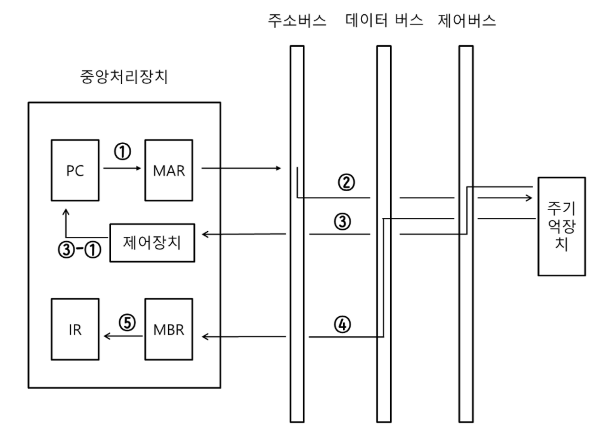
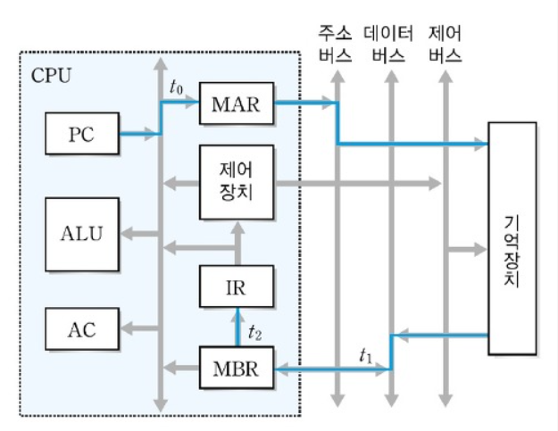

## 목차

1. 컴퓨터 구조 기초
2. 컴퓨터의 구성
3. 중앙처리장치(CPU) 작동 원리
4. 캐시 메모리

--------


# 1. 컴퓨터 구조 기초

컴퓨터 구조는 크게 CPU, Memory, Disk로 나눠져 있다.

* CPU는 ALU(Arithmetic Logic Uit 산술연산) + CU(Control Unit) +레지스터 이다.
  * ALU : 산술연산과 논리 연산을 수행하는 디지털 회로
  * CU : 프로그램에 따라 명령과 제어 신호를 생성, 정보와 데이터 흐름을 결정하고 각종 장치의 동작을 제어한다.
  * Register : CPU에서 사용하는 데이터를 임시적으로 저장

* 캐시메모리 CPU와 메모리 사이에 존재하면서 명령어를 빠르게 전달하기 위한 메모리이다.

* 보통 개발자는 c, c++, java등을 통해 코드를 작성하고 컴파일을 통해 실행파일을 만든다. 실행파일은 코드, 리소스 부분으로 나눠 디스크에 저장된다. 이때 실행파일(프로그램)의 일부분이 메모리에 올라오는 것을 프로세스라고 하며 프로그램을 실행 중이다. 
* 우리는 한 컴퓨터에서 여러 프로그램을 실행할 수 있는데 여러 프로그램은 동시에 사용되는 것처럼 보여도 사실은 여러 프로세스는 돌아가면서 CPU를 사용하게 된다. 이때 CPU 스케줄링을 통해 어떤 프로세스가 CPU를 사용할지 결정한다.
  * `4주차 CPU 스케줄링 참조` 
  * 이때 CPU가 한 프로세스에서 다른 프로세스로 교체되는 것을 문맥이 교체된다고 하며 문맥교환(Context Switching)이라고 한다.
* 메모리에는 여러 프로세스의 일부가 올라오게 되는데 메모리는 모든 파일을 올릴 수 없고 올린다고해도 효율성이 떨어진다. 그래서 적은 메모리를 효율적으로 관리하기 위해 메모리 교체하는 알고리즘이 필요하다.
  * `5주차 페이지 알고리즘 참조`
* 가상 메모리를 통해 당장 사용할 부분에 물리적 메모리에 올라가고 당장 사용되지 않은 부분은 디스크의 swap 영역에 저장한다. CPU는 logical address만 알고 MMU는 physical address로 연결시켜주고 가져오게 된다. 이때 메모리에 올라와있지 않아 page fault가 일어나면 swap 영역에서 메모리로 가져오고 가용 프레임이 없을 경우 페이지 알고리즘을 통해 교체하게 된다.
* 디스크에서 읽어오는 시간의 대부분은 헤드가 움직이는 시간이 차지하게 된다. 읽거나 쓰는 시간은 별로 많지 않다. 어떻게 파일 시스템을 저장할 것인지에 관해서는 여러 방법이 있다. 
  * `6주차 파일시스템 참조` 
* 이제 SSD로 변화되는 시기라서 중요도에 대한 비중이 떨어지지만 여전히 대용량 저장을 위해서는 개념이 필요하다.
* 프로그램 개발(C, C++, Java) -> 컴파일 -> 프로그램 어셈블 -> 어셈블러 -> 기계어 코드 (바이너리) = 실행파일
  * 컴파일을 하면서 오브젝트 코드, 목적 코드라고 하는 파일로 만들어지고, 링크라는 과정을 통해서 실행 파일 또는 DLL과 같은 파일로 만들어진다.


# 2. 컴퓨터의 구성

컴퓨터 시스템은 크게 하드웨어와 소프트웨어로 나누어진다.

**하드웨어** : 컴퓨터를 구성하는 기계적 장치

* CPU, 기억장치, 입출력 장치

**소프트웨어** : 하드웨어의 동작을 지시하고 제어하는 명령어 집합

* 시스템 소프트웨어 : 운영체제, 컴파일러
* 응용 소프트웨어 : 워드프로세서, 스프레드시트 등


#### 하드웨어

##### 중앙처리장치(CPU) 

* 주기억장치에서 프로그램 명령어와 데이터를 읽어와 처리하고 명령어의 수행 순서를 제어한다. CPU는 비교와 연산을 담당하는 `산술논리연산장치(ALU)`와 명령어의 해석과 실행을 담당하는 `제어장치`, 속도가 빠른 데이터 기억장소인 `레지스터`로 구성된다.

##### 기억장치 : RAM, HDD

* 프로그램, 데이터, 연산의 중간 결과를 저장하는 장치이다.
* 주기억장치와 보조기억장치로 나누어지며, 보조기억장치는 하드디스크 등을 말하며, 주기억장치에 비해 속도는 느리지만 많은 자료를 영구적으로 보관할 수 있는 장점이 있다.

##### 입출력 장치 : 마우스, 프린터 등

* 입력장치는 컴퓨터 내부로 자료를 입력하는 장치이다. (키보드, 마우스 등)
* 출력 장치는 컴퓨터에서 외부로 표현하는 장치 (프린터, 모니터, 스피커 등)


### 시스템 버스

하드웨어 구성 요소를 물리적으로 연결하는 선으로 각 구성요소가 다른 구성요소로 데이터를 보낼 수 있도록 통로가 되어준다.

용도에 따라 데이터 버스, 주소 버스, 제어 버스로 나누어 진다.

##### 데이터 버스

CPU와 기타 장치 사이에서 데이터를 전달하는 통로이다.

기억장치와 입출력장치의 명령어와 데이터를 CPU로 보내거나, 중앙처리장치의 연산 결과를 기억장치와 입출력장치로 보내는 `양방향` 버스이다.

##### 주소 버스

데이터를 정확히 실어나르기 위해서는 기억장치 `주소`를 정해주어야 한다.

CPU, 기억장치, 입출력 장치로 `기억장치 주소`들을 전달하는 통로이며 `단방향` 버스이다. 억장치 주소를 전달하는 통로이기 때문에 '단방향' 버스임

##### 제어 버스

주소 버스와 데이터 버스는 모든 장치에 공유되기 때문에 이를 `제어할 수단`이 필요하다. 제어 버스는 중앙처리장치가 기억장치나 입출력장치에 제어 신호를 전달하는 통로이다.

제어 버스는 읽기 동작과 쓰기 동작을 모두 수행하기 때문에 `양방향` 버스이다.

* 제어 신호 종류 : 기억장치 읽기 및 쓰기, 버스 요청 및 승인, 인터럽트 요청 및 승인, 클락, 리셋 등


컴퓨터는 기본적으로 **읽고 처리한 뒤 저장**하는 과정으로 이루어진다.

(READ → PROCESS → WRITE)

이 과정을 진행하면서 끊임없이 주기억장치(RAM)과 소통한다. 이때 운영체제가 64bit라면, CPU는 RAM으로부터 데이터를 한번에 64비트씩 읽어온다.


#### 시스템 버스 처리과정



1. 프로그램 카운터(PC)에서 읽기와 쓰기 연산을 수행할 주기억장치 `주소`를 메모리 주소 레지스터(MAR)로 보내 저장한다.
2. 주소버스를 이용해 MAR 저장된 주소를 통해 메모리에 어느 부분을 읽어야하는지를 알려준다. 
3. 제어 버스를 통해 메모리에 그 주소를 읽어 `다음 수행할 명령어`를 데이터 버스에 저장한다. 
4. 데이터 버스를 통해 메모리 버퍼 레지스터(MBR)에 저장한다.
5. MBR에 저장된 데이터를 명렁어 레지스터(IR)(다음에 수행할 명령어)에 저장된다. 


# 3. 중앙처리장치(CPU) 작동 원리

CPU는 연산장치, 제어장치, 레지스터 3가지로 구성된다.

#### 연산 장치

산술연산과 논리연산 수행한다. 연산에 필요한 데이터를 레지스터에서 가져오고, 연산 결과를 다시 레지스터로 보낸다.

#### 제어 장치

명령어를 순서대로 실행할 수 있도록 제어하는 장치이다.

주기억장치에서 프로그램 명령어를 꺼내 해독하고, 그 결과에 따라 명령어 실행에 필요한 제어 신호를 기억장치, 연산장치, 입출력장치로 보낸다. 또한 장치들이 보낸 신호를 받아서 다음에 수행할 동작을 결정한다.

#### 레지스터

프로세서 내부에 있는 메모리이자 고속 메모리이다.

명령어 주소, 코드, 연산에 필요한 데이터, 연산 결과 등을 임시로 저장한다.

용도에 따라 범용 레지스터와 전용 레지스터로 구분된다.

* 범용 레지스터 : 연산에 필요한 데이터나 연산 결과를 임시로 저장
* 전용(특수목적) 레지스터 : 특별한 용도로 사용하는 레지스터 


#### 특수 목적 레지스터 중 중요한 것들

- MAR(메모리 주소 레지스터) :  프로세서가 참조하려는 데이터의 주소를 저장해 메모리에 접근하는 버퍼 레지스터
- PC(프로그램 카운터) : 다음에 수행할 명령어 주소 저장
- IR(명령어 레지스터) : 현재 실행 중인 명령어 저장
- MBR(메모리 버퍼 레지스터) : 프로세서가 메모리를 읽거나 저장할 데이터 자체를 보관하고 있는 버퍼 레지스터이다. 
- AC(누산기) : 연산 결과 임시 저장


#### CPU의 동작 과정

1. 주기억장치는 입력장치에서 입력받은 데이터 또는 디스크에서 프로그램을 읽어온다.
2. CPU는 메인 메모리에 저장된 프로그램 명령어와 데이터를 읽어와 처리하고 결과를 다시 메모리에 저장한다.
3. 메인 메모리는 처리 결과를 디스크에 저장하거나 출력장치로 보낸다.
4. 제어장치는 1~3 과정에서 명령어가 순서대로 실행되도록 각 장치를 제어한다.


#### 명령어 세트

CPU가 실행할 명령어의 집합이다.

* 연산 코드(Operation Code) + 피연산자(Operand)
* 연산 코드 : 실행할 연산, 제어, 데이터 전달, 입출력 기능을 가짐
  * 연산 기능 : 사칙연산, 시프트, 보수 등의 산술연산과 논리곱, 논리합, 부정 등의 논리연산을 수행
  * 제어 기능 : 조건 분기와 무조건 분기 등을 사용하여 명령어의 실행 순서를 제어
  * 데이터 전달 기능 : 레지스터와 레지스터 사이, 레지스터와 주기억장치 사이에서 데이터를 전달
  * 입출력 기능 : 프로그램과 데이터를 주기억장치에 전달하고, 연산 결과는 출력장치로 전달
* 피연산자 : 필요한 데이터 or 저장 위치(주소)
  *  주소 : 기억장치 혹은 레지스터의 주소가 저장
  * 숫자/문자 : 숫자는 정수, 고정 소수점 수, 부동 소수점 수 및 각각의 코드로 저장되고 문자는 아스키 코드로 저장
  * 논리 데이터 : 참 또는 거짓을 표현할 때 사용하며 비트나 플래그 등으로 저장


CPU는 프로그램 실행하기 위해 주기억장치에서 명령어를 순차적으로 인출하여 해독하고 실행하는 과정을 반복한다. 

CPU가 주기억장치에서 한번에 하나의 명령어를 인출하여 실행하는데 필요한 일련의 활동을 `명령어 사이클`이라고 한다. 명령어 사이클은 인출, 실행, 간접, 인터럽트 사이클로 나누어 진다.

* 인출 사이클과 실행 사이클은 항상 수행되지만 간접사이클과 인터럽트 사이클은 주소 지정방식이 필요하거나 인터럽트 요구가 있을때만 수행된다.

 

#### 인출 사이클과 실행 사이클에 의한 명령어 처리 과정



* 주기억장치의 지정된 주소에서 하나의 명령어를 가져오고
* 실행 사이클에서는 명령어를 실행하고,
* 명령어 실행 완료시 그 다음 명령어에 대한 인출 사이클 시작된다.

##### 인출 사이클

* 인출 사이클에서 가장 중요한 부분은 `PC(프로그램 카운터) 값 증가`

1. PC에 저장된 주소를 MAR(메모리 주소 레지스터)로 전달
2. 저장된 내용을 토대로 주기억장치의 해당 주소에서 명령어 인출
3. 인출한 명령어를 MBR(메모리 버퍼 레지스터)에 저장
4. 다음 명령어를 인출하기 위해 PC 값 증가시킴
5. 메모리 버퍼 레지스터(MBR)에 저장된 내용을 명령어 레지스터(IR)에 전달

```
T0 : MAR ← PC
T1 : MBR ← M[MAR], PC ← PC+1
T2 : IR ← MBR
```

##### 실행 사이클

```
T0 : MAR ← IR(Addr)
T1 : MBR ← M[MAR]
T2 : AC ← AC + MBR
```

* 이미 인출이 진행되고 명령어만 실행하면 되기 때문에 PC를 증가할 필요없다.
* IR에 MBR의 값이 이미 저장된 상태를 의미한다.
* 따라서 AC에 MBR을 더해주기만 하면 된다.


> 참고자료
>
> [CPU작동원리](https://ndb796.tistory.com/7)


# 4. 캐시메모리

Cache Memory는 메인 메모리와 CPU간의 데이터 속도 향상을 위한 중간 버퍼 역할을 하는 CPU내 또는 외에 존재하는 메모리이다. 전체 시스템의 성능의 개선을 시킬 수 있는 메모리이다.

* 캐시는 잠시 저장해둔다는 의미이고 기능이다.


#### 그밖에 캐시들

* 네트워크에서 캐시는 로컬에 파일을 미리 받아놓거나 웹서버에서도 매번 로딩을 해야 하는 파일들을 미리 로딩해두고, 응답을 주기도 한다.
* 데이터 베이스와 웹서버 사이에 캐시를 둔다면 더 빠른 응답이 가능하다.
* 캐시의 원리를 이용한 캐시 서버를 활용하여 CDN같은 서비스도 할 수 있다. CDN은 컨텐츠를 딜리버리 해주는 서버이다. 멀리 있는 곳에서 파일을 가져온다면 네트워크 구간이 멀어서 실패율도 있고, 전송 속도가 느리고, 오래 걸릴 수 있다. 자주 쓰는 파일들을 가까운 지역의 서버에 올려 놓으면 빠른 접근이 가능해진다. 


#### 단점

캐시 서버 또는 캐시 메모리 등 캐시는 영구적 메모리 공간이 아니라 지워질 수 있는 메공간이다. 


### 캐시 Hit

CPU에서 필요로 하는 데이터가 캐시 메모리에 있어서 참고할 수 있느냐는 것이 Cache Memory의 성능이 된다. 

*  CPU가 필요한 데이터가 Cache Memory 내에 들어와 있으면 `Cache Hit`라 하고 접근하고자 하는 데이터가 없을 경우를 `Cache Miss`라 한다.
* 원하는 데이터가 Cache에 있을 확률을 `Hit Ratio`라 한다.


### 지역성

CPU에서 명령어를 수행하면서 매번 Cache Memory 를 참조하게 되는데, 이때 Hit률이 지역성을 갖는다.

지역성(Locality Of Reference) 은 프로세스들이 기억장치 내의 정보를 균일하게 액세스하는 것이 아니라 `어느 순간에 특정부분을 집중적으로 참조`하는 것을 말한다. 

#### 공간적 지역성(spatial locality of reference)

한 번 참조한 메모리의 `옆에 있는 메모리`를 다시 참조하게 되는 성질을 말한다. 예를 들면, Array과 같이 연속적으로 사용되질 가능성이 높다. 

#### 시간적 지역성(temporal locality of reference)

한 번 참조된 주소의 내용은 곧 다음에 다시 참조된다는 특성을 말한다. 예를 들면, 반복문(for, while)처럼 특정 메모리값으로 선언된 부분을 반복하여서 접근하게 된다. 

지역성의 특성은 블록 사이즈의 크기와 연관이 있다. 블록 사이즈가 커지면 캐시의 Hit율도 올라간다. 하지만 블록 사이즈만 키운다고 효율성을 높힐 수 없다. Hit율을 높이고 최소의 시간에 데이터를 전달하기 위해서는 Hit 실패시에 `다음 동작을 처리하는데 있어서 시간을 최소화`하는 것이 중요하며 `데이터의 일관성` 유지해서 이에 따른 오버헤드 최소화해야 한다.


### 쓰기 정책 (Write Policy) 

#### Write Through 

프로세서에서 메모리에 쓰기 요청을 할 때마다 `캐시의 내용과 메인 메모리의 내용을 같이 바꾸는 방식`이다. 

* 단순하다는 장점을 가지고 있지만 데이터에 대한 쓰기 요청을 할 때마다 항상 메인 메모리에 접근해야 하므로 캐시에 의한 접근 시간의 개선이 없어지게 된다. 즉, 쓰기 시의 접근 시간은 주 메모리의 접근 시간과 같게 되는 단점을 가진다.
* 하지만 실제 프로그램에서 메모리 참조 시 쓰기에 대한 작업은 통계적으로 `10~15%`에 불과하기 때문에 많이 사용되는 방식이다.

#### Write Back

CPU에서 메모리에 대한 `쓰기 작업 요청 시 캐시에서만 쓰기 작업`을 하고 그 변경 사실을 확인할 수 있는 표시를 하여 놓은 후 `캐시로부터 해당 블록의 내용이 제거될 때 그 블록을 메인 메모리에 복사`함으로써 메인 메모리와 캐시의 내용을 동일하게 유지하는 방식이다.

* 이 방식은 동일한 블록 내에 여러 번 쓰기를 실행하는 경우, 캐시에만 여러 번 쓰기를 하고 메인 메모리에는 한 번만 쓰게 되므로 이 경우에 매우 효율적으로 동작하게 된다.
* 하지만 구성 방법이 복잡하다.


### 주소 매핑 방식

 캐시 메모리는 실제 메인 메모리에 비해 그 크기가 매우 작아서 메인 메모리와의 1:1 매칭되는 동일한 주소 체계를 가질 수 없다. 그래서 메인 메모리와의 다른 형태의 주소 매핑 방식을 사용하고 있다. 

#### 1. direct mapping (직접매핑)

 메인 메모리를 일정한 크기의 블록으로 나누고 각각의 블록을 캐시의 정해진 위치에 매핑하는 방식으로 세 가지 매핑 방법 중 가장 간단하며 구현도 가장 쉬운 방식이다.

* 예를 들어 16MByte의 메인 메모리를 가지는 시스템에 대하여 64KByte의 캐시 메모리가 있다면 전체의 메인 메모리에 대하여 캐시 사이즈 단위로 나눠 각 블록에 태그(Tag) 값을 매기게 된다. 
* 메인 메모리 주소 0~0x00FFFF까지는 태그 값 00, 메인 메모리 주소 0x010000~ 0x01FFFF까지는 태그 값 01을 가진다.

주소 = tag(2bit) + block(2bit) + word

#### 2. associative mapping

Direct mapping에서 주기억 장치 블록과 캐시 블록을 지정된 한 개의 블록에 직접 사상하는 가장 간단한 방법으로 각 그룹의 모든 블록을 미리 지정하기 때문에 구현이 간단하지만 동일한 그룹에 속한 블록들이 빈번히 액세스되는 경우 캐쉬의 실패율이 높아져성능을 떨어뜨린다.

이에 대한 개선으로 캐시의 태그 필드를 확장하여 캐시의 어떤 라인과도 무관하게 매핑 시킬 수 있는 매핑 방법이 이 방식이다. 유연성이 우수하지만 모든 Cache 슬롯들의 태그번호들을 고속으로 검색하기 위해서는 복잡한 회로가 필요하다.

주소 = tag(4bit) + word

#### 3. set associative mapping

set associative mapping은 associative mapping의 장점을 가지고, 단점을 없앤 절충안적인 방식으로 많은 마이크로프로세서들이 이 방식을 택하고 있다.

Cache의 몇 개의 block을 묶어서 하나의 set으로 구성한다. Main memory의 block들은 들어갈 set은 정해져있지만 set 내에서는 어디로 들어가든 상관 없다.

주소 = tag(2bit) + set(2bit) +word


### Cache 일관성 문제

공유 메모리 시스템에서 각 클라이언트(혹은 프로세서)가 가진 `로컬 캐시 간`의 일관성을 의미한다. 즉, 각 클라이언트가 자신만의 로컬 캐시를 가지고 다른 여러 클라이언트들과 메모리를 공유하고 있을 때, 캐시 갱신으로 인한 `데이터 불일치 문제`가 발생한다. 

캐시 일관성 문제는 주로 변경 가능한 데이터 공유, 프로세스의 이주, 출력 동작 시에 발생된다.

1) 공유 Cache 사용 : 모든 프로세스들이 하나의 Cache를 사용하는 방법으로 구조가 간단하나 프로세스간 충돌이 심하다. 지역참조 성격을 위반한다.
2) 공유 변수 캐시 저장 금지 : 공유가 가능한 변수에는 캐시메모리에 저장하지 않음으로써 일관성을 깨트리지 않는다.
3) 버스 감시 메커니즘(snoopy 프로토콜) : 주소 버스를 항상 감시하여 캐시 상 메모리에 대한 접근이 있는지를 감시하는 구조이다. 
   * Write Invalidate(MESI 프로토콜) : Write back 방식에서 사용, M(modified), E(exclusive), S(shared), I(Invaild) 4가지 상태로 캐시 블록 상태를 관리
     * 다른 캐시에서 쓰기가 발생하면 캐시 컨트롤러에 의해 자신의 캐시 위에 있는 복사본을 무효화 시킨다.
   * Write Update : Write Through방식에서 사용, Invalid, Valid 두 가지 플래그로 캐시 블록 상태 관리 
4) 디렉토리 기반 캐쉬 : 캐쉬 정보 상태를 디렉토리에 저장하여 데이터 일관성을 유지하고 중앙집중식(주기억장치내) 디렉토리에 기억하는 방식이다.
   * 디렉터리 기반 구조는 어떤 노드에 해당 캐시 블록의 사본을 가지고 있는지 알고 있기 때문에 브로드캐스트할 필요 없이 특정 노드에만 요청하게 되어 대역폭이 작아도 된다. 


### Cache Memory의 교체 알고리즘

FIFO (First In First Out) : 먼저 저장되어 있던 블록이 먼저 나가는 방식으로 캐시 내에 가장 오래 있었던 블록을 교체한다.

LRU (Least Recently Used) : 사용되지 않은 채로 가장 오래 있었던 블록을 교체한다

LFU (Least Frequently Used) : 각 슬롯에 카운터를 설치함으로써 구현 사용 빈도수가 가장 적은 블록을 교체한다. 

OPTIMAL 방식 : 향후 가장 참조되지 않을 블록을 교체한다. 하지만 미래를 알 수 없기 때문에 실현 불가능하다.

 이 교체에 있어서 `지역성`을 고려해서 최근에 가장 많이 사용하지 않았던 내용을 내리는 것이 효율적인데, 이러한 방식을 `LRU(Least Recently Used)`라 한다. 이 방식의 구현을 위하여 각각의 라인에 추가적인 비트를 두고 각 라인에 대한 데이터 참조 시 그 발생하는 시점을 기록함으로써 이 방식을 실현하고 있다.


> 참고자료
>
> [참고1](https://wikidocs.net/65523)
>
> [캐시일관성](https://goodgid.github.io/Cache-Coherence/)
>
> 추가자료
>
> [참고 2](https://gofo-coding.tistory.com/entry/5-Set-Associative-Mapping)
